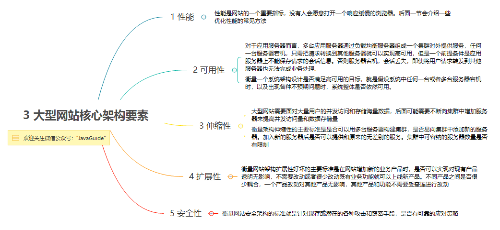
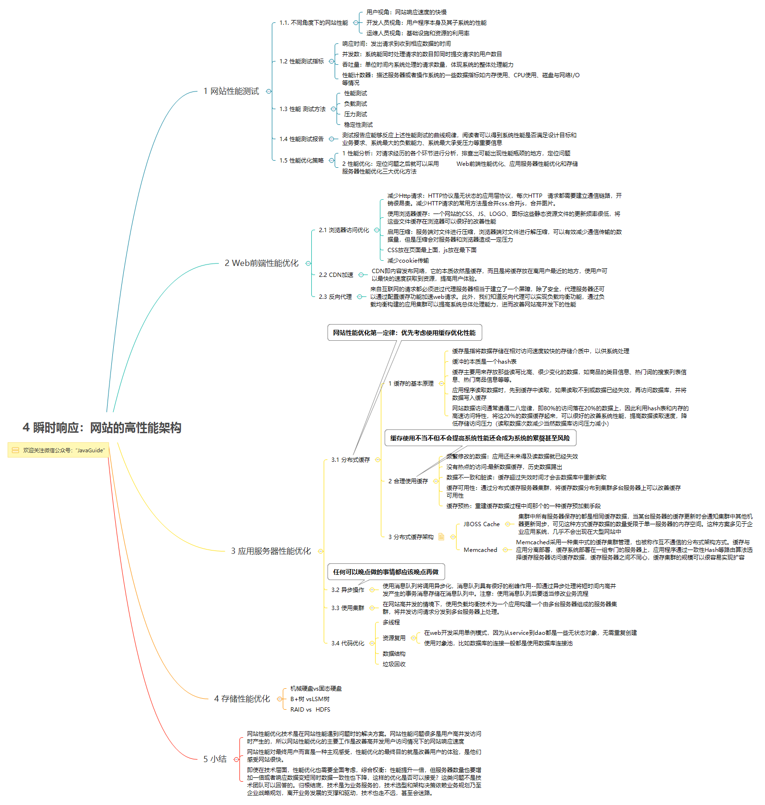
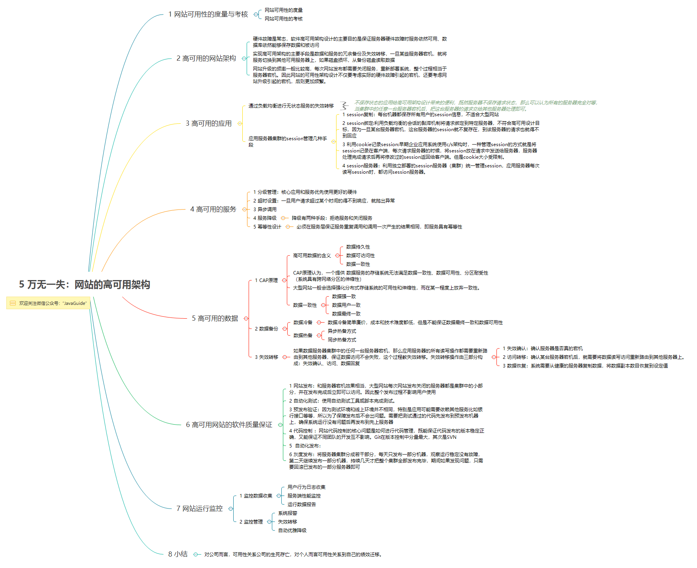
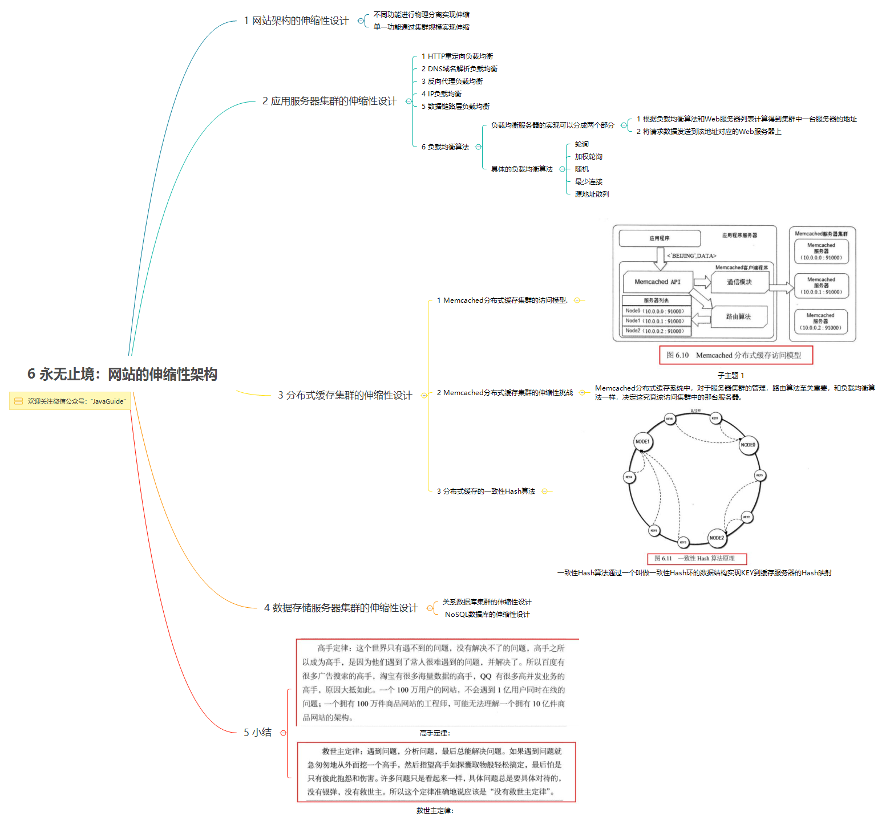
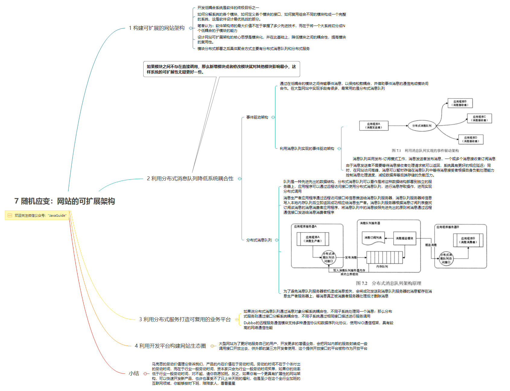
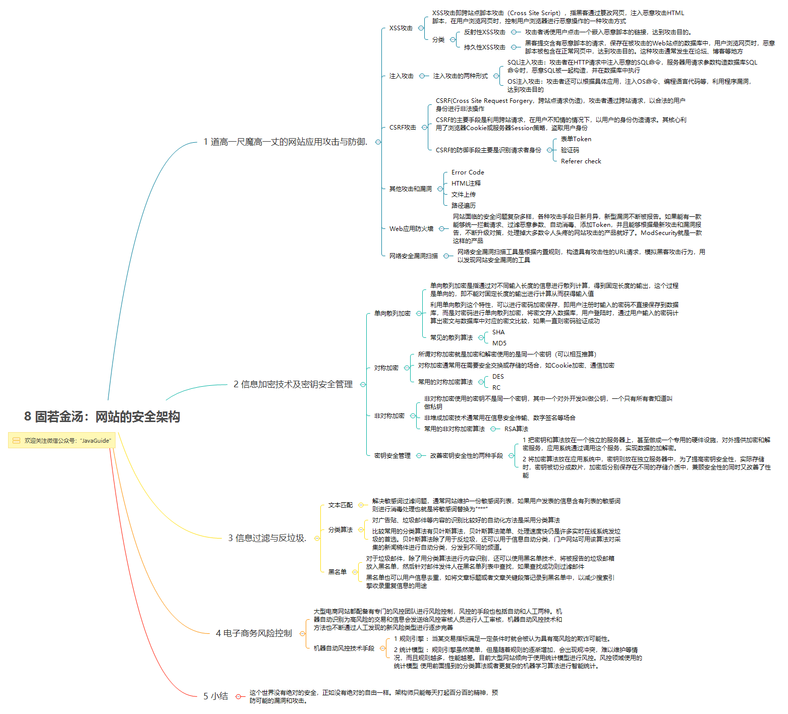

### 设计模式之基础架构思想
**MVC**  
MVC 模式代表 Model-View-Controller（模型 - 视图 - 控制器） 模式，常用于应用程序的分层开发。  
优点：View、Model 都是可以重复利用的，可以独立使用。  
缺点：Controller 的代码过于臃肿；没有明确的定义，会存在不同的实现细节。  

MVC 的一般流程是这样的：  
> 1、View（界面）触发事件   
> 2、Controller（业务）处理了业务，然后触发了数据更新   
> 3、不知道谁更新了 Model 的数据   
> 4、Model（带着数据）回到了 View  
> 5、View 更新数据  

MVC 的应用还是相当广泛的，也常常会在项目达到一定规模后进行重构，这时候可能考虑的方向：  
> 1、增加 Service 层  
> 2、使用 DDD   
> 3、模块化  
> 4、微服务  

**MVP**  
优化 MVC 模，其中之一就是 Model-View-Presenter（MVP）模式。  
MVP 切断 View 和 Model 的联系，让 View 只和 Presenter（原 Controller）交互，减少在需求变化中需要维护的对象的数量。MVP 定义了 Presenter 和 View 之间的接口，让一些可以根据已有的接口协议去各自分别独立开发，以此去解决界面需求变化频繁的问题。

**MVVM**  
MVVM（Model-View-ViewModel）是一种 “更好的” UI 模式解决方案。  
ViewModel 大致上就是 MVP 的 Presenter 和 MVC 的 Controller 了，而 View 和 ViewModel 间没有了 MVP 的界面接口，而是直接交互，用数据 “绑定” 的形式让数据更新的事件不需要开发人员手动去编写特殊用例，而是自动地双向同步。  
> 数据绑定可以认为是观察者（Observer）模式或者是发布订阅（Publish/Subscribe）模式。  
> 数据绑定的原理都是为了用一种统一的集中的方式实现频繁需要被实现的数据更新问题。  

比起 MVP，MVVM 不仅简化了业务与界面的依赖关系，还优化了数据频繁更新的解决方案，甚至可以说提供了一种有效的解决模式。

### 大型网站技术架构
`图片来源公众号 (JavaGuide) `

**1.大型网站架构演化**  
  

**2.大型架构模式**  
  

**3.大型网站核心架构要素**  
  

**4.瞬时响应：网站的高性能架构**  
  

**5.万无一失：网站的高可用架构**  
  

**6.永无止境：网站的伸缩性架构**  
  

**7.随机应变：网站的可扩展性架构**  
  

**8.固若金汤：网站的安全机构**  
  

