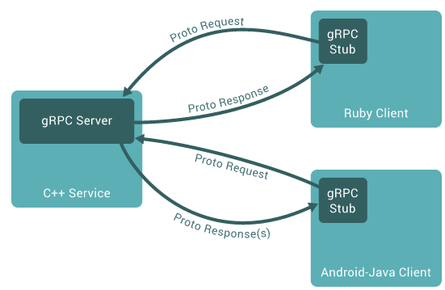
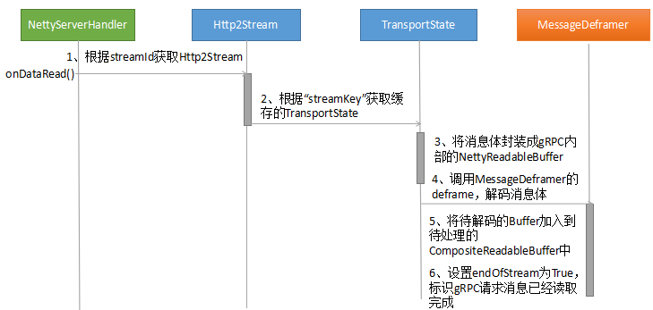
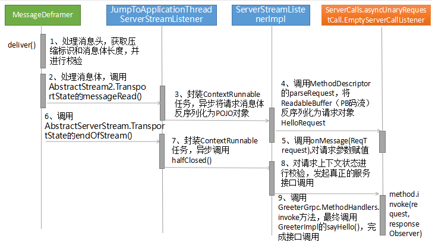

### RPC 框架原理
RPC 框架的目标就是让远程服务调用更加简单、透明，RPC 框架负责屏蔽底层的传输方式（TCP 或者 UDP）、序列化方式（XML/Json/ 二进制）和通信细节。服务调用者可以像调用本地接口一样调用远程的服务提供者，而不需要关心底层通信细节和调用过程。  

RPC 框架的调用原理图:  
  

业界主流的 RPC 框架：  
> 1、支持多语言的 RPC 框架，比较成熟的有 Google 的 gRPC、Apache（Facebook）的 Thrift；  
> 2、只支持特定语言的 RPC 框架，例如新浪微博的 Motan；  
> 3、支持服务治理等服务化特性的分布式服务框架，其底层内核仍然是 RPC 框架, 例如阿里的 Dubbo  

随着微服务的发展，基于语言中立性原则构建微服务，逐渐成为一种主流模式，例如对于后端并发处理要求高的微服务，比较适合采用 Go 语言构建，而对于前端的 Web 界面，则更适合 Java 和 JavaScript。因此，基于多语言的 RPC 框架来构建微服务，是一种比较好的技术选择。例如 Netflix，API 服务编排层和后端的微服务之间就采用 gRPC 进行通信。  

### gRPC 是什么
gRPC 是一个高性能、开源和通用的 RPC 框架，面向服务端和移动端，基于 HTTP/2 设计。  
gRPC 是由 Google 开发并开源的一种语言中立的 RPC 框架，当前支持 C、Java 和 Go 语言，其中 C 版本支持 C、C++、Node.js、C# 等。  

[gRPC 官网](https://grpc.io/)  

gRPC 的调用示例：  
  

gRPC 特点:  
> 1、语言中立，支持多种语言；  
> 2、基于 IDL 文件定义服务，通过 proto3 工具生成指定语言的数据结构、服务端接口以及客户端 Stub；  
> 3、通信协议基于标准的 HTTP/2 设计，支持双向流、消息头压缩、单 TCP 的多路复用、服务端推送等特性，这些特性使得 gRPC 在移动端设备上更加省电和节省网络流量；  
> 4、序列化支持 PB（Protocol Buffer）和 JSON，PB 是一种语言无关的高性能序列化框架，基于 HTTP/2 + PB, 保障了 RPC 调用的高性能。  

### gRPC 搭建
以官方的 helloworld 为例，介绍 gRPC 服务端创建以及 service 调用流程（采用简单 RPC 模式）。  
服务定义（helloworld.proto）
```
service Greeter {
  rpc SayHello (HelloRequest) returns (HelloReply) {}
}

message HelloRequest {
  string name = 1;
}

message HelloReply {
  string message = 1;
}
```
服务端创建代码如下（HelloWorldServer 类）  
```java
private void start() throws IOException {
    /* The port on which the server should run */
    int port = 50051;
    server = ServerBuilder.forPort(port)
        .addService(new GreeterImpl())
        .build()
        .start();
}

// 服务端接口实现类（GreeterImpl）
static class GreeterImpl extends GreeterGrpc.GreeterImplBase {
    @Override
    public void sayHello(HelloRequest req, StreamObserver<HelloReply> responseObserver) {
      HelloReply reply = HelloReply.newBuilder().setMessage("Hello " + req.getName()).build();
      responseObserver.onNext(reply);
      responseObserver.onCompleted();
    }
}
```

**服务端创建流程**  
gRPC 服务端创建采用 Build 模式，对底层服务绑定、transportServer 和 NettyServer 的创建和实例化做了封装和屏蔽，让服务调用者不用关心 RPC 调用细节，整体上分为三个过程：  
> 1、创建 Netty HTTP/2 服务端；  
> 2、将需要调用的服务端接口实现类注册到内部的 Registry 中，RPC 调用时，可以根据 RPC 请求消息中的服务定义信息查询到服务接口实现类；  
> 3、创建 gRPC Server，它是 gRPC 服务端的抽象，聚合了各种 Listener，用于 RPC 消息的统一调度和处理。  

  

gRPC 服务端创建关键流程分析：  
> 1、NettyServer 实例创建：gRPC 服务端创建，首先需要初始化 NettyServer，它是 gRPC 基于 Netty 4.1 HTTP/2 协议栈之上封装的 HTTP/2 服务端。NettyServer 实例由 NettyServerBuilder 的 buildTransportServer 方法构建，NettyServer 构建完成之后，监听指定的 Socket 地址，即可实现基于 HTTP/2 协议的请求消息接入。  
> 2、绑定 IDL 定义的服务接口实现类：gRPC 与其它一些 RPC 框架的差异点是服务接口实现类的调用并不是通过动态代理和反射机制，而是通过 proto 工具生成代码，在服务端启动时，将服务接口实现类实例注册到 gRPC 内部的服务注册中心上。请求消息接入之后，可以根据服务名和方法名，直接调用启动时注册的服务实例，而不需要通过反射的方式进行调用，性能更优。  
> 3、gRPC 服务实例（ServerImpl）构建：ServerImpl 负责整个 gRPC 服务端消息的调度和处理，创建 ServerImpl 实例过程中，会对服务端依赖的对象进行初始化，例如 Netty 的线程池资源、gRPC 的线程池、内部的服务注册类（InternalHandlerRegistry）等，ServerImpl 初始化完成之后，就可以调用 NettyServer 的 start 方法启动 HTTP/2 服务端，接收 gRPC 客户端的服务调用请求。  

**服务端 service 调用流程**  
gRPC 的客户端请求消息由 Netty Http2ConnectionHandler 接入，由 gRPC 负责将 PB 消息（或者 JSON）反序列化为 POJO 对象，然后通过服务定义查询到该消息对应的接口实例，发起本地 Java 接口调用，调用完成之后，将响应消息反序列化为 PB（或者 JSON），通过 HTTP2 Frame 发送给客户端。  
流程并不复杂，但是细节却比较多，整个 service 调用可以划分为如下四个过程：  
> 1、gRPC 请求消息接入；  
> 2、gRPC 消息头和消息体处理；  
> 3、内部的服务路由和调用；  
> 4、响应消息发送。  

gRPC 的请求消息由 Netty HTTP/2 协议栈接入，通过 gRPC 注册的 Http2FrameListener，将解码成功之后的 HTTP Header 和 HTTP Body 发送到 gRPC 的 NettyServerHandler 中，实现基于 HTTP/2 的 RPC 请求消息接入。  

gRPC 请求消息接入流程：  
> 1、Netty 4.1 提供了 HTTP/2 底层协议栈，通过 Http2ConnectionHandler 及其依赖的其它类库，实现了 HTTP/2 消息的统一接入和处理。  
> 通过注册 Http2FrameListener 监听器，可以回调接收 HTTP2 协议的消息头、消息体、优先级、Ping、SETTINGS 等。  
> gRPC 通过 FrameListener 重载 Http2FrameListener 的 onDataRead、onHeadersRead 等方法，将 Netty 的 HTTP/2 消息转发到 gRPC 的 NettyServerHandler 中；  
> 2、Netty 的 HTTP/2 协议接入仍然是通过 ChannelHandler 的 CodeC 机制实现，它并不影响 NIO 线程模型。  
> 因此，理论上各种协议、以及同一个协议的多个服务端实例可以共用同一个 NIO 线程池（NioEventLoopGroup）, 也可以独占。  
> 在实践中独占模式普遍会存在线程资源占用过载问题，很容易出现句柄等资源泄漏。  
> 在 gRPC 中，为了避免该问题，默认采用共享池模式创建 NioEventLoopGroup，所有的 gRPC 服务端实例，都统一从 SharedResourceHolder 分配 NioEventLoopGroup 资源，实现 NioEventLoopGroup 的共享。  

   

gRPC 消息头的处理入口是 NettyServerHandler 的 onHeadersRead()，处理流程如下：  
> 1、对 HTTP Header 的 Content-Type 校验，此处必须是 "application/grpc"；  
> 2、从 HTTP Header 的 URL 中提取接口和方法名，以 HelloWorldServer 为例，它的 method 为：“helloworld.Greeter/SayHello”；  
> 3、将 Netty 的 HTTP Header 转换成 gRPC 内部的 Metadata，Metadata 内部维护了一个键值对的二维数组 namesAndValues，以及一系列的类型转换方法。  
> 4、创建 NettyServerStream 对象，它持有了 Sink 和 TransportState 类，负责将消息封装成 GrpcFrameCommand，与底层 Netty 进行交互，实现协议消息的处理；  
> 5、创建 NettyServerStream 之后，会触发 ServerTransportListener 的 streamCreated 方法，在该方法中，主要完成了消息上下文和 gRPC 业务监听器的创建；  
> 6、gRPC 上下文创建：CancellableContext 创建之后，支持超时取消，如果 gRPC 客户端请求消息在 Http Header 中携带了“grpc-timeout”，系统在创建 CancellableContext 的同时会启动一个延时定时任务，延时周期为超时时间，一旦该定时器成功执行，就会调用 CancellableContext.CancellationListener 的 cancel 方法，发送 CancelServerStreamCommand 指令；  
> 7、JumpToApplicationThreadServerStreamListener 的创建：它是 ServerImpl 的内部类，从命名上基本可以看出它的用途，即从 ServerStream 跳转到应用线程中进行服务调用，gRPC 服务端的接口调用主要通过 JumpToApplicationThreadServerStreamListener 的 messageRead 和 halfClosed 方法完成；  
> 8、将 NettyServerStream 的 TransportState 缓存到 Netty 的 Http2Stream 中，当处理请求消息体时，可以根据 streamId 获取到 Http2Stream，进而根据“streamKey”还原 NettyServerStream 的 TransportState，进行后续处理。  

 

gRPC 消息体的处理入口是 NettyServerHandler 的 onDataRead()，实际上它们是并行 + 交叉串行实行的，处理流程如下:  
> 1、因为 Netty HTTP/2 协议 Http2FrameListener 分别提供了 onDataRead 和 onHeadersRead 回调方法，所以 gRPC NettyServerHandler 在处理完消息头之后需要缓存上下文，以便后续处理消息体时使用；  
> 2、onDataRead 和 onHeadersRead 方法都是由 Netty 的 NIO 线程负责调度，但是在执行 onDataRead 的过程中发生了线程切换  

  

内部的服务路由和调用，主要包括如下几个步骤：  
> 1、将请求消息体反序列为 Java 的 POJO 对象，即 IDL 中定义的请求参数对象；  
> 2、根据请求消息头中的方法名到注册中心查询到对应的服务定义信息；  
> 3、通过 Java 本地接口调用方式，调用服务端启动时注册的 IDL 接口实现类。

  

中间的交互流程比较复杂，涉及的类较多，但是关键步骤主要有三个：  
> 1、解码：对 HTTP/2 Body 进行应用层解码，转换成服务端接口的请求参数，解码的关键就是调用 requestMarshaller.parse(input)，将 PB 码流转换成 Java 对象；  
> 2、路由：根据 URL 中的方法名从内部服务注册中心查询到对应的服务实例，路由的关键是调用 registry.lookupMethod(methodName) 获取到 ServerMethodDefinition 对象；  
> 3、调用：调用服务端接口实现类的指定方法，实现 RPC 调用，与一些 RPC 框架不同的是，此处调用是 Java 本地接口调用，非反射调用，性能更优，它的实现关键是 UnaryRequestMethod.invoke(request, responseObserver) 方法。  

响应消息的发送由 StreamObserver 的 onNext 触发，发送原理如下：  
> 1、分别发送 gRPC HTTP/2 响应消息头和消息体，由 NettyServerStream 的 Sink 将响应消息封装成 SendResponseHeadersCommand 和 SendGrpcFrameCommand，加入到 WriteQueue 中；  
> 2、WriteQueue 通过 Netty 的 NioEventLoop 线程进行消息处理，NioEventLoop 将 SendResponseHeadersCommand 和 SendGrpcFrameCommand 写入到 Netty 的 Channel 中，进而触发 DefaultChannelPipeline 的 write(Object msg, ChannelPromise promise) 操作；  
> 3、响应消息通过 ChannelPipeline 职责链进行调度，触发 NettyServerHandler 的 sendResponseHeaders 和 sendGrpcFrame 方法，调用 Http2ConnectionEncoder 的 writeHeaders 和 writeData 方法，将响应消息通过 Netty 的 HTTP/2 协议栈发送给客户端。  

  

需要指出的是，请求消息的接收、服务调用以及响应消息发送，多次发生 NIO 线程和应用线程之间的互相切换，以及并行处理。  

