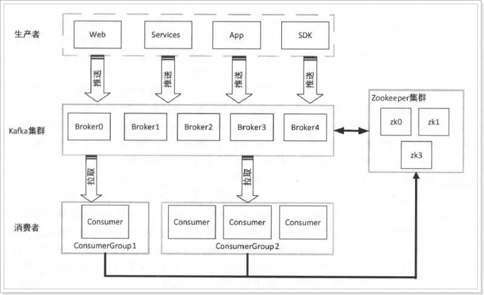

### 什么是 Kafka
Kafka 是分布式实时流处理平台。
Kafka 是最初由 Linkedin 公司开发，是一个分布式、支持分区的（partition）、多副本的（replica），基于 zookeeper 协调的分布式消息系统，它的最大的特性就是可以实时的处理大量数据以满足各种需求场景：比如基于 hadoop 的批处理系统、低延迟的实时系统、storm/Spark 流式处理引擎，web/nginx 日志、访问日志，消息服务等等，用 scala 语言编写，Linkedin 于 2010 年贡献给了 Apache 基金会并成为顶级开源项目。  

Kafka 解决了生产环境中数据上下游的耦合问题。  
Kafka 带来的主要价值在于，它可以作为数据管道，成为各个数据段之间的大型缓冲区，有效地解耦管道数据的生产者和消费者。Kafka 的解耦能力以及在安全和效率方面的可靠性，使它成为构建数据管道的最佳选择。  

消息队列的性能好坏，其文件存储机制设计是衡量一个消息队列服务技术水平和最关键指标之一。  

**Kafka 的特性**  

- 高吞吐量、低延迟：kafka 每秒可以处理几十万条消息，它的延迟最低只有几毫秒，每个 topic 可以分多个 partition, consumer group 对 partition 进行 consume 操作。
- 可扩展性：kafka 集群支持热扩展
- 持久性、可靠性：消息被持久化到本地磁盘，并且支持数据备份防止数据丢失
- 容错性：允许集群中节点失败（若副本数量为 n,则允许 n-1 个节点失败）
- 高并发：支持数千个客户端同时读写

**Kafka 的使用场景**  

- 日志收集：一个公司可以用 Kafka 可以收集各种服务的 log，通过 kafka 以统一接口服务的方式开放给各种 consumer，例如 hadoop、Hbase、Solr 等。
- 消息系统：解耦和生产者和消费者、缓存消息等。
- 用户活动跟踪：Kafka 经常被用来记录 web 用户或者 app 用户的各种活动，如浏览网页、搜索、点击等活动，这些活动信息被各个服务器发布到 kafka 的 topic 中，然后订阅者通过订阅这些 topic 来做实时的监控分析，或者装载到 hadoop、数据仓库中做离线分析和挖掘。
- 运营指标：Kafka 也经常用来记录运营监控数据。包括收集各种分布式应用的数据，生产各种操作的集中反馈，比如报警和报告。
- 流式处理：比如 spark streaming和storm
- 事件源

### Kafka 架构
**Kafka 完整架构**  
  

- broker：集群中的每一个 kafka 实例，称之为 broker；
- ZooKeeper：Kafka 利用 ZooKeeper 保存相应元数据信息， Kafka 元数据信息包括如代理节点信息、Kafka 集群信息、旧版消费者信息及其消费偏移量信息、主题信息、分区状态信息、分区副本分配方案信息、动态配置信息等。
- ConsumerGroup：在 Kafka 中每一个消费者都属于一个特定消费组（ ConsumerGroup ），我们可以为每个消费者指定一个消费组，以 groupld 代表消费组名称，通过 group.id 配置设置。如果不指定消费组，则该消费者属于默认消费组 test-consumer-group。

其他基本概念。  

- 集群：多个 broker 组成一个 Kafka 集群
- 消息(Message)：Kafka中的数据单元，通过 \<tpoic、partition、offset> 三元组，可以找到在 Kafka 中唯一对应的一条消息
- 消息位移：Offset。表示分区中每条消息的位置信息，是一个单调递增且不变的值。
- 批次：消息被分批次写入Kafka，批次就是一组消息
- 副本(Replica)：冗余机制，防止数据丢失。分为领导者副本（leader replica）与追随者副本（follower replica）
- 消息模式：消息被序列化的方式：Json、XML、Apache Avro
- 提交：更新分区当前位置的操作叫作提交
- 主题(Topic)：不同的主题，类比MySQL数据库中不同的表格
- 分区(Partition)：一个主题的消息可以设置多个分区
- 生产者：创建消息，消息的输入
- 消费者：读取消息，消息的输出
- 消费者位移：Consumer Ofset。表征消费者消费进度，每个消费者都有自己的消费者位移。
- 消费者组：Consumer Group。多个消费者实例共同组成的一个组，同时消费多个分区以实现高吞吐。
- 重平衡：Rebalance。消费者组内某个消费者实例挂掉后，其他消费者实例自动重新分配订阅主题分区的过程。Rebalance 是 Kafka 消费者端实现高可用的重要手段。

**Kakfa 的设计思想**  

- Kakfa Broker Leader 的选举
Kakfa Broker 集群受 Zookeeper 管理。  
所有的 Kafka Broker 节点一起去 Zookeeper 上注册一个临时节点，因为只有一个 Kafka Broker 会注册成功，其他的都会失败，所以这个成功在 Zookeeper 上注册临时节点的这个 Kafka Broker 会成为 Kafka Broker Controller，其他的 Kafka broker 叫 Kafka Broker follower（这个过程叫 Controller 在 ZooKeeper 注册 Watch）。  
这个 Controller 会监听其他的 Kafka Broker 的所有信息，如果这个 kafka broker controller 宕机了，在 zookeeper 上面的那个临时节点就会消失，此时所有的 kafka broker 又会一起去 Zookeeper 上注册一个临时节点，因为只有一个 Kafka Broker 会注册成功，其他的都会失败，所以这个成功在 Zookeeper 上注册临时节点的这个 Kafka Broker 会成为 Kafka Broker Controller，其他的 Kafka broker 成为 Kafka Broker follower。比如一旦有一个 broker 宕机了，这个 kafka broker controller 会读取该宕机 broker 上所有的 partition 在 zookeeper 上的状态，并选取 ISR 列表中的一个 replica 作为 partition leader（如果 ISR 列表中的 replica 全挂，选一个幸存的 replica 作为 leader; 如果该 partition 的所有的 replica 都宕机了，则将新的 leader 设置为-1，等待恢复，等待 ISR 中的任一个 Replica “活”过来，并且选它作为 Leader；或选择第一个“活”过来的 Replica（不一定是 ISR 中的）作为 Leader），这个 broker 宕机的事情，kafka controller 也会通知 zookeeper，zookeeper 就会通知其他的 kafka broker。

### Kafka 安装与配置
准备三台虚拟机，分别是 node01，node02，node03，并且修改 hosts 文件如下。
```bash
vim /etc/hosts
# 注意: 前面的 ip 地址改成自己的 ip 地址
# 192.168.40.133 node01
# 192.168.40.134 node02
# 192.168.40.135 node03

# 3 台服务器的时间要一致，时间更新
yum install -y rdate
rdate -s  time-b.nist.gov
```

由于 Kafka 是用 Scala 语言开发的，运行在 JVM 上，因此在安装 Kafka 之前需要先安装 JDK。  
```bash
java -version
```

安装 ZooKeeper。  
```bash
# 上传 zookeeper-3.4.9.tar.gz 到 /export/software
cd /export/software
mkdir -p /export/servers/
tar -xvf zookeeper-3.4.9.tar.gz -C /export/servers/
# 创建 ZooKeeper 的 data 目录
mkdir /export/data/zookeeper -p
cd /export/servers/zookeeper-3.4.9/conf/
# 修改配置文件
mv zoo_sample.cfg zoo.cfg
vim zoo.cfg
# 设置 data 目录
dataDir=/export/data/zookeeper
# 启动 ZooKeeper
./zkServer.sh start
# 检查是否启动成功
jps

# 搭建 ZooKeeper 集群
# 在 /export/data/zookeeper 目录中创建 myid 文件
vim /export/data/zookeeper/myid
# 写入对应的节点的 id，如：1,2等，保存退出
# 在 conf 下，修改 zoo.cfg 文件
vim zoo.cfg
# 添加如下内容
# server.1=node01:2888:3888
# server.2=node02:2888:3888
# server.3=node03:2888:3888

# 配置环境变量
vim /etc/profile
export ZK_HOME=/export/servers/zookeeper-3.4.9
export PATH=${ZK_HOME}/bin:$PATH
# 立即生效
source /etc/profile

# 分发到其它机器
scp /etc/profile node02:/etc/
scp /etc/profile node03:/etc/
cd /export/servers
scp -r zookeeper-3.4.9 node02:/export/servers/
scp -r zookeeper-3.4.9 node03:/export/servers/

# 一键启动、停止脚本
mkdir -p /export/servers/onekey/zk
vim slave
# 输入如下内容
# node01
# node02
# node03
# 保存退出
vim startzk.sh
# 输入如下内容
# cat /export/servers/onekey/zk/slave | while read line
# do
# {
#  echo "开始启动 --> "$line
#  ssh $line "source /etc/profile;nohup sh ${ZK_HOME}/bin/zkServer.sh start >/dev/null 2>&1 &"
# }&
# wait
# done
# echo "★★★启动完成★★★"
# 保存退出
vim stopzk.sh
# 输入如下内容
# cat /export/servers/onekey/zk/slave | while read line
# do
# {
#  echo "开始停止 --> "$line
#  ssh $line "source /etc/profile;nohup sh ${ZK_HOME}/bin/zkServer.sh stop >/dev/null 2>&1 &"
# }&
# wait
# done
# echo "★★★停止完成★★★"
# 保存退出
#设置可执行权限
chmod +x startzk.sh stopzk.sh
#添加到环境变量中
export ZK_ONEKEY=/export/servers/onekey
export PATH=${ZK_ONEKEY}/zk:$PATH

# 检查启动是否成功
jps
# 检查集群是否正常
zkServer.sh status
```

安装单机版 Kafka。  
```bash
# 上传 kafka_2.11-1.1.0.tgz 到 /export/software/
cd /export/software/
tar -xvf kafka_2.11-1.1.0.tgz -C /export/servers/
cd /export/servers
mv kafka_2.11-1.1.0/ kafka

# 配置环境变量
vim /etc/profile
# 输入如下内容
export KAFKA_HOME=/export/servers/kafka
export PATH=${KAFKA_HOME}/bin:$PATH
# 保存退出
source /etc/profile

# 修改配置文件
cd /export/servers/kafka
cd config
vim server.properties
# The id of the broker. This must be set to a unique integer for each broker.
# 必须要只要一个brokerid，并且它必须是唯一的。
# broker.id=0
#
# A comma separated list of directories under which to store log files
# 日志数据文件存储的路径 （如不存在，需要手动创建该目录, mkdir -p /export/data/kafka/）
# log.dirs=/export/data/kafka
# ZooKeeper的配置，本地模式下指向到本地的ZooKeeper服务即可
# zookeeper.connect=node01:2181

# 以守护进程的方式启动 kafka
kafka-server-start.sh -daemon /export/servers/kafka/config/server.properties

# 检测 kafka 是否启动
jps
```

部署 kafka-manager。  
```bash
# 上传 kafka-manager-1.3.3.17.tar.gz 到 /export/software/
cd /export/software
tar -xvf kafka-manager-1.3.3.17.tar.gz -C /export/servers/
cd /export/servers/kafka-manager-1.3.3.17/conf

# 修改配置文件
vim application.conf
# 新增项，http 访问服务的端口
# http.port=19000
# 修改成自己的 zk 机器地址和端口
# kafka-manager.zkhosts="node01:2181"

cd /export/servers/kafka-manager-1.3.3.17/bin
#启动服务
./kafka-manager -Dconfig.file=../conf/application.conf
#制作启动脚本
vim /etc/profile
export KAFKA_MANAGE_HOME=/export/servers/kafka-manager-1.3.3.17
export PATH=${KAFKA_MANAGE_HOME}/bin:$PATH
source /etc/profile
cd /export/servers/onekey/
mkdir kafka-manager
cd kafka-manager
vim start-kafka-manager.sh
nohup kafka-manager -Dconfig.file=${KAFKA_MANAGE_HOME}/conf/application.conf >/dev/null 2>&1 &
chmod +x start-kafka-manager.sh
vim /etc/profile
export PATH=${ZK_ONEKEY}/kafka-manager:$PATH
source /etc/profile

# 检查是否启动成功
# 打开浏览器，输入地址：http://node01:19000/
```

搭建 kafka 集群。  
```bash
# 将 kafka 分发到 node02、node03
cd /export/servers/
scp -r kafka node02:/export/servers/
scp -r kafka node03:/export/servers/
scp /etc/profile node02:/etc/
scp /etc/profile node03:/etc/
# 分别到 node02、node03 机器上执行
source /etc/profile

# 修改 node01、node02、node03 上的 kafka 配置文件
# node01
cd /export/servers/kafka/config
vim server.properties
# zookeeper.connect=node01:2181,node02:2181,node03:2181

# node02
cd /export/servers/kafka/config
vim server.properties
# broker.id=1
# zookeeper.connect=node01:2181,node02:2181,node03:2181

# node03
cd /export/servers/kafka/config
vim server.properties
# broker.id=2
# zookeeper.connect=node01:2181,node02:2181,node03:2181

# 编写一键启动、停止脚本
mkdir -p /export/servers/onekey/kafka
vim slave
# 输入如下内容
# node01
# node02
# node03
# 保存退出
vim start-kafka.sh
# 输入如下内容
# cat /export/servers/onekey/kafka/slave | while read line
# do
# {
#  echo "开始启动 --> "$line
#  ssh $line "source /etc/profile;nohup sh ${KAFKA_HOME}/bin/kafka-server-start.sh -daemon ${KAFKA_HOME}/config/server.properties >/dev/null 2>&1 &"
# }&
# wait
# done
# echo "★★★启动完成★★★"
chmod +x start-kafka.sh
vim stop-kafka.sh
# 输入如下内容
# cat /export/servers/onekey/kafka/slave | while read line
# do
# {
#  echo "开始停止 --> "$line
#  ssh $line "source /etc/profile;nohup sh ${KAFKA_HOME}/bin/kafka-server-stop.sh >/dev/null 2>&1 &"
# }&
# wait
# done
# echo "★★★停止完成★★★"
chmod +x stop-kafka.sh
#加入到环境变量中
export PATH=${ZK_ONEKEY}/kafka:$PATH
source /etc/profile

# 通过 kafka-manager 管理工具查看集群信息
# url： http://node01:19000/clusters/my-kafka/brokers
```

### Kafka 使用
对 kafka 的操作有 2 种方式，一种是通过命令行方式，一种是通过 API 方式。  
```bash
# topic 的操作
# 创建 topic
kafka-topics.sh --create --zookeeper node01:2181 --replication-factor 1 --partitions 1 --topic my-kafka-topic
# 查看 topic 列表
kafka-topics.sh --list --zookeeper node01:2181
# 查看 topic 的详细信息
kafka-topics.sh --describe --zookeeper node01:2181 --topic test-topic
# 若不指定 topic，则查看所有 topic 的信息
kafka-topics.sh --describe --zookeeper node01:2181
# 删除 topic
kafka-topics.sh --delete --zookeeper node01:2181 --topic my-kafka-topic

# 生产者的操作
kafka-console-producer.sh --broker-list node01:9092 --topic my-kafka-topic

# 消费者的操作
kafka-console-consumer.sh --bootstrap-server node01:9092 --topic my-kafka-topic
# 通过以上命令，可以看到消费者可以接收生产者发送的消息
# 如果需要从头开始接收数据，需要添加 --from-beginning 参数
kafka-console-consumer.sh --bootstrap-server node01:9092 --from-beginning --topic my-kafka-topic
```
