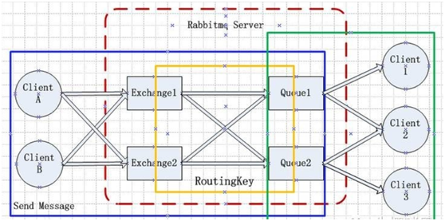

### RabbitMQ
RabbitMQ 是高可靠、高可用的消息中间件。  
RabbitMQ 是基于 Erlang 语言，实现了 AMQP（Advanced Message Queuing Protocol，高级消息队列协议） 协议实现的消息队列中间件。它最初起源于金融系统，用于在分布式系统中存储转发消息。  

**RabbitMQ 特性**  

- 可靠性  
- 灵活的路由
- 扩展性
- 高可用性
- 支持多种协议
- 多语言客户端
- 易用的管理界面
- 插件机制

**RabbitMQ 核心概念**  

- Producer(生产者) 和 Consumer(消费者)
> Producer(生产者) :生产消息的一方（邮件投递者）  
> Consumer(消费者) :消费消息的一方（邮件收件人）  
> 消息一般由 2 部分组成：消息头（或者说是标签 Label）和消息体。  
- Exchange(交换器)
> Exchange(交换器) 用来接收生产者发送的消息并将这些消息路由给服务器中的队列中。  
> 生产者将消息发给交换器的时候，一般会指定一个 RoutingKey(路由键)，用来指定这个消息的路由规则，而这个RoutingKey需要与交换器类型和绑定誕(BindingKey)联合使用才能最终生效。  
> RabbitMQ 中通过 Binding(绑定) 将 Exchange(交换器) 与 Queue(消息队列) 关联起来，在绑定的时候一般会指定一个 BindingKey(绑定建) ,这样 RabbitMQ 就知道如何正确将消息路由到队列了。
- Queue(消息队列)
> Queue(消息队列) 用来保存消息直到发送给消费者。它是消息的容器，也是消息的终点。一个消息可投入一个或多个队列。消息一直在队列里面，等待消费者连接到这个队列将其取走。
- Broker（消息中间件的服务节点）
> 对于 RabbitMQ 来说，一个 RabbitMQ Broker 可以简单地看作一个 RabbitMQ 服务节点，或者 RabbitMQ 服务实例。大多数情况下也可以将一个 RabbitMQ Broker 看作一台 RabbitMQ 服务器。  
- Exchange Types(交换器类型)
> ① fanout，会向响应的 queue 广播  
> ② direct，如果 routing key 匹配，那么 Message 就会被传递到相应的 queue  
> ③ topic，对 key 进行模式匹配，比如 ab* 可以传递到所有 ab* 的 queue  
> ④ headers(不推荐)  
- Connection（连接）
> Producer 和 Consumer 通过 TCP 连接到 RabbitMQ。  
- Channel（渠道）
> 它建立在上述的 TCP 连接中，数据流动都是在 Channel 中进行的。  

  

生产者将消息发送给交换器是需要一个 RoutingKey ，当 BindingKey 和 RoutingKey 匹配时，消息会被路由到对应的队列中。  
`注意：这里要说明的是 BindingKey 并不是在所有的情况都生效，还依赖交换器的类型。Fanout 类型的交换机会无视 BindingKey，会将消息发送给所有的交换机绑定的所有的队列。`  

### RabbitMQ 安装
```bash
#centeros7 安装 erlang
yum install erlang
#启动扩展源
yum install epel-release
#下载rabbitmq源文件
wget http://www.rabbitmq.com/releases/rabbitmq-server/v3.6.6/rabbitmq-server-3.6.6-1.el7.noarch.rpm
#安装
yum install rabbitmq-server-3.6.6-1.el7.noarch.rpm 
#尝试执行
yum install socat
# 添加开机启动RabbitMQ服务
chkconfig rabbitmq-server on
# 启动服务
/sbin/service rabbitmq-server start
# 查看服务状态
/sbin/service rabbitmq-server status 
# 停止服务
 /sbin/service rabbitmq-server stop
# 查看当前所有用户
 rabbitmqctl list_users
# 查看默认guest用户的权限
 rabbitmqctl list_user_permissions guest
由于RabbitMQ默认的账号用户名和密码都是guest。为了安全起见, 先删掉默认用户
rabbitmqctl delete_user guest
# 添加新用户
rabbitmqctl add_user username password
# 设置用户
rabbitmqctl set_user_tags username administrator
# 赋予用户默认vhost的全部操作权限
rabbitmqctl set_permissions -p / username ".*" ".*" ".*"
# 查看用户的权限
rabbitmqctl list_user_permissions username
#这是打开管理插件的命令.
rabbitmq-plugins enable rabbitmq_management
```

**安装 PHP 扩展**  
```bash
# 安装 rabbitmq-c，C 与 RabbitMQ 通信需要依赖这个库
git clone git://github.com/alanxz/rabbitmq-c.git  
cd rabbitmq-c
mkdir build  && cd build  
cmake -DCMAKE_INSTALL_PREFIX=/usr/local ..  
cmake --build . --target install
# php 扩展：amqp
wget http://pecl.php.net/get/amqp-1.9.1.tgz
tar zvxf amqp-1.9.1.tgz
cd amqp-1.9.1
phpize
./configure --with-amqp
make && make install
# 将 extension=amqp.so 放到 php.ini
php -i | grep amqp
```

### RabbitMQ 实践
**实现消息发送和接收**  
```php
// receive.php

/**
 * 接收消息
 */
$exchangeName = 'demo';
$queueName = 'hello';
$routeKey = 'hello';

// 建立TCP连接
$connection = new AMQPConnection([
    'host' => 'localhost',
    'port' => '5672',
    'vhost' => '/',
    'login' => 'guest',
    'password' => 'guest'
]);
$connection->connect() or die("Cannot connect to the broker!\n");

$channel = new AMQPChannel($connection);

$exchange = new AMQPExchange($channel);
$exchange->setName($exchangeName);
$exchange->setType(AMQP_EX_TYPE_DIRECT);

echo 'Exchange Status: ' . $exchange->declareExchange() . "\n";

$queue = new AMQPQueue($channel);
$queue->setName($queueName);

echo 'Message Total: ' . $queue->declareQueue() . "\n";

echo 'Queue Bind: ' . $queue->bind($exchangeName, $routeKey) . "\n";

var_dump("Waiting for message...");

// 消费队列消息
while(TRUE) {
    $queue->consume('processMessage');
}

// 断开连接
$connection->disconnect();

function processMessage($envelope, $queue) {
    $msg = $envelope->getBody();
    var_dump("Received: " . $msg);
    $queue->ack($envelope->getDeliveryTag()); // 手动发送ACK应答
}
```

终端中运行消息发送脚本 `php receive.php`，然后打开另一个终端。 

```php
// send.php

/**
 * 发送消息
 */
$exchangeName = 'demo';
$routeKey = 'hello';
$message = 'Hello World!';

// 建立TCP连接
$connection = new AMQPConnection([
    'host' => 'localhost',
    'port' => '5672',
    'vhost' => '/',
    'login' => 'guest',
    'password' => 'guest'
]);
$connection->connect() or die("Cannot connect to the broker!\n");

try {
    $channel = new AMQPChannel($connection);

    $exchange = new AMQPExchange($channel);
    $exchange->setName($exchangeName);
    $exchange->setType(AMQP_EX_TYPE_DIRECT);
    $exchange->declareExchange();

    echo 'Send Message: ' . $exchange->publish($message, $routeKey) . "\n";
    echo "Message Is Sent: " . $message . "\n";
} catch (AMQPConnectionException $e) {
    var_dump($e);
}

// 断开连接
$connection->disconnect();
```

终端中运行消息发送脚本 `php send.php`。  
