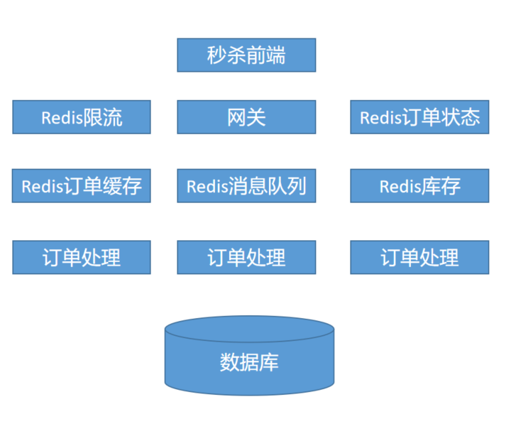
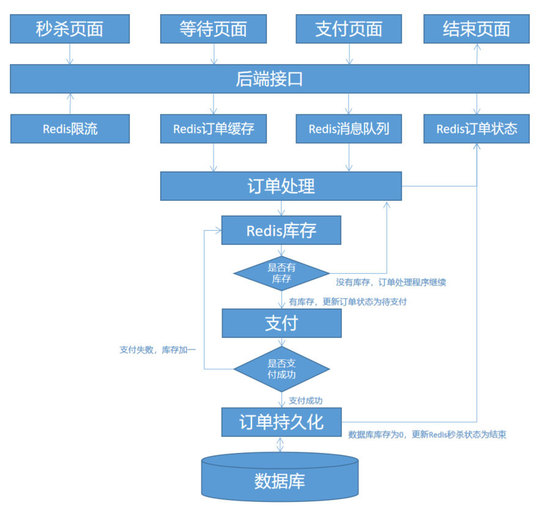

### 什么是秒杀
双十一零点抢购、手机整点抢购、抢火车票、1 元秒杀、抢红包等等，都可以说是秒杀的各种应用场景了。  
秒杀系统的设计，难就难在，在极短的时间内，应对瞬时涌入平时成百上千倍的巨大流量，还包括各种攻击刷量作弊等未知流量，最终我们要保证在用户体验顺畅良好的情况下，不能多卖或者少卖。

当我们公司决定要做秒杀系统的时候，我就去找业务，到时大概会有多少 UV，不知道 10 倍或者 100 倍？然后去找老板，给技术多少预算，最多平时的 10 倍不能再多了，当然越少越好，也就是说让我们用平时最多 10 倍的预算去解决不可预估的用户流量，怎么做？要是有钱直接扔 1 万台服务器跑去吧，钱能解决的事就不是事，但问题是现在还没那么多钱，还要把事情搞定。  

秒杀的特点：抢购（稀缺）、时间点、限量。  

### 秒杀系统设计原则
- 分流。将拥挤无序的人们，通过分组的方式实现分流。
- 限流。每次安排一定的人数进入超市采购。
- 削峰。通过匀速进入，和每隔一小段时间进入超市，避免大量人员一次性涌入。
- 网关。尽可能的将用户拦截在超市门口外。
- 队列。所有参加采购的人员都需要排队依次先后入场。
- 缓存。将销售场地搬到离用户更近的地方，等到猪肉卖差不多了，然后再去库房拿。
- 异步处理。 开通绿色通道，用户不需要进入超市，下完单就可以去干其他事情了，超市的人员会帮忙采购并送货上门。区别于同步处理，用户只能排队等着直到买到猪肉，这期间不能离开去做其他事情。
- 可扩展。可以通过增加销售窗口，增加每次进入场地采购猪肉人数。
- 降级。推迟非抢购猪肉的用户进超市，保障猪肉采购活动顺利进行。

### 秒杀架构设计
  

可以看出 Redis 在秒杀系统中的重要位置，它主要作用为限流，缓存和消息队列。

构建整个秒杀系统的业务流程：  
  

根据业务流程，看看具体的实现过程。  

**秒杀页面**  
参加秒杀活动的用户，应先登录网站，才可以进行秒杀（屏蔽非秒杀用户流量）。  
秒杀页面需要完全静态化，并前后端分离。  
然后将秒杀页面放到 CDN 上。CDN 主要有两个作用，第一，分流，将用户根据地域不同分组；第二，缓存。将秒杀页面放到离用户更近的服务器上，提高用户访问速度，还可以减少后端服务器压力，这里可以选择公有云 CDN，可以根据预算随时扩容和释放资源。  
前端倒计时，按钮设置为灰色不可点，时间到后，暴露提交 API，并通过 JS 禁止用户重复提交。  

**限流**  
引入限流，是为了保障我们系统的最大处理能力，将大部分无效流量尽可能限制在系统上游（网关之外）。  

假如我们系统平时每天的 UV 在 12 万左右，峰值 UV 在 2000 左右，在当时业务部门无法预估用户流量的情况下，又假如业务要求我们保证卖完 1 万件产品的系统容量，我们根据平时支付成功率 2% 计算（支付成功率 = 下单并支付成功用户数 / 访问该产品用户数，秒杀时候支付成功率会更高），那么我们需要准备最少可以处理 50 万用户并发请求的系统能力，这也就是我们需要的限流数量。所以，限流系统至关重要，是整个秒杀系统的门神。

限流，最简单的方式可以通过 Redis 计数器限流，每一个用户请求计数器加 1，如果计数器大于限流数量，则将用户直接跳转到等待页面。还可以通过 UID 限流，将用户 UID 存入 Redis 集合中，如果集合中存在该用户 IP，或者集合总数大于限流值时直接跳转到等待页面。当然，还可以通过 IP、User-Agent 限流，总之，这里需要尽可能限制系统处理能力外的流量进入系统下游。  

**削峰**  
削峰就是为了降低并发，减少对系统的瞬间冲击，将流量图从很尖的 “山峰” 状变为带有弧度的 “山坡” 状，将瞬间巨大流量转变为均匀流量。如下图将原本红色的流量图，转变为绿色的实际流量图。这就是大家常说的削峰填谷。因为秒杀活动中，系统总共处理的流量是恒定的，通过削峰填谷，可以将本来在 1 秒内进入系统的流量，转变为 10 秒甚至 20 秒，这样做其实也是有效的降低了系统最大处理能力，让我们的系统可以更从容地应对巨大流量。
  

消息队列，就是削峰填谷的最佳解决方案。当然，也可以通过验证码，答题，JS 定时器等小技巧进一步削峰，延迟流量瞬间进入系统。  

**排队等待页面**  
排队等待页面是为了保障用户体验顺畅和良好。当秒杀活动开始后，用户点击秒杀按钮，希望立即可以得到反馈。所以，我们在参与秒杀活动的时候，经常会看到一个等待页面，“你已成功挤进多少位”、“排在你前面的人超过多少位” 等等的提示。  

这里，我们会使用 3 种排队等待页面。  
第一种，成功挤进系统下游的用户，会跳转到你已成功挤进多少位的页面，我们这里设置前端会每 2 秒调用一次后端接口（调用间隔可以根据系统处理能力的 QPS 和系统容量来设置），判断订单是否处理完成，然后跳转支付页面进行支付。  
第二种，订单处理完成，需要立即跳转支付页面的，会展示你已秒杀成功，正在跳转到支付页面。  
第三种，没有进入到系统下游被限流的用户，会跳转到排在你前面的人超过多少位，请您耐心等待，并且前端会每 20 秒调用一次后端接口，判断是否流量不够，需要进入系统下游。如果系统容量评估够准确的话，很少会出现补充流量的情况。
总之，无论秒杀系统是否 OK，一定要尽可能地给与用户友好的交互体验和信息提示。  

**后端接口**  
我们一共需要给前端暴露了 3 个接口：  
第一，秒杀开始处理接口。它主要有三个作用，调用限流模块是否可以继续，写入 Redis 队列等待处理，将用户订单信息写入 Redis 缓存方便后续处理。  
第二，进入系统排队等待调用接口。在等待页面环节说到过，成功进入系统的用户等待页面，就是每 2 秒会调用一次该后端接口，这个接口会去查询订单处理状态，如果订单处理完成，立即跳转支付。  
第三，没有进入系统排队等待调用接口。这个接口只干一件事，就是查询秒杀流量状态值，判断是否流量不够需要补充。所以，我们系统会判断 Redis 队列和商品库存，如果队列长度不足以卖完产品，就更新 Redis 该状态值并补充流量进入系统。  

**缓存订单信息**  
所有通过限流的用户订单信息需要先缓存起来，一是提高处理效率，二是只有支付成功的用户订单信息才是有效的。  

**进入队列等待处理**  
订单缓存成功后，需要依次放入 Redis 消息队列中等待下一步处理。这里会通过异步处理程序处理队列中的数据。  

**订单异步处理程序处理队列**  
订单异步处理模块，我们会用 Redis 集群做一个预处理库存，我们且叫它 Redis 库存，并且会同时起多台服务器的多个订单处理进程，来查询 Redis 库存。

如果有库存，那么，Redis 库存减一，再去 Redis 消息队列读取一个用户进行订单处理，处理完成后更新 Redis 为待支付状态，用户会跳转到支付页面进行支付。

如果没有库存，进程会继续查询 Redis 库存，为什么呢？因为会有支付失败的用户啊，我们给支付设置了超时时间，比如 5 分钟，如果支付失败或者超时，就会给 Redis 库存加一，继续订单处理。只有真正支付成功后，才会去更新数据库产品库存，将用户跳转到秒杀成功页面。

通过 Redis 预处理库存和消息队列，可以避免产品少卖或者多卖。

订单处理模块，就好比是秒杀系统的心脏，异步、并行、可扩展、分布式是这里的核心，它的处理能力，决定了整个秒杀系统的处理能力和处理效率。  

**订单持久化**  
支付成功后，会进行订单持久化，订单持久化会将用户订单信息更新到数据库中，并且会将数据库产品库存减一，如果减一后数据库产品库存为 0，则更新 Redis 为秒杀结束状态，整个秒杀活动结束。  

### 秒杀常见问题
1、我们的预算有限，并且流量不好预估，怎么办  
技术部的最终目的是为了支撑公司业务更好的运作，因此，一定要明确业务部门的诉求，然后结合现有的资源，做适合自己公司的技术方案。  

我们通过和业务部门多次沟通后，最终达成一致：一定要保证用户体验顺畅和良好，产品可以少卖不能多卖，但是要必须从技术设计角度上保证不多卖不少卖（因为多卖会很麻烦，少卖可以容忍）。还有，我们也分析了平时的交易和访问数据，通过支付成功率计算出了最大的系统容量。这样，我们就可以根据预算和现有系统容量做进一步技术方案了。  

2、怎么保证 Redis 高可用，如果出问题怎么办  
我们当时面临两种解决方案，第一，直接用公有云 Redis。这样在高可用上会有一定保证，难点就是要做系统改造，私有云对接公有云。第二，使用自建 Redis 集群保证高可用。虽然公司平时也在用 Redis 集群，但是应对秒杀这样的规模，还是头次。  

最终经公司领导决定使用了第二种方案，事实证明，得不偿失，因为 Redis 高可用不单单是上个 Redis 集群就可以了，你还要考虑持久化、雪崩、穿透这些东西，虽然后来都没有发生，但是技术设计上一样都不能少，所以强烈推荐，能优先使用公有云就不要自己做，当然，如果考虑到技术沉淀这方面，自建肯定会更好一些。  

3、如果遇到大量 DDoS 攻击怎么办  
用公有云 CDN，虽然我们也有自建 CDN，但是为了预防 DDoS 攻击，最好将秒杀活动相关页面放到了公有云 CDN 上，因为公有云 CDN 在处理 DDoS 方面已经非常成熟了，如果自己做，这又是另一个领域的问题了，我们应该聚焦到业务部的主要诉求上来。  

4、如何屏蔽作弊流量  
我们都知道，秒杀活动要么是商品促销，要么是稀缺物品，难免会有很多作弊流量。为了尽可能减少作弊流量，我们使用了两个措施：  
> 强制用户登录后才可以参加秒杀活动。  
> 增加手机验证码，虽然在用户体验上不是很友好，但是这个可以有效减少作弊，并且在限流和削峰上有帮助。（设计技术方案很多时候，是在用户体验和系统稳定性中做权衡的结果）  

5、监控，监控，一定要做好监控  
我觉得衡量一个技术部的综合能力，就应该看看监控大盘做的好不好，衡量一个系统设计的如何，同样看监控大盘指标怎么样。

经过这次秒杀活动，我们后来的第一个重点，就是完善监控大盘。因为秒杀活动开始后，我们的秒级监控系统出了问题，这也是整个秒杀系统设计所忽视的部分。没有秒级监控，我们只能通过分钟监控曲线和系统日志观察流量实时动态，整个秒杀活动前后总共也就 5 分钟左右，期间发生的任何异常，都需要做出相应的处理措施，监控系统就好比我们的眼睛一样，重要程度就不言而喻了。
