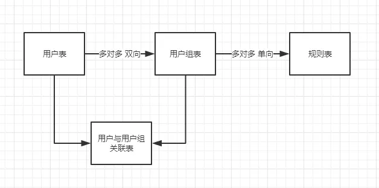
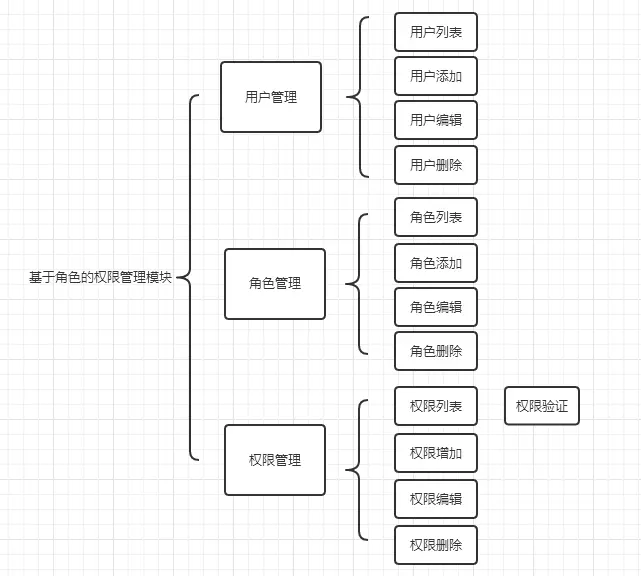

### Auth 权限
Auth 权限认证是按规则进行认证，对权限的控制更为精细。  
每一个功能对应的一个 url 路径，规则表其实就是记录 url 路径，通过 url 来实现权限管理。  

**Auth 的特性**  

- 是对规则进行认证，不是对节点进行认证。用户可以把节点当作规则名称实现对节点进行认证。auth=newAuth();auth=newAuth();auth->check (‘规则名称’,’用户 id’)
- 可以同时对多条规则进行认证，并设置多条规则的关系（or 或者 and）。auth=newAuth();auth=newAuth();auth->check (‘规则 1, 规则 2’,’用户 id’,’and’)
- 一个用户可以属于多个用户组（think_auth_group_access 表 定义了用户所属用户组），我们需要设置每个用户组拥有哪些规则（think_auth_group 定义了用户组的权限）。
- 支持规则表达式。在 think_auth_rule 表中定义一条规则时，如果 type 为 1， condition 字段就可以定义规则表达式。 如定义 {score}>50 and {score}<100 表示用户的分数在 50-100 之间时这条规则才会通过。

**权限验证时机**  

- 前置验证  
所谓前置认证，就是当前可访问的页面内部元素在显示前就进行权限验证。例如：游客访问网页时，看不到某个功能菜单，但管理员能看到等。前置验证用户体验好，但性能差点
- 后置认证  
所谓后置认证，这个就简单，就是每个功能访问时先进行权限验证。例如，在页面上点击‘添加栏目’按钮，先进行验证，通过才执行添加栏目功能代码。后置验证用户体验差，但性能好

**权限模块设计**  
   

**AUTH 权限管理与 RBAC 权限管理**  
相同点：都是基于角色的权限管理，都是同一个用户可属于多个角色或用户组。  
不同点：  
1、数据表的设计不同，导致 AUTH 更灵活、权限管理更细腻。  
2、Rbac 是基于节点控制，根据 3 级节点，module,controller,action, 节点类似与树形结构，3 级节点间相互有关联；Auth 是基于规则控制，定制规则和条件表达式，每一条规则都是独立的。  
3、Rbac 表关系：用户表 -> 用户角色关联表 -> 角色表 -> 角色节点关联表 -> 节点表；Auth 表关系：用户表 -> 用户和用户组关联表 -> 用户组表 -> 规则表。  
4、Rbac 根据 3 级节点控制，粒度到操作 action, 每个节点为单一的模块，控制器或操作；Auth 根据规则控制，可自由定制不同的规则，非常自由，同一个规则内可以定制多个不同节点 (中间的关系：OR AND)。  
5、Auth 可定制规则表达式，比如定制积分表达式。  

