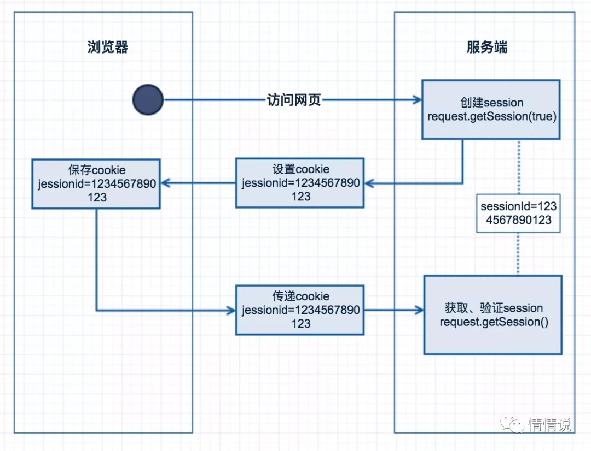

### 什么是 Cookie & Session
大部分系统都需要识别用户的身份，有些功能只有特定的用户能使用，有些功能需要根据用户身份显示不同的内容，一般使用唯一编号标识用户的身份。  

session 和 cookie 主要用来识别登录者身份的，默认通过 SESSIONID 唯一编号进行验证。  
session 是在服务端保存的一个数据结构，用来跟踪用户的状态，也可以保存用户相关的一些数据，可以保存在内存、缓存、数据库等存储结构中。  
cookie 是客户端保存用户信息的一种机制。

HTTP Cookie（也叫 Web Cookie 或浏览器 Cookie）是服务器发送到用户浏览器并保存在本地的一小块数据，它会在浏览器下次向同一服务器再发起请求时被携带并发送到服务器上。通常，它用于告知服务端两个请求是否来自同一浏览器，如保持用户的登录状态。Cookie 使基于无状态的 HTTP 协议记录稳定的状态信息成为了可能。

Cookie 主要用于以下三个方面：  
会话状态管理（如用户登录状态、购物车、游戏分数或其它需要记录的信息）  
个性化设置（如用户自定义设置、主题等）  
浏览器行为跟踪（如跟踪分析用户行为等）  

Cookie 曾一度用于客户端数据的存储，因当时并没有其它合适的存储办法而作为唯一的存储手段，但现在随着现代浏览器开始支持各种各样的存储方式，Cookie 渐渐被淘汰。由于服务器指定 Cookie 后，浏览器的每次请求都会携带 Cookie 数据，会带来额外的性能开销（尤其是在移动环境下）。新的浏览器 API 已经允许开发者直接将数据存储到本地，如使用 Web storage API （本地存储和会话存储）或 IndexedDB。  

Cookie 的组成主要是 Name、Value、Domain（作用域）、Path（生效路径）、Expired/Max-Age（过期时间）、Size（大小，最大 5 M）、HttpOnly（是否只允许 Http 获取）、SameSite（跨域共享）。  

Cookie 的交互过程：  
1、使用浏览器访问服务端页面  
2、服务端收到该客户端第一次请求后，会创建一个 Session，生产一个唯一 sessionId  
3、同时在响应请求中设置 Cookie，属性名为 jessionid  
4、客户端收到后会保存 jessionid，再次请求时，会在 header 中设置，服务端可从请求头中获取  
5、服务端验证获取的 sessionId 是否存在，即可验证是否是同一用户  
  

`注意：当浏览器禁用 Cookie 后，基于 Cookie 的 Session 将不能正常工作，每次都将创建一个新的 Session，可通过 URL 重写传递 sessionId。`  

### Cookie & Session 存在的问题
**Session 是不适合日活上百万的**  
网站负载大了以后，比方微博这种，一个系统保存上亿的 sessionId，这时候就需要考虑负载均衡了。  
但是，当把 sessionId 都存到 Redis 缓存，所有的机器都来访问这个地方的数据， 这样一来，虽然不用复制了，但是增加了单点失败的可能性，要是负责 Session 的机器挂了，所有人都得重新登录一遍 ... 估计得被人骂死。  
