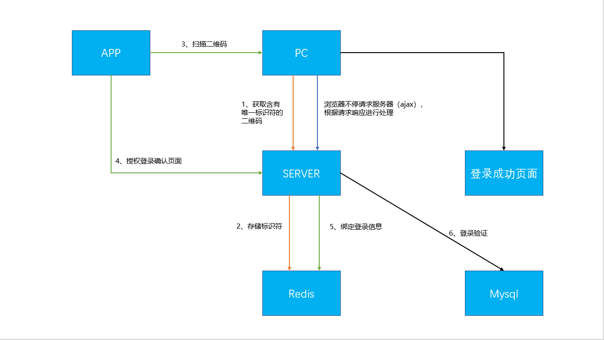
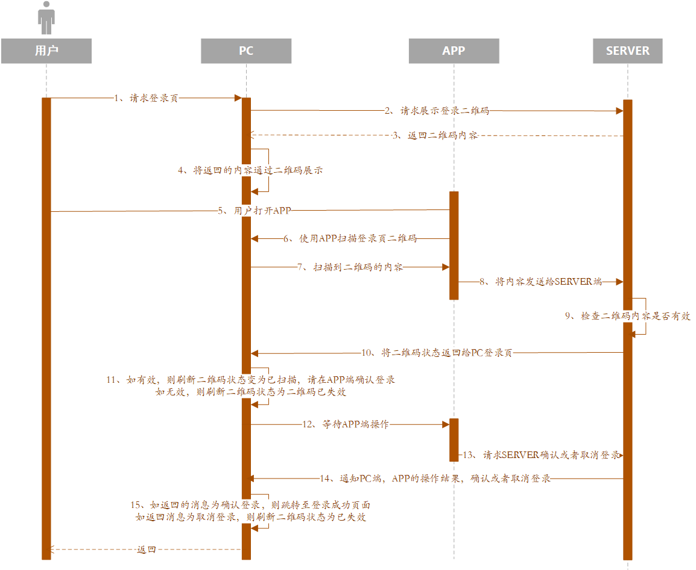

### 什么是扫码登陆
App 扫码登陆的基本流程：  
1、网页端的二维码本质是一个 URL，比方是 http://www.a.com?uuid=xxxxx， 这个 uuid 是生成的当前 PC 的唯一标示， 然后会定时请求后端的 API，假设这个请求叫 A 请求，根据返回的状态来做下一步动作。  
2、当手机扫码后，会带上这个 uuid 和用户信息，发送一个请求给后端，后端拿到这个 uuid，就知道用户已经登录来，然后上面的 A 接口就会返回一个已经登录的状态，同时返回用户信息，这样二维码页面会跳转到用户列表页，整个扫码登录流程完成。  
`注意：PC 端的二维码检测可以使用 setInterval 定时请求或长连接请求。`  


扫码登陆时序图：  
  

### 扫码登陆实现原理
整个功能的实现原理，概括如下：  

- Server 端作为整个的请求控制中心；
- PC 端发起二维码登录请求，从 Server 端获取登录的二维码内容 A，并转换为二维码展示在页面；
- App 端通过扫一扫获取到二维码内容 A，提交给 Server 端，并通知 Server 端对 A 完成登录或者取消登录操作；
- PC 端通过 Server 拿到 App 端对 A 的操作处理结果，并做出相应的反应，最终完成登录；
整个过程借助 Redis 存储内容 A 的状态，完成响应处理。  

**Server 端如何完成数据处理**  
PC 端向 Server 请求获取二维码内容的流程：  
- 生成一个唯一码 code，并存入 Redis，有效时间为 120s，Redis 的 key 为 Constants.QRCODE_LOGIN + code，Redis 的 value 为 logout；
- 生成二维码内容，Constants.QRCODE_HEADER + code，并返回 PC 端；
- 未过期二维码数据的处理。
```java
/**
 * 登陆首页获取扫一扫登陆的二维码内容
 * 
 * @return Map<String,Object>
 */
@PostMapping(value="/getQrcodeContent")
public ResponseBean getQrcodeContent(@RequestBody JSONObject jsonObject){
    String oldContext = jsonObject.containsKey("context")?jsonObject.getString("context"):"";
    // 如果页面有旧的二维码，同时请求新的二维码内容，则直接删除旧内容
    if( !"".equals(oldContext) ){
        if( redisRepository.exists( Constants.QRCODE_LOGIN + oldContext.replace(Constants.QRCODE_HEADER, ""))){
Constants.QRCODE_LOGIN + oldContext.replace(Constants.QRCODE_HEADER, ""));
        }
    }

    String code = Base64.encode(UUID.randomUUID().toString());
    String context = Constants.QRCODE_HEADER + code;
    // 将生成的 code存入 redis，失效时间为 120s
    redisRepository.setExpire(Constants.QRCODE_LOGIN + code, QrCodeEnmu.logout.toString(), 120);
    return new ResponseBean(ResponseConstant.SUCCESS, context);
}
```

**PC 端是如何检测到 App 端已经完成了扫码操作**  
PC 端在拿到二维码内容之后，即可进行展示用于扫码的二维码；与此同时，PC 端会发起一个检查二维码状态变化的轮询请求，以保证实时检测到状态的变化。  

检查上一个接口中生成的 Redis 的 key 为 Constants.QRCODE_LOGIN + code 的状态，并做出相应的处理，给 PC 端相应的返回，以保证 PC 端能够实时的检测到 Server 发生的数据状态的变化。当 App 端扫描二维码并操作时，PC 端通过以下接口能够马上检测到数据发生变化。  
```java
/**
 * web 端与服务器建立连接检查当前用户是否有做登陆动作
 * 
 * @return Map<String,Object>
 * @throws Exception 
 */
@PostMapping(value="/qrcodeCheckLogin")
public ResponseBean qrcodeCheckLogin(@RequestBody JSONObject jsonObject, HttpServletRequest httpRequest) throws Exception{
    String context = jsonObject.containsKey("context")?jsonObject.getString("context"):"";
    String type = jsonObject.containsKey("type")?jsonObject.getString("type"):"";

    if( "".equals(context) ){
        return new ResponseBean(ResponseConstant.IVALID_QRCODE);
    }

    // 统一一个开始时间，每次请求超过 10s 时自动跳出循环结束
    long starttime = System.currentTimeMillis();
    String code = context.replace(Constants.QRCODE_HEADER, "");
    ResponseBean responseBean = new ResponseBean();
    while(true){
        Thread.sleep(500);
        logger.info("retry check login...");
        // 检查 redis 是否还存在二维码内容
        if( !redisRepository.exists(Constants.QRCODE_LOGIN + code) ){
            return new ResponseBean(ResponseConstant.IVALID_QRCODE);
        }else{
            String status = redisRepository.get(Constants.QRCODE_LOGIN + code);
            // 如果status 的值是 scan，则表示该 code 已经被手机扫描，返回页面提示在手机上确认登陆
            // 如果 status 的值是  login，则表示该 code 处于登录状态，则返回前端状态信息
            // 如果 status 的值是 cancel，则表示该 code 为取消登录
            // 如果 status 的值是 logout，则表示该 code 尚未被扫描
            if( QrCodeEnmu.scan.toString().equals(status) ){
                // 如果传入的 type 的状态值不为空，则表明已经扫描成功，在等待确认下一步操作
                if( QrCodeEnmu.scan.toString().equals(type) ){
                    long endTime = System.currentTimeMillis();
                    long exeTime = endTime - starttime;
                    // 请求大于 10s，则跳出循环结束
                    if( exeTime >= 10000 ){
                        responseBean.setIsSuccess(true);
                        responseBean.setResponseCode(1104);
                        responseBean.setResponseMsg("请求超时，请重新请求");
                        break;
                    }
                }else{
                    return new ResponseBean(ResponseConstant.SCAN_SUCCESS);
                }
            }else if( QrCodeEnmu.cancel.toString().equals(status) ){
                //删除redis中该二维码的缓存信息
                redisRepository.del(Constants.QRCODE_LOGIN + code); 

                return new ResponseBean(ResponseConstant.CANCEL_SUCCESS);
            }else if( status.startsWith("login_") ){
                redisRepository.del(Constants.QRCODE_LOGIN + code);
                String userCode = status.replace("login_", "");

                SysUser sysUser = systemService.getUserByLoginName(userCode);

                // 完成登录操作
                UserDetails userDetails = AuthUserFactory.create(sysUser);
                UsernamePasswordAuthenticationToken authentication = new UsernamePasswordAuthenticationToken(userDetails, null, userDetails.getAuthorities());
                authentication.setDetails(new WebAuthenticationDetailsSource().buildDetails(httpRequest));
                SecurityContextHolder.getContext().setAuthentication(authentication);

                final String jwtToken = jwtTokenUtil.generateToken(userDetails, jwtTokenUtil.getRandomKey());
                return new ResponseBean(ResponseConstant.SUCCESS, JwtTokenUtil.TOKEN_TYPE_BEARER + " " + jwtToken);
            }else{
                long endTime = System.currentTimeMillis();
                long exeTime = endTime - starttime;
                // 请求大于 10s，则跳出循环结束
                if( exeTime >= 10000 ){
                    responseBean.setIsSuccess(true);
                    responseBean.setResponseCode(1104);
                    responseBean.setResponseMsg("请求超时，请重新请求");
                    break;
                }
            }
        }
    }
    return responseBean;
}
```

**App 端在过程中完成了哪些交互**  
- App 端保持登录状态，若未登录，则必须提前完成登录；
- App 扫描二维码，向 Server 端请求更改 Constants.QRCODE_LOGIN + code 的状态为 scan，并打开一个确认操作的页面；
- 向 Server 端确认登录或者取消登录。

App 扫一扫请求接口的统一处理方法：  
```java
/**
 * App 扫一扫统一入口
 *     
 * @param jsonObject
 * @return
 */
@PostMapping("/scanService")
public ResponseBean scanService(@RequestBody JSONObject jsonObject) {
    // APP 扫描到的内容信息
    String message = jsonObject.containsKey("message")?jsonObject.getString("message"):"";
    String token = jsonObject.containsKey("token")?jsonObject.getString("token"):"";

    if(message.startsWith(Constants.QRCODE_HEADER)){
        // 扫码登录
        // 获取 uuid，校验 redis 中是否存在该标识
        String uuid = message.replace(Constants.QRCODE_HEADER, "");
        String key = Constants.QRCODE_LOGIN + uuid;
        if( !redisRepository.exists(key) ) {
            // 如果不存在该 KEY，表示二维码已经失效
            JSONObject result = new JSONObject();
            result.put("type", "TEXT");
            result.put("content", "获取信息失败，请重新获取");
            return new ResponseBean(ResponseConstant.GET_MESSAGE_FAILED, result);
        } else {
            // 更新二维码，并将二维码唯一标识与 token 绑定，有效时间 120s
            redisRepository.setExpire(key, QrCodeEnmu.scan.toString(), 120);
            redisRepository.setExpire("qrcode_" + token, uuid, 120);
            JSONObject result = new JSONObject();
            result.put("type", "HTTP");
            result.put("content", "http://localhost:8081/views/confirm.html");  // APP 端打开一个页面，确认或者取消登录
            return new ResponseBean(ResponseConstant.SUCCESS, result);
        }
    } else {
        // 其他类型的请求操作
    }
    return new ResponseBean();
}
```
关键点在于，将扫描到的二维码内容信息，提交给 Server 端进行处理，并绑定当前登录 token 和 code 的关系到缓存中，以便于确认或取消登录时使用。  

App 端确认 / 取消登录接口代码如下：  
```java
/**
 * 扫码登录：确认/取消登录
 * 
 * @param jsonObject
 * @return 
 */
@PostMapping("/scanLogin")
public ResponseBean scanLogin(@RequestBody JSONObject jsonObject){
    String token = jsonObject.containsKey("token")?jsonObject.getString("token"):"";
    String type = jsonObject.containsKey("type")?jsonObject.getString("type"):"";

    if( "".equals(token) || "".equals(type) ){
        return new ResponseBean(ResponseConstant.IVALID_ERROR);
    }

    // 根据 token 获取用户信息
    final String authToken = StringHelper.substring(token, 7);
    String username = jwtTokenUtil.getUsernameFromToken(authToken);
    //根据 token 获取绑定的 uuid，并校验是否已失效
    if(!redisRepository.exists("qrcode_"+token)){
        return new ResponseBean(ResponseConstant.GET_MESSAGE_FAILED);
    }else{
        String uuid = redisRepository.get("qrcode_"+token);
        if(QrCodeEnmu.login.toString().equals(type)){
            // 更新二维码状态，并附上用户信息
            redisRepository.setExpire(Constants.QRCODE_LOGIN + uuid, "login_"+username, 120);
            // 删除绑定了的 token 与 uuid
            redisRepository.del("qrcode_"+token);
            return ResponseBean.success();
        }else if(QrCodeEnmu.cancel.toString().equals(type)){
            redisRepository.setExpire(Constants.QRCODE_LOGIN + uuid, "cancel", 120);
            // 删除绑定了的 token 与 uuid
            redisRepository.del("qrcode_"+token);

            return new ResponseBean(ResponseConstant.CANCEL_SUCCESS);
        }
    }
    return new ResponseBean();
}
```
确认 / 取消登录的核心处理步骤就是对 Constants.QRCODE_LOGIN + code 状态的变更处理，确认则修改为 login_ + username，取消则修改为 cancel。修改完成后，PC 端通过 qrcodeCheckLogin 接口监听到状态的变化，并响应给 PC 端完成下一步动作。  
