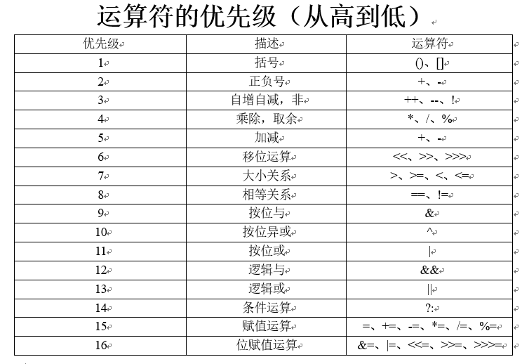

### Java 初识
Java 介于编译型语言和解释型语言之间。  

随着 Java 的发展，Java 又分出了三个不同版本：  
J2SE(Java 2 Platform Standard Edition)标准版是为开发普通桌面和商务应用程序提供的解决方案，该技术体系是其他两者的基础，可以完成一些桌面应用程序的开发。   
J2ME(Java 2 Platform Micro Edition)小型版是为开发电子消费产品和嵌入式设备提供的解决方案。  
J2EE(Java 2 Platform Enterprise Edition)企业版是为开发企业环境下的应用程序提供的一套解决方案，该技术体系中包含的技术如 Servlet、Jsp 等，主要针对于 Web 应用程序、开发数据库、消息服务等。  
Java SE 是整个 Java 平台的核心，而 Java EE 是进一步学习 Web 应用所必须的(Spring 等框架都是 Java EE 开源生态系统的一部分)。

Java 语言特点：简单性、面向对象、健壮性、结构中立、高性能、多线程、动态、安全性、跨平台。  
跨平台：只要在需要运行 java 应用程序的操作系统上，先安装一个 Java 虚拟机 JVM (Java Virtual Machine) 即可。由 JVM 来负责 Java 程序在该系统中的运行。（Write once, run anywhere）  
```
           --- jvm --- windows
Java 语言 -|-- jvm --- linux
           --- jvm --- macos
```

使用 JDK 开发完成的 java 程序，最终交给 JRE 去运行。  
JRE(Java Runtime Environment) Java 运行环境，包括 Java 虚拟机 JVM(Java Virtual Machine) 和 Java 程序所需的核心类库等，如果想要运行一个开发好的 Java 程序，计算机中只需要安装 JRE 即可。  
JDK(Java Development Kit) Java 开发工具包，JDK 是提供给 Java 开发人员使用的，其中包含了 java 的开发工具，也包括了 JRE。所以安装了 JDK，就不用在单独安装 JRE 了。其中的开发工具：编译工具 javac.exe 和打包工具 jar.exe 等。  

JSR 规范(Java Specification Request)，为了保证 Java 语言的规范性。凡是想给 Java 平台加一个功能，比如说访问数据库的功能，大家要先创建一个 JSR 规范，定义好接口，这样，各个数据库厂商都按照规范写出 Java 驱动程序。  
负责审核 JSR 的组织就是 JCP(Java Community Process)。  
一个 JSR 规范发布时，为了让大家有个参考，还要同时发布如下套件：  
RI：Reference Implementation 参考实现  
TCK：Technology Compatibility Kit 兼容性测试套件  

Java 的学习曲线：  
1、先学习 Java SE，掌握 Java 语言本身、Java 核心开发技术以及 Java 标准库的使用；  
2、如果继续学习 Java EE，Spring 框架、数据库开发、分布式架构就是需要学习的；  
3、如果学习大数据开发，那么 Hadoop、Spark、Flink 这些大数据平台就是需要学习的，他们都基于 Java 或 Scala 开发；  
4、如果学习移动开发，那么就深入 Android 平台，掌握 Android App 开发。  

### Java 安装
JDK 的下载：http://www.oracle.com  

Java 环境变量配置：  
添加变量 JAVAHOME(java/jdk-xx)，  
添加 path 环境变量(%JAVA_HOME%\bin;)，  
!不建议添加 CLASSPATH 环境变量(.;%JAVA_HOME%\lib)，推荐在启动 JVM 时设置 class 变量（java -classpath ".;%JAVA_HOME%\lib" 或 java -cp ".;%JAVA_HOME%\lib"）  
`添加环境变量 path 的意义是 javac 和 java 命令可以在任意目录下使用；classpath 环境变量则是让 class 文件在任意目录运行，在 IDE 中运行 Java 程序，IDE 自动传入的 -cp 参数是当前工程的 bin 目录和引入的 jar 包；另外，不要把任何 Java 核心库添加到 classpath 中，JVM 根本不依赖 classpath 加载核心库`  

```bash
# ubuntu 下安装 java
sudo apt update
sudo add-apt-repository ppa:linuxuprising/java
sudo apt install oracle-java12-installer
# 若系统 java 多版本，设置默认 java12
sudo apt -y install oracle-java12-set-default

# 设置 java 环境
sudo vim /etc/profile.d/jdk.sh
# 中增加以下两行
# export JAVA_HOME=/usr/lib/jvm/java-12-oracle
# export PATH=$PATH:$JAVA_HOME/bin:/usr/lib/jvm/java-12-oracle/db/bin
source /etc/profile.d/jdk.sh
```

IDE-Idea：https://www.jetbrains.com/idea/

### Hello, java
```java
/**
 * HelloJava class
 * 
 * 类名必须以英文字母开头，后接字母，数字和下划线的组合（习惯以大写字母开头）
 * public 是访问修饰符，表示该 class 是公开的
 */
public class HelloJava {
	// 固定入口方法
	public static void main(String [] args) {
		System.out.println("Hello, java");
	}
}
```
代码执行过程；
HelloJava.java -> javac 编译(javac HelloJava.java) -> Java 字节码文件 HelloJava.class -> java 执行(java HelloJava) -> 运行结果 Hello, java

### Java 关键字和标识符
关键字：被 Java 语言赋予特定含义的单词，组成关键字的字母全部小写，比如 public  
`注意：goto 和 const 作为保留字存在，目前并未使用`
[关键字汇总参考](http://cyw3.github.io/YalesonChan/2016/Java-key.html)   

标识符：给类、接口、方法、变量等起名字时使用的字符序列，由英文大小写字母、数字字符、$ 和 _ 组成，比如 myName   
`注意：不能以数字开头，不能使用 Java 关键字（goto 和 const 也不能哦），区分大小写`  

### Java 注释
注释是一个程序员必须要具有的良好编程习惯。  
注释是用于解释说明程序的文字，提高程序的阅读性，帮助我们调试程序。  
```java
// 单行注释文字
/* 多行注释文字 */
/** 文档注释文字 */
```

### Java 输入输出
Java 的输入，提高程序的灵活性。
```java 
import java.util.Scanner;

Scanner sc = new Scanner(System.in); // 创建 Scanner 对象，System.in 表示标准输入流
System.out.print("Input your name: "); // System.out 表示标准输出流
String name = scanner.nextLine(); // 读取一行输入并获取字符串
System.out.print("Input your age: ");
int age = sc.nextInt(); // 读取一行输入并获取整数，如果转换为浮点数使用 nextDouble()...
System.out.printf("Hi, %s, you are %d\n", name, age); // 格式化输出
```

Java 的输出主要时向屏幕输出一些内容。  
Java 的输出格式化功能提供了多种占位符，可以把各种数据类型 “格式化” 成指定的字符串。  

|占位符 | 说明 |
| ----- | ----- |
| %% | 字符 % |
| %d | 格式化输出整数 |
| %x | 格式化输出十六进制整数 |
| %f | 格式化输出浮点数 |
| %e | 格式化输出科学计数法表示的浮点数 |
| %s | 格式化字符串 |

```java
System.out.print("打印输出");
System.out.println("打印输出并换行");

double d = 3.1415926;
System.out.printf("格式化输出 %.2f\n", d); // 格式化输出 3.14
```

### Java 常量与变量
常量：在程序执行的过程中其值不可以发生改变，分为字面值常量和自定义常量（比如整数常量 1，布尔常量 true 和 false，空常量 null等）    
变量：在程序执行的过程中，在某个范围内其值可以发生改变的量，类似数学中的未知数  
`注意：语句块中定义的变量有一个作用域{}，就是从定义处开始，到语句块结束；定义变量时，要遵循作用域最小化原则，尽量将变量定义在尽可能小的作用域，并且不要重复使用变量名`  

```java
// 定义常量，通常全字符大写
public static final double PI = 3.1415926;

// 定义变量，没有初始化不能直接使用
// 虽然一行可以定义多个变量，但是建议只定义一个
int number;
// 定义并初始化
int number = 1;
// 省略类型，使用 var（编译器会根据赋值语句自动推断出变量 str_builder 的类型是 StringBuilder）
var str_builder = new StringBuilder();
```

### Java 数据类型
Java语言是强类型语言，对于每一种数据都定义了明确的具体数据类型，在内存总分配了不同大小的内存空间。  

Java 提供了两种变量类型：基本类型和引用类型。  

基本类型是 CPU 可以直接进行运算的类型。  
```
# 整数类型（没有无符号类型）
byte：8 位，-128 ~ 127 (-2^7 ~ 2^7 - 1)，封装器类 Byte
short: 16 位，-32768 ~ 32767 (-2^15 ~ 2^15-1)，封装器类 Short
int（默认）: 32 位，-2147483648 ~ 2147483647 (-2^31 ~ 2^31-1)，封装器类 Integer
long: 64 位，-9223372036854775808 ~ 9223372036854775807 (-2^63 ~ 2^63-1)，封装器类 Long

# 浮点数类型
float：32 位，-3.403E38 ~ 3.403E38（需要加上 f 后缀，区分双精度），封装器类 Float
double（默认）：64 位，-1.798E308 ~ 1.798E308，封装器类 Double

# 字符类型
# 存储 Unicode 码如 'A'，使用单引号赋值（注意与双引号的字符串类型区分）
char: 16 位，1，封装器类 Character 

# 布尔类型
# 理论上存储布尔类型只需要 1 bit，但是通常 JVM 内部会把 boolean 表示为 4 字节整数
# 封装器类 Boolean
true
false
```
基本类型的类型转换  
1、默认转换：byte,short,char —> int —> long —> float —> double  
2、强制转换：变量名=(目标类型)(被转换的数据);  
3、boolean 类型不能转换为其他的数据类型  

Java 的装箱拆箱  
自动装箱就是 Java 自动将原始类型值转换成对应的对象，比如将 int 的变量转换成 Integer 对象，这个过程叫做装箱，反之将 Integer 对象转换成 int 类型值，这个过程叫做拆箱。比如不同类型的比较就会触发自动装箱。  
装箱过程是通过调用包装器的 valueOf 方法实现的，而拆箱过程是通过调用包装器的 xxxValue 方法实现的。  
```java
// 自动装箱
int i = 10;
Integer n = i; // <=> Integer n = Integer.valueOf(i);

// 自动拆箱
Integer i = 10; // <=> Integer i = Integer.valueOf(10);
int n = i; // <=> int n = i.intValue();
```

引用类型底层结构和基本类型差别较大
```
# 类
class

# 接口
interface

# 数组
[]

# 枚举 
# 枚举类型不能被继承  
public enum t {
    SPRING, SUMMER;
}

# 标注
Annotation
```

### Java 字符串 
在 Java 中字符串属于对象，Java 提供了 String 类来创建和操作字符串，String 被声明为 final，不可被继承。  

和 char 类型不同，字符串 String 类型是引用类型，我们用双引号 "" 表示字符串，一个字符串可以存储 0 个到任意个字符。  

```java
// string 不可变
String s = "hello";
String t = s;
s = "world"; // s 指向了 world，hello 依旧存在
System.out.println(t); // hello

// string 拼接
// 用 + 连接字符串和其他数据类型，会将其他数据类型先自动转型为字符串再连接
String s1 = "Hello";
String s2 = "world";
String s = s1 + " " + s2 + "!";
System.out.println(s);

// 字符串的比较，返回布尔类型
s1.equals(s2);
s1.equalsIgnoreCase(s2);

// 单字节处理
// 字符串长度 str.length();
String str = "Something";
for (int i=0;i<str.length();i++){
    char s = str.charAt(i); // 返回指定索引处的字符
}

// 字符串反转
String str = "Something";
StringBuffer strBuff = new StringBuffer(str);
String strRev = strBuff.reverse().toString(); // gnihtemoS

// 字符串大小写转换
String str = "Something";
String strUpper = str.toUpperCase();
String strLower = str.toLowerCase();

// 空格移除
String str = "     aaa   ";
str.trim(); // aaa，首尾空格移除
str.replace(" ",""); // aaa，字符串替换，移除所有空格
str.replaceAll("\\s*",""); // 可以替换大部分空白字符， 不限于空格
// JDK 11 还引入了几种方法
// isBlank() 指示 String 是否为空或仅包含空格字符
// stripLeading() 从头部移除空白区域
// stripTrailing() 从末尾移除空白区域
// strip() 从字符串的开头和结尾移除空白区域
// repeat(int) 重复 String 为 int 次
// lines() 使用 Spliterator 从源字符串延迟提供行

// 分割字符串，返回一个分割后的字符串数组
String str = "tim,kerry,timmy";
String[] results = str.split(","); // {"tim", "kerry", "timmy"}

// 搜索与截取
String s = "String";
s.indexOf('i'); // 3，返回指定字符或字符串首字符的索引，不存在时返回 -1
s.indexOf('i', 5); // -1，从索引 5 开始查找
s.substring(3); // ing，从索引 3 开始截取字符串

// 格式化字符串
float floatVar = 1.23f;
int intVar = 4;
String stringVar = "HaHaHa";
String fs;
fs = String.format(" 浮点型变量的值为 " +
                   "% .2f, 整型变量的值为 " +
                   " % d, 字符串变量的值为 " +
                   " %s", floatVar, intVar, stringVar);
//  浮点型变量的值为  1.23, 整型变量的值为   4, 字符串变量的值为  HaHaHa

```

### Java 空值 
引用类型的变量可以指向一个空值 null，它表示不存在，即该变量不指向任何对象。  
```java
String s1 = null; // s1 是 null
String s2; // 没有初始化，s2 也是 null
String s3 = s1; // s3 也是 null
```

`注意：要区分空值 null 和空字符串 ""，空字符串是一个有效的字符串对象，它不等于 null`

### Java 数组
Java 语言中提供的数组是用来存储固定大小的同类型元素。  

定义一个数组类型的变量，使用数组类型 “类型 []”，例如，int[]。和单个基本类型变量不同，数组变量初始化必须使用 new int[5] 表示创建一个可容纳 5 个 int 元素的数组。  

Java 的数组有以下特点：  
1、数组所有元素初始化为默认值，整型都是 0，浮点型是 0.0，布尔型是 false；  
2、数组一旦创建后，大小就不可改变；  
3、数组是引用类型，在使用索引访问数组元素时，如果索引超出范围，运行时将报错；  
4、数组可以被重新赋值，指向新的数组，原数组依旧存在

```java
// 动态初始化：定义数组时未初始化元素时需要指定长度
int[] arr1 = new int[5];
System.out.println(arr1.length); // 数组的长度 5
System.out.println(arr1[0]); // 默认 0

// 静态初始化：定义数组时直接指定初始化的元素，不需要指定长度
int[] arr2 = new int[] { 68, 79, 91, 85, 62 };
// 简写为 int[] arr2 = { 68, 79, 91, 85, 62 };
// System.out.println(arr2.length); // 5
arr2 = new int[] { 1, 2, 3 };
System.out.println(arr2.length); // 3

// 字符串型的数组
String[] strArr = { "aaa", "bbb", "ccc" };
String str = strArr[0];
strArr[0] = "test"; // 数组项的改变不影响引用字符串型的 str
System.out.println(str); // aaa

// 遍历数组（for each 方式，不能指定排序）
// 遍历数组可以这样（能指定排序） for (int i=0; i < arr3.length; i++)
// for-each 的实现原理其实就是使用了普通的 for 循环和迭代器
int[] arr3 = { 1, 4, 19, 16, 25 };
for (int item : arr3) {
    System.out.println(item);
}

// 打印数组
import java.util.Arrays;
System.out.println(Arrays.toString(arr3));

// 数组排序
// 对数组排序会直接修改数组本身
// Arrays.sort(int[] array, int fromIndex, int toIndex) 可以对部分排序，默认全排
import java.util.Arrays;
Arrays.sort(arr3); // 默认从小到大升序排序
// 冒泡排序（从大到小排序）
for (int i = 0; i < arr3.length - 1; i++) {
    for (int j = 0; j < arr3.length - i - 1; j++) {
        if (arr3[j] < arr3[j+1]) {
            int tmp   = arr3[j];
            arr3[j]   = arr3[j+1];
            arr3[j+1] = tmp;
        }
    }
}
```

Java 的多维数组  
多维数组最常见的就是二维数组。  
Java 动态创建二维数组的格式：  
数据类型[][] 变量名 = new 数据类型[m][n];  
`m 表示这个二维数组有多少个一维数组，n 表示每一个一维数组的元素个数（也可以不指定）`  
Java 静态创建二维数组的格式：  
数据类型[][] 变量名 = new 数据类型[][]{{元素…},{元素…},{元素…}};  
数据类型[][] 变量名 = {{元素…},{元素…},{元素…}};  
```java
int[][] arr = {
    { 1, 2, 3, 4 },
    { 5, 6, 7, 8 },
    { 9, 10, 11, 12 }
};
System.out.println(arr.length); // 3，即包含 3 个一维数组
System.out.println(ns[1][2]); // 7

// 遍历二维数组
for (int[] item : arr) {
    for (int i : item) {
        System.out.print(i + ", ");
    }
    System.out.println();
}
// 1, 2, 3, 4, 
// 5, 6, 7, 8, 
// 9, 10, 11, 12, 

// 打印二维数组
System.out.println(Arrays.deepToString(arr)); // [[1, 2, 3, 4], [5, 6, 7, 8], [9, 10, 11, 12]]
```

### Java 数据结构
线性表（ArrayList）  
链表（LinkedList）  
栈（Stack）  
队列（Queue）  
图（Map）  
树（Tree）  

### Java 运算符
Java 的运算符包括算术运算符、赋值运算符、比较运算符、逻辑运算符、位运算符、三目运算符。  
```java
int number1 = 2019;
int number2 = 2020;
int maxNumber = number1 > number2 ? number1 : number2;
```

一些需要注意的地方
> 1、整数由于存在范围限制，如果计算结果超出了范围，就会产生溢出；而溢出不会出错，却会得到一个奇怪的结果  
> 2、浮点数运算在除数为 0 时，不会报错，但会返回几个特殊值：
> NaN 表示 Not a Number
> Infinity 表示无穷大
> -Infinity 表示负无穷大

  

### Java 控制结构
```java
// If 条件语句
// 根据 if 判断条件的真假，编译器直接把分支为 false 的代码块消除  
if (true) {
    System.out.println("如果 if 内只有一行代码，可以省略 {}，但是不建议这样做");
}

int number = 10;
if (number == 10){
    System.out.println("= 10");
} else if (number > 10) {
    System.out.println("> 10");
} else {
    System.out.println("< 10");
}
// 浮点数的对比，需要注意精度问题（利用差值小于某个临界值来判断）
double x = 1 - 9.0 / 10;
if (Math.abs(x - 0.1) < 0.00001) {
    System.out.println("x is 0.1");
}
// 引用类型的相等判断，必须使用 equals()
String s1 = "hello";
String s2 = "HELLO".toLowerCase();
System.out.println(s1);
System.out.println(s2);
// 如果 s1 = null，需要考虑 s1 避免空指针（NullPointerException）异常
if (s1 != null && s1.equals(s2)) {
    System.out.println("s1 equals s2");
} else {
    System.out.println("s1 not equals s2");
}

// While 循环
int counterWhile = 0;
while(counterWhile < 100)
{
    System.out.println(counterWhile);
    // 增加计数器 counterWhile 0->99
    counterWhile++;
}
// 输出 100
System.out.println(counterWhile);
// Do While循环
int counterDoWhile = 0;
do
{
    System.out.println(counterDoWhile);
    // 增加计数器 counterDoWhile 0->99
    counterDoWhile++;
}while(counterDoWhile < 100);
// 输出 100
System.out.println(counterWhile);

// For 循环
// for 循环结构 => for(<起始语句>; <循环进行的条件>; <步长>)
// for 循环还可以缺少初始化语句、循环条件和每次循环更新语句
for(int counterFor = 0; counterFor < 10; counterFor++){
    // counterFor 0->9
    System.out.println(counterFor);
}

// 循环的关键字
// continue：继续下一轮的循环，continue label 即继续 label 下的下一轮循环
// break：跳出当前循环，break label 即跳出 label 下的所有循环

// Switch Case 语句
int month = 3;
String monthString;
// 实际是 month.hashCode() == value.hashCode()
// 同样适用于字符串、枚举，字符串不需要使用 equals()
switch (month){
    case 1:
            monthString = "January";
            break;
    case 2:
            monthString = "February";
            break;
    case 3:
            monthString = "March";
            break;
    case 4:
    case 5:
    default:
            monthString = "Other month";
            break;
}

// java12 的 switch 写法
switch (month){
    case 1 -> monthString = "January";
    case 2 -> {
        monthString = "February";
        System.out.println(monthString);
    }
    case 3 -> {
        monthString = "March";
        System.out.println(monthString);
    }
    case 4, 5, default -> monthString = "Other month";
}
```

### Java 类与函数
Java 中函数被称作方法。
```java
class Bicycle {
    public int cadence; // Public: 任意位置均可访问
    private int speed;  // Private: 只在同类中可以访问
    protected int gear; // Protected: 可以在同类与子类中可以访问
    String name; // Default public: 可以在包内中可以访问

    // 默认构造函数（初始化一个对象的方式）
    public Bicycle() {
        gear = 1;
        cadence = 50;
        speed = 5;
        name = "Bontrager";
    }

    // 含有参数的构造函数
    public Bicycle(int startCadence, int startSpeed, int startGear, String name) {
        this.gear = startGear;
        this.cadence = startCadence;
        this.speed = startSpeed;
        this.name = name;
    }

    // 函数语法:
    // <public/private/protected> <返回值类型> <函数名称>(<参数列表>)
    public int getCadence() {
        return cadence;
    }

    // void 说明函数没有返回值
    public void setCadence(int newValue) {
        cadence = newValue;
    }

    // @Override 表示需要重载的方法
    // 返回对象属性的方法
    @Override
    public String toString() {
        return " cadence: " + cadence;
    }
}

// PennyFarthing 是 Bicycle 的子类
class PennyFarthing extends Bicycle {
    public PennyFarthing(int startCadence, int startSpeed){
        // 通过 super 调用父类的构造函数
        super(startCadence, startSpeed, 0, "PennyFarthing");
    }

    
    @Override
    public void setCadence(int newValue) {
        setCadence = newValue + 1;
    }
}
```

### Java 数学运算
Java 的 Math 包含了用于执行基本数学运算的属性和方法，如初等指数、对数、平方根和三角函数。  
```java
System.out.println("π：" + Math.PI);  
System.out.println("90 度的正弦值：" + Math.sin(Math.PI/2));  
System.out.println("0 度的余弦值：" + Math.cos(0));  
System.out.println("60 度的正切值：" + Math.tan(Math.PI/3));  
System.out.println("1 的反正切值： " + Math.atan(1));  
System.out.println("π/2 的角度值：" + Math.toDegrees(Math.PI/2));  

double num = 1.234;
System.out.println("舍去法求整 Math.floor(" + num + ")=" + Math.floor(num));   
System.out.println("四舍五入求整 Math.round(" + num + ")=" + Math.round(num));   
System.out.println("进一法求整 Math.ceil(" + num + ")=" + Math.ceil(num));  
// 如果是小数点保留几位，可以使用 String.format 或 (float)(Math.round(totalPrice*100)/100)

// 获取随机小数
System.out.println(Math.random());

```

### Java 日期时间
```java
import java.util.Calendar;
import java.util.Date;
import java.text.*;

// 获取当前时间戳（精确到毫秒）
System.out.println(System.currentTimeMillis());
System.out.println(Calendar.getInstance().getTimeInMillis());
System.out.println(new Date().getTime());
// 获取当前时间戳（精确到秒）
System.out.println(System.currentTimeMillis() / 1000);
System.out.println(Calendar.getInstance().getTimeInMillis() / 1000);
System.out.println(new Date().getTime() / 1000);

// 初始化 Date 对象
Date date = new Date();

// 使用 toString () 函数显示日期时间
System.out.println(date.toString()); // Wed Aug 07 02:56:28 UTC 2019

// 指定格式输出
SimpleDateFormat ft = new SimpleDateFormat ("yyyy-MM-dd hh:mm:ss");
System.out.println(" 当前时间为: " + ft.format(date));
// 或者这样
System.out.printf("%tF", date);
System.out.printf("%tT", date);

```

### Java 文件处理
```java
String path = "/temp/test.txt";
File fileHandle = new File(path); // path 可以为目录或文件
// 判断是文件还是目录
if (fileHandle.isDirectory()){
    // 如果是目录，创建目录
    boolean result = fileHandle.mkdir();
    // 如果是目录，获取目录下的文件
    String[] fileList = fileHandle.list();
}
// 判断文件是否存在
if (fileHandle.exists()){
    // 创建文件
    boolean result = fileHandle.createNewFile();
}
// 获取文件大小
fileHandle.length();
// 获取文件绝对路径
fileHandle.getAbsoluteFile();
// 文件重命名/移动文件
String newPath = "/temp/test_new.txt";
File newFileHandle = new File(newPath);
boolean result = fileHandle.renameTo(newFileHandle);
// 修改文件属性
newFileHandle.setReadOnly();
newFileHandle.setLastModified(desired time);
// 删除文件
newFileHandle.delete();
```

### Java 正则表达式
```java
import java.util.regex.*;

// 寻找匹配字符串
String text = "This is Jim and that's Tim";
String pattern = "[TJ]im";
Pattern reg = Pattern.compile(pattern, Pattern.CASE_INSENSITIVE);
Matcher matcher = reg.matcher(text);
if (matcher.find()){
   String matchedText = matcher.group();
   System.out.println(matchedText); // Jim
}

// 匹配替换字符串
String text2 = matcher.replaceAll("Tom");
System.out.println(text2); // This is Tom and that's Tom
```

### Java 内存分配
Java 程序在运行时，需要在内存中的分配空间。为了提高运算效率，就对空间进行了不同区域的划分，因为每一片区域都有特定的处理数据方式和内存管理方式。  
> 栈：用于存储局部变量  
> 堆：用来存放动态产生的数据，比如存储 new 出来的东西  
> 常量池：JVM 为每个已加载的类型维护一个常量池，它是这个类型用到的常量的一个有序集合  
> 方法区：面向对象部分  
> 本地方法区：和系统相关  
> 寄存器：JVM 内部虚拟寄存器，存取速度非常快，程序不可控制，给 CPU 使用  

### Java 垃圾回收
Java 提供了一个系统级的线程来跟踪内存分配，不再使用的内存区将会自动回收。  

Hotspot JVM 全局是采用的分代收集器：  
1）分配新对象在新生代的 Eden 区  
2）当达到回收条件的时候，未有引用的会受到，有引用的放到新生代的 Survivor Space 区  
3）等几次回收之后，来回再 Survivor Space 复制几回，并且标记上对象的年龄  
4）当我们设置 -xx：MaxTenuringThreshold=9 的时候。当年龄达到 9 的时候 copy 到老年代  
5）然后循环此过程，当老年代达到一定值的时候触发老年 GC

发生垃圾回收的时候会用到三种算法。  
1、“标记 - 清除”（Mark-Sweep）算法  
如它的名字一样，算法分为 “标记” 和 “清除” 两个阶段。首先标记出所有需要回收的对象，在标记完成后统一回收掉所有被标记的对象。之所以说它是最基础的收集算法，是因为后续的收集算法都是基于这种思路并对其缺点进行改进而得到的。  
它的主要缺点有两个：一个是效率问题，标记和清除过程的效率都不高；另外一个是空间问题，标记清除之后会产生大量不连续的内存碎片，可能会导致太多空间碎片，当程序在以后的运行过程中需要分配较大对象时无法找到足够的连续内存而不得不提前触发另一次垃圾收集动作。  
2、复制算法（Copying）  
将现有的内存空间分为两快，每次只使用其中一块；当其中一块时候完的时候，就将还存活的对象复制到另外一块上去；再把已使用过的内存空间一次清理掉。  
它的优点，由于是每次都对整个半区进行内存回收，内存分配时不必考虑内存碎片问题；只要移动堆顶指针，按顺序分配内存即可，实现简单，运行高效。  
它的缺点，内存减少为原来的一半，太浪费了；对象存活率较高的时候就要执行较多的复制操作，效率变低；如果不使用 50% 的对分策略，老年代需要考虑的空间担保策略。  
演进：并不需要根据 1:1 划分内存空间，而是将内存划分为一块较大的 Eden Space 和两块较小的 Survivor Space。  
3、标记 - 整理算法（Mark-Compact）  
复制收集算法在对象存活率较高时就要执行较多的复制操作，效率将会变低。更关键的是，如果不想浪费 50% 的空间，就需要有额外的空间进行分配担保，以应对被使用的内存中所有对象都 100% 存活的极端情况，所以在老年代一般不能直接选用这种算法。  
根据老年代的特点，有人提出了另外一种 “标记 - 整理”（Mark-Compact）算法，标记过程仍然与 “标记 - 清除” 算法一样，但后续步骤不是直接对可回收对象进行清理，而是让所有存活的对象都向一端移动，然后直接清理掉端边界以外的内存（有点 copy 的意思，但是比 copy 省空间。比清理好的一点是没有碎片）。
