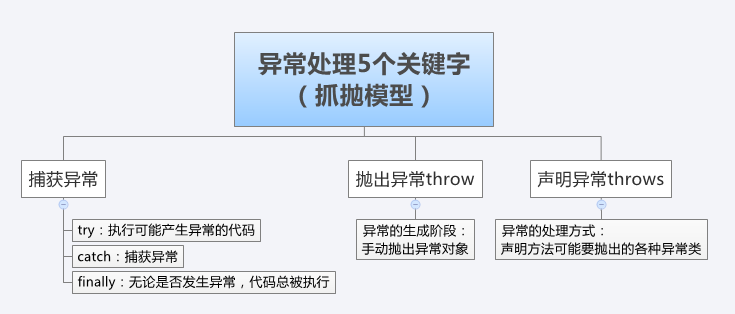

### Java 异常
异常是指程序在运行过程中由于外部问题（如硬件错误、输入错误）等导致的程序异常事件。  
异常处理是编程语言或计算机硬件里的一种机制，用于处理软件或信息系统中出现的异常状况（即超出程序正常执行流程的某些特殊的情况）。

Java 内置了一套异常处理机制，总是使用异常来表示错误。  
Java 异常是一种 class，因此它本身带有类型信息。异常可以在任何地方抛出，但只需要在上层捕获，这样就和方法调用实现分离了。  
  

从继承关系可知：Throwable 是异常体系的根，它继承自 Object。  
Throwable 有两个体系：Error 和 Exception。Error 表示严重的错误，程序对此一般无能为力；Exception 则是运行时的错误，它可以被捕获并处理。
```
Error 体系：
OutOfMemoryError 内存耗尽
NoClassDefFoundError 无法加载某个 Class
StackOverflowError 栈溢出

Exception 体系：
# RuntimeException 需修复程序本身
NullPointerException 空指针异常（对某个 null 的对象调用方法或字段）
ArrayIndexOutOfBoundsException 数组下标（索引）越界
IllegalArgumentException 参数不匹配异常
InstantiationException 对象初始化异常

# IOException 属于应用程序逻辑处理的一部分，应该捕获并处理
UnsupportedCharsetException 不支持编码
FileNotFoundException 未找到文件
SocketException 读取网络失败
NumberFormatException 数字转换异常
ArithmeticException 算术异常

# Others
ParseException
GeneralSecurityException
SQLException
TimeoutException
```

Java 规定：  
1、必须捕获的异常，包括 Exception 及其子类，但不包括 RuntimeException 及其子类，这种类型的异常称为 Checked Exception   
2、不需要捕获的异常，包括 Error 及其子类，RuntimeException 及其子类  

只要是方法声明的 Checked Exception，不在调用层捕获，也必须在更高的调用层捕获。所有未捕获的异常，最终也必须在 main() 方法中捕获，不会出现漏写 try 的情况，这是由编译器保证的。main() 方法也是最后捕获 Exception 的机会（如果不想写任何 try 代码，可以直接把 main() 方法定义为 throws Exception，但是一旦代码异常就会退出程序）。
  

```java
import java.io.UnsupportedEncodingException;
import java.util.Arrays;

static byte[] toGBK(String s) {
    try {
        // 用指定编码转换 String 为 byte[]:
        return s.getBytes("GBK");
    } catch (UnsupportedEncodingException e) {
        // 如果系统不支持 GBK 编码，会捕获到 UnsupportedEncodingException
        System.out.println(e); // 打印异常信息
        e.printStackTrace(); // 打印异常栈

        return s.getBytes(); // 尝试使用用默认编码
    }
}

byte[] bs = toGBK("中文");
System.out.println(Arrays.toString(bs));

// 在方法定义的时候，使用 throws Xxx 表示该方法可能抛出的异常类型
// 调用方在调用的时候，必须强制捕获这些异常，否则编译器会报错
// getBytes 方法的定义就是要求捕获这样的异常：
// public byte[] getBytes(String charsetName) throws UnsupportedEncodingException {...}
```

在 Java 中，凡是可能抛出异常的语句，都可以用 try ... catch 捕获。把可能发生异常的语句放在 try 中，然后使用 catch 捕获对应的 Exception 及其子类。
```java
// 使用多个 catch 语句
// 多个 catch 语句只有一个能被执行（即 JVM 在捕获到异常后，会从上到下匹配 catch 语句，匹配到某个 catch 后，执行 catch 代码块，然后不再继续匹配）  
// 存在多个 catch 的时候，catch 的顺序非常重要：子类必须写在前面，否则永远不被捕获
try {
    process1();
    process2();
    process3();
} catch (UnsupportedEncodingException e) {
    System.out.println("Bad encoding");
} catch (IOException e | NumberFormatException e) {
    // 处理逻辑一样时，使用 | 把异常合在一起
    System.out.println("Bad input");
} catch (Exception e) {
    System.out.println("Unknown error");
} finally {
    // 有无异常都会执行的区域（可以不写）
    // JVM 会先执行 finally，然后抛出异常
    System.out.println("END");
    // 如果在这里再抛出异常，原有异常会被屏蔽（不建议这样做）
    // 如果要保证原有异常，需要考虑 Suppressed Exception（通过 Throwable.getSuppressed() 获取） 
    // throw new IllegalArgumentException();
}
```

异常的传播：  
当某个方法抛出了异常时，如果当前方法没有捕获异常，异常就会被抛到上层调用方法，直到遇到某个 try ... catch 被捕获为止。  
这个时候，printStackTrace() 打印的方法调用栈就非常重要了，可以很方便地定位异常代码。  

除了捕获异常，我们还可以抛出异常。  
```java
if (s == null) {
    throw new NullPointerException();
}

// 为了能追踪到完整的异常栈，在构造异常的时候，把原始的 Exception 实例传进去，新的 Exception 就可以持有原始 Exception 信息
static void process1() 
{
    try {
        process2();
    } catch (NullPointerException e) {
        throw new IllegalArgumentException();
    }
}

static void process2() 
{
    throw new NullPointerException();
}

try {
    process1();
} catch (Exception e) {
    e.printStackTrace();
}
```

### Java 自定义异常
在一个大型项目中，可以自定义新的异常类型，但是保持一个合理的异常继承体系也是非常重要的。  
```java
// 自定义一个 BaseException 作为 “根异常”, 进而派生出各种业务类型的异常  
// BaseException 需要从一个适合的 Exception 派生，建议从 RuntimeException 派生
// BaseException 应该提供多种构造方法
public class BaseException extends RuntimeException 
{
    public BaseException() 
    {
        super();
    }

    public BaseException(String message, Throwable cause) 
    {
        super(message, cause);
    }

    public BaseException(String message) 
    {
        super(message);
    }

    public BaseException(Throwable cause) 
    {
        super(cause);
    }
}

public class UserNotFoundException extends BaseException {}
public class NoAccessException extends BaseException {}
```

### Java 断言
断言是一种调试方式，断言失败会抛出 AssertionError。  
只能在开发和测试阶段启用断言。对可恢复的错误不能使用断言，而应该抛出异常；断言很少被使用，更好的方法是编写单元测试。  

在 Java 中，使用 assert 关键字来实现断言。  
```java
double x = Math.abs(-123.45);
assert x >= 0 : "x must >= 0"; // 添加一个可选的断言消息 "x must >= 0"。断言失败的时候，AssertionError 会带上该消息 
System.out.println(x);
```

 JVM 默认关闭断言指令，即遇到 assert 语句就自动忽略了，不执行。  
 那么，要执行 assert 语句，必须给 Java 虚拟机传递 -enableassertions（可简写为 -ea）参数启用断言。
```bash
java -ea Main.java
# 有选择地对特定地类启用断言（只对 com.itranswarp.sample.Main 这个类启用断言）
java -ea:com.itranswarp.sample.Main Main.java
# 对特定包启用断言（只对 com.itranswarp.sample 这个包启动断言，注意后面的三个点）
java -ea:com.itranswarp.sample... Main.java
```

### Java 日志
日志就是 Logging，它的目的是为了取代 System.out.println()，记录程序出现的问题或运行的结果；日志可以存档，便于追踪问题。  
Java 标准库内置了日志包 java.util.logging。日志的输出可以设定级别，JDK 的 Logging 定义了 7 个日志级别，从严重到普通：SEVERE、WARNING、INFO、CONFIG、FINE、FINER、FINEST。默认级别是 INFO，INFO 级别以下的都不会被打印出来。  
```java
import java.util.logging.Level;
import java.util.logging.Logger;

Logger logger = Logger.getGlobal();
logger.info("start process...");
logger.warning("memory is running out...");
logger.fine("ignored."); // 不会被打印
logger.severe("process will be terminated...");
```

使用 Java 标准库内置的 Logging 有以下局限：  
> 1、Logging 系统在 JVM 启动时读取配置文件并完成初始化，一旦开始运行 main() 方法，就无法修改配置；  
> 2、配置不太方便，需要在 JVM 启动时传递参数 -Djava.util.logging.config.file=<config-file-name\>。  
> 总而言之，Java 标准库内置的 Logging 使用并不是非常广泛  

**Commons Logging**  
和 Java 标准库提供的日志不同，Commons Logging 是一个第三方日志库，它是由 Apache 创建的日志模块，使用它需要先下载编译。  
Commons Logging 的特色是，它可以挂接不同的日志系统，并通过配置文件指定挂接的日志系统。默认情况下，Commons Loggin 自动搜索并使用 Log4j（Log4j 是另一个流行的日志系统），如果没有找到 Log4j，再使用 JDK Logging。  
Commons Logging 定义了 6 个日志级别：FATAL、ERROR、WARNING、INFO、DEBUG、TRACE，默认级别 INFO。  
建议开发阶段始终使用 Commons Logging 接口来写入日志。  
```java
import org.apache.commons.logging.Log;
import org.apache.commons.logging.LogFactory;

// 通过 LogFactory 获取 Log 类的实例
static final Log log = LogFactory.getLog(Main.class);
// 使用 Log 实例的方法打日志
log.info("start...");
log.warn("end.");
try {
    // ...
} catch (Exception e) {
    log.error("got exception!", e);
}
```

**Log4j**  
Log4j 是一种非常流行的日志框架，它是一个组件化设计的日志系统。  
Log4j 是一个第三方库，需要下载，需要把日志写入文件则把 log4j-api-2.x.jar、log4j-core-2.x.jar 和 log4j-jcl-2.x.jar 放到 classpath 中（Commons Logging 会自动发现并使用 Log4j，需要把相应的 jar 包也放到 classspath 中）。  
```
log.info("User signed in.");
 │
 │   ┌──────────┐    ┌──────────┐    ┌──────────┐    ┌──────────┐
 ├──>│ Appender │───>│  Filter  │───>│  Layout  │───>│ Console  │
 │   └──────────┘    └──────────┘    └──────────┘    └──────────┘
 │
 │   ┌──────────┐    ┌──────────┐    ┌──────────┐    ┌──────────┐
 ├──>│ Appender │───>│  Filter  │───>│  Layout  │───>│   File   │
 │   └──────────┘    └──────────┘    └──────────┘    └──────────┘
 │
 │   ┌──────────┐    ┌──────────┐    ┌──────────┐    ┌──────────┐
 └──>│ Appender │───>│  Filter  │───>│  Layout  │───>│  Socket  │
     └──────────┘    └──────────┘    └──────────┘    └──────────┘
# 当我们使用 Log4j 输出一条日志时，Log4j 自动通过不同的 Appender 把同一条日志输出到不同的目的地。比如 console 输出到屏幕；file 输出到文件；socket 通过网络输出到远程计算机；jdbc 输出到数据库... 
# 在输出日志的过程中，通过 Filter 来过滤哪些 log 需要被输出，哪些 log 不需要被输出，比如仅输出 ERROR 级别的日志
# 最后，通过 Layout 来格式化日志信息，例如，自动添加日期、时间、方法名称等信息
```
在实际使用的时候，并不需要关心 Log4j 的 API，而是通过配置文件来配置它。以 XML 配置为例，使用 Log4j 的时候，我们把一个 log4j2.xml 的文件放到 classpath 下就可以让 Log4j 读取配置文件并按照我们的配置来输出日志。  
虽然配置 Log4j 比较繁琐，但一旦配置完成，使用起来就非常方便。

**SLF4J 和 Logback**  
因为对 Commons Logging 的接口不满意，有人就搞了 SLF4J。因为对 Log4j 的性能不满意，有人就搞了 Logback。  
SLF4J 和 Logback 可以取代 Commons Logging 和 Log4j；始终使用 SLF4J 的接口写入日志，使用 Logback 只需要配置，不需要修改代码。  
SLF4J 和 Logback 都是第三方库，使用它们需要分别下载并把 slf4j-api-1.7.x.jar、logback-classic-1.2.x.jar 和 logback-core-1.2.x.jar 放到 classpath 中。Logback 和 Log4j 类似，我们仍然需要一个 Logback 的配置文件，把 logback.xml 也放到 classpath 下。
```java
import org.slf4j.Logger;
import org.slf4j.LoggerFactory;

final Logger logger = LoggerFactory.getLogger(getClass());

int score = 99;
Person p = new Person();
p.setScore(score);
// 我们发现，日志带格式化了：传入的是一个带占位符的字符串，用后面的变量自动替换占位符
logger.info("Set score {} for Person {} ok.", score, p.getName());
```

