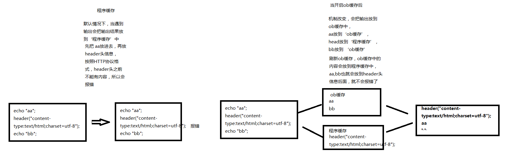

### 什么是 ob
缓存解决的是如何快速查找利用数据，节省 cpu 消耗问题；缓冲解决的是高速 cpu 与低速 I/O 设备不匹配的问题。  
高速的 cpu 早早处理完自己的数据，想通过线路传递给用户，但是线路太窄了，一下子输送不过去；这时候，如果引入缓冲区，cpu 可以快速将生成的数据放入缓冲区，然后自己就可以腾出手来去干别的事情。缓冲区根据指令适时将数据输出，这样就合理的解决了高速 cpu 与低速 I/O 设备的矛盾了。  

ob 即 output_buffering  输出缓冲。  
缓冲区是通过 php.ini 中的 output_buffering 变量控制的。其默认值是 off, 可以设置为 on 来打开 buffer。打来 buffer 后，即便程序中没有用 ob 函数，实际上代码也是使用了缓冲区的。另外，不管 php.ini 中 output_buffering 的设置，cli 模式下的 php 始终默认是关闭的。  

**缓冲区输出时机**  
1、缓冲是有容量大小的，当缓冲区到达极限则会自动输出内容  
2、脚本执行完毕  

**ob 运行方式**  
默认情况下，php 会把输出的内容放到【程序缓存】中，待程序跑完，把【程序缓存】中的东西全部抛到浏览器中；当 ob开启后，所有的输出都会放到【ob】中，头信息（header）等这些依旧存放到【程序缓存】中，待程序跑完，【ob】中的内容会被放到【程序缓存】内容后面，再发送到浏览器。  

   

在程序中，如果开启 ob_start(), 所有的 echo 输出都会保存到 ob中，可以使用 ob 系列函数进行操作。在程序执行结束，会把缓存中的数据发送给浏览器，如果使用了 ob_clean() 类似的函数，会情况缓存中的内容，那么就不用有数据发送给浏览器。  

```php
ob_start(); // 开启 ob

ob_get_contents(); // 获取缓存中的数据

ob_clean(); // 清空缓存中的数据

ob_end(); // 关闭 ob

ob_end_clean(); // 清空缓存并关闭 ob

ob_flush(); // 刷新缓冲区，把 ob中的内容放到程序缓存中（默认是在程序执行完后再放到程序缓存中）

flush(); // 把程序缓存内容推送到浏览器
// 需要注意的是， Microsoft Internet Explorer 只有当接受到的 256 个字节以后才开始显示该页面
// 所以必须发送一些额外的空格来让这些浏览器显示页面内容
```
