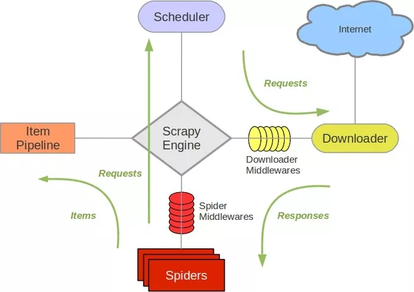

### Scrapy 概述
Scrapy['skræpi:] 是 Python 开发的一个非常流行的网络爬虫框架，可以用来抓取 Web 站点并从页面中提取结构化的数据，被广泛的用于数据挖掘、数据监测和自动化测试等领域。下图展示了 Scrapy 的基本架构，其中包含了主要组件和系统的数据处理流程（图中带数字的红色箭头）。  
  

**组件**  
1、Scrapy 引擎（Engine）：Scrapy 引擎是用来控制整个系统的数据处理流程。   
2、调度器（Scheduler）：调度器从 Scrapy 引擎接受请求并排序列入队列，并在 Scrapy 引擎发出请求后返还给它们。  
3、下载器（Downloader）：下载器的主要职责是抓取网页并将网页内容返还给蜘蛛（Spiders）。  
4、蜘蛛（Spiders）：蜘蛛是有 Scrapy 用户自定义的用来解析网页并抓取特定 URL 返回的内容的类，每个蜘蛛都能处理一个域名或一组域名，简单的说就是用来定义特定网站的抓取和解析规则。  
5、条目管道（Item Pipeline）：条目管道的主要责任是负责处理有蜘蛛从网页中抽取的数据条目，它的主要任务是清理、验证和存储数据。当页面被蜘蛛解析后，将被发送到条目管道，并经过几个特定的次序处理数据。每个条目管道组件都是一个 Python 类，它们获取了数据条目并执行对数据条目进行处理的方法，同时还需要确定是否需要在条目管道中继续执行下一步或是直接丢弃掉不处理。条目管道通常执行的任务有：清理 HTML 数据、验证解析到的数据（检查条目是否包含必要的字段）、检查是不是重复数据（如果重复就丢弃）、将解析到的数据存储到数据库（关系型数据库或 NoSQL 数据库）中。  
6、中间件（Middlewares）：中间件是介于 Scrapy 引擎和其他组件之间的一个钩子框架，主要是为了提供自定义的代码来拓展 Scrapy 的功能，包括下载器中间件和蜘蛛中间件。  

**数据处理流程**  
Scrapy 的整个数据处理流程由 Scrapy 引擎进行控制，通常的运转流程包括以下的步骤：  
1、引擎询问蜘蛛需要处理哪个网站，并让蜘蛛将第一个需要处理的 URL 交给它。  
2、引擎让调度器将需要处理的 URL 放在队列中。  
3、引擎从调度那获取接下来进行爬取的页面。  
4、调度将下一个爬取的 URL 返回给引擎，引擎将它通过下载中间件发送到下载器。  
5、当网页被下载器下载完成以后，响应内容通过下载中间件被发送到引擎；如果下载失败了，引擎会通知调度器记录这个 URL，待会再重新下载。  
6、引擎收到下载器的响应并将它通过蜘蛛中间件发送到蜘蛛进行处理。  
7、蜘蛛处理响应并返回爬取到的数据条目，此外还要将需要跟进的新的 URL 发送给引擎。  
8、引擎将抓取到的数据条目送入条目管道，把新的 URL 发送给调度器放入队列中。  

上述操作中的 2-8 步会一直重复直到调度器中没有需要请求的 URL，爬虫停止工作。  

### Scrapy 基本使用
先创建虚拟环境并在虚拟环境下使用 pip 安装 scrapy。  
```bash
# 安装
pip install scrapy
# 创建一个 Scrapy 项目
scrapy startproject douban
cd douban
# alias tree="find . -print | sed -e 's;[^/]*/;|____;g;s;____|; |;g'"
tree
# .
# |____ scrapy.cfg # Scrapy 项目的配置文件，其内定义了项目的配置文件路径、部署相关信息等内容
# |____ douban
# | |____ spiders # 包含一个个 Spider 的实现，每个 Spider 都有一个文件
# | | |____ __init__.py
# | | |____ __pycache__
# | |____ __init__.py
# | |____ __pycache__
# | |____ middlewares.py # 定义 Spider Middlewares 和 Downloader Middlewares 的实现
# | |____ settings.py # 定义项目的全局配置
# | |____ items.py # 定义 Item 数据结构，所有的 Item 的定义都可以放这里
# | |____ pipelines.py # 定义 Item Pipeline 的实现，所有的 Item Pipeline 的实现都可以放这里
```
根据数据处理流程，基本上需要我们做的有以下几件事情：  
1、在 items.py 文件中定义字段，这些字段用来保存数据，方便后续的操作。  
```python
# -*- coding: utf-8 -*-

# Define here the models for your scraped items
#
# See documentation in:
# https://doc.scrapy.org/en/latest/topics/items.html

import scrapy


class DoubanItem(scrapy.Item):

    name = scrapy.Field()
    year = scrapy.Field()
    score = scrapy.Field()
    director = scrapy.Field()
    classification = scrapy.Field()
    actor = scrapy.Field()
```

2、在 spiders 文件夹中编写自己的爬虫。  
通过 Scrapy 提供的爬虫模板创建了 Spider，执行如下命令  
```bash
scrapy genspider movie movie.douban.com --template=crawl
```

生成的爬虫 spiders/movie.py 的代码如下  
```python
# -*- coding: utf-8 -*-
import scrapy
from scrapy.selector import Selector
from scrapy.linkextractors import LinkExtractor
from scrapy.spiders import CrawlSpider, Rule

from douban.items import DoubanItem


# 在 Scrapy 框架中，我们自定义的蜘蛛都继承自 scrapy.spiders.Spider
class MovieSpider(CrawlSpider):
    name = 'movie' # 爬虫的名字
    allowed_domains = ['movie.douban.com'] # 允许爬取的域名，不在此范围的链接不会被跟进爬取
    start_urls = ['https://movie.douban.com/top250'] # 起始 URL 列表，当我们没有重写 start_requests() 方法时，就会从这个列表开始爬取
    #  LinkExtractor 对象会自动完成对新的链接的解析，该对象中有一个名为 extract_link 的回调方法
    rules = (
        Rule(LinkExtractor(allow=(r'https://movie.douban.com/top250\?start=\d+.*'))),
        Rule(LinkExtractor(allow=(r'https://movie.douban.com/subject/\d+')), callback='parse_item'),
    )
    # 其他属性配置
    # custom_settings：用来存放蜘蛛专属配置的字典，这里的设置会覆盖全局的设置
    # cawler：由 from_crawler () 方法设置的和蜘蛛对应的 Crawler 对象，Crawler 对象包含了很多项目组件，利用它我们可以获取项目的配置信息，如调用 crawler.settings.get () 方法
    # settings：用来获取爬虫全局设置的变量
    # 

    def parse_item(self, response):
        sel = Selector(response)
        item = DoubanItem()
        # Scrapy 支持用 XPath 语法和 CSS 选择器进行数据解析，对应的方法分别是 xpath 和 css
        item['name']=sel.xpath('//*[@id="content"]/h1/span[1]/text()').extract()
        item['year']=sel.xpath('//*[@id="content"]/h1/span[2]/text()').re(r'\((\d+)\)')
        item['score']=sel.xpath('//*[@id="interest_sectl"]/div/p[1]/strong/text()').extract()
        item['director']=sel.xpath('//*[@id="info"]/span[1]/a/text()').extract()
        item['classification']= sel.xpath('//span[@property="v:genre"]/text()').extract()
        item['actor']= sel.xpath('//*[@id="info"]/span[3]/a[1]/text()').extract()
        return item

    # 其他方法配置
    # start_requests ()：此方法用于生成初始请求，它返回一个可迭代对象。该方法默认是使用 GET 请求访问起始 URL，如果起始 URL 需要使用 POST 请求来访问就必须重写这个方法
    # parse()：当 Response 没有指定回调函数时，该方法就会被调用，它负责处理 Response 对象并返回结果，从中提取出需要的数据和后续的请求，该方法需要返回类型为 Request 或 Item 的可迭代对象（生成器当前也包含在其中，因此根据实际需要可以用 return 或 yield 来产生返回值）
    # closed ()：当蜘蛛关闭时，该方法会被调用，通常用来做一些释放资源的善后操作
```

到这里，我们已经可以通过下面的命令让爬虫运转起来。  
```bash
scrapy crawl movie

# 可以在控制台看到爬取到的数据，如果想将这些数据保存到文件中，可以通过 -o 参数来指定文件名
# Scrapy 支持我们将爬取到的数据导出成 JSON、CSV、XML、pickle、marshal 等格式
scrapy crawl moive -o result.json
```

3、在 pipelines.py 中完成对数据进行持久化的操作。  
利用 Pipeline 我们可以完成以下操作：清理 HTML 数据，验证爬取的数据；丢弃重复的不必要的内容；将爬取的结果进行持久化操作。  
```python
# -*- coding: utf-8 -*-

# Define your item pipelines here
#
# Don't forget to add your pipeline to the ITEM_PIPELINES setting
# See: https://doc.scrapy.org/en/latest/topics/item-pipeline.html
import pymongo

from scrapy.exceptions import DropItem
from scrapy.conf import settings
from scrapy import log


class DoubanPipeline(object):

    def __init__(self):
        connection = pymongo.MongoClient(settings['MONGODB_SERVER'], settings['MONGODB_PORT'])
        db = connection[settings['MONGODB_DB']]
        self.collection = db[settings['MONGODB_COLLECTION']]

    def process_item(self, item, spider):
        #Remove invalid data
        valid = True
        for data in item:
          if not data:
            valid = False
            raise DropItem("Missing %s of blogpost from %s" %(data, item['url']))
        if valid:
        #Insert data into database
            new_moive=[{
                "name":item['name'][0],
                "year":item['year'][0],
                "score":item['score'],
                "director":item['director'],
                "classification":item['classification'],
                "actor":item['actor']
            }]
            self.collection.insert(new_moive)
            log.msg("Item wrote to MongoDB database %s/%s" %
            (settings['MONGODB_DB'], settings['MONGODB_COLLECTION']),
            level=log.DEBUG, spider=spider) 
        return item
```

4、修改 settings.py 文件对项目进行配置。  
```python
# -*- coding: utf-8 -*-

# Scrapy settings for douban project
#
# For simplicity, this file contains only settings considered important or
# commonly used. You can find more settings consulting the documentation:
#
#     https://doc.scrapy.org/en/latest/topics/settings.html
#     https://doc.scrapy.org/en/latest/topics/downloader-middleware.html
#     https://doc.scrapy.org/en/latest/topics/spider-middleware.html

BOT_NAME = 'douban'

SPIDER_MODULES = ['douban.spiders']
NEWSPIDER_MODULE = 'douban.spiders'


# Crawl responsibly by identifying yourself (and your website) on the user-agent
USER_AGENT = 'Mozilla/5.0 (Macintosh; Intel Mac OS X 10_8_3) AppleWebKit/536.5 (KHTML, like Gecko) Chrome/19.0.1084.54 Safari/536.5'

# Obey robots.txt rules
ROBOTSTXT_OBEY = True

# Configure maximum concurrent requests performed by Scrapy (default: 16)
# CONCURRENT_REQUESTS = 32

# Configure a delay for requests for the same website (default: 0)
# See https://doc.scrapy.org/en/latest/topics/settings.html#download-delay
# See also autothrottle settings and docs
DOWNLOAD_DELAY = 3
RANDOMIZE_DOWNLOAD_DELAY = True
# The download delay setting will honor only one of:
# CONCURRENT_REQUESTS_PER_DOMAIN = 16
# CONCURRENT_REQUESTS_PER_IP = 16

# Disable cookies (enabled by default)
COOKIES_ENABLED = True

MONGODB_SERVER = '120.77.222.217'
MONGODB_PORT = 27017
MONGODB_DB = 'douban'
MONGODB_COLLECTION = 'movie'

# Disable Telnet Console (enabled by default)
# TELNETCONSOLE_ENABLED = False

# Override the default request headers:
# DEFAULT_REQUEST_HEADERS = {
#   'Accept': 'text/html,application/xhtml+xml,application/xml;q=0.9,*/*;q=0.8',
#   'Accept-Language': 'en',
# }

# Enable or disable spider middlewares
# See https://doc.scrapy.org/en/latest/topics/spider-middleware.html
# SPIDER_MIDDLEWARES = {
#    'douban.middlewares.DoubanSpiderMiddleware': 543,
# }

# Enable or disable downloader middlewares
# See https://doc.scrapy.org/en/latest/topics/downloader-middleware.html
# DOWNLOADER_MIDDLEWARES = {
#    'douban.middlewares.DoubanDownloaderMiddleware': 543,
# }

# Enable or disable extensions
# See https://doc.scrapy.org/en/latest/topics/extensions.html
# EXTENSIONS = {
#    'scrapy.extensions.telnet.TelnetConsole': None,
# }

# Configure item pipelines
# See https://doc.scrapy.org/en/latest/topics/item-pipeline.html
ITEM_PIPELINES = {
    'douban.pipelines.DoubanPipeline': 400,
}

LOG_LEVEL = 'DEBUG'

# Enable and configure the AutoThrottle extension (disabled by default)
# See https://doc.scrapy.org/en/latest/topics/autothrottle.html
#AUTOTHROTTLE_ENABLED = True
# The initial download delay
#AUTOTHROTTLE_START_DELAY = 5
# The maximum download delay to be set in case of high latencies
#AUTOTHROTTLE_MAX_DELAY = 60
# The average number of requests Scrapy should be sending in parallel to
# each remote server
#AUTOTHROTTLE_TARGET_CONCURRENCY = 1.0
# Enable showing throttling stats for every response received:
#AUTOTHROTTLE_DEBUG = False

# Enable and configure HTTP caching (disabled by default)
# See https://doc.scrapy.org/en/latest/topics/downloader-middleware.html#httpcache-middleware-settings
HTTPCACHE_ENABLED = True
HTTPCACHE_EXPIRATION_SECS = 0
HTTPCACHE_DIR = 'httpcache'
HTTPCACHE_IGNORE_HTTP_CODES = []
HTTPCACHE_STORAGE = 'scrapy.extensions.httpcache.FilesystemCacheStorage'
```

### Scrapy 进阶应用
**Selector 的用法**  
Scrapy 提供了自己的数据提取方法，即 Selector（选择器）。Selector 是基于 lxml 来构建的，支持 XPath 选择器、CSS 选择器以及正则表达式，功能全面，解析速度和准确度非常高。  
```python
# 直接使用
# Selector 是一个可以独立使用的模块
# 可以直接利用 Selector 这个类来构建一个选择器对象，然后调用它的相关方法如 xpath()、css()等来提取数据
from scrapy import Selector

body = '<html><head><title>Hello World</title></head><body></body></html>'
selector = Selector(text=body)
title = selector.xpath('//title/text()').extract_first()
print(title)
```

Scrapy Shell 模式。  
这个过程其实是，Scrapy 发起了一次请求，请求的 URL 就是刚才命令行下输入的 URL，然后把一些可操作的变量传递给我们，如 request、response 等。进入 Scrapy Shell 之后，我们将主要操作 response 这个变量来进行解析。  
```bash
scrapy shell http://doc.scrapy.org/en/latest/_static/selectors-sample1.html
response.url
# 调用 response.selector 返回的内容就相当于用 response 的 body 构造了一个 Selector 对象
result = response.selector.xpath('//a')
result
result.xpath('./img')

# 提取出 a 节点元素，就可以利用 extract() 方法
result.extract()
# 选取节点的内部文本和属性
response.xpath('//a/text()').extract()
response.xpath('//a/@href').extract()
# 如果只匹配到一个元素，这样获取是有索引越界的风险的
response.xpath('//a[@href="image1.html"]/text()').extract()[0]
# 我们应该这样
response.xpath('//a[@href="image1.html"]/text()').extract_first()
# 甚至，可以加个默认值
response.xpath('//a[@href="image1"]/text()').extract_first('Default Image')
```

Scrapy 的选择器同时还对接了 CSS 选择器，使用response.css()方法可以使用 CSS 选择器来选择对应的元素。  
```python
# 选取所有的 a 节点
response.css('a')
# 提取出节点
response.css('a').extract()
# 也可以使用extract_first()方法提取列表的第一个元素
response.css('a[href="image1.html"] img').extract_first()
# 获取文本和属性需要用::text和::attr()的写法
response.css('a[href="image1.html"]::text').extract_first()
response.css('a[href="image1.html"] img::attr(src)').extract_first()

# CSS 选择器和 XPath 选择器一样可以嵌套选择
# 先用 XPath 选择器选中所有a节点，再利用 CSS 选择器选中img节点，再用 XPath 选择器获取属性
response.xpath('//a').css('img').xpath('@src').extract()
```

Scrapy 的选择器还支持正则匹配。  
`注意：response 对象不能直接调用 re() 和 re_first() 方法。`  
```python
# 我们给 re()方法传了一个正则表达式，其中 (.*) 就是要匹配的内容
response.xpath('//a/text()').re('Name:\s(.*)')

# 如果同时存在两个分组，那么结果依然会被按序输出
response.xpath('//a/text()').re('(.*?):\s(.*)')

# 类似 extract_first() 方法，re_first() 方法可以选取列表的第一个元素
response.xpath('//a/text()').re_first('(.*?):\s(.*)')
```

**Spider 的用法**  
在 Scrapy 中，要抓取网站的链接配置、抓取逻辑、解析逻辑里其实都是在 Spider 中配置的。  

在实现 Scrapy 爬虫项目时，最核心的类便是Spider类了，它定义了如何爬取某个网站的流程和解析方式。简单来讲，Spider要做的事就是如下两件：  
1、定义爬取网站的动作  
2、分析爬取下来的网页  

对于 Spider 类来说，整个爬取循环过程如下所述：  
1、以初始的 URL 初始化 Request，并设置回调函数。当该 Request 成功请求并返回时，Response 生成并作为参数传给该回调函数。  
2、在回调函数内分析返回的网页内容。返回结果有两种形式。一种是解析到的有效结果返回字典或 Item 对象，它们可以经过处理后（或直接）保存。另一种是解析得到下一个（如下一页）链接，可以利用此链接构造 Request 并设置新的回调函数，返回 Request 等待后续调度。  
3、如果返回的是字典或 Item 对象，我们可通过 Feed Exports 等组件将返回结果存入到文件。如果设置了 Pipeline 的话，我们可以使用 Pipeline 处理（如过滤、修正等）并保存。  
4、如果返回的是 Reqeust，那么 Request 执行成功得到 Response 之后，Response 会被传递给 Request 中定义的回调函数，在回调函数中我们可以再次使用选择器来分析新得到的网页内容，并根据分析的数据生成 Item。  
通过以上几步循环往复进行，我们完成了站点的爬取。  

scrapy.spiders.Spider 这个类是最简单最基本的 Spider 类，其他 Spider 必须继承这个类。  
scrapy.spiders.Spider 这个类提供了start_requests() 方法的默认实现，读取并请求start_urls属性，并根据返回的结果调用 parse() 方法解析结果。它还有如下一些基础属性和常用方法：  

- name  
爬虫名称，是定义 Spider 名字的字符串。Spider 的名字定义了 Scrapy 如何定位并初始化 Spider，它必须是唯一的。不过我们可以生成多个相同的 Spider 实例，数量没有限制。name是 Spider 最重要的属性。如果 Spider 爬取单个网站，一个常见的做法是以该网站的域名名称来命名 Spider。例如，Spider 爬取 mywebsite.com，该 Spider 通常会被命名为 mywebsite。  
- allowed_domains  
允许爬取的域名，是可选配置，不在此范围的链接不会被跟进爬取。  
- start_urls  
它是起始 URL 列表，当我们没有实现 start_requests() 方法时，默认会从这个列表开始抓取。  
- custom_settings  
它是一个字典，是专属于本 Spider 的配置，此设置会覆盖项目全局的设置。此设置必须在初始化前被更新，必须定义成类变量。  
- crawler  
它是由 from_crawler() 方法设置的，代表的是本 Spider 类对应的 Crawler 对象。Crawler 对象包含了很多项目组件，利用它我们可以获取项目的一些配置信息，如最常见的获取项目的设置信息，即 Settings。  
- settings  
它是一个 Settings 对象，利用它我们可以直接获取项目的全局设置变量。
- start_requests()  
此方法用于生成初始请求，它必须返回一个可迭代对象。此方法会默认使用 start_urls 里面的 URL 来构造 Request，而且 Request 是 GET 请求方式。如果我们想在启动时以 POST 方式访问某个站点，可以直接重写这个方法，发送 POST 请求时使用 FormRequest 即可。  
- parse()  
当 Response 没有指定回调函数时，该方法会默认被调用。它负责处理 Response，处理返回结果，并从中提取出想要的数据和下一步的请求，然后返回。该方法需要返回一个包含 Request 或 Item 的可迭代对象。  
- closed()  
当 Spider 关闭时，该方法会被调用，在这里一般会定义释放资源的一些操作或其他收尾操作。  

**DownloaderMiddleware 的用法**  
Downloader Middleware 即下载中间件，它是处于 Scrapy 的 Request 和 Response 之间的处理模块。  
  

Scheduler 从队列中拿出一个 Request 发送给 Downloader 执行下载，这个过程会经过 Downloader Middleware 的处理。另外，当 Downloader 将 Request 下载完成得到 Response 返回给 Spider 时会再次经过 Downloader Middleware 处理。即 Downloader Middleware 在整个架构中起作用的位置是以下两个：  
1、在 Scheduler 调度出队列的 Request 发送给 Downloader 下载之前，也就是我们可以在 Request 执行下载之前对其进行修改。  
2、在下载后生成的 Response 发送给 Spider 之前，也就是我们可以在生成 Resposne 被 Spider 解析之前对其进行修改。  

Downloader Middleware 的功能十分强大，修改 User-Agent、处理重定向、设置代理、失败重试、设置 Cookies 等功能都需要借助它来实现。  
Scrapy 其实已经提供了许多 Downloader Middleware，比如负责失败重试、自动重定向等功能的 Middleware，它们被DOWNLOADER_MIDDLEWARES_BASE 变量所定义：  
```
{
    'scrapy.downloadermiddlewares.robotstxt.RobotsTxtMiddleware': 100,
    'scrapy.downloadermiddlewares.httpauth.HttpAuthMiddleware': 300,
    'scrapy.downloadermiddlewares.downloadtimeout.DownloadTimeoutMiddleware': 350,
    'scrapy.downloadermiddlewares.defaultheaders.DefaultHeadersMiddleware': 400,
    'scrapy.downloadermiddlewares.useragent.UserAgentMiddleware': 500,
    'scrapy.downloadermiddlewares.retry.RetryMiddleware': 550,
    'scrapy.downloadermiddlewares.ajaxcrawl.AjaxCrawlMiddleware': 560,
    'scrapy.downloadermiddlewares.redirect.MetaRefreshMiddleware': 580,
    'scrapy.downloadermiddlewares.httpcompression.HttpCompressionMiddleware': 590,
    'scrapy.downloadermiddlewares.redirect.RedirectMiddleware': 600,
    'scrapy.downloadermiddlewares.cookies.CookiesMiddleware': 700,
    'scrapy.downloadermiddlewares.httpproxy.HttpProxyMiddleware': 750,
    'scrapy.downloadermiddlewares.stats.DownloaderStats': 850,
    'scrapy.downloadermiddlewares.httpcache.HttpCacheMiddleware': 900,
}
```
字典的键名是 Scrapy 内置的 Downloader Middleware 的名称，键值代表了调用的优先级，优先级是一个数字，数字越小代表越靠近 Scrapy 引擎，数字越大代表越靠近 Downloader，数字小的 Downloader Middleware 会被优先调用。  
如果自己定义的 Downloader Middleware 要添加到项目里，DOWNLOADER_MIDDLEWARES_BASE变量不能直接修改。Scrapy 提供了另外一个设置变量DOWNLOADER_MIDDLEWARES，我们直接修改这个变量就可以添加自己定义的 Downloader Middleware，以及禁用DOWNLOADER_MIDDLEWARES_BASE里面定义的 Downloader Middleware。  

Downloader Middleware 定义了一个或多个方法的类，核心的方法有如下三个：  
1、process_request(request, spider)  
request，是 Request 对象，即被处理的 Request；spider，是 Spdier 对象，即此 Request 对应的 Spider。  
Request 被 Scrapy 引擎调度给 Downloader 之前，process_request() 方法就会被调用，也就是在 Request 从队列里调度出来到 Downloader 下载执行之前，我们都可以用 process_request() 方法对 Request 进行处理。方法的返回值必须为 None、Response 对象、Request 对象之一，或者抛出 IgnoreRequest 异常。  
返回类型不同，产生的效果也不同。  

- 当返回是 None 时，Scrapy 将继续处理该 Request，接着执行其他 Downloader Middleware 的process_request()方法，一直到 Downloader 把 Request 执行后得到 Response 才结束。这个过程其实就是修改 Request 的过程，不同的 Downloader Middleware 按照设置的优先级顺序依次对 Request 进行修改，最后送至 Downloader 执行。  
- 当返回为 Response 对象时，更低优先级的 Downloader Middleware 的process_request()和process_exception()方法就不会被继续调用，每个 Downloader Middleware 的process_response()方法转而被依次调用。调用完毕之后，直接将 Response 对象发送给 Spider 来处理。  
- 当返回为 Request 对象时，更低优先级的 Downloader Middleware 的process_request()方法会停止执行。这个 Request 会重新放到调度队列里，其实它就是一个全新的 Request，等待被调度。如果被 Scheduler 调度了，那么所有的 Downloader Middleware 的process_request()方法会被重新按照顺序执行。  
- 如果 IgnoreRequest 异常抛出，则所有的 Downloader Middleware 的 process_exception() 方法会依次执行。如果没有一个方法处理这个异常，那么 Request 的 errorback() 方法就会回调。如果该异常还没有被处理，那么它便会被忽略。  

2、process_response(request, response, spider)  
request，是 Request 对象，即此 Response 对应的 Request；response，是 Response 对象，即此被处理的 Response；spider，是 Spider 对象，即此 Response 对应的 Spider。  
Downloader 执行 Request 下载之后，会得到对应的 Response。Scrapy 引擎便会将 Response 发送给 Spider 进行解析。在发送之前，我们都可以用 process_response() 方法来对 Response 进行处理。方法的返回值必须为 Request 对象、Response 对象之一，或者抛出 IgnoreRequest 异常。  
不同的返回情况：  

- 当返回为 Request 对象时，更低优先级的 Downloader Middleware 的process_response()方法不会继续调用。该 Request 对象会重新放到调度队列里等待被调度，它相当于一个全新的 Request。然后，该 Request 会被process_request()方法顺次处理。  
- 当返回为 Response 对象时，更低优先级的 Downloader Middleware 的process_response()方法会继续调用，继续对该 Response 对象进行处理。  
- 如果 IgnoreRequest 异常抛出，则 Request 的errorback()方法会回调。如果该异常还没有被处理，那么它便会被忽略。  

3、process_exception(request, exception, spider)  
request，是 Request 对象，即产生异常的 Request；exception，是 Exception 对象，即抛出的异常；spdier，是 Spider 对象，即 Request 对应的 Spider。  
当 Downloader 或process_request()方法抛出异常时，例如抛出IgnoreRequest异常，process_exception()方法就会被调用。方法的返回值必须为 None、Response 对象、Request 对象之一。  
不同的返回值：  

- 当返回为 None 时，更低优先级的 Downloader Middleware 的 process_exception() 会被继续顺次调用，直到所有的方法都被调度完毕。  
- 当返回为 Response 对象时，更低优先级的 Downloader Middleware 的 process_exception() 方法不再被继续调用，每个 Downloader Middleware 的 process_response() 方法转而被依次调用。  
- 当返回为 Request 对象时，更低优先级的 Downloader Middleware 的process_exception()也不再被继续调用，该 Request 对象会重新放到调度队列里面等待被调度，它相当于一个全新的 Request。然后，该 Request 又会被process_request()方法顺次处理。  

**对接 Selenium**
Scrapy 抓取页面的方式和 requests 库类似，都是直接模拟 HTTP 请求，而 Scrapy 也不能抓取 JavaScript 动态渲染的页面。  
JavaScript 渲染的页面有两种方式：  
一种是分析 Ajax 请求，找到其对应的接口抓取，Scrapy 同样可以用此种方式抓取；  
另一种是直接用 Selenium 或 Splash 模拟浏览器进行抓取，我们不需要关心页面后台发生的请求，也不需要分析渲染过程，只需要关心页面最终结果即可，可见即可爬。  
```bash
# 新建项目
scrapy startproject scrapyseleniumtest
# 新建一个 spider
scrapy genspider taobao www.taobao.com
```

首先定义 Item 对象。  
```python
from scrapy import Item, Field

class ProductItem(Item):
	# 此 Item 保存的 MongoDB 的 Collection 名称
    collection = 'products'
    image = Field()
    price = Field()
    deal = Field()
    title = Field()
    shop = Field()
    location = Field()
```

初步实现 Spider 的 start_requests() 方法。  
```python
from scrapy import Request, Spider
from urllib.parse import quote
from scrapyseleniumtest.items import ProductItem

class TaobaoSpider(Spider):
    name = 'taobao'
    allowed_domains = ['www.taobao.com']
    base_url = 'https://s.taobao.com/search?q='

    def start_requests(self):
    	# setttings.py 里：
    	# KEYWORDS = ['iPad']
    	# MAX_PAGE = 100
        for keyword in self.settings.get('KEYWORDS'):
            for page in range(1, self.settings.get('MAX_PAGE') + 1):
                url = self.base_url + quote(keyword)
                yield Request(url=url, callback=self.parse, meta={'page': page}, dont_filter=True)
```

对接 Selenium 进行抓取，采用 Downloader Middleware 来实现。  
在 Middleware 里面的 process_request() 方法里对每个抓取请求进行处理，启动浏览器并进行页面渲染，再将渲染后的结果构造一个 HtmlResponse 对象返回。  
```python
from selenium import webdriver
from selenium.common.exceptions import TimeoutException
from selenium.webdriver.common.by import By
from selenium.webdriver.support.ui import WebDriverWait
from selenium.webdriver.support import expected_conditions as EC
from scrapy.http import HtmlResponse
from logging import getLogger

class SeleniumMiddleware():
    def __init__(self, timeout=None, service_args=[]):
        self.logger = getLogger(__name__)
        self.timeout = timeout
        self.browser = webdriver.PhantomJS(service_args=service_args)
        self.browser.set_window_size(1400, 700)
        self.browser.set_page_load_timeout(self.timeout)
        self.wait = WebDriverWait(self.browser, self.timeout)

    def __del__(self):
        self.browser.close()

    def process_request(self, request, spider):
        """
        用PhantomJS抓取页面
        :param request: Request对象
        :param spider: Spider对象
        :return: HtmlResponse
        """
        self.logger.debug('PhantomJS is Starting')
        page = request.meta.get('page', 1)
        try:
            self.browser.get(request.url)
            if page > 1:
                input = self.wait.until(
                    EC.presence_of_element_located((By.CSS_SELECTOR, '#mainsrp-pager div.form > input')))
                submit = self.wait.until(
                    EC.element_to_be_clickable((By.CSS_SELECTOR, '#mainsrp-pager div.form > span.btn.J_Submit')))
                input.clear()
                input.send_keys(page)
                submit.click()
            self.wait.until(EC.text_to_be_present_in_element((By.CSS_SELECTOR, '#mainsrp-pager li.item.active > span'), str(page)))
            self.wait.until(EC.presence_of_element_located((By.CSS_SELECTOR, '.m-itemlist .items .item')))
            return HtmlResponse(url=request.url, body=self.browser.page_source, request=request, encoding='utf-8', status=200)
        except TimeoutException:
            return HtmlResponse(url=request.url, status=500, request=request)

    @classmethod
    def from_crawler(cls, crawler):
        return cls(timeout=crawler.settings.get('SELENIUM_TIMEOUT'),
                   service_args=crawler.settings.get('PHANTOMJS_SERVICE_ARGS'))
```

在 settings.py 里，我们设置调用刚才定义的 SeleniumMiddleware。  
```python
DOWNLOADER_MIDDLEWARES = {
    'scrapyseleniumtest.middlewares.SeleniumMiddleware': 543,
}
```

Response 对象就会回传给 Spider 内的回调函数进行解析。所以下一步我们就实现其回调函数，对网页来进行解析。  
```python
def parse(self, response):
    products = response.xpath(
        '//div[@id="mainsrp-itemlist"]//div[@class="items"][1]//div[contains(@class, "item")]')
    for product in products:
        item = ProductItem()
        item['price'] = ''.join(product.xpath('.//div[contains(@class, "price")]//text()').extract()).strip()
        item['title'] = ''.join(product.xpath('.//div[contains(@class, "title")]//text()').extract()).strip()
        item['shop'] = ''.join(product.xpath('.//div[contains(@class, "shop")]//text()').extract()).strip()
        item['image'] = ''.join(product.xpath('.//div[@class="pic"]//img[contains(@class, "img")]/@data-src').extract()).strip()
        item['deal'] = product.xpath('.//div[contains(@class, "deal-cnt")]//text()').extract_first()
        item['location'] = product.xpath('.//div[contains(@class, "location")]//text()').extract_first()
        yield item
```

最后我们实现一个 Item Pipeline，将结果保存到 MongoDB。  
```python
import pymongo

class MongoPipeline(object):
    def __init__(self, mongo_uri, mongo_db):
        self.mongo_uri = mongo_uri
        self.mongo_db = mongo_db

    @classmethod
    def from_crawler(cls, crawler):
        return cls(mongo_uri=crawler.settings.get('MONGO_URI'), mongo_db=crawler.settings.get('MONGO_DB'))

    def open_spider(self, spider):
        self.client = pymongo.MongoClient(self.mongo_uri)
        self.db = self.client[self.mongo_db]

    def process_item(self, item, spider):
        self.db[item.collection].insert(dict(item))
        return item

    def close_spider(self, spider):
        self.client.close()
```
记得在 settings.py 中开启它的调用：
```python
ITEM_PIPELINES = {
    'scrapyseleniumtest.pipelines.MongoPipeline': 300,
}

MONGO_URI = 'localhost'
MONGO_DB = 'taobao'
```

执行如下命令启动抓取即可。[详细代码参考](https://github.com/Python3WebSpider/ScrapySeleniumTest)    
```bash
scrapy crawl taobao
```

### Scrapy 分布式
Scrapy 分布式实现，大致需要如下步骤：  
1、安装 Scrapy-Redis。  
2、配置 Redis 服务器。  
3、修改配置文件。  

- SCHEDULER = 'scrapy_redis.scheduler.Scheduler'  
- DUPEFILTER_CLASS = 'scrapy_redis.dupefilter.RFPDupeFilter'  
- REDIS_HOST = '1.2.3.4'  
- REDIS_PORT = 6379  
- REDIS_PASSWORD = '1qaz2wsx'  
- SCHEDULER_QUEUE_CLASS = 'scrapy_redis.queue.FifoQueue'  
- SCHEDULER_PERSIST = True（通过持久化支持接续爬取）  
- SCHEDULER_FLUSH_ON_START = True（每次启动时重新爬取）  

4、Scrapyd 分布式部署  
安装 Scrapyd，然后修改配置文件 /etc/scrapyd/scrapyd.conf。  
安装 Scrapyd-Client，将项目打包成 Egg 文件，将打包的 Egg 文件通过 addversion.json 接口部署到 Scrapyd 上。  
