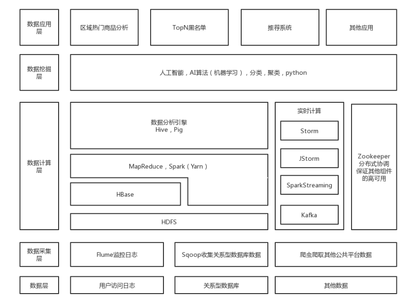

### 为什么学习大数据
对数据的存储以及处理大致可以划分为以下几个阶段：  
1、单纯靠人脑记忆：远古时期的智人，买东西的时候不会记录下来自己这次花了多少钱，买了多少东西，只是单纯的记录在自己的大脑里，很快就会忘记，记都记不住更不用说去分析处理一下数据了。

2、记录在纸上：有了造纸术之后，我们就把数据记录到了纸上，数据就不那么容易丢失，而且我们还可以对数据做一些简单的处理，比如说记个账，算算自己这一个月总共花了多少钱。这个时期数据已经可以存储下来了，并且还可以做一些简单的计算，但是，纸容易腐烂导致数据易丢失，可靠性不是很高。

3、记录在磁盘 / U 盘中：有了计算机之后，有了磁盘，后来又有了 U 盘，我们就可以把原来写在纸上的东西以文件的形式放到磁盘中，磁盘不容易坏，这大大提高了数据的可靠性。

4、分布式的存储：对于少量数据的存储和处理，我们只需要用一个磁盘就可以解决，但是随着数据量的增加，任何单一的磁盘都不足以容纳海量的数据。当一头牛拉不动的时候，不要试图用一头更强壮的牛，用两头牛。所以我们就会使用两块磁盘来存储，就有了分布式存储这一概念。数据的存储在多台机器上，自然，数据的处理也发生在多台机器上。对于存储在多台机器上的数据，其数据存储方式和处理方式自然有别于在单台机器上存取和处理数据。因此，大家学习大数据技术的目的就是为了解决在多台机器上存取和处理海量数据这两个问题的。

### 如何学习大数据
**分布式存储**  
首先是解决海量数据的存储，学习大数据第一步就是要学习 HDFS（Hadoop Distributed File System），HDFS 是在 Linux 之上的一套分布式的文件系统。  
需要熟练安装 hadoop（hadoop 中包含 HDFS）及 HDFS 基本命令。  
```bash
# 用 hdfs 创建目录的命令是
hdfs dfs -mkdir /temp
```

`注意：HDFS 上的数据是不会修改和删除的，因为大数据开发的主要目的是针对已有的海量数据做分析，而不是做事务性操作。`

基于 HDFS 的 NoSQL —— HBASE。  
HBase 是以 HDFS 为基础的，HDFS 的数据是存在磁盘上的，HBase 的数据存储的格式不同于传统的关系型数据库，关系型数据库是以行为单位进行存储，而 HBase 是以列为单位进行存储，也是以 key-value 对的方式来存储数据的，存储的数据会先放在内存中，内存满了再持久化到 HDFS。

**分布式计算**  
分布式计算又分两种：离线计算，实时计算；还可以称这两种计算方式分别为批处理，流计算。  

- 离线计算
大数据领域的离线计算就好比写好一个离线计算程序（MapReduce 程序或 Spark 程序）之后提交到服务器集群，然后开始运行，等待几个小时或第二天获取运行结果。

Hive 是数据仓库，数据存储在 HDFS。Hive 也是数据分析引擎，在 HIVE 中执行的复杂查询其实都是转换成了一个 mapreduce 程序，而 mapreduce 程序它是用来做分布式计算的。  
学习 hive 的使用其实就是在学习 hive 的查询语句（Hive Query Language），建表语句。  
另一个和 Hive 类似的数据分析引擎叫 Pig，它使用一种叫 Piglatin 的查询语句来查询数据，企业中用的不多，大部分用的都是 Hive。  

无论是手动编写 mapreduce 程序还是直接使用 hive 来处理数据，操作的都是 hdfs 上的数据，而这些数据源通常来源于我们常见的关系型数据库比如 Mysql。  
Sqoop 的功能就是在关系型数据库和 HDFS 之间导入和导出数据。  
```bash
# 将 mysql 中的数据导入到 HDFS 上
sqoop import --connect jdbc:mysql://localhost:3306/dbname --username root --password 123 --table cate --target-dir /data
```
数据可能还来源于日志，这时候就要考虑使用 Flume 这个日志采集引擎了。Flume 的主要作用就是采集日志文件，监控文件或目录，当文件或目录的内容发生变化后实时的将数据发送到指定目的。  
> 先官网下载压缩包，解压，修改环境变量，修改配置文件，然后执行命令启动 flume，flume 会根据你配置文件中的参数，去监控指定的文件或目录，当文件或目录内容发生变化的时候就会将数据发送到 HDFS 或者其他的目的。

- 实时计算
mapreduce 计算框架在计算的时候，每一步的计算结果都是持久化到磁盘上的，在进行下一步操作的时候就需要进行磁盘 IO，效率就比较低。因此，Spark 横空出世。  
Spark 把中间过程的计算结果放在内存中，因此大大提高了离线计算的计算效率。Spark 也是企业中使用最广的大数据计算框架，因为它还提供了一个可以进行实时计算的子模块 SparkStreaming。  
Spark 既可以进行离线计算也可以使用 SparkStreaming 进行实时计算，所以大部分企业都会选择使用 Spark 来作为核心的计算框架。而 Hadoop 中的 mapreduce 框架只是起一个辅助作用。  

在学习 Spark 之前需要先学一门语言 Scala。Scala 是一个语法比较杂的编程语言，学 Scala 的时候会觉得它和 JS，Java，C++ 都有点像；而且它兼容 Java，也运行在 JVM 上，用 Java 写的工具类和方法可以直接被 Scala 类方法调用，反之亦然。虽然 Spark 程序也可以使用 Java 来编写，但是，用 Scala 编写会更加简洁一些，一般企业中编写 Spark 程序也是用的 Scala，很多大数据的招聘也要求你得会使用 Scala。

Storm 属于老牌经典的实时计算框架，大部分公司内部都有使用，编程模式和 mapreduce 极其相似，导 jar 包，实现接口，main 方法，打 jar 包，向集群提交，运行。  
> 在本地编写 Storm 程序也是相当的方便，环境都不需要配，建立 maven 工程导入依赖，写代码，右击运行就 OK。

Strom 是真正的实时，来一个数据就处理一个；而 SparkStreaming 是以时间段的方式，是个伪实时，比如每过 5 秒才集中处理一下过去 5 秒内的发送过来的数据。

Storm，SparkStreaming 接收的都是实时发送过来的数据，而这些数据来源也比较繁杂且海量，这时候就需要消息中间件 Kafka 了。  
在企业中一般的做法是 Flume 实时监控目录或文件末尾，数据发生变化后送到 Kafka 缓存，Kafka 再将数据送到 SparkStreaming，Storm 等实时计算组件中。  

大数据技术要真正应用于企业的开发，需要保证它的 HA（High Availaibility） 高可用性，在搭建 Hadoop 集群，Spark 集群，Storm 集群的时候都会用上 Zookeeper，将 Hadoop，Spark，Storm 的元信息存储到 Zookeeper 上，防止因为某个节点宕机而造成数据计算失败。  
Zookeeper 在整个大数据体系中的作用是动物园管理者。Hadoop 是一头大象，Hive 是个小蜜蜂，HBase 是小鲸鱼，Pig 是一头猪...，zookeeper 就是用来确保这些 "小动物" 的稳定性可用性。

### 大数据整体架构
企业中的大数据平台整体架构大致如下：  
  

最底层是数据源，可以来自关系型数据库，用户访问日志等。  
往上就是数据采集层，就需要我们使用 Sqoop / Flume 采集关系型数据库，日志中的数据，当然，我们也可以使用爬虫去爬取其他公共网站的数据。  
再往上，我们采集完了数据就要把它存储到 HDFS 上，实时的就送到 Kafka。离线计算就用 Hive，MapReduce 调 HDFS 的数据，实时的就通过 Storm，JStorm，SparkStreaming 取 Kafka 中的数据再进行计算。   
再向上，就是数据挖掘层，就是一直炒的火热的人工智能，机器学习，深度学习等。其实就是一系列复杂的算法，而这都是在拥有海量数据的基础之上才能开始做的，没有数据做支撑，算法就是个空壳。  
即大数据是人工智能的血液。  

### 理解 Map/Reduce
Map/Reduce 是一种编程模型，是一种编程方法，抽象理论。  
Map 的作用是过滤一些原始数据，Reduce 则是处理这些数据，得到我们想要的结果。  
```java
public class Test 
{
  public static void main(String[] args) 
  {
    Map<Long, Integer> map = Maps.newHashMapWithExpectedSize(5);
    map.put(1l, Objects.hashCode(Lists.newArrayList(1, 2, 3)));
    map.put(2l, Objects.hashCode(Lists.newArrayList(2, 3, 4)));
    map.put(3l, Objects.hashCode(Lists.newArrayList(1, 2, 3)));
    map.put(4l, Objects.hashCode(Lists.newArrayList(1, 2, 5)));
    map.forEach((k, v) -> System.out.println(k + " - " + v));
    System.out.println("---------------------------------");
    
    System.out.println(
        map.entrySet().stream().collect(groupingBy(Map.Entry::getValue))
            .values().stream()
            .map(v -> v.get(0).getKey()).collect(Collectors.toList())
    );
    System.out.println("---------------------------------");

    System.out.println(
        map.entrySet().stream().collect(groupingBy(Map.Entry::getValue)).values().stream()
            .map(e -> e.stream().reduce((e1, e2) -> e1).get().getKey()).collect(Collectors.toList()));
  }
}
```
