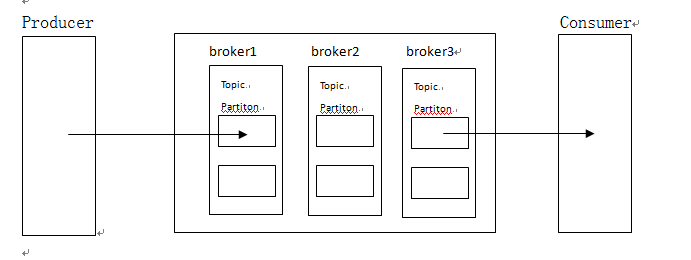

### 什么是 Kafka
Kafka 是由 Linkedin 公司开发，使用 Scala 语言编写的一种分布式、分区的、多副本的、多订阅者的日志系统(分布式 MQ 系统)，可以用亍 web/nginx 日志，搜索日志，监控日志，访问日志等等。  
Kafka 的设计初衷是希望作为一个统一的信息收集平台，能够实时的收集反馈信息，并能够支撑较大的数据量，且具备良好的容错能力。

Kafka 集群里面有多个 broker，每一个运行着 Kafka 进程的一台机器就是一个broker。  
broker 的特点是它里面的id不能重复。  
broker里面的消息是以分区的形式存储的。  
而且，每一个分区里面的消息还会存副本，分区分为活跃分区和备份分区，活跃分区负责读取数据，备份分区负责同步活跃分区里面的数据。  

### Kafka 基本概念
  

Kafka 对消息进行分类，每一个分类就是一个 topic，一个 topic 可以分布在台服务器上，在生产中通常一个业务对应一个 topic。  

Partition：由于消息是海量的，为了消息的读写性能，每一个topic都被分成很多部分（至少有一个分区），每一个部分就叫做一个分区（Partiton），在创建topic的时候可以指定分多少个区，每一个区就是一个文件目录，这个目录只负责存储该 topic 的一部分消息，所有的 Partition 中的消息加起来就组成一个完整的 topic。每个 topic 的每个分区会被均匀的分布到 Kafka 集群的各个 broker 机器上。  
一个分区可以看做是一个 FIFO 的队列。  

Replication：副本，每一个分区都有多个副本。

Leader 和 follower：每个 topic 的每一个分区的多个副本中，其中一个副本会被选为 leader，其他的副本都是 follower。leader 负责消息的读写，而所有的 follower 都会从 leader 复制消息。  

ISR：是 Replicas 的一个子集，表示目前活跃的并且同步速度能够跟得上 leader 的那些分区副本的集合。由于读写都是首先落到 leader 上，所以一般来说通过同步机制从 leader 上拉取数据的 Replica 都会和 leader 有一些延迟，不管是在时间上跟不上进度，还是在数量上跟不上进度，都会被踢出 ISR。  
每个 Partition 都有它自己独立的ISR。  

Offset：每一条消息都有一个 offset 值作为唯一标识，就是一条消息在一个分区中的编号，编号的顺序不是全局的，所以不能跨分区。  

Producer：生产者，发送消息的进程，将消息发送到 topic 中。  

Consumer：消费者，消费消息的进程，从 topic 中读取消息。

ConsumerGroup：由多个消费者组成的组，每一个组中的所有消费者共同消费一个完整的 topic，彼此消费的消息不重复。

Broker：每一个 Broker 就是 Kafka 实例，多个 Broker 组成 Kafka 集群。  
生产者会把消息发送到 Broker，消费者会从 Broker 消费消息。Kafka 集群会通过选举来选出一个 Broker 作为管理者（KafkaController），负责处理分区的 leader 选举，以及分区的迁移。

Zookeeper：生产者、消费者、和Kafka集群都依赖于Zookeeper存储一些元数据信息。

### Kafka 架构

### Kafka 原理

### Kafka 环境搭建
1、在 [Kafka Download Page](http://kafka.apache.org/downloads) 中选择下载一个稳定版本的压缩包，然后解压到大数据目录。
```bash
# 下载，解压
wget xxx
tar -xzvf kafka.x.x.x.tgz
```
2、启动服务
```bash
cd kafka.x.x.x
bin/zookeeper-server-start.sh config/zookeeper.properties &
```

3、topic 操作
```bash
# 创建 topic 名为 test_topic: 1 个副本，1 个分区
bin/kafka-topics.sh --create --zookeeper localhost:2181 --replication-factor 1 --partitions 1 --topic test_topic
# 查看已创建 topic 的详情
bin/kafka-topics.sh --describe --topic test_topic --zookeeper localhost:2181
# 查看所有已创建的 topic
bin/kafka-topics.sh --list --zookeeper localhost:2181

# 修改 topic 分区数
bin/kafka-topics.sh --zookeeper localhost:2181 --alter --topic test_topic --partitions 4
# 删除 topic （需要在 server.properties 中添加 delete.topic.enable=true）
bin/kafka-topics.sh --zookeeper localhost:2181 --delete --topic test_topic

# 注意，通过配置 broker 可以自动创建 topic（建议把自动创建配置关掉）
# 删除多余 topic 报 marked for deletion 错误时，
# 需要调整 server.properties 的参数 auto.create.topics.enable（是否自动创建topic）、delete.topic.enable（是否删除topic）
```

4、启动 producer, 发送消息
```bash
bin/kafka-console-producer.sh --broker-list localhost:9092 --topic test_topic
```

5、启动 consumer, 接受消息 
```bash
bin/kafka-console-consumer.sh --zookeeper localhost:2181 --topic test_topic --from-beginning
```
### Kafka 应用场景
-- 日志收集  
-- 行为跟踪  
-- 持久性日志  
