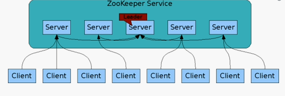
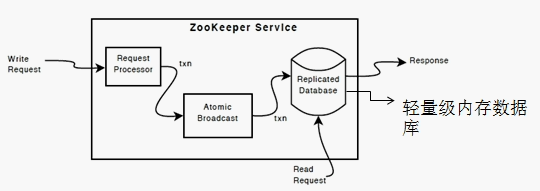

### 什么是 ZooKeeper
zookeeper 曾经是 Hadoop 的子项目，现在是 Hadoop 生态系统中非常重要的组件。   
ZooKeeper 是面向分布式应用的协调服务（配置服务、分布式同步、组服务等），其实现了树形结构的数据模型（与文件系统类似），并且提供了简洁的编程原语。  
ZooKeeper 数据全部于内存中存储，于硬盘中落地数据快照、事务日志。  
ZooKeeper 能够加强集群稳定性、持续性，保证集群的有序性和高效。  
ZooKeeper 的目标：封装复杂、易错的关键服务，将简单易用的接口和性能高效、功能稳定的系统提供给用户。  
（白话版：Zookeeper 可以理解为 Hadoop 的整体监控系统，比如 Hadoop 的 NameNode,Hbase 的 HMaster 宕机后，这时候 Zookeeper 就得重新选出leader）

### ZooKeeper 体系及数据结构
体系结构  
ZooKeeper Server 具有 fast fail 特性，非常健壮。  
没有单点作业。  
不超过半数的 Server 挂掉不影响服务。  
以下是 Master/Slave  主流模式结构图：  



数据结构
```html
 / 
 |— — /NameServer
 |          |— — /server_1
 |          | 
 |           — — /server_2
 |— — /Configuration
 |
 |— — /GroupMembers
 |           |— — /member_1
 |           |— — /member_2
 |            — — /member_3
  — — /Apps
```

### ZooKeeper 重要概念
#### ZNode
ZooKeeper 数据模型的结构与 Unix 文件系统很类似，整体上可以看作是一棵树，每个节点称做一个 ZNode。  
每个 ZNode 都可以通过其路径唯一标识。  
在每个ZNode上可存储少量数据(默认是 1 M, 可以通过配置修改, 通常不建议在 ZNode 上存储大量的数据)。  
每个 ZNode 的 Acl 是独立的，子结点不会继承父结点。

ZNode根据其本身的特性，可以分为下面两类：
Regular ZNode: 常规型 ZNode, 用户需要显式的创建、删除；  
Ephemeral ZNode: 临时型ZNode, 用户创建它之后，可以显式的删除，也可以在创建它的Session结束后，由ZooKeeper Server自动删除。  
ZNode 还有一个 Sequential 的特性，如果创建的时候指定的话，该 ZNode 的名字后面会自动追加一个不断增加的 SequenceNo。

#### ZNode Stat
除了存储的数据，ZNode 包含了称为 Stat 的数据结构，用于存储 ZNode 的属性信息，主要包括：
>1. cZxid / mZxid：ZNode 创建 / 最后更新的 Zxid  
>2. ctime / mtime：ZNode 创建 / 最后更新的时间（Unix 时间，毫秒）  
>3. dataVersion ：ZNode 数据版本  
>4. dataLength ：ZNode 存储的数据长度  
>5. numChildren ：子级 ZNode 的数量  
>6. 其他关于 ACL、子级 ZNode 的信息  

关于 Zxid：所有提交到 ZooKeeper 的事务，都会被标记唯一的 ZooKeeper Transaction Id。

#### Session
Client 与 ZooKeeper 之间的通信，需要创建一个 Session，这个 Session 会有一个超时时间（即 ZooKeeper Session 是客户端与服务端交互的通道）。  
因为 ZooKeeper 集群会把 Client 的 Session 信息持久化，所以在 Session 没有超时之前，Client 与 ZooKeeper Server 的连接可以在各个 ZooKeeper Server 之间透明地移动。  
在实际的应用中，如果 Client 与 Server 之间的通信足够频繁，Session 的维护就不需要其它额外的消息了。  
否则，ZooKeeper Client 会每 t/3ms 发一次心跳给 Server，如果 Client 2t/3ms 没收到来自 Server 的心跳回应，就会换到一个新的 ZooKeeper Server 上（这里t是用户配置的 Session 的超时时间）。

#### Watcher
ZooKeeper 支持一种 Watch 操作，Client 可以在某个 ZNode 上设置一个 Watcher，来 Watch 该 ZNode 上的变化。  
如果该 ZNode 上有相应的变化，就会触发这个 Watcher，把相应的事件通知给设置 Watcher 的 Client。  
需要注意的是，ZooKeeper 中的 Watcher 是一次性的，即触发一次就会被取消，如果想继续 Watch 的话，需要客户端重新设置 Watcher。  

### ZooKeeper ACL
ZooKeeper 通过 ACL 控制 ZNode 的访问权限（默认情况，ZNode 无访问权限控制），权限维度包括：
>1. CREATE：创建 ZNode；  
>2. READ：获取 ZNode 数据及其子级 ZNode；  
>3. WRITE：ZNode 数据写入；  
>4. DELETE：删除 ZNode；  
>5. ADMIN：权限设置。  

ZooKeeper 支持多种权限模式，最常见的 Digest 模式，类似于 username / password。  
[更多参考](http://zookeeper.apache.org/doc/current/zookeeperProgrammers.html#sc_ACLPermissions)

### ZooKeeper 一致性保证
基于 ZooKeeper 的设计，允许使用“Leader”和“Follower”同时提供“读”服务，由此涉及“一致性”问题，ZooKeeper 保证：
>1. 顺序一致性（Sequential Consistency）：来自相同客户端提交的事务，ZooKeeper 将严格按照其提交顺序依次执行；  
>2. 原子性（Atomicity）：于 ZooKeeper 集群中提交事务，事务将“全部完成”或“全部未完成”，不存在“部分完成”；  
>3. 单一系统镜像（Single System Image）：客户端连接到 ZooKeeper 集群的任意节点，其获得的数据视图都是相同的；  
>4. 可靠性（Reliability）：事务一旦完成，其产生的状态变化将永久保留，直到其他事务进行覆盖；  
>5. 实时性（Timeliness）：事务一旦完成，客户端将于限定的时间段内，获得最新的数据。  

### ZooKeeper 基本原理
ZooKeeper 的核心是原子广播，这个机制保证了各个 Server 之间的同步。  
实现这个机制的协议叫做 Zab 协议。  
Zab 协议有两种模式，它们分别是恢复模式（选主）和广播模式（同步）。  
当服务启动或者领导者崩溃后，Zab 就进入了恢复模式，当领导者被选举出来，且大多数 Server 完成了和 leader 的状态同步以后，恢复模式就结束了。  
状态同步保证了 leader 和 Server 具有相同的系统状态。 

为了保证事务的顺序一致性，ZooKeeper 采用了递增的事务 id 号（zxid）来标识事务。  
所有的提议（proposal）都在被提出的时候加上了 zxid。  
实现中 zxid 是一个64位的数字，它的高 32 位是 epoch 用来标识 leader 关系是否改变，每次一个 leader 被选出来，它都会有一个新的 epoch，标识当前属于那个 leader 的统治时期。  
低 32 位用于递增计数。

### ZooKeeper 选主流程
1.选举 Leader  
2.同步数据  
3.选举 Leader 过程中算法有很多，但要达到的选举标准是一致的  
4.Leader 要具有最高的 zxid  
5.集群中大多数的机器得到响应并 follower 选出的 Leader  

>Leader：提供 “读” & “写” 服务（Leader 由集群全部机器通过“Leader 选举”产生）  
>Follower：集群中非 “Leader” 的其他节点  

### ZooKeeper 服务端
ZooKeeper 允许进行单机模式（Standalone）和集群模式（Replicated）部署。
关于集群模式，需要说明以下两点。
使用集群模式进行 ZooKeeper 进行部署：集群中的全部 ZooKeeper 节点称为“quorum”，必须使用相同的配置文件。  
根据 ZooKeeper 特性，ZooKeeper 集群通常以“奇数”作为节点数量（3、5……）。  
ZooKeeper 配置文件（conf/zoo.cfg）涉及的配置项如下  
（以下仅列出 conf/zoo_sample.cfg 的内容 ，[更多配置项](http://zookeeper.apache.org/doc/current/zookeeperAdmin.html#sc_configuration)）：  
```buildoutcfg
## ZooKeeper 基础时间单元，即 tick（毫秒）# 1. 心跳时间间隔# 2. 默认 session 超时时间：tickTime × 2#
tickTime=2000

## 数据快照、事务日志、myid 文件的存储路径#
dataDir=/data/service/zookeeper

## ZooKeeper 端口#
clientPort=2181

## 适用于集群模式：集群节点与 Leader 建立初始化连接的时间限制（基于 tick 数计算）#
initLimit=10

## 适用于集群模式：集群节点与 Leader 进行通信的时间限制（基于 tick 数计算）#
syncLimit=5

## 适用于集群模式：集群的节点列表# 2888：集群节点与 Leader 通信的端口# 3888：集群进行 Leader 选举的端口#
server.1=host1:2888:3888
server.2=host2:2888:3888
server.3=host3:2888:3888
# server.X=hostX:2888:3888 # X 即为 ZooKeeper Server Id
```
完成配置，于 dataDir 路径建立 myid 文件（内容即为 ZooKeeper Server Id）。使用以下脚本命令即可启动 / 停止 ZooKeeper：
```bash
# 启动
./bin/zkServer.sh start

# 停止
./bin/zkServer.sh stop
```

### ZooKeeper 客户端
ZooKeeper 提供了非常简洁的编程接口，包括：   
>1. 创建 ZNode   
>2. 写入 ZNode 数据  
>3. 读取 ZNode 数据  
>4. 获取 ZNode 的子级 ZNode  
>5. 删除 ZNode  
>6. 判断 ZNode 是否存在  

与 127.0.0.1:2181 的 ZooKeeper 建立连接，进入脚本客户端的控制台
```bash
./bin/zkCli.sh -server 127.0.0.1:2181
```

在 ZooKeeper 脚本客户端的控制台
```bash
## 创建 ZNode /Y2018，2018 即为 ZNode 数据#
create /Y2018 2018

## 创建 ZNode /Y2018/M02，Feb 即为 ZNode 数据（需要说明，ZooKeeper 不支持 ZNode 递归创建）# 允许通过参数 -e 或 -s 创建 “临时” 或 “顺序” ZNode#
create /Y2018/M02 Feb

## ZNode /Y2018/M02 写入 2018-Feb#
set /Y2018/M02 2018-Feb

## ZNode /Y2018 写入 2018，基于 ZNode 版本 0# ZooKeeper 通过 set 命令的 “版本” 参数实现 CAS，“版本” 即来自 Stat - dataVersion#
set /Y2018 2018 0

## 读取 ZNode /Y2018/M02 数据#
get /Y2018/M02

## 获取 ZNode /Y2018 子级 ZNode#
ls /Y2018

## 删除 ZNode /Y2018/M02# 1. 与 set 相同，delete 命令支持 “版本” 参数# 2. ZNode 删除时，必须确保其无子级 ZNode##
delete /Y2018/M02

## zkCli.sh 未提供 “判断 ZNode 是否存在” 命令，使用 get 亦可#
```

Java API，使用 Curator  
Curator 使用“流式接口”风格封装了 ZooKeeper Java API，并实现了诸多工具，例如 Leader 选举。  
使用 Curator，于 build.gradle 添加如下代码。  
```gradle
compile('org.apache.curator:curator-framework:4.0.0') {
exclude group: 'org.apache.zookeeper', module: 'zookeeper'
}
compile('org.apache.zookeeper:zookeeper:3.4.11')
```

判断 ZNode 是否存在”及其 Watch 代码
```java
package com.gitchat.zk;

import org.apache.curator.framework.CuratorFramework;
import org.apache.curator.framework.CuratorFrameworkFactory;
import org.apache.curator.framework.api.CuratorWatcher;
import org.apache.curator.retry.RetryOneTime;
import org.apache.zookeeper.Watcher.Event.EventType;

import java.util.concurrent.CountDownLatch;

public class Main {

static CountDownLatch countDownLatch = new CountDownLatch(1);

public static void main(String args[]) throws Exception {
//
// 与 127.0.0.1:2181 连接，重试策略：仅重试 1 次
//
CuratorFramework client = CuratorFrameworkFactory.newClient("127.0.0.1:2181", new RetryOneTime(1000));
client.start();

//
// 判断 ZNode /2018-02 是否存在，设置 Watch
//
client.checkExists().usingWatcher((CuratorWatcher) (event) -> {
if (event.getType() == EventType.NodeCreated) {
System.out.println(Thread.currentThread().getName() + ": " + "node Created.");
} else if (event.getType() == EventType.NodeDeleted) {
System.out.println(Thread.currentThread().getName() + ": " + "node Deleted.");
}

countDownLatch.countDown();
}).inBackground((c, event) -> {
//
// 异步接口
//
System.out.println(Thread.currentThread().getName() + ": " + "checkExists == " + event.getResultCode() + ", event == " + event.getType());
}).forPath("/2018-02");

countDownLatch.await();
System.out.println("terminate...");
}
}
```
如代码所示：  
>1. 使用 CuratorFrameworkFactory 的 newClient 方法创建 ZooKeeper Session；  
>2. 使用 Curator 的异步接口，判断 ZNode 是否存在，并注册 CuratorWatcher。  

在此做下说明：  
>1. ZooKeeper 的异步响应、Watch 通知，全部由 EventThread 完成（ZooKeeper 客户端与服务端的 TCP 通信，由独立的 I/O 线程完成）；  
>2. Curator 提供了 org.apache.curator.framework.recipes.cache.NodeCache，能够简化 Watch 设置，例如实现自动的 Watch 设置。  

### ZooKeeper 流行应用
-- 分布式配置管理  
-- 分布式通知/协调  
-- 分布式锁  
-- 分布式队列  
-- 命名服务  
-- 集群管理  
