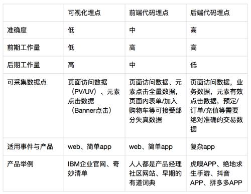

### 什么是数据埋点
埋点就是在应用中特定的流程收集一些信息，用来跟踪应用使用的状况，后续用来进一步优化产品或是提供运营的数据支撑，包括访问数（Visits），访客数（Visitor），停留时长（Time On Site），页面浏览数（Page Views）和跳出率（Bounce Rate）。  
这样的信息收集可以大致分为两种：页面统计（track this virtual page view），统计操作行为（track this button by an event）。  

埋点是为了更好地使用数据，不要试图得到精准的数据要得到的是高质量的埋点数据。  

数据埋点的关键指标：访问与访客、停留时间、跳出率（用户只访问了应用或某一个页面所占的会话比例）、退出率（针对页面）、转化率和参与度等。

代码埋点、无埋点、可视化埋点、全埋点、前端埋点、后端埋点，叫法很多，实际上可以简单的分为客户端埋点（即前端）与服务器端埋点（即后端）。而前端埋点根据实现方式可分为可视化埋点与代码埋点，后端埋点统一都是代码埋点方式。  
> 代码埋点是指在产品开发阶段，PM 通过对产品上线后需要做的数据分析的场景，设计数据需求，撰写数据需求文档，然后交由开发在每个需要采集的数据点写入代码，通过写入的代码进行数据监测与上报。  
> 代码埋点又会分为前端埋点与后端埋点，前端埋点是指在 web、app 这样的产品内写入代码，而后端埋点是指在数据服务器内写入代码。  
> 
> 无埋点属于前端埋点的一种方式，开发通过加入 “无埋点” 采集代码，对网页或者 APP 上所有的可交互事件元素进行解析并监测，当有用户操作行为（交互事件）发生时，即对此事件进行采集、上报，因此 “无埋点” 与 “全埋点” 是相同的概念。  
> 无埋点并不是不用写入任何代码，而是通过代码将所有事件元素解析后，以可视化的方式呈现，让 PM、运营经理等可以根据需要自行手动选取、标定。为了与开发逐一进行代码写入的方式进行区分，被称作可视化埋点，可视化埋点通常通过第三方工具实现。

  

### 数据埋点系统方案
埋点的主流有两种方式：  
1、自己公司研发在产品中注入代码统计，并搭建起相应的后台查询  
2、第三方统计工具，如友盟、神策、Talkingdata、GrowingIO 等  
如果是产品早期，通常会使用第二种方式来采集数据，并直接使用第三方分析工具进行基本的分析。而对于那些对数据安全比较重视，业务又相对复杂的公司则通常是使用第一种方式采集数据，并搭建相应的数据产品实现其数据应用或是分析的诉求。  

**客户端埋点**  
客户端埋点，是指在 APP 或者 web 产品中植入代码，对用户在产品内的行为事件数据进行收集，用户一旦触发了该事件，就会上传埋点代码中定义的、需要上传的有关该事件的信息，前端埋点会包含代码埋点与可视化埋点方式。  
主要的应用场景：产品运营阶段初期，功能简单，无深度分析需求；分析事件与后端无交互。  
优劣分析：优点在于可统计 app 内与服务器无交互事件数据；缺点是会出现丢数据的情况，和自己的业务数据库数据对不上（这是前端数据采集的先天缺陷，因为网络异常，或者统计口径不一致，都会导致数据对不上）。  

**服务端埋点**  
服务器端埋点，是通过开发在服务器端写入代码，采集客户端与服务器端会存在交互的事件数据，以及存储在业务服务器中的业务数据。  
主要的应用场景 ：产品功能复杂，需进行深度下钻与多维分析；用户行为数据与业务数据整合分析；数据保密性高；分析项与后端交互，前后端均可采集的数据；涉及充值、退订等的重要事件。  
优劣分析：优点是避免多个客户端埋点、采集数据准确；缺点是客户端与服务器端无请求交互的数据，无法进行客户端行为事件精确统计（如提交订单，用户可能是点击了 3 次才提交成功）。  

**Piwik**  
Piwik 是一个基于 PHP+MySQL 的 web 埋点统计系统，开源版本基于 GPL3.0 开源许可，支持简体中文页面。  
除了基本的流量统计、分析功能之外，pwiki 还支持事件统计，比如某个区块的点击事件、链接点击事件。  

Piwik 安装很简单。
```bash
wget https://builds.piwik.org/piwik.zip 
unzip piwik.zip
```
联合 nginx 配置
```
server {
    listen       80;
    server_name  piwik.xxx.com;

    location / {
        root /xxx/piwik/piwik/;
        index  index.php index.html index.htm;

        location ~ \.php$ {
            fastcgi_read_timeout 300;
            fastcgi_pass   unix:/xxx/php/var/run/www.sock;

            fastcgi_index  index.php;
            fastcgi_param  SCRIPT_FILENAME $request_filename;
            include        fastcgi_params;
        }
    }   
}
```


