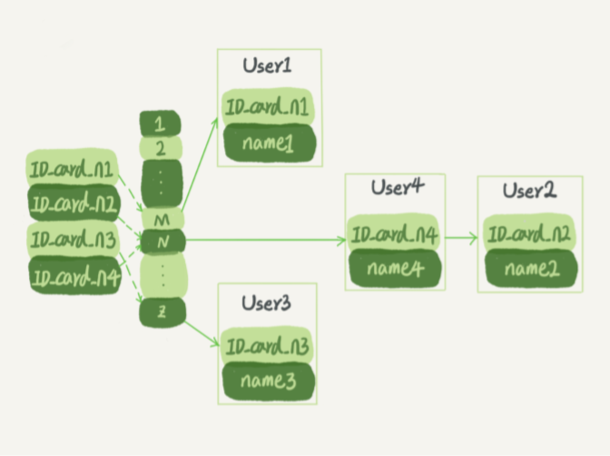
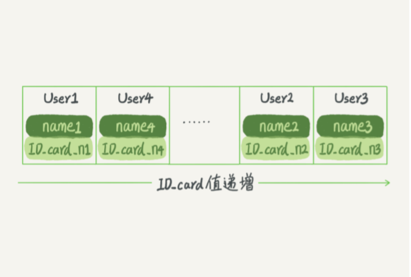
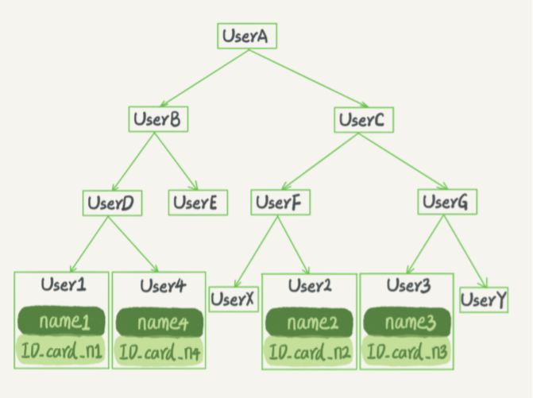

### 索引
索引的出现其实就是为了提高数据查询的效率，就像书的目录一样。  

实现索引的方式有很多种。这里主要说说三种常见的索引模型，分别是哈希表、有序数组和搜索树。  
哈希表是一种以键 - 值（key-value）存储数据的结构，我们只要输入待查找的值即 key， 就可以找到其对应的值即 Value。哈希的思路很简单，把值放在数组里，用一个哈希函数 把 key 换算成一个确定的位置，然后把 value 放在数组的这个位置。不可避免地，多个 key 值经过哈希函数的换算，会出现同一个值的情况。处理这种情况的一种方法是，拉出一个链表。哈希表这种结构适用于只有等值查询的场景。  

  

图中，User2 和 User4 根据身份证号算出来的值都是 N，但没关系，后面还跟了一个链 表。假设，这时候你要查 ID_card_n2 对应的名字是什么，处理步骤就是：首先，将 ID_card_n2 通过哈希函数算出 N；然后，按顺序遍历，找到 User2。需要注意的是，图中四个 ID_card_n 的值并不是递增的，这样做的好处是增加新的 User 时速度会很快，只需要往后追加。但缺点是，因为不是有序的，所以哈希索引做区间查询 的速度是很慢的。  

有序数组在等值查询和范围查询场景中的性能就都非常优秀。假设身份证号没有重复，这个数组就是按照身份证号递增的顺序保存的。这时候如果你要查 ID_card_n2 对应的名字，用二分法就可以快速得到，这个时间复杂度是 O(log(N))。如果仅仅看查询效率，有序数组就是最好的数据结构了。但是，在需要更新数据的时候就 麻烦了，你往中间插入一个记录就必须得挪动后面所有的记录，成本太高。所以，有序数组索引只适用于静态存储引擎。  

  

二叉搜索树的特点是：每个节点的左儿子小于父节点，父节点又小于右儿子。这样如果你要查 ID_card_n2 的话，按照下图中的搜索顺序就是按照 UserA -> UserC -> UserF -> User2 这个路径得到。这个时间复杂度是 O(log(N))。为了维持 O(log(N)) 的查询复杂度，你就需要保持这棵树是平衡二叉树。为了做这个 保证，更新的时间复杂度也是 O(log(N))。    
树可以有二叉，也可以有多叉。多叉树就是每个节点有多个儿子，儿子之间的大小保证从 左到右递增。二叉树是搜索效率最高的，但是实际上大多数的数据库存储却并不使用二叉 树。其原因是，索引不止存在内存中，还要写到磁盘上。  
为了让一个查询尽量少地读磁盘，就必须让查询过程访问尽量少的数据块。那么，我们就 不应该使用二叉树，而是要使用“N 叉”树。这里，“N 叉”树中的“N”取决于数据块的大小。N 叉树由于在读写上的性能优点，以及适配磁盘的访问模式，已经被广泛应用在数据库引擎中。

  

不管是哈希还是有序数组，或者 N 叉树，它们都是不断迭代、不断优化的产物或者解决方 案。数据库技术发展到今天，跳表、LSM 树等数据结构也被用于引擎设计中。  

### InnoDB 的索引模型 
在 InnoDB 中，表都是根据主键顺序以索引的形式存放的，这种存储方式的表称为索引组 织表。InnoDB 使用了 B+ 树索引模型，所以数据都是存储在 B+ 树中的，每一个索引在 InnoDB 里面对应一棵 B+ 树。  

根据叶子节点的内容，索引类型分为主键索引和非主键索引。主键索引的叶子节点存的是整行数据。在 InnoDB 里，主键索引也被称为聚簇索引 （clustered index）。  
非主键索引的叶子节点内容是主键的值。在 InnoDB 里，非主键索引也被称为二级索引 （secondary index）。  

基于主键索引和普通索引的查询：  
如果语句是 select * from T where ID=500，即主键查询方式，则只需要搜索 ID 这棵 B+ 树；  
如果语句是 select * from T where k=5，即普通索引查询方式，则需要先搜索 k 索引 树，得到 ID 的值为 500，再到 ID 索引树搜索一次。这个过程称为回表。  
也就是说，基于非主键索引的查询需要多扫描一棵索引树。因此，我们在应用中应该尽量 使用主键查询。   

**索引维护**  
B+ 树为了维护索引有序性，在插入新值的时候需要做必要的维护。
插入新行需要在最新记录后插入新的记录，但是如果在数据中间插入数据，则需要逻辑上挪动后面的数据。更糟糕的是如果节点所在数据页满了的情况还需要申请一个新的数据页，然后挪动部分数据过去，这个过程叫页分裂。  

除了性能外，页分裂操作还影响数据页的利用率。原本放在一个页的数据，现在分到两个页中，整体空间利用率降低大约 50%。  
当然有分裂就有合并。当相邻两个页由于删除了数据，利用率很低之后，会将数据页做合 并。合并的过程，可以认为是分裂过程的逆过程。  

基于上面的索引维护过程，自增主键的插入数据模式，正符合了递增插入的场景。每次插入一条新记录，都是追加操作，都不涉及到挪动其他记录，也不会触发叶子节点的分裂。由于每个非主键索引的叶子节点上都是主键的值，主键长度越小，普通索引的叶子节点就越小，普通索引占用的空间也就越小。  
而有业务逻辑的字段做主键，则往往不容易保证有序插入，这样写数据成本相对较高。用业务字段直接做主键的场景通常是 KV 场景，由于没有其他索引，所以也就不用考虑其他索引的叶子节点大小的问题。  

优先考虑“尽量使用主键查询”原则，直接将这个索引设置为主键，可以避免每次查询需要搜索两棵树。

### 覆盖索引
覆盖索引指的是可以直接提供查询结果，不需要回表。  
于覆盖索引可以减少树的搜索次数，显著提升查询性能，所以使用覆盖索引是一个常用的性能优化手段。  

我们知道，身份证号是市民的唯一标识。也就是说，如果有根据身份证号查询市民信息的需求，我们只要在身份证号字段上建立索引就够了。而再建立一个（身份证号、姓名）的联合索引，是不是浪费空间？  
如果现在有一个高频请求，要根据市民的身份证号查询他的姓名，这个联合索引就有意义了。它可以在这个高频请求上用到覆盖索引，不再需要回表查整行记录，减少语句的执行时间。  
当然，索引字段的维护总是有代价的。因此，在建立冗余索引来支持覆盖索引时就需要权衡考虑了。

### 最左前缀原则  
索引项是按照索引定义里面出现的字段顺序排序的。B+ 树这种索引结构，可以利用索引的“最左前缀”，来定位记录。  

不只是索引的全部定义，只要满足左前缀，就可以利用索引来加速检索。这个最左前缀可以是联合索引的左 N 个字段，也可以是字符串索引的左 M 个字符。  

在建立联合索引的时候，如何安排索引内的字段顺序呢？  
第一原则是，如果通过调整顺序，可以少维护一个索引，那么这个顺序往往就是需要优先考虑采用的。  
接着，我们要考虑的原则就是索引字段所占用的空间。  

**索引下推**  
MySQL 5.6 引入的索引下推优化（index condition pushdown)，可以在索引遍历过程中，对索引中包含的字段先做判断，直接过滤掉不满足条件的记录，减少回表次数。  

### 常见问题
1、怎么删除表的前 10000 行  
第一种方式，直接执行 delete from T limit 10000，单个语句占用时间长，锁 的时间也比较长；而且大事务还会导致主从延迟。  
第二种方式，在 20 个连接中同时执行 delete from T limit 500，会人为造成锁冲突。  
第三种方式，在一个连接中循环执行 20 次 delete from T limit 500，这样相对较好。

2、选择唯一索引还是普通索引  
这两类索引在查询能力上是没差别的，主要考虑的是对更新性能的影响，建议尽量选择普通索引。  

执行查询的语句是 select id from T where k=5，在索引树上查找的过程，先是通过 B+ 树从树根开始，按层搜索到叶子节点。
> 对于普通索引来说，查找到满足条件的第一个记录 (5,500) 后，需要查找下一个记录， 直到碰到第一个不满足 k=5 条件的记录。  
> 对于唯一索引来说，由于索引定义了唯一性，查找到第一个满足条件的记录后，就会停 止继续检索。  

InnoDB 的数据是按数据页为单位来读写的。也就是说，当需要读一条记录的时候，并不是将这个记录本身从磁盘读出来，而是以页为单位，将其整体读入内存。在 InnoDB 中，每个数据页的大小默认是 16KB。因为引擎是按页读写的，所以说，当找到 k=5 的记录的时候，它所在的数据页就都在内存里了。那么，对于普通索引来说，要多做的那一次“查找和判断下一条记录”的操作，就只需要一次指针寻找和一次计算。  
当需要更新一个数据页时，如果数据页在内存中就直接更新，而如果这个数据页还没有在内存中的话，在不影响数据一致性的前提下，InooDB 会将这些更新操作缓存在 change buffer 中，这样就不需要从磁盘中读入这个数据页了。在下次查询需要访问这个数据页的时候，将数据页读入内存，然后执行 change buffer（实际上它是可以持久化的数据）中与这个页有关的操作。通过这种方式就能保证这个数据逻辑的正确性。  
对于唯一索引来说，所有的更新操作都要先判断这个操作是否违反唯一性约束。如果都已经读入到内存了，那直接更新内存会更快，就没必要使用 change buffer 了，所以唯一索引的更新就不能使用 change buffer，实际上也只有普通索引可以使用。  
> 插入新记录时，这个记录要更新的目标页在内存中。对于唯一索引来说，找到 3 和 5 之间的位置，判断到没有冲突，插入这个值，语句执行结束；而对于普通索引来说，找到 3 和 5 之间的位置，插入这个值，语句执行结束。  
> 插入新记录时，这个记录要更新的目标页不在内存中。对于唯一索引来说，需要将数据页读入内存，判断到没有冲突，插入这个值，语句执行结束；对于普通索引来说，则是将更新记录在 change buffer，语句执行就结束了。  

change buffer 用的是 buffer pool 里的内存，因此不能无限增大。change buffer 的大小，可以通过参数 innodb_change_buffer_max_size 来动态设置。这个参数设置为 50 的时候，表示 change buffer 的大小最多只能占用 buffer pool 的 50%。将数据从磁盘读入内存涉及随机 IO 的访问，是数据库里面成本最高的操作之一。change buffer 因为减少了随机磁盘访问，所以对更新性能的提升是会很明显的。  
对于写多读少的场景，change buffer 使用效果最好，相反 change buffer 的维护代价会增加。

3、为什么有时候索引会选错以及相应的解决方案是什么？  
选择索引是优化器的工作，优化器选择索引的目的，是找到一个最优的执行方案，并用最小的代价去执行语句。  
在数据库里面，扫描行数是影响执行代价的因素之一 ———— 扫描的行数越少，意味着访问磁盘数 据的次数越少，消耗的 CPU 资源越少。  
> 扫描行数如何判断？  
> 需要根据统计信息（即索引的“区分度”，一个索引上不同的值越多，这个索引的区分度就越好）来估算记录数。  
> 一个索引上不同的值的个数，我们称之为“基数”（cardinality）。基数的计算是通过采样统 计的方法。采样统计的时候，InnoDB 默认会选择 N 个数据页，统计这些页面上的不同值，得到一个平均值，然后乘以这个索引的页面数，就得到了这个索引的基数。   

扫描行数并不是唯一的判断标准，优化器还会结合是否使用临时表、是否排序等因素进行综合判断。优化器会估算每个选择的代价，比如存在主键的方案会认为扫描主键索引更快但实际上并不是最优解。  
索引选择错误的情况比如：  
> 1、条件中有 or，即使其中有条件带索引也不会使用  
> 2、对于多列索引，不是使用的第一部分 (第一个)  
> 3、like 查询是以 % 开头  
> 4、如果列类型是字符串，那一定要在条件中将数据使用引号引用起来，否则不使用索引  
> 5、如果 mysql 估计使用全表扫描要比使用索引快  

索引选择错误的解决方案主要有如下几种：  
> 1、相对粗暴的方法，采用 force index 强行选择一个索引，相对应的扩展性和敏捷度比较低  
> 2、如果 explain 的结果说明是索引统计信息不准确导致的，可以使用 analyze table 解决  
> 3、修改语句，引导 MySQL 使用我们期望的索引，比如增加排序分组逻辑  
> 4、在有些场景下，我们可以新建一个更合适的索引，来提供给优化器做选择或删掉误用的索引  

4、怎么给字符串字段加索引？  
有如下四种方式可以考虑：  
> 1、直接创建完整索引，这样可能比较占用空间；  
> 2、创建前缀索引，节省空间，但会增加查询扫描次数，并且不能使用覆盖索引（因为系统并不确定前缀索引的定义是否截断了完整信息）；  
> 使用前缀索引，定义好长度，就可以做到既节省空间，又不用额外增加太多的查询成本。那如何定义好长度呢？比如根据如下 sql 语句计算损失的区分度（举个例子，设定可接受的损失比例 3%，在返回的 L5 ~ L7 中找出不小于 L* 97% 的值就可以确认前缀索引的长度）  
> select count(distinct email) as L from user;  
> select count(distinct left(email, 5)) as L5, count(distinct left(email, 6)) as L6, count(distinct left(email, 7)) as L7 from user;  
> 3、倒序存储及查询（使用 reverse 函数），再创建前缀索引，用于绕过字符串本身前缀的区分度不够的问题；  
> 4、创建 hash 字段索引（使用 crc32 函数），查询性能稳定，有额外的存储和计算消耗，跟第三种方式一样， 都不支持范围扫描

5、Sql 语句逻辑相同，为什么性能差异巨大？  
对索引字段做函数操作，可能会破坏索引值的有序性，因此优化器就决定放弃走树搜索功能。  
> 1、条件字段函数操作  
> 比如条件使用 month() 函数，就会导致全索引扫描。为了能够用上索引的快速定位能力，需要把 SQL 语句改成基于字段本身的范围查询（比如 between "xxxx-xx-xx" and "xxxx-xx-xx"），但是需要注意补全年份。  
> 即使是对于不改变有序性的函数，也不会考虑使用索引。比如条件语句是 id+1=10000，MySQL 优化器还是不能用 id 索引快速定位 到 9999 这一行，需要手动改写成 where id = 10000 -1 才可以。  
> 2、隐式类型转换  
> 比如字段 field 的类型是 varchar(32)，条件语句是 field=1111，实际执行的语句是 CAST(filed AS signed int)=1111，优化器就会放弃走树搜索逻辑。  
> 3、隐式字符编码转换  
> 比如两个关联表的字符集一个是 utf8，一个是 utf8mb4，它们的关联查询也回导致全表扫描。实际上，字符集不同，utf8mb4 是 utf8 的超集，就会发生这样的转换 CONVERT(field USING utf8mb4)="xxx"。这个时候，要么修改表的字符集保持一致，要么保证条件语句的字段值进行相关字符集转换操作。  
> 

6、导致慢查询性能的问题？  
a、索引没设计好  
一般通过紧急创建索引来解决，MySQL 5.6 版本以后，创建索引都支持 Online DDL 了，对于那种高峰期数据库已经被这个语句打挂了的情况，最高效的做法就是直接执行 alter table 语句。  
主从数据库中，比较理想的是能够在备库先执行，如不紧急就考虑类似 gh-ost 这样的方案更加稳妥  
> 1、在备库B上执行 set sql_log_bin=off，也就是不写 binlog，然后执行 alter table 语句加上索引；  
> 2、执行主备切换；  
> 3、这时候，主库是 B，备库是 A。在 A 上执行 set sql_log_bin=off，然后执行 alter table 语句加上索引。

b、语句没写好  
MySQL 5.7 提供了query_rewrite 功能，可以把输入的一种语句改写成另外一种模式。  
call query_rewrite.flush_rewrite_rules() 这个存储过程，是让插入的新规则生效，也就是我们说的“查询重写”。  
> 比如，增加一个语句改写规则：  
> insert into query_rewrite.rewrite_rules(pattern, replacement, pattern_database) values ("select * from t where id + 1 = ?", "select * from t where id = ? - 1", "db1");

c、mysql 选错了索引  
参考问题 3。  

