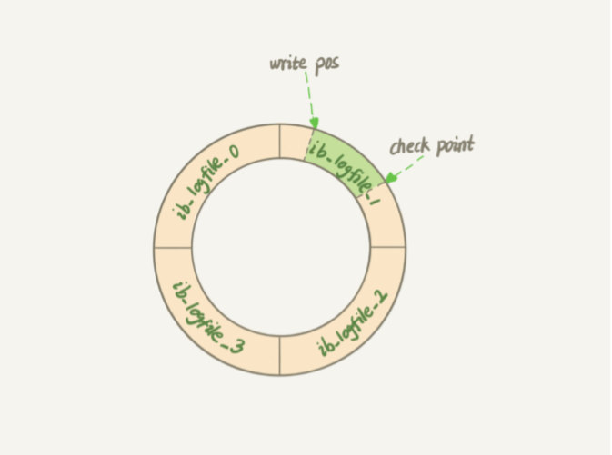
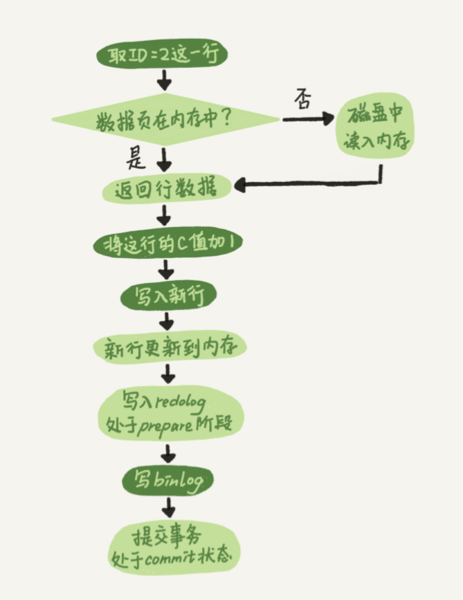

### Mysql Log
MySQL 日志分两层：一是 Server 层，它主要做的是 MySQL 功能层面的事情；还有一个是引擎层，负责存储相关的具体事宜。  
redo log 是 InnoDB 引擎特有的日志，Server 层也有自己的日志，称为 binlog（归档日志）。
> redo log 是 InnoDB 引擎特有的；binlog 是 MySQL 的 Server 层实现的，所有引擎 都可以使用。   
> redo log 是物理日志，记录的是“在某个数据页上做了什么修改”；binlog 是逻辑日 志，记录的是这个语句的原始逻辑，比如“给 ID=2 这一行的 c 字段加 1 ”。   
> redo log 是循环写的，空间固定会用完；binlog 是可以追加写入的。“追加写”是指 binlog 文件写到一定大小后会切换到下一个，并不会覆盖以前的日志。

### Mysql redo log
MySQL 里经常说到的 WAL 技术（Write-Ahead Logging），它的关键点就是先写日志，再写磁盘。具体来说，当有一条记录需要更新的时候，InnoDB 引擎就会先把记录写到 redo log 里面并更新内存，这个时候更新就算完成了；同时，InnoDB 引擎会在适当的时 候，将这个操作记录更新到磁盘里面，而这个更新往往是在系统比较空闲的时候做。    

InnoDB 的 redo log 是固定大小的，比如可以配置为一组 4 个文件，每个文件的大小是 1GB，那么总共就可以记录 4GB 的操作。从头开始写，写到末尾就又回到开头循环写。

  
write pos 是当前记录的位置，一边写一边后移，写到第 3 号文件末尾后就回到 0 号文件 开头。  
checkpoint 是当前要擦除的位置，也是往后推移并且循环的，擦除记录前要把记录 更新到数据文件。  
write pos 和 checkpoint 之间还空着的部分，可以用来记录新的操作。如果 write pos 追上 checkpoint，表示不能再执行新的更新，得停下来先擦掉一些记录，把 checkpoint 推进一下。  

有了 redo log，InnoDB 就可以保证即使数据库发生异常重启，之前提交的记录都不会丢 失，这个能力称为 crash-safe。

innodb_flush_log_at_trx_commit 这个参数设置成 1 的时候，表示每次事务的 redo log 都直接持久化到磁盘。  

### Mysql binlog
binlog 是归档日志，binlog 会记录所有的逻辑操作，并且是采用“追加写”的形式。如  

当需要恢复到指定的某一秒时，比如某天下午两点发现中午十二点有一次误删表，需要找 回数据，那你可以这么做：  
> 1、找到最近的一次全量备份，如果你运气好，可能就是昨天晚上的一个备份，从这 个备份恢复到临时库；  
> 2、从备份的时间点开始，将备份的 binlog 依次取出来，重放到中午误删表之前的 那个时刻

sync_binlog 这个参数设置成 1 的时候，表示每次事务的 binlog 都持久化到磁盘。  

我们来看 Mysql 的更新流程，使用了二阶段提交（保证数据逻辑一致性的常用方案）。

> 图中浅色框表示是在 InnoDB 内部执行的， 深色框表示是在执行器中执行的。  
> 1、执行器先找引擎取 ID=2 这一行。ID 是主键，引擎直接用树搜索找到这一行。如果 ID=2 这一行所在的数据页本来就在内存中，就直接返回给执行器；否则，需要先从磁 盘读入内存，然后再返回。   
> 2、执行器拿到引擎给的行数据，把这个值加上 1，比如原来是 N，现在就是 N+1，得到 新的一行数据，再调用引擎接口写入这行新数据。  
> 3、引擎将这行新数据更新到内存中，同时将这个更新操作记录到 redo log 里面，此时 redo log 处于 prepare 状态。然后告知执行器执行完成了，随时可以提交事务。  
> 4、执行器生成这个操作的 binlog，并把 binlog 写入磁盘。  
> 5、执行器调用引擎的提交事务接口，引擎把刚刚写入的 redo log 改成提交（commit）状 态，更新完成。

### 常见问题  
1、为什么 sql 会偶尔慢“抖”一下？  
InnoDB 在处理更新语句的时候，只做了写日志这一个磁盘操作，这个日志叫作 redo log（重做日志），在更新内存写完 redo log 后，就返回给客户端，本次更新成功。

当内存数据页跟磁盘数据页内容不一致的时候，我们称这个内存页为“脏页”。内存数据写入到磁盘后，内存和磁盘上的数据页的内容就一致了，称为“干净页”。不论是脏页还是干净页，都在内存中。把内存里的数据写入磁盘的过程，术语就是 flush。平时执行很快的更新操作，其实就是在写内存和 redo 日志，而 MySQL 偶尔“抖”一下的那个瞬间，可能就是在刷脏页（flush）。
> 什么情况会引发数据库的 flush 过程？  
> 1、 InnoDB 的 redo log 可能写满了  
> 2、系统内存不足，当需要新的内存页，而内存不够用的时候，就要淘汰一些数据页，空出内存给别的数据页使用  
> 3、 MySQL 认为系统“空闲”的时候，见缝插针地找时间，只要有机会就刷一点“脏页”    
> 4、 MySQL 正常关闭的情况，MySQL 会把内存的脏页都 flush 到磁盘上，这样下次 MySQL 启动的时候，就可以直接从磁盘上读数据，启动速度会很快  

**InnoDB 刷脏页的控制策略**  
> 1、使用  innodb_io_capacity 参数正确地告诉 InnoDB 所在主机的 IO 能力，这样 InnoDB 才能知道需要全力刷 脏页的时候，可以刷多快。  
> 2、InnoDB 的刷盘速度就是要参考这两个因素：一个是脏页比例（参数 innodb_max_dirty_pages_pct 是脏页比例上限，默认值是 75%），一个是 redo log 写盘速度。InnoDB 每次写入的日志都有一个序号，当前写入的序号跟 checkpoint 对应的序号之间的差值记为 N，InnoDB 会根据这个 N 算出一个范围在 0 到 100 之间的数字 R（N 越大，算出来的 R 值越大），按照 innodb_io_capacity 定义的能力乘以 R% 来控制刷脏页的速度。平时要多关注脏页比例（脏页比例是通过 Innodb_buffer_pool_pages_dirty/Innodb_buffer_pool_pages_total 得到），不要让它经常接近 75%。  
> 3、Mysql 的一个机制：在准备刷一个脏页的时候，如果这个数据页旁边的数据页刚好是脏页，就会把这个“邻居”也带着一起刷掉；而且这个把“邻居”拖下水的逻辑还可以继续蔓延，也就是对于每个邻居数据页，如果跟它相邻的 数据页也还是脏页的话，也会被放到一起刷。在 InnoDB 中，innodb_flush_neighbors 参数就是用来控制这个行为的，值为 1 的时候会有上述的“连坐”机制，值为 0 时表示不找邻居，自己刷自己的。如果使用的是 SSD 这类 IOPS 比较高的设备的话，建议把 innodb_flush_neighbors 的值设置成 0（MySQL 8.0 已默认是 0）。

