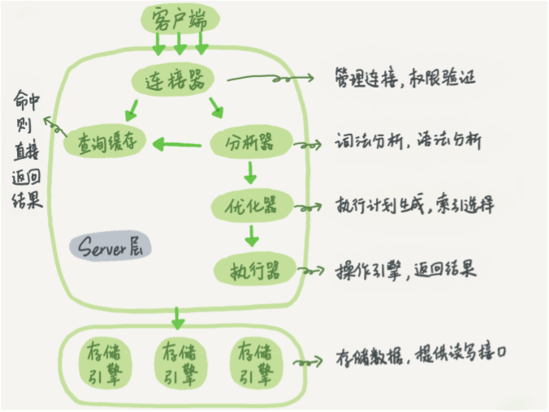

### 一条 sql 查询语句的生命周期
大体上，MySQL 可以分为 Server 层和存储引擎层两部分。  

Server 层包括连接器、查询缓存、分析器、优化器、执行器等，涵盖 MySQL 的大多数核 心服务功能，以及所有的内置函数（如日期、时间、数学和加密函数等），所有跨存储引 擎的功能都在这一层实现，比如存储过程、触发器、视图等。

存储引擎层负责数据的存储和提取。其架构模式是插件式的，支持 InnoDB、MyISAM、Memory 等多个存储引擎。现在最常用的存储引擎是 InnoDB，它从 MySQL 5.5.5 版本开始成为了默认存储引擎。  



**连接器**  
连接器负责跟客户端建立连接、获取权限、维持和管理连接。  
使用 mysql 客户端工具与服务端建立连接，在完成经典的 TCP 握手 后，连接器就要开始认证你的身份，这个时候用的就是你输入的用户名和密码。如果用户名或密码不对，你就会收到一个"Access denied for user"的错误，然后客户端程序结束执行；如果用户名密码认证通过，连接器会到权限表里面查出你拥有的权限。之后这个连接里面的权限判断逻辑，都将依赖于此时读到的权限，即用户成功建立连接后，即使你用管理员账号对这个用户的权限做了修改，也不会影响已经存在连接的权限。  
```bash
$ mysql -h$ip -P$port -u$user -p
# 查看 mysql 进程列表
mysql> show processlist
```
正常的短连接模式就是连接到数据库后，执行很少的 SQL 语句就断开，下次需要的时候再重连。MySQL 建立连接的过程，成本是很高的。除了正常的网络连接三次握手外，还需要做登录权限判断和获得这个连接的数据读写权限。所以，在数据库压力比较小的时候，这些额外的成本并不明显；但是，短连接模型存在一个风险，就是一旦数据库处理得慢一些，连接数就会暴涨。  
> max_connections 参数，用来控制一个 MySQL 实例同时存在的连接数的上限  
> 超过这个值，系统就会拒绝接下来的连接请求，并报错提示“Too many connections”。对于被拒绝连接的请求来说，从业务角度看就是数据库不可用。  
> 设计 max_connections 这个参数的目的是想保护 MySQL。  
> 如果把 max_connections 改得太大，让更多的连接都可以进来，那么系统的负载可能会进一步加大，大量的资源耗费在权限验证等逻辑上，已经连接的线程可能拿不到 CPU 资源去执行业务的 SQL 请求

导致短链接风暴的两种处理方法：  
1、先处理调那些占着连接但是不工作的线程，通过 kill connection 主动踢掉  
从数据库端主动断开连接可能是有损的，尤其是有的应用端收到这个错误后，不重新连接，而是直接用这个已经不能用的句柄重试查询。这会导致从应用端看上去，“MySQL一直没恢复”。  
2、减少连接过程的消耗  
跳过权限验证的方法是：重启数据库，并使用 –skip-grant-tables 参数启动。这样，整个 MySQL 会跳过所有的权限验证阶段，包括连接过程和语句执行过程在内。这样风险极高，尤其外网可以访问的情况下。在 MySQL 8.0 版本里，如果你启用 –skip-grant-tables 参数，MySQL 会默认把 --skip-networking 参数打开，表示这时候数据库只能被本地的客户端连接。

**查询缓存**  
MySQL 拿到一个查询请求后，会先到查询缓存看看，之前是不是执行过这条语句。之前执行过的语句及其结果可能会以 key-value 对的形式（key 是查询 的语句，value 是查询的结果），被直接缓存在内存中。如果你的查询能够直接在这个缓存中找到 key，那么这个 value 就会被直接返回给客户端。如果语句不在查询缓存中，就会继续后面的执行阶段。执行完成后，执行结果会被存入查询缓存中。  
查询缓存的使用弊大于利。查询缓存的失效非常频繁，只要有对一个表的更新，这个表上所有的查询缓存都会被清空。除非你的业务就是有一张静态表，很长时间才会更新一次；而对于更新 压力大的数据库来说，查询缓存的命中率会非常低。MySQL 8.0 版本直接将查询缓存的整块功能删掉了。    
```bash
# 用 SQL_CACHE 显式指定使用查询缓存
mysql> select SQL_CACHE * from user where id=10
```

**分析器**  
分析器先会做“词法分析”识别字符串的含义，再做“语法分析”识别语法是否正确（如果错误，就会收到“You have an error in your SQL syntax”的错误提醒）。  
分析器处理语法和解析查询, 生成一棵对应的解析树；预处理器进一步检查解析树的合法。比如: 数据表和数据列是否存在, 别名是否有歧义等。  

**优化器**  
优化器是在表里面有多个索引的时候，决定使用哪个索引；或者在一个语句有多表关联 （join）的时候，决定各个表的连接顺序。优化器的作用就是决定选择使用一个更好的方案获得结果。  

**执行器**  
开始执行的时候，要先判断一下你对这个表 T 有没有执行查询的权限，如果没有，就会返回没有权限的错误；如果命中查询缓存，会在查询缓存返回结果的时候，做权限验证。如果有权限，就打开表继续执行。打开表的时候，执行器就会根据表的引擎定义，去使用这个引擎提供的接口。

### select 常见问题
1、count(*) 为什么那么慢？  
MyISAM 引擎把一个表的总行数存在了磁盘上，因此执行 count(*) 的时候会直接返回 这个数，效率很高；如果加了 where 条件的话，MyISAM 也是不能返回得这么快的。  
InnoDB 引擎执行 count(*) 的时候，需要把数据一行一行地从引擎里面读出来，然后累积计数。
> 即使是在同一个时刻的多个查询，由于多版本并发控制（MVCC）的原因， InnoDB 表“应该返回多少行”也是不确定的。  
> 这和 InnoDB 的事务设计有关系，可重复读是它默认的隔离级别，在代码上就是通过多版 本并发控制，也就是 MVCC 来实现的。每一行记录都要判断自己是否对这个会话可见，因此对于 count(*) 请求来说，InnoDB 只好把数据一行一行地读出依次判断，可见的行才能够用于计算“基于这个查询”的表的总行数。  
> show table status 命令显示的行数 TABLE_ROWS 很快，但是它是一个估算值

解决方案：  
> 1、使用缓存系统保存计数  
> 实际上，将计数保存在缓存系统中的方式，缓存系统的异常重启等原因会造成丢失更新的问题（重新全表扫描的成本还可以接受）。即使缓存系统正常工作，这个值还是逻辑上不精确的（在并发系统里面，我们是无法精确控制不同线程的执行时刻；而且两个不同的存储构成的系统，不支持分布式事务，无法拿到精确一致的视图）。  
> 2、在数据库保存计数  
> 这好比设计一张统计表，它解决了崩溃丢失的问题（InnoDB 是支持崩溃恢复不丢数据），但是还是存在类似缓存系统上的逻辑不精确。我们需要利用“事务”这个特性，把问题解决掉。更新事务只要还没提交，计数值+1的操作就不会在其他会话可见，所以逻辑上是准确的。

扩展：  
分析性能差别的时候，需要记住几个原则 ————  server 层要什么就给什么；InnoDB 只给必要的值；优化器只优化了 count(*) 的语义为“取行数”，其他“显而易见”的优化并没有做。  

count() 是一个聚合函数，对于返回的结果集， 一行行地判断，如果 count 函数的参数不是 NULL，累计值就加 1，否则不加，最后返回累计值。  
所以，count(*)、count(主键 id) 和 count(1) 都表示返回满足条件的结果集的总行数；而 count(字段），则表示返回满足条件的数据行里面，参数“字段”不为 NULL 的总个数。  
> 对于 count(主键 id) 来说，InnoDB 引擎会遍历整张表，把每一行的 id 值都取出来，返 回给 server 层。server 层拿到 id 后，判断是不可能为空的，就按行累加。  
> 对于 count(1) 来说，InnoDB 引擎遍历整张表，但不取值。server 层对于返回的每一 行，放一个数字“1”进去，判断是不可能为空的，按行累加。  
> 显然，count(1) 执行得要比 count(主键 id) 快。因为从引擎返回 id 会涉及到解析数据行，以及拷贝字段值的操作。  
> 
> 对于 count(字段) 来说：  
> 1、如果这个“字段”是定义为 not null 的话，一行行地从记录里面读出这个字段，判断不能为 null，按行累加；   
> 2、如果这个“字段”定义允许为 null，那么执行的时候，判断到有可能是 null，还要把值取出来再判断一下，不是 null 才累加。  
> 
> count(*) 是例外，并不会把全部字段取出来，而是专门做了优化，不取值。count(\*) 肯定不是 null，按行累加。  
> 按照效率排序的话，count(字段) < count(主键 id) < count(1) ≈ count(\*)，所 以尽量使用 count(\*)。

 


