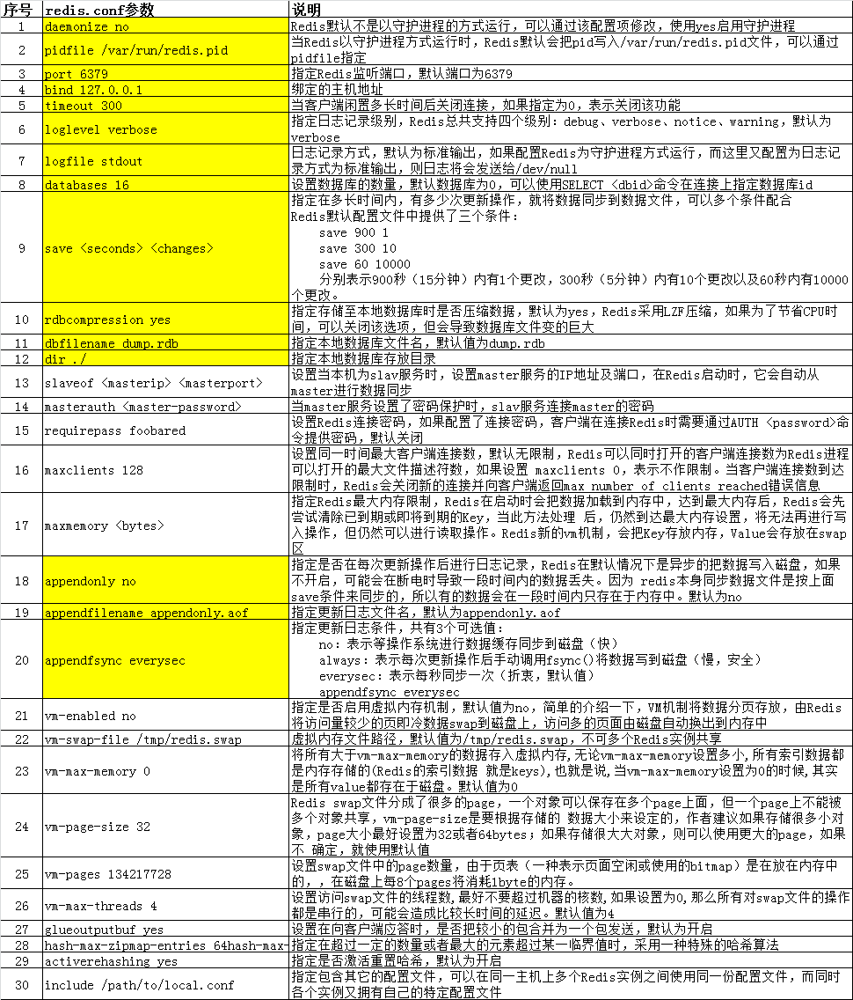
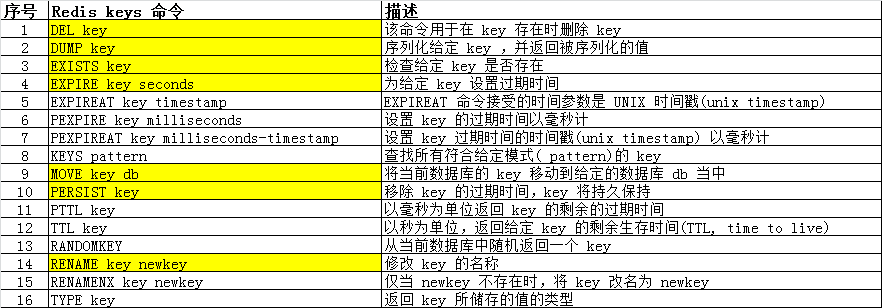
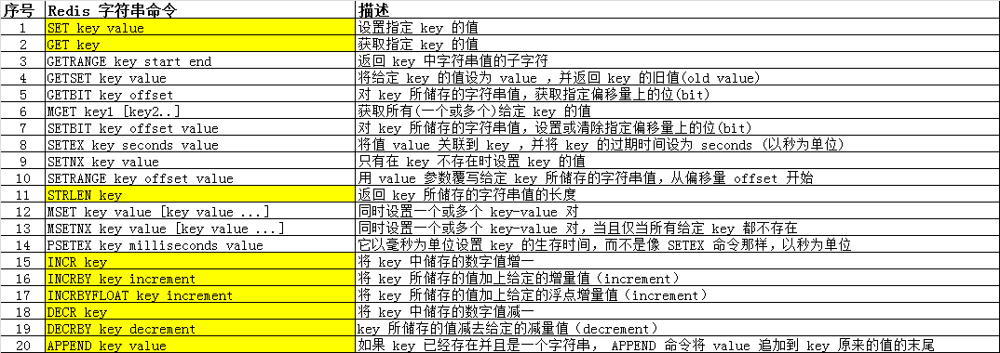
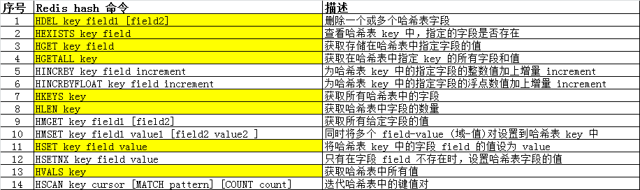
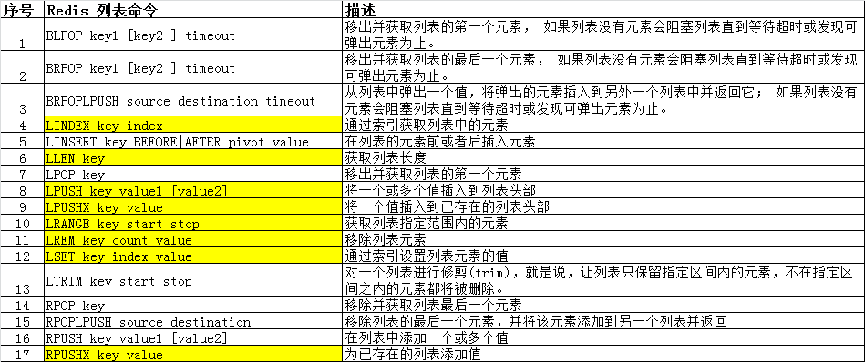
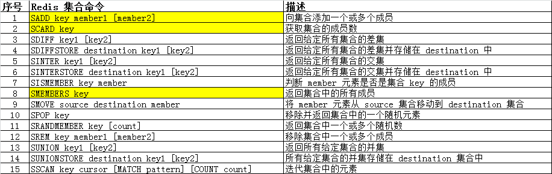
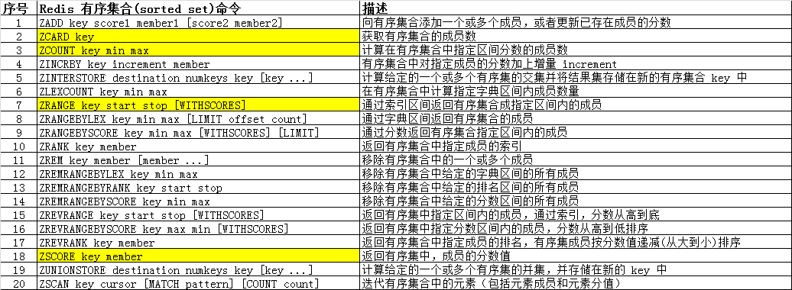

### 什么是 Redis
「[Redis](https://redis.io/)」是一个开源的使用C语言编写、支持网络、可基于内存亦可持久化的日志型、Key-Value数据库，并提供多种语言的 API。

### Redis 的特点
- 支持数据持久化
> Redis 可以将内存中的数据保存在磁盘中，重启的时候可以再次加载进行使用。
>   
> 方式一（RDB）：根据指定的规则，定时周期性的把内存中更新的数据写入到磁盘里。  
> RDB的方式是通过快照（snapshot）完成，当符合规则时 Redis 会把内存的数据生成一个副本并存储在硬盘中，这个过程称之为“快照”。  
> 
> 方式二（AOF）：把修改的操作记录追加到文件里，记录每次对服务器写的操作,当服务器重启的时候会重新执行这些命令来恢复原始的数据。默认情况 Redis 没有开启 AOF 方式，可以通过 appendonly 命令来启用，如：appendonly yes。  
> 
> 两种方式的区别：RDB 方式性能较高，但是可能会引起一定程度的数据丢失，AOF 方式正好相反。  

- 支持主从复制
> 主机会自动将数据同步到从机，可以进行读写分离

- 丰富的数据类型
> Redis 不仅仅支持简单的key-value类型的数据，同时还提供 list，set，zset，hash 等数据结构的存储。  

- 单进程单线程高性能服务器
> 启动一个实例只能用一个 CPU，所以用 Redis 可以用多个实例，一个实例用一个 CPU 以便于提高效率。  

- crash safe 和 recovery slow
> Redis 崩溃后，数据相对安全，但是恢复起来比较缓慢，所以生产环境不建议一个 Redis 实例数据太多{（20-30）G 数据内存对应（96-128）G 实际内存）}，这种 20%-23% 的比例比较合适，因为磁盘读到内存的恢复时间也很慢，可以使用 ssd 磁盘来提高磁盘读取速度。  

- 性能极高
> 读写性能优异，Redis 单机 qps（每秒的并发）可以达到的速度是 110000 次/s，写的速度是 81000 次/s，适合小数据量高速读写访问。  

- Redis 的原子性
> Redis 的所有操作都是原子性的，意思是要么成功执行要么失败完全不执行。  
> 单个操作是原子性的。  
> 多个操作也支持事务，即原子性，通过 MULTI 和 EXEC 指令包起来。  
> 
> Redis 支持数据的备份即 master-slave 模式的数据备份。  
> Redis 还支持 publish/subscribe, key 过期。

### Redis 的缺陷与陷阱
> 1、Redis 不具备自动容错和恢复功能，主机从机的宕机都会导致前端部分读写请求失败，需要等待机器重启或者手动切换前端的 IP 才能恢复  
> 2、主机宕机，宕机前有部分数据未能及时同步到从机，切换 IP 后还会引入数据不一致的问题，降低了系统的可用性  
> 3、Redis 较难支持在线扩容，在集群容量达到上限时在线扩容会变得很复杂。为避免这一问题，运维人员在系统上线时必须确保有足够的空间，这对资源造成了很大的浪费  
> 4、内存管理开销大（不要超过物理内存的 3/5）  

### Redis 的安装
```bash
wget http://download.redis.io/releases/redis-4.0.9.tar.gz
tar -zxvf redis-4.0.9.tar.gz -C /usr/local/
cd redis-4.0.9
# 若编译失败，重新执行 make MALLOC=libc
make

# 启动 redis 服务
./redis-server
# 启动 redis 客户端，一般 ./redis-cli 即可
./redis-cli -h 127.0.0.1 -p 6379 -a "password" 
```

### Redis 的配置
Redis 的配置文件位于 Redis 的安装目录下，名为 redis.conf（Ubuntu 下，一般在 /etc/redis/6379.conf）。  
```bash
# 在 Redis 客户端下，使用命令获取所有配置项
config get *
# 获取某一项配置 
config get loglevel

# 修改配置
config set loglevel debug
```

> 配置参数大致如下  


### Redis 的五种数据类型及使用
- key-value  
> Redis key 值是二进制安全的
> 
> 太长的键值不好，比如 1024 字节的键值就不好，不仅因为消耗内存，在数据中查找这类键值的成本也很高  
> 太短的键值通常也不好，键值的设置应该像变量命名一样，能标识出它的含义  
> 最好坚持一种模式，比如 “user:666:password”  
> key 建议 10 到 20 个字符  
> value 建议 string 不要超过 2K，set 元素不要超过 5000 字节，如果内容长度太多，可以根据内容长度规划不同的实例端口  
>   
```bash
# 客户端和服务器连接正常
redis> ping
PONG
# 设置 key-value
redis> set name redis
OK
# 获取 key
redis> get name
"redis"
# 判断 key 是否存在
redis> exists name
(integer) 1
# 设置过期时间，过期后 key 对应的 value 变为 nil
redis> expire name 3600
(integer) 1
# 获取所有 key
redis> keys *
1) "name"
# 重命名 key
redis> rename name NAME
OK
# 查看 key 的类型
redis> type NAME
string
# 删除 key
redis> del NAME
(integer) 1
```

- 字符串（string）  
> Redis 最简单而且最常用的数据类型之一，字符串（string）类型也可以用来存储数字，并支持对数字的加减操作  
> 应用场景：流量访问限制、投票统计、用户 token 和 uid 的对应关系，构建缓存系统  
>    
```bash
# 查看帮助（查看某个命令 help COMMAND）
redis> help @string

# 设置
redis> set name redis
OK
# 获取长度
redis> strlen name
(integer) 5
# 追加字符串
redis> append name 2018
(integer) 9
redis> get name
"redis2018"

# 使用数字
redis> set age 18
OK
# 自增 1
redis> incr age
(integer) 19
# 增加 2
redis> incrby age 2
(integer) 21
# 自减 1
redis> decr age
(integer) 20
# 减去 2
redis> decrby age 2
(integer) 18
```

- 哈希（hash）  
> Redis hash 是一个 string 类型的 field 和 value 的映射表，hash 特别适合用于存储对象，能够存储 key 对多个属性的数据  
> 应用场景： 存储用户信息，存储结构化对象数据  
>    
```bash
# 查看帮助（查看某个命令 help COMMAND）
redis> help @hash

# 设置 hash key 的 field 和 value
redis> hset user name redis
(integer) 1
redis> hset user age 18
(integer) 1
# 获取 hash key 的 field 对应的 value
redis> hget user name
"redis"
# 获取 hash key 所有的 field
redis> hkeys user
1) "name"
2) "age"
# 获取 hash key 所有的 value
redis> hvals user
1) "redis"
2) "18"
# 获取 hash key 的 field 数量
redis> hlen user
(integer) 2
# 获取 hash key 所有的 field 和 value
redis> hgetall user
1) "name"
2) "redis"
3) "age"
4) "18"
# 扫描 hash key 的键值对
redis> hscan user 0
1) "0"
2) 1) "name"
   2) "redis"
   3) "age"
   4) "18"
```

- 列表（list）  
> Redis 列表就是有序元素的序列，比如 1,2,3,4,5,6 就是一个列表；  
> Redis 列表是简单的字符串列表，按照插入顺序排序，可以在头部或尾部添加元素    
> Redis 列表是基于 Linked List 实现（用数组实现的 List 和用 Linked List 实现的 List，在属性方面大不相同）  
> 这意味着即使在一个列表中有数百万个元素，在头部或尾部添加一个元素的操作，其时间复杂度也是常数级别的  
> 也就是说，用 LPUSH 命令在十个元素的列表头部添加新元素，和在千万元素列表头部添加新元素的速度相同  
> 应用场景：消息队列  
>    
```bash
# 查看帮助（查看某个命令 help COMMAND）
redis> help @list

# 设置列表元素（可以 1 个或多个元素）
redis> lpush demo 1 2 3
(integer) 3
# 查看列表长度
redis> llen demo
(integer) 3
# 获取指定范围的元素
redis> lrange demo 0 1
1) "3"
2) "2"
# 移除一个元素
redis> lpop demo
"3"
# 移除指定个数的元素
redis> lrem demo 2 2
(integer) 1
redis> lrange demo 0 3
1) "1"
```

- 集合（set）
> Redis 集合是 string 类型的无序集合  
> 集合成员是唯一的，这就意味着集合中不能出现重复的数据  
> 应用场景：关注和共同关注  
>    
```bash
# 查看帮助（查看某个命令 help COMMAND）
redis> help @set

# 添加集合元素（可以 1 个或多个元素）
redis> sadd lang english japanese
(integer) 2
# 获取集合元素个数
redis> scard lang
(integer) 2
# 判断集合是否存在某元素
redis> sismember lang chinese
(integer) 0
# 获取集合所有元素
redis> smembers lang
1) "japanese"
2) "english"
```

- 有序集合（sorted set）
> Redis 有序集合和集合一样也是 string 类型元素的集合，且不允许重复的成员  
> 不同的是，Redis 有序集合每个元素都会关联一个 double 类型的分数，redis 正是通过分数来为集合中的成员进行从小到大的排序  
> 应用场景： 排行榜，带权重的消息队列  
>    
```bash
# 查看帮助（查看某个命令 help COMMAND）
redis> help @sorted_set

# 添加有序集合元素
redis> zadd country 1 china
(integer) 1
redis> zadd country 2 US
(integer) 1
redis> zadd country 3 japan
(integer) 1
# 查看集合元素的分数
redis> zscore country china
"1"
# 查看集合
redis> zrange country 0 3
1) "china"
2) "US"
3) "japan"
# 逆向查看集合
redis> zrevrange country 0 3
1) "japan"
2) "US"
3) "china"
# 根据分数范围获取集合元素
redis> zrangebyscore country 2 3
1) "US"
2) "japan"
```

### Redis 的集群
Redis 有 3 种集群策略

- 主从
> 1 台机器可写，作为主；另外 N 台可读，作为从，类似于 MySQL 的主从复制，不过 Redis 没有 BINLOG 机制。  
> 为了使在部分节点失败或者大部分节点无法通信的情况下集群仍然可用，所以集群使用了主从复制模型，每个节点都会有 N-1 个复制品。  

- 哨兵
> 增加一台机器作为哨兵，监控 3 台主从机器  
> 当主节点挂机的时候，机器内部进行选举，从集群中从节点里指定一台机器升级为主节点，从而实现高可用  
> 当主节点恢复的时候，加入到从节点中继续提供服务

- 集群
> Redis3.0 以后增加了集群的概念，可以实现多主多从结构，实现正真的高可用

### Redis 与 PHP
「[phpredis](https://github.com/phpredis/phpredis)」是使用 c 写的 php 扩展，「[predis](https://github.com/nrk/predis)」是使用纯 php 写的第三方包。  
在性能上，当然是 phpredis 扩展更好一些。  

phpredis 扩展和 predis 在连接的保持上是有区别的
> phpredis 在扩展中使用 c 可以保持 php-fpm 到 redis 的长连接，所以一个 php-fpm 进程上的多个请求是复用同一个连接的  
> phpredis 的 pconnect 就是长连接方式  
> predis 是使用 php 的 socket 来连接 redis，所以需要每次请求连接 redis  

phpredis 和 predis 的性能差距没有跨数量级。  
根据业务场景，如果业务非常依赖 redis，并且单机 qps 需要支持的比较大，建议使用 phpredis；如果是小规模业务，建议使用 predis（laravel 官方推荐使用，便捷）。  

### Redis 安全
Redis 在生产环境的使用过程中可能存在一些安全隐患：  
1、禁止执行高危命令，如 FLUSHALL，以免被恶意清空所有数据；
2、创建单独的非 ROOT 用户执行 Redis 服务，并设置禁止登录；
3、启用密码验证（redis.conf 的 requirepass 配置）；
4、禁止外网访问 Redis，只允许内网访问，必要的话还可以修改监听端口（redis.conf 的 bind 配置）

### Redis 疑难杂症
- predis 与 phpredis 的区别
> predis 是纯 php 实现的，通过 socket 与 redis 服务器通信，使用时只需要通过 composer 加载依赖，无需额外安装扩展  
> phpredis 是基于 c 语言开发的 PHP 扩展，因此需要安装对应的扩展才能使用  
> 功能上两者差不多，性能上后者略胜一筹，但由于与 redis 通信的主要瓶颈还是在网络 IO 上，所以除非性能要求比较高的场景，否则两者都可以使用，使用 predis 的话不需要安装额外扩展，更简单一些，这也是 laravel 默认使用 predis 的原因。

- redis 与 memcache 对比
> 数据类型：memcached 只支持以 key-value 形式访问存取数据，在内存中维护一张巨大的哈希表，从而保证所有查询的时间复杂度是 O(1)；redis 则支持除 key-value 之外的其他数据类型，比如 list、set、hash、zset 等，用来实现队列、有序集合等更复杂的功能；  
> 性能：memcached  支持多线程，可以利用多核优势，不过也引入了锁，redis 是单线程，在操作大数据方面，memcached 更有优势，处理小数据的时候，redis 更优；  
> 数据持久化：redis 支持数据同步和持久化存储，memcached 不支持，意味着一旦机器重启所有存储数据将会丢失；  
> 数据一致性：memcached 提供了 cas 命令来保证，而 redis 提供了事务的功能，可以保证一串命令的原子性，中间不会被任何操作打断。  
> 分布式：memcached 本身不支持分布式存储，只能在客户端通过一致性哈希算法实现，属于客户端实现；redis 更倾向于在服务端构建分布式存储，并且 redis 本身就对此提供了支持，即 redis cluster。  

- 缓存雪崩
> Redis 不可能把所有的数据都缓存起来 (内存昂贵且有限)，所以 Redis 需要对数据设置过期时间，并采用的是惰性删除 + 定期删除两种策略对过期键删除。  
> Redis 对过期键的策略 + 持久化。  
> 如果缓存数据设置的过期时间是相同的，并且 Redis 恰好将这部分数据全部删光了。这就会导致在这段时间内，这些缓存同时失效，全部请求到数据库中。这就是缓存雪崩。  
> Redis 挂掉了，请求全部走数据库。对缓存数据设置相同的过期时间，导致某段时间内缓存失效，请求全部走数据库。缓存雪崩如果发生了，很可能就把我们的数据库搞垮，导致整个服务瘫痪！  
> 
> 对于 “对缓存数据设置相同的过期时间，导致某段时间内缓存失效，请求全部走数据库” ，解决方法是在缓存的时候给过期时间加上一个随机值，这样就会大幅度的减少缓存在同一时间过期。  
> 对于 “Redis 挂掉了，请求全部走数据库” 这种情况，我们可以有以下的思路：  
> 事发前：实现 Redis 的高可用 (主从架构 + Sentinel 哨兵 或者 Redis Cluster)，尽量避免 Redis 挂掉这种情况发生。  
> 事发中：万一 Redis 真的挂了，我们可以设置本地缓存 (ehcache)+ 限流 (hystrix)，尽量避免我们的数据库被干掉 (起码能保证我们的服务还是能正常工作的)。  
> 事发后：redis 持久化，重启后自动从磁盘上加载数据，快速恢复缓存数据。  
> 

  

  

- 缓存穿透
> 缓存穿透是指查询一个一定不存在的数据。由于缓存不命中，并且出于容错考虑，如果从数据库查不到数据则不写入缓存，这将导致这个不存在的数据每次请求都要到数据库去查询，失去了缓存的意义。缓存穿透如果发生了，也可能把我们的数据库搞垮，导致整个服务瘫痪！  
> 
> 由于请求的参数是不合法的 (每次都请求不存在的参数)，于是我们可以使用布隆过滤器(BloomFilter) 或者压缩 filter 提前拦截，不合法就不让这个请求到数据库层！  
> 当我们从数据库找不到的时候，我们也将这个空对象设置到缓存里边去。下次再请求的时候，就可以从缓存里边获取了。这种情况我们一般会将空对象设置一个较短的过期时间。  

  

- 缓存击穿  
> 缓存击穿，就是说某个 key 非常热点，访问非常频繁，处于集中式高并发访问的情况，当这个 key 在失效的瞬间，大量的请求就击穿了缓存，直接请求数据库，就像是在一道屏障上凿开了一个洞。  
> 
> 解决方式很简单，可以将热点数据设置为永远不过期；或者基于 redis or zookeeper 实现互斥锁，等待第一个请求构建完缓存之后，再释放锁，进而其它请求才能通过该 key 访问数据。

- 缓存与数据库读写一致问题
> 如果仅仅查询的话，缓存的数据和数据库的数据自然是没问题的。但是，当我们要更新的时候呢？各种情况很可能就造成数据库和缓存的数据不一致了。  
> 
> 从理论上说，只要我们设置了键的过期时间，我们就能保证缓存和数据库的数据最终是一致的。因为只要缓存数据过期了，就会被删除。随后读的时候，因为缓存里没有，就可以查数据库的数据，然后将数据库查出来的数据写入到缓存中。  
> 
> 除了设置过期时间，我们还需要做更多的措施来尽量避免数据库与缓存处于不一致的情况发生。  
> 一般来说，执行更新操作时，要么先操作数据库，再操作缓存；要么先操作缓存，再操作数据库。首先，要明确的是，无论我们选择哪个，我们都希望这两个操作要么同时成功，要么同时失败。所以，这会演变成一个分布式事务的问题。所以，如果原子性被破坏了，可能会有以下的情况：操作数据库成功了，操作缓存失败了；操作缓存成功了，操作数据库失败了。（如果第一步已经失败了，我们直接返回 Exception 出去就好了，第二步根本不会执行）   
> 
> 操作缓存也有两种方案：更新缓存和删除缓存。  
> 一般我们都是采取删除缓存缓存策略的，原因是在高并发环境下，无论是先操作数据库还是后操作数据库而言，如果加上更新缓存，那就更加容易导致数据库与缓存数据不一致问题(删除缓存会简单直接粗暴许多)；而且如果每次更新了数据库，都要更新缓存【这里指的是频繁更新的场景，这会耗费一定的性能】，倒不如直接删除掉。等再次读取时，缓存里没有，那我到数据库找，在数据库找到再写到缓存里边 (体现懒加载)。基于这两点，对于缓存在更新时，都是建议执行删除操作！  
> 那么，先删除缓存，再更新数据库：在高并发下表现不如意，在原子性被破坏时表现优异；先更新数据库，再删除缓存 (Cache Aside Pattern 设计模式)：在高并发下表现优异，在原子性被破坏时表现不如意。  
> 另外，删除缓存失败的解决思路：将需要删除的 key 发送到消息队列中；自己消费消息，获得需要删除的 key；不断重试删除操作，直到成功。  


