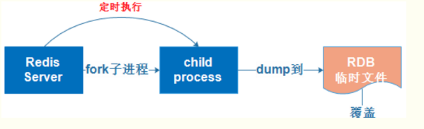

### 关于持久化
持久化是将数据（如内存中的对象）保存到可永久保存的存储设备中。  
从应用层理解，如果关闭 ( Close ) 你的应用然后重新启动则先前的数据依然存在；从系统层理解，如果关闭 ( Shutdown ) 你的系统（电脑）然后重新启动则先前的数据依然存在。  

持久化的主要应用是将内存中的对象存储在数据库中，或者存储在磁盘文件中、 XML 数据文件中等等。  

### Redis 持久化
Redis 与 Memcached 一样，为了保证效率，数据都是缓存在内存中，当你重启系统或者关闭系统后，缓存在内存中的数据都会消失殆尽，再也找不回来...为了让数据能够长期保存，就要将 Redis 放在缓存中的数据做持久化存储。  

Redis 设计之初就已经考虑持久化的问题：  
> 如果你只希望你的数据在服务器运行的时候存在，你也可以不使用任何持久化方式。  
> RDB 持久化方式，能够在指定的时间间隔能对你的数据进行快照存储。  
> AOF 持久化方式，记录每次对服务器写的操作，当服务器重启的时候会重新执行这些命令来恢复原始的数据，AOF 命令以 Redis 协议追加保存每次写的操作到文件末尾。Redis 还能对 AOF 文件进行后台重写，使得 AOF 文件的体积不至于过大。  
> 你也可以同时开启两种持久化方式，在这种情况下，当 redis 重启的时候会优先载入 AOF 文件来恢复原始的数据，因为在通常情况下 AOF 文件保存的数据集要比 RDB 文件保存的数据集要完整。  

#### Redis 持久化之 RDB
  

Redis 默认的持久化方式是 RDB ，并且默认是打开的。

RDB 是一个非常紧凑的文件，它保存了某个时间点的数据集，非常适用于数据集的备份，比如你可以在每个小时报保存一下过去 24 小时内的数据，同时每天保存过去 30 天的数据，这样即使出了问题你也可以根据需求恢复到不同版本的数据集。由于 RDB 是一个紧凑的单一文件，很方便传送到另一个远端数据中心，所以非常适用于灾难恢复。  

RDB 在保存 RDB 文件时，父进程唯一需要做的就是 fork 出一个子进程，接下来的工作全部由子进程来做，父进程不需要再做其他 IO 操作，所以 RDB 持久化方式可以最大化 Redis 的性能。  

与 AOF 相比，在恢复大的数据集的时候，RDB 方式会更快一些。  

当 Redis 需要保存 dump.rdb 文件时， 服务器执行以下操作  
> 1、Redis 调用 forks，同时拥有父进程和子进程  
> 2、子进程将数据集写入到一个临时 RDB 文件中  
> 3、当子进程完成对新 RDB 文件的写入时，Redis 用新 RDB 文件替换原来的 RDB 文件，并删除旧的 RDB 文件（写时复制 copy-on-write 机制）  

RDB 的保存方式分为主动保存与被动保存。  
主动保存可以在 redis-cli 中输入 save 或 bgsave 即可。  
`注意：如果 rdb 被动配置已打开，shutdown 命令会保证服务器正常关闭而不丢失任何数据（即执行保存）`
> save 是同步操作，bgsave 是异步操作。  
> 
> save 直接调用 rdbSave 方法 ，阻塞 Redis 主进程，直到保存完成为止。在主进程阻塞期间，服务器不能处理客户端的任何请求。  
> bgsave 则 fork 出一个子进程，子进程负责调用 rdbSave ，并在保存完成之后向主进程发送信号，通知保存已完成。因为 rdbSave 在子进程被调用，所以 Redis 服务器在 bgsave 执行期间仍然可以继续处理客户端的请求。

被动保存需要满足配置文件中设定的触发条件，触发条件可以在 redis.conf 中看到。  
```
# 条件：比如服务器在 900 秒之内，对数据库进行了至少 1 次修改（条件可以有多个）
# 满足触发条件后，数据就会被保存为快照
# RDB 方式的数据完整性是不可靠的，除非宕机的那一刻正好是满足触发条件的条数
save 900 1 
# 如果要关闭被动保存的 rdb（主动关闭不受配置文件的影响）
save ""
```
触发保存条件后，会在指定的目录生成一个名为 dump.rdb 的文件，等到下一次启动 Redis 时，Redis 会去读取该目录下的 dump.rdb 文件，将里面的数据恢复到 Redis。  
```bash
redis-cli
# 获取配置目录（rdb 文件就在里面）
redis> config get dir
```

#### Redis 持久化之 AOF
  
AOF 文件是一个只进行追加的日志文件，所以不需要写入 seek, 即使由于某些原因 (磁盘空间已满，写的过程中宕机等等) 未执行完整的写入命令，你也可使用 redis-check-aof 工具修复这些问题。  

Redis 可以在 AOF 文件体积变得过大时，自动地在后台对 AOF 进行重写： 重写后的新 AOF 文件包含了恢复当前数据集所需的最小命令集合。 整个重写操作是绝对安全的，因为 Redis 在创建新 AOF 文件的过程中，会继续将命令追加到现有的 AOF 文件里面，即使重写过程中发生停机，现有的 AOF 文件也不会丢失。 而一旦新 AOF 文件创建完毕，Redis 就会从旧 AOF 文件切换到新 AOF 文件，并开始对新 AOF 文件进行追加操作。  

AOF 文件有序地保存了对数据库执行的所有写入操作， 这些写入操作以 Redis 协议的格式保存， 因此 AOF 文件的内容非常容易被人读懂， 对文件进行分析（parse）也很轻松。 导出（export） AOF 文件也非常简单： 举个例子， 如果你不小心执行了 FLUSHALL 命令， 但只要 AOF 文件未被重写， 那么只要停止服务器， 移除 AOF 文件末尾的 FLUSHALL 命令， 并重启 Redis ， 就可以将数据集恢复到 FLUSHALL 执行之前的状态。

AOF 重写和 RDB 创建快照一样，都巧妙地利用了写时复制机制  
> 1、Redis 执行 fork ()，现在同时拥有父进程和子进程  
> 2、子进程开始将新 AOF 文件的内容写入到临时文件  
> 3、对于所有新执行的写入命令，父进程一边将它们累积到一个内存缓存中，一边将这些改动追加到现有 AOF 文件的末尾，这样即使在重写的中途发生停机，现有的 AOF 文件也还是安全的  
> 4、当子进程完成重写工作时，它给父进程发送一个信号，父进程在接收到信号之后，将内存缓存中的所有数据追加到新 AOF 文件的末尾  
> 5、现在 Redis 原子地用新文件替换旧文件，之后所有命令都会直接追加到新 AOF 文件的末尾  

AOF 的保存开启需要在 redis.conf 设置 appendonly yes 即可，保存的文件名默认为 appendonly.aof（配置项 appendfilename，可修改）。aof 的几种同步方式配置如下  
```
appendfsync everysec  # 每秒钟同步一次，该策略为 AOF 的缺省策略 
appendfsync always  # 每次有数据修改发生时都会写入 AOF 文件（安全但是费时） 
appendfsync no  # 从不同步，高效但是数据不会被持久化 
```

如果需要在不重启的情况下切换 RDB 为 AOF，首先需要为最新的 dump.rdb 文件创建一个备份、将备份放到一个安全的地方，然后执行如下命令
```bash
# 开启 AOF 功能
# Redis 会阻塞直到初始 AOF 文件创建完成为止
# 之后 Redis 会继续处理命令请求， 并开始将写入命令追加到 AOF 文件末尾
redis-cli config set appendonly yes

# 关闭 RDB 功能
redis-cli config set save ""
```
记得需要修改 redis.conf 的相应配置，防止服务器重启之后回到 RDB 方式。  

#### Redis 持久化方式对比及选择
RDB 与 AOF 的优点对比：  
> RDB 方式可以保存过去一段时间内的数据，并且保存结果是一个单一的文件，可以将文件备份到其他服务器，并且在恢复大量数据的时候，RDB 方式的速度会比 AOF 方式的恢复速度要快。  
> AOF 方式默认每秒钟备份 1 次，频率很高，它的操作方式是以追加的方式记录日志而不是数据，并且它的重写过程是按顺序进行追加，所以它的文件内容非常容易读懂。可以在某些需要的时候打开 AOF 文件对其编辑，增加或删除某些记录，最后再执行恢复操作。

RDB 与 AOF 的缺点对比：  
> 如果你希望在 Redis 意外停止工作（例如电源中断）的情况下丢失的数据最少的话，那么 RDB 不适合你。虽然你可以配置不同的 save 时间点，但是 Redis 要完整的保存整个数据集是一个比较繁重的工作，隔几分钟做一次完整保存，一旦宕机就有可能丢失几分钟的数据。  
> RDB 需要经常 fork 子进程来保存数据集到硬盘上，当数据集比较大的时候，fork 的过程是非常耗时的，可能会导致 Redis 在一些毫秒级内不能响应客户端的请求。如果数据集巨大并且 CPU 性能不是很好的情况下，这种情况会持续 1 秒，AOF 也需要 fork, 但是你可以调节重写日志文件的频率来提高数据集的耐久度。  
> RDB 由于备份频率不高，所以在恢复数据的时候有可能丢失一小段时间的数据，而且在数据集比较大的时候有可能对毫秒级的请求产生影响。  
> 
> 对于相同的数据集来说，AOF 文件的体积通常要大于 RDB 文件的体积。  
> 根据所使用的 fsync 策略，AOF 的速度可能会慢于 RDB。 在一般情况下， 每秒 fsync 的性能依然非常高， 而关闭 fsync 可以让 AOF 的速度和 RDB 一样快， 即使在高负荷之下也是如此。 不过在处理巨大的写入载入时，RDB 可以提供更有保证的最大延迟时间（latency）。  
> AOF 的文件体积比较大，而且由于保存频率很高，所以整体的速度会比 RDB 慢一些，但是性能依旧很高。  

持久化的方式选择建议：  
对于企业级的中大型应用，如果不想牺牲数据完整性但是又希望保持高效率，那么你应该同时使用 RDB 和 AOF 两种方式；  
如果你不打算耗费精力在这个地方，只需要保证数据完整性，那么优先考虑使用 AOF 方式；  
RDB 方式非常适合大规模的数据恢复，如果业务对数据完整性和一致性要求不高，RDB 是很好的选择。  

确保你的数据有完整的备份，磁盘故障、节点失效等问题问题可能让你的数据消失不见， 不进行备份是非常危险的。    
Redis 对于数据备份是非常友好的， 因为你可以在服务器运行的时候对 RDB 文件进行复制： RDB 文件一旦被创建， 就不会进行任何修改。 当服务器要创建一个新的 RDB 文件时， 它先将文件的内容保存在一个临时文件里面， 当临时文件写入完毕时， 程序才使用 rename(2) 原子地用临时文件替换原来的 RDB 文件。无论何时，复制 RDB 文件都是绝对安全的。  
> 1、创建一个定期任务（ cron job ）， 每小时将一个 RDB 文件备份到一个文件夹， 并且每天将一个 RDB 文件备份到另一个文件夹  
> 2、确保快照的备份都带有相应的日期和时间信息， 每次执行定期任务脚本时， 使用 find 命令来删除过期的快照： 比如说你可以保留最近 48 小时内的每小时快照， 还可以保留最近一两个月的每日快照  
> 3、至少每天一次，将 RDB 备份到你的数据中心之外， 或者至少是备份到你运行 Redis 服务器的物理机器之外  

`备注：密码持久化，修改 redis.conf 的配置项 requirepass zxc9527，重启 redis 服务即可 `