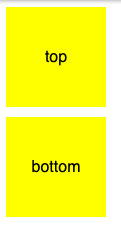
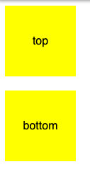
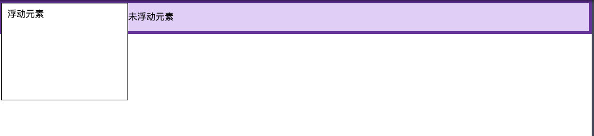
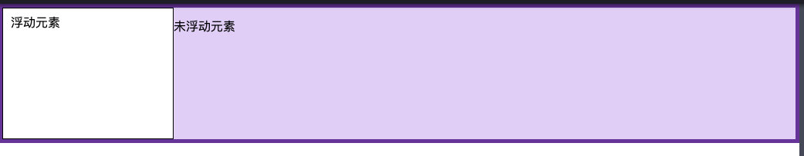

### BFC 是什么
块格式化上下文（Block Formatting Context，BFC） 是 Web 页面的可视化 CSS 渲染的一部分，是块盒子的布局过程发生的区域，也是浮动元素与其他元素交互的区域。  

它是一个独立的渲染区域，只有块级元素参与，它规定了内部的 Block level Box 如何布局，并且与这个区域外部好不相干。  

### BFC 能解决什么问题
1、浮动定位  
2、消除外边距折叠  
3、清除浮动  
4、自适应多栏布局  
5、...  

### BFC 怎么创建
下列方式会创建 BFC：  
1、根元素或包含根元素的元素  
2、浮动元素 (float 不为 none)  
3、绝对定位元素 (position 为 absolute 或者 fixed)  
4、display 为 inline-block,table-cell,table-caption  
5、overflow 值不为 visible  
6、弹性元素 (flex 布局)  
7、网格元素 (grid 布局)

### BFC 的约束规则
> 内部的 Box 会在垂直方向上一个接一个的放置  
> 垂直方向上的距离由 margin 决定。（完整的说法是：属于同一个 BFC 的两个相邻 Box 的 margin 会发生重叠（塌陷），与方向无关。）  
> 每个元素的左外边距与包含块的左边界相接触（从左向右），即使浮动元素也是如此。（这说明 BFC 中子元素不会超出他的包含块，而 position 为 absolute 的元素可以超出他的包含块边界）  
> BFC 的区域不会与 float 的元素区域重叠   
> 计算 BFC 的高度时，浮动子元素也参与计算  
> BFC 就是页面上的一个隔离的独立容器，容器里面的子元素不会影响到外面元素，反之亦然  
> 

### BFC 的应用
#### 防止 margin 重叠 
```html
<body>
	<p>top</p>
	<p>bottom</p>
</body>

<style>
p {
	width: 100px;
	height: 100px;
	background: yellow;
	line-height: 100px;
	margin: 10px;
	text-align: center;
}
</style>
```
两个 div 中间的间距为 10px, 而不是 20px, 因为它们处于同一个 BFC，效果如下：  


解决方案是给第二个 div 再包一层 div，设置其 overflow 属性，使它们处于不同的 BFC：
```html
<body>
	<p>top</p>
	<div>
		<p>bottom</p>
	</div>
</body>
<style>
p {
	width: 100px;
	height: 100px;
	background: yellow;
	line-height: 100px;
	margin: 10px;
	text-align: center;
}

div	{
	overflow: auto;
}

</style>
```
效果如下：  
  

#### 让浮动内容与周围内容等高
如下例子：
```html
<div class="box">
    <div class="float">浮动元素</div>
    <p>未浮动元素</p>
</div>
<style>
.box {
    background-color: rgb(224, 206, 247);
    border: 5px solid rebeccapurple;
}

.float {
    float: left;
    width: 200px;
    height: 150px;
    background-color: white;
    border:1px solid black;
    padding: 10px;
}      

</style>
```
效果如下：  
  

由于浮动，使得浮动元素的高度高于旁边的元素，解决方式为使父 box 生成一个 BFC，如下：  
```html
<div class="box">
    <div class="float">浮动元素</div>
    <p>未浮动元素</p>
</div>
<style>
.box {
    background-color: rgb(224, 206, 247);
    border: 5px solid rebeccapurple;
    overflow: auto;
}

.float {
    float: left;
    width: 200px;
    height: 150px;
    background-color: white;
    border:1px solid black;
    padding: 10px;
}      

</style>
```
效果如下：  
  

### BFC 与 清除浮动
http://www.cnblogs.com/dolphinX/p/3508869.html
http://nicolasgallagher.com/micro-clearfix-hack/
https://github.com/zuopf769/notebook/blob/master/fe/%E6%B8%85%E9%99%A4%E6%B5%AE%E5%8A%A8%E5%92%8CBFC/README.md

