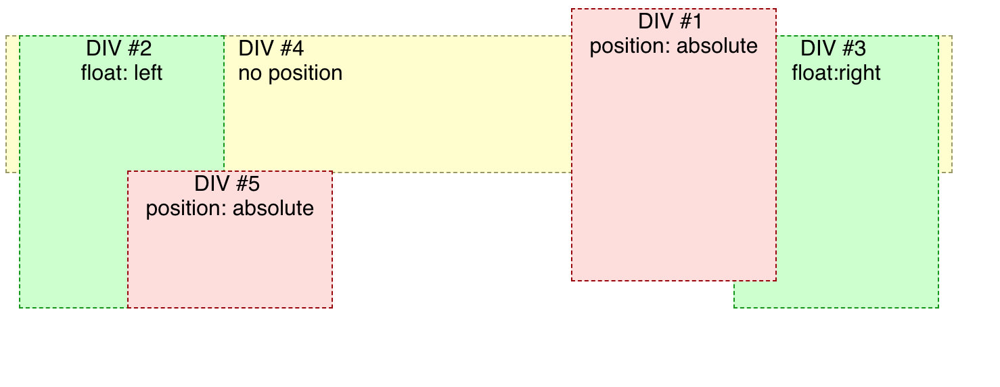
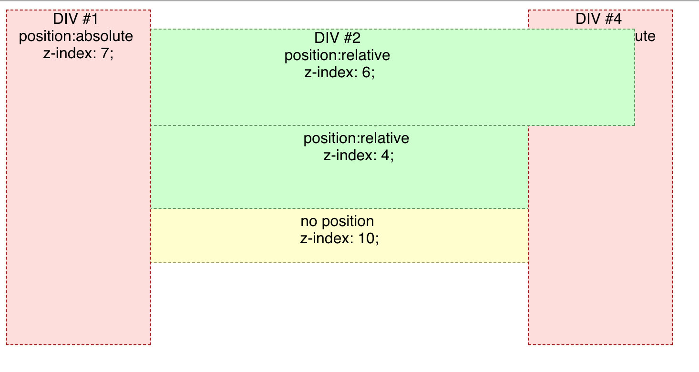

### z-index 是什么
html 中页面元素的布局非常复杂，元素可以并列，也可以层叠。  
z-index 是用来控制元素重叠时堆叠顺序的属性。z-index 属性适用于已经定位的元素（即 position 不为 static 的元素）。  

### z-index 重点概念：堆叠上下文
堆叠上下文（stacking content），在一个页面中可能有多个堆叠上下文，每个页面上的元素都只属于一个堆叠上下文，元素的 z-index 属性也只描述同一个堆叠上下文中 "z 轴" 的层级表示，不同堆叠上下文的元素无法通过 z-index 来控制元素的层叠。  

###  z-index 的取值
z-index 的默认值是 auto，当页面生成一个新的元素时，如果不显式地设置它的 z-index 值，它就不会自己产生一个新的 stacking content，而是处于和父元素相同的 stacking content 中。  

z-index 的值可以为 inherit，表示继承父级的属性。  

​z-index 的值也可以设置为整数值，甚至可以设置为负值，当元素的 z-index 值设置为整数时（包括 0），它就会产生一个自己的 stacking content，它的父元素的 z-index 值就不会和它的 z-index 值做比较。  

### 不使用 z-index 的情况
页面元素在页面中的布局是流式的，即从上到下，从左到右排布，而堆叠顺序是从下到上的，也就是说一个元素 A 先于另一个元素 B 出现，那么 A 就是处于 B 之下的（如果两者有重叠的部分，A 就会被 B 覆盖），另一个关注点是非定位元素（即不显式地设置 position 的元素）总是先于定位元素（显式地设置 position 的元素）渲染的，所以它始终是在定位元素之下的，与在 HTML 中出现的顺序无关。  

比如 [在 CODEPEN 中打开](https://codepen.io/louzhedong/pen/aQYjVP)：  
```html
<body>
	<div class="abs1">
	<span>DIV #1</span>
	<br>
	position:absolute
</div>
<div class="rel1">
	<span>DIV #2</span>
	<br>
	position:relative
</div>
<div class="rel2">
	<span>DIV #3</span>
	<br>
	position:relative
</div>
<div class="abs2">
	<span>DIV #4</span>
	<br>
	position:absolute
</div>
<div class="normal">
	<span>DIV #5</span>
	<br>
	no position
</div>
</body>
<style>
body {
	width: 50%;
	position: relative;
}
div {
	text-align: center;
	opacity: 1;
}

.normal {
	height: 70px;
  border: 1px dashed #999966;
  background-color: #ffffcc;
  margin: 0px 50px 0px 50px;
}

.rel1 {
	height: 100px;
  position: relative;
  top: 30px;
  border: 1px dashed #669966;
  background-color: #ccffcc;
  margin: 0px 50px 0px 50px;
}

.rel2 {
	height: 100px;
  position: relative;
  top: 15px;
  left: 20px;
  border: 1px dashed #669966;
  background-color: #ccffcc;
  margin: 0px 50px 0px 50px;
}

.abs1 {
        position: absolute;
        width: 150px;
        height: 350px;
        top: 10px;
        left: 10px;
        border: 1px dashed #990000;
        background-color: #ffdddd;
    }

  .abs2 {
        position: absolute;
        width: 150px;
        height: 350px;
        top: 10px;
        right: 10px;
        border: 1px dashed #990000;
        background-color: #ffdddd;
    }
</style>
```
效果如下：  
  

可以看到，DIV \#5 未显式地设置 position 的值，因此即便它在 HTML 中最后出现的，但它的层级却是最低的，被其他所有元素给覆盖。DIV \#1\~\#4 都设置了 position 的值，他们的层叠顺序取决于在 HTML 中出现的顺序。  

### 浮动堆叠顺序
在页面布局中有这么一种情况，即浮动，那么浮动的元素层叠规则是怎么样的呢。浮动元素的层叠位置是介于非定位元素与定位元素之间的，遵循下面一系列的层叠规则。  

> 根元素（即 HTML 元素）的背景和 border  
> 正常流中非定位后代元素（这些元素顺序按照 HTML 文档出现顺序）  
> 浮动元素 (浮动元素之间是不会出现 z-index 重叠的)  
> 正常流中 inline 后代元素  
> 已定位后代元素（这些元素顺序按照 HTML 文档出现顺序）  

比如 [在 CODEPEN 中打开](https://codepen.io/louzhedong/pen/vQRavL)： 
```html
<body>
	<div class="abs1">
		<span>DIV #1</span>
		<br>
		position: absolute
	</div>
	<div class="float1">
		<span>DIV #2</span>
		<br>
		float: left
	</div>
	<div class="float2">
		<span>DIV #3</span>
		<br>
		float:right
	</div>
	<div class="normal">
		<span>DIV #4</span>
		<br>
		no position
	</div>
	<div class="abs2">
		<span>DIV #5</span>
		<br>
		position: absolute
	</div>
</body>
<style>
body {
	width: 50%;
	position: relative;
}

div {
	text-align: center;
}
.abs1 {
	position: absolute;
  width: 150px;
  height: 200px;
  top: 10px;
  right: 140px;
  border: 1px dashed #990000;
  background-color: #ffdddd;
}
.float1{
  margin: 0px 10px 0px 20px;
  float: left;
  width: 150px;
  height: 200px;
  border: 1px dashed #009900;
  background-color: #ccffcc;
}

 .float2 {
   margin: 0px 20px 0px 10px;
   float: right;
   width: 150px;
   height: 200px;
   border: 1px dashed #009900;
   background-color: #ccffcc;
 }

.normal {
	 height: 100px;
   border: 1px dashed #999966;
   background-color: #ffffcc;
   margin: 0px 10px 0px 10px;
   text-align: left;
}

.abs2 {
	position: absolute;
  width: 150px;
  height: 100px;
  top: 130px;
  left: 100px;
  border: 1px dashed #990000;
  background-color: #ffdddd;
}
</style>
```

效果如下：  
  

可以看到，DIV \#1 在 HTML 中的位置位于 DIV \#2 和 DIV \#3 之前，但它并没有被它们给覆盖，因为浮动元素的层叠顺序是介于非定位元素与定位元素之间的。  

### z-index 堆叠  
z-index 只适用于已经定位的元素。  

比如 [在 CODEPEN 中打开](https://codepen.io/louzhedong/pen/PxRdqj)： 
```html
<body>
	<div class="abs1">
		<span>DIV #1</span>
		<br>
		position:absolute
		<br>
		z-index: 7;
</div>
<div class="rel1">
	<span>DIV #2</span>
	<br>
	position:relative
	<br>
	z-index: 6;
</div>
<div class="rel2">
	<span>DIV #3</span>
	<br>
	position:relative
	<br>
	z-index: 4;
</div>
<div class="abs2">
	<span>DIV #4</span>
	<br>
	position:absolute
	<br>
	z-index: 5;
</div>
<div class="normal">
	<span>DIV #5</span>
	<br>
	no position
	<br>
	z-index: 10;
</div>
</body>
<style>
body {
	width: 50%;
	position: relative;
}
div {
	text-align: center;
	opacity: 1;
}

.normal {
	height: 70px;
  border: 1px dashed #999966;
  background-color: #ffffcc;
  margin: 0px 50px 0px 50px;
	z-index: 10;
}

.rel1 {
	height: 100px;
  position: relative;
  top: 30px;
  border: 1px dashed #669966;
  background-color: #ccffcc;
  margin: 0px 50px 0px 50px;
	z-index: 6;
}

.rel2 {
	height: 100px;
  position: relative;
  top: 15px;
  left: 20px;
  border: 1px dashed #669966;
  background-color: #ccffcc;
  margin: 0px 50px 0px 50px;
	z-index: 4;
}

.abs1 {
  position: absolute;
  width: 150px;
  height: 350px;
  top: 10px;
  left: 10px;
  border: 1px dashed #990000;
  background-color: #ffdddd;
	z-index: 7;
}

.abs2 {
  position: absolute;
  width: 150px;
  height: 350px;
  top: 10px;
  right: 10px;
  border: 1px dashed #990000;
  background-color: #ffdddd;
	z-index: 5;
}
</style>
```

效果如下：  
   

可以看到，如果一个元素未设置 position，那么即使设置了 z-index 的值，也无法提高它的层级。  

产生层叠结构的原因：这些元素有特殊的属性触发它们生成了 stacking content，能生成 stacking content 的规则。  
> 根元素（即 HTML 元素）  
> 已定位元素（即绝对定位或相对定位）并且 z-index 不是默认的 auto。  
> a flex item with a z-index value other than "auto",  
> 元素 opacity 属性不为 1 (See the specification for opacity)  
> 元素 transform 不为 none  
> 元素 min-blend-mode 不为 normal  
> 元素 filter 属性不为 none  
> 元素 isolation 属性为 isolate  
> on mobile WebKit and Chrome 22+, position: fixed always creates a new stacking context, even when z-index is "auto" (See this post)  
> specifing any attribute above in will-change even you don't write themselves directly (See this post)  
> elements with -webkit-overflow-scrolling set to "touch"  

在堆叠上下文（stacking context）中 ，子元素的堆叠顺序还是按照上述规则。重点是，`子元素的 z-index 值只在父元素范围内有效`。子堆叠上下文被看做是父堆叠上下文中一个独立的模块，相邻的堆叠上下文完全没关系。