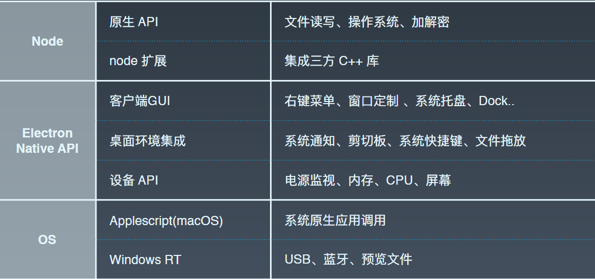

### Electron 是什么
Electron 是用 HTML、CSS 和 JavaScript 来构建跨平台桌面应用程序的一个开源库。  
Electron 将 Chromium 和 Node.js 合并到同一个运行环境中，也是就说 Electron 其实就是谷歌浏览器加 Node.js，但你使用 Electron 来装载界面的时候，你不用考虑浏览器的兼容性，只要你的前端项目能够在谷歌浏览器中正常运行，那么你的项目就可以正常地在 Electron 中运行。  

用 Electron 开发的桌面应用是可以跨平台的，在开发模式下或者是生成模式下同样的一套代码可以运行在不同平台，打包之后的应用可以运行在 Windows、Mac 和 Linux 等不同的平台上。  
Electron 中引入一个很重的机制，主进程和渲染进程，关于主进程和渲染进程。  
用 Electron 写项目的时候，你也不用担心代码的调试问题，Electron 中引入来谷歌浏览器的开发者工具，只需要一段很少的代码就在项目中配置谷歌浏览器调试工具。  
Electron 给我们提供来很丰富的 API，这些 API 在你编码的过程中将会给你减去不少的代码量。  

[Electron 官网](https://www.electronjs.org/)  
[Electron 文档](https://wizardforcel.gitbooks.io/electron-doc/content/)  

### 为什么 Electron

- 与 Web 开发的不同 —— IPC  
IPC（Inter-Process Communication）负责主进程和渲染进程的通信。  

- 与 Web 开发的不同 —— 原生能力  


- 与 Web 开发的不同 —— 只对 Chrome 负责  
⽆无浏览器器兼容问题，最新浏览器器 feature，No polyfill，支持 ES6/7 语法。  

- 学习 Electron 的好处：造工具，技术广度  
开发效率高，社区活跃，大型应用案例比如 Atom、Vs Code 等。  

- 什么时候考虑 Electron  
快速交付和试错，前端工程师充足，开发工具和效率应用。

### Electron 环境搭建
搭建 Electron 环境前，需要先安装 Nodejs。  
```bash
# node 安装
# Windows：https://github.com/coreybutler/nvm-windows/releases
# Mac/Linux
curl -o- https://raw.githubusercontent.com/nvm-sh/nvm/v0.35.2/install.sh | bash
nvm install 12.14.0
nvm use 12.14.0
npm -v
node -v

# 加速镜像
npm config set registry https://registry.npm.taobao.org
# mac/linux 在 .bashrc 或者 .zshrc 加入
export NVM_NODEJS_ORG_MIRROR=http://npm.taobao.org/mirrors/node
# Windows 在 %userprofile%\AppData\Roaming\nvm\setting.txt 加入
# node_mirror: https://npm.taobao.org/mirrors/node/ npm_mirror: https://npm.taobao.org/mirrors/npm/
# 或在命令行使用 set ELECTRON_MIRROR=https://npm.taobao.org/mirrors/electron/

# 项目安装（推荐）
npm install electron --save-dev --electron-mirror=https://npm.taobao.org/mirrors/electron/
# 全局安装
npm install electron -g
# 自定义安装 - 指定 ia32 位数版本
npm install --arch=ia32 electron
# 自定义安装 - 指定平台安装
npm install --platform=win32 Electron
```

### Electron 原理
Electron 是一个 Chromium + Node.js + NativeApis 的项目，这个项目集成的这些组件是 Electron 的核心 Chromium 是 Google 为发展 Chrome 浏览器而启动的开源项目，Chromium 相当于 Chrome 的工程版或称实验版（尽管 Chrome 自身也有 β 版阶段），新功能会率先在 Chromium 上实现，待验证后才会应用在 Chrome 上，故 Chrome 的功能会相对落后但较稳定。Electron API 就像 Node 一样，被设计成支持用户开发模块和应用程序。  

electron 主要分为主进程和渲染进程。  

**主进程**  
ipcMain 是 Electron 的主进程的 EventEmitter 的实例，当在主进程中使用时，它处理从渲染器进程（网页）发送出来的异步和同步信息。 从渲染器进程发送的消息将被发送到该模块。  

- 发送消息时，事件名称为 channel
- 回复同步信息时，需要设置 event.returnValue
- 将异步消息发送回发件人，需要使用 event.sender.send (...)

electron 运行 package.json 中的 main 字段标明脚本的进程称为主进程；在主进程创建 web 页面来展示用户页面，一个 electron 有且只有一个主进程；electron 使用 Chromium 来展示 web 页面，每个页面运行在自己的渲染进程中。  

**渲染进程**  
ipcRenderer 是渲染进程的 EventEmitter 的实例。 你可以使用它提供的一些方法从渲染进程（web 页面）发送同步或异步的消息到主进程。也可以接收主进程回复的消息。

**重要组件及事件**  
app 主要用于控制整个应用程序的生命周期。  
```javascript
const {app} = require('Electron')
// window-all-closed 事件是当所有窗口关闭时触发，这里处理 app 组件自动退出
app.on('window-all-closed', () => {
	app.quit()
})
```

autoUpdater 使应用程序能够自动更新，目前只支持 Windows 和 Mac。  
```javascript
import { autoUpdater } from 'Electron-updater'

// update-downloaded 是一个自动更新下载事件
autoUpdater.on('update-downloaded', () => {
  autoUpdater.quitAndInstall()
})

app.on('ready', () => {
  if (process.env.NODE_ENV === 'production') {
  	autoUpdater.checkForUpdates()
  }
})
```

BrowserWindow 创建和控制浏览器窗口。  
```javascript
const {BrowserWindow} = require('Electron')
let win = new BrowserWindow({width: 800, height: 600})
// closed 是关闭窗口事件
win.on('closed', () => {
	win = null
})
win.loadURL('https://github.com')
win.loadURL(`file://${__dirname}/app/index.html`)
```

static 方法是静态方法，是属于类本身的方法而不是类对象的方法。比如  
> BrowserWindow.getAllWindows () 返回 BrowserWindow []，返回所有窗口  
> BrowserWindow.getFocusedWindow () 返回当前锁定的窗口  
> BrowserWindow.fromWebContents (webContents) 从网页获得一个窗口  

webContents 渲染以及控制 web 页面。  
```javascript
const {BrowserWindow} = require('Electron')

let win = new BrowserWindow({width: 800, height: 1500})
win.loadURL('http://github.com')

let contents = win.webContents
console.log(contents)
```

<webview\> 标签是在一个独立的 frame 和进程里显示外部 web 内容。  

BrowserWindowProxy 操纵子浏览器窗口，使用 window.open 创建一个新窗口时会返回一个 BrowserWindowProxy 对象，并提供一个有限功能的子窗口。  

使用默认应用程序管理文件和 url，shell 模块提供与桌面集成相关的功能。  
```javascript
const {shell} = require('Electron')
// 在用户的默认浏览器中打开 URL 
shell.openExternal('https://github.com')
```

### 快速开始
最简单的 electron 应用组成是：主进程（main.js) + 渲染进程（index.html）+ 包体描述（package.json）。  
```
# main.js
const {app, Browserwindow} = require('electron')

let win 
app.on('ready', () => {
    win = new BrowserWindow()
    win.loadFile('index.html')
}

# index.html
<html>
    <body>hello, electron</body>
</html>

# package.json
{
	"name": "hello-electron",
	"version": "1.0.0",
	"main": "main.js"
}
```

克隆一个官方仓库，快速启动一个项目。
```bash
# 克隆示例项目的仓库
git clone https://github.com/electron/electron-quick-start

# 进入这个仓库
cd electron-quick-start

# 安装依赖并运行
npm install && npm start
```

使用 electron-forge 搭建一个 electron 项目。  
```bash
npm install -g electron-forge 
electron-forge init my-new-app 
cd my-new-app
npm start
```

### Electron 应用工程化
Electron 应用工程化的关键点在于打包、更新、提升原生体验。  

**Electron 打包**  
打包是迭代效率的瓶颈。  

打包工具有 electron-packager、electron-builder、electron-forge 等。  
通常，[electron-builder](https://www.electron.build/) 基本适用所有场景。  
```
# 安装
npm install electron-builder --save-dev

# 命令
electron-builder --win --x64
electron-builder build                    构建命名                      [default]
electron-builder install-app-deps         下载app依赖
electron-builder node-gyp-rebuild         重建自己的本机代码
electron-builder create-self-signed-cert  为Windows应用程序创建自签名代码签名证书
electron-builder start                    使用electronic-webpack在开发模式下运行应用程序(须臾要electron-webpack模块支持)

# 构建参数
--mac, -m, -o, --macos   Build for macOS,                              [array]
--linux, -l              Build for Linux                               [array]
--win, -w, --windows     Build for Windows                             [array]
--x64                    Build for x64 (64位安装包)                     [boolean]
--ia32                   Build for ia32(32位安装包)                     [boolean]
--armv7l                 Build for armv7l                              [boolean]
--arm64                  Build for arm64                               [boolean]
--dir                    Build unpacked dir. Useful to test.           [boolean]
--prepackaged, --pd      预打包应用程序的路径（以可分发的格式打包）
--projectDir, --project  项目目录的路径。 默认为当前工作目录。
--config, -c             配置文件路径。 默认为`electron-builder.yml`（或`js`，或`js5`)
--publish, -p            发布到GitHub Releases [choices: "onTag", "onTagOrDraft", "always", "never", undefined]

# package.js 中带注释的配置
"build": {
    "productName":"xxxx",//项目名 这也是生成的exe文件的前缀名
    "appId": "com.leon.xxxxx",//包名  
    "copyright":"xxxx",//版权  信息
    "directories": { // 输出文件夹
      "output": "build"
    }, 
    "nsis": {
      "oneClick": false, // 是否一键安装
      "allowElevation": true, // 允许请求提升。 如果为false，则用户必须使用提升的权限重新启动安装程序。
      "allowToChangeInstallationDirectory": true, // 允许修改安装目录
      "installerIcon": "./build/icons/aaa.ico",// 安装图标
      "uninstallerIcon": "./build/icons/bbb.ico",//卸载图标
      "installerHeaderIcon": "./build/icons/aaa.ico", // 安装时头部图标
      "createDesktopShortcut": true, // 创建桌面图标
      "createStartMenuShortcut": true,// 创建开始菜单图标
      "shortcutName": "xxxx", // 图标名称
      "include": "build/script/installer.nsh", // 包含的自定义nsis脚本
    },
    "publish": [
      {
        "provider": "generic", // 服务器提供商 也可以是GitHub等等
        "url": "http://xxxxx/" // 服务器地址
      }
    ],
    "files": [
      "dist/electron/**/*"
    ],
    "dmg": {
      "contents": [
        {
          "x": 410,
          "y": 150,
          "type": "link",
          "path": "/Applications"
        },
        {
          "x": 130,
          "y": 150,
          "type": "file"
        }
      ]
    },
    "mac": {
      "icon": "build/icons/icon.icns"
    },
    "win": {
      "icon": "build/icons/aims.ico",
      "target": [
        {
          "target": "nsis",
          "arch": [
            "ia32"
          ]
        }
      ]
    },
    "linux": {
      "icon": "build/icons"
    }
  }
```

**Electron 更新**  
Electron 更新难点在于 UAC & 权限问题。  

**Electron 提升原生体验**  
离线应用，消灭白屏，应用签名，原生 UI。

**Electron 安装包制作**  
安装包制作推荐使用 [火凤](http://www.hofosoft.cn/)。  

### Electron 安全
主要的 Electron 安全威胁来源：  
1、用户认证信息泄露  
如 Cookie 安全威胁。因为 Electron cookie 没有像 Chrome 加密，桌面端存在“克隆攻击”，将 cookie 文件 copy 至其他机器，可直接使用。  
相应的解决方案是用户认证信息与设备指纹绑定。  

2、数据泄露  
3、应用权限失控  
4、源码安全  

Mac 崩溃率在万分之⼏，Windows 崩溃率在千分之几到万分之几过程中；长尾问题基本解决。  
崩溃治理关键：  
1、用户操作日志和系统信息非常重要  
2、及时升级 Electron  
3、复现和定位问题比治理重要  
4、社区响应快  
5、devtool 在治理内存问题非常有效  


### 常见问题

