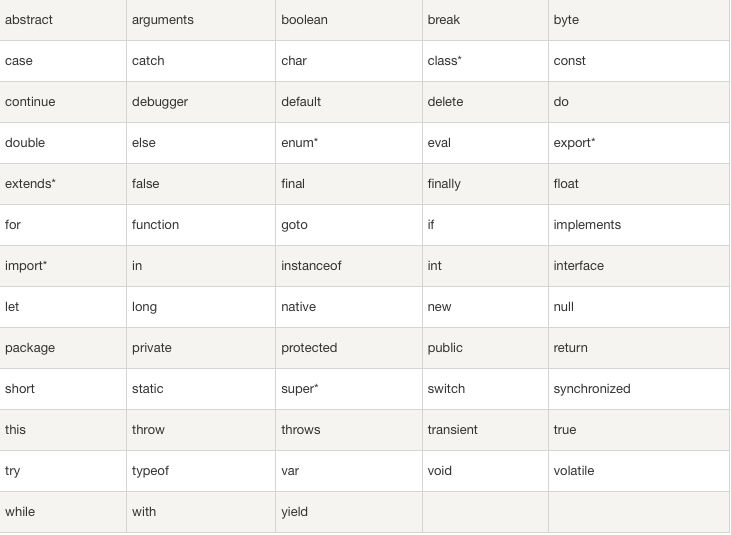
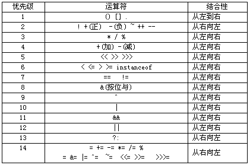

### TypeScript 概览
TypeScript 是一种由微软开发的自由和开源的编程语言，它是 JavaScript 的一个超集，而且本质上向这个语言添加了可选的静态类型和基于类的面向对象编程。  
TypeScript 扩展了 JavaScript 的语法，所以任何现有的 JavaScript 程序可以不加改变的在 TypeScript 下工作。  

[TypeScript 官网](http://www.typescriptlang.org/)  
[TypeScript 中文](https://www.tslang.cn/index.html)  
[TypeScript Github](https://github.com/Microsoft/TypeScript)  

TypeScript 的优势：  

- 更多的规则和类型限制，让代码预测性更高，可控性更高，易于维护和调试  
- 对模块、命名空间和面向对象的支持，更容易组织代码开发大型复杂程序  
- TypeScript 的编译步骤可以捕获运行之前的错误  
- Angular2 + 和 Ionic2 + 默认使用 TypeScript

### TypeScript 安装
TypeScript 的安装需要 Node.js。  
```bash
# 全局安装
npm i -g typescript
# 查看版本
tsc -v
```

### TypeScript 基本使用
创建 TypeScript 项目
```bash
mkdir demo
cd demo
npm init -y
# 创建 tsconfig.json 文件
tsc --init
# 安装 .d.ts 文件
npm install @types/node --dev-save
```

第一个 Hello 程序 hello.ts，
```js
function greeter(person: string): string {
    return "Hello, " + person;
}

let user = "TypeScript";
document.body.innerHTML = greeter(user);
```
在命令行上，运行 TypeScript 编译器  
```bash
# 输出 hello.js
tsc hello.ts
```

### TypeScript 基础
**变量与常量**  
变量是计算机中的存储单元；常量是内容不会改变的数据。

为了方便存取变量中的数据，我们需要给变量取一个名字。这个命名遵循如下的规则：  

- 变量名由字母、数字、下划线、美元符号 $ 组成；  
- 不能以数字开头；  
- 变量名不能是关键字（关键字就是被 TypeScript 语言占用的名字）。  

TypeScript 关键字如下：
  

```typescript
// 定义一个数值型变量
var a: number;
```

局部变量，函数体内定义的变量就是局部变量；存储在栈区。  
全局变量，函数体外定义的变量就是全局变量；存储在全局区。  
`注意：常量存储在常量区，对象存储在堆区。`  
当局部变量与全局变量重名的时候，在函数体内是局部变量起作用。  
当局部变量与全局变量重名的时候，如果在函数体内想使用函数体外的全局变量，this.变量名。

变量的声明提升是 TypeScript 语言的一大特色。  
```typescript
function func(){
    console.log(a);//undefined
    /**
     * 此行代码执行了两个任务：
     * 1. var a:number; 声明变量
     * 2. a = 1;给变量赋值
     * 注意：声明变量在函数一调用的时候就会被执行，这个就是声明提升
     */
    var a:number = 1;
    console.log(a);
}
```

使用 let 关键字声明的变量就是一个块级作用域变量。推荐大家在以后的学习过程中尽量使用 let 去声明变量，这样的变量就是一个块级作用域变量。  
let 关键字声明的块级作用域变量的特点有：  
1、变量的作用域范围是距离最近的一对大括号内；  
2、let 关键字声明的变量不能重名。  

**数据类型**  
TypeScript 中的数据类型有 Undefined、Number（数值类型）、string（字符串类型）、Boolean（布尔类型）、enum（枚举类型）、any（任意类型）、void（空类型）、Array（数组类型）、Tuple（元祖类型）、Null（空类型）、never。  

- Undefined：当定义了一个变量，没有给这个变量进行赋值，那这个变量中有一个默认值 undefined  
- Number：所有的数字不管是整数还是小数都属于 Number 类型  
在 TypeScript 中存在以下几种特殊的 Number 类型数据：  
1、NaN：不是数字（Not a Number）。如果一个计算结果或者函数的返回值本应该是数字，但是不是数字，在 TypeScript 中并不会报错，而是把它的结果设置成 NaN。  
2、Infinity：正无穷大。  
3、-Infinity：负无穷大。
- String：由单引号或者双引号括起来的一串字符就是字符串  
- Boolean：表示判断条件是否成立的变量就是布尔类型（boolean），其数值有 true 和 false  
- Enum：变量的结果可能是固定的几种数据使用枚举表示，通常枚举的命名是全大写  
- Any：在一个变量中存储的数据类型可能不止一种，此时我们可以使用 any 来表示说明变量的类型  
- Null：Null 代表是引用类型为空  
- Never：表示的是那些永不存在的值的类型。  
never 类型是那些总是会抛出异常或根本就不会有返回值的函数表达式或箭头函数表达式的返回值类型； 变量也可能是 never 类型，当它们被永不为真的类型保护所约束时。  
never 类型是任何类型的子类型，也可以赋值给任何类型；然而，没有类型是 never 的子类型或可以赋值给 never 类型（除了 never 本身之外）。 即使 any 也不可以赋值给 never。  
- Object：表示非原始类型，也就是除 number，string，boolean，symbol，null 或 undefined 之外的类型。  
- Array：数组。  
```typescript
// 方式 1
let list: number[] = [1, 2, 3];
// 方式 2：使用数组泛型，Array<元素类型>
let list: Array<number> = [1, 2, 3];
```
- Tuple：元组。  
元组类型允许表示一个已知元素数量和类型的数组，各元素的类型不必相同。  
```typescript
// 声明格式
let x: [string, number];
// 初始化
x = ['hello', 10];
```

**表达式**  
像 +、-、\*、/ 等这些符号就是运算符，由变量、常量、运算符组成的式子就是表达式。

- 赋值运算符  
赋值运算符的作用就是把右边的常量赋值给左边的变量，需要注意的是赋值运算符的左边必须是变量。  
- 算术运算符  
运算符是用来进行算术运算的，它包含： + - * / %。  
- 自增自减运算符  
自增 1，自减 1 的运算符：++、--。自增自减运算符是单目运算符，主要用在循环结构中。  
- 复合运算符  
复合运算符是把算术运算符和赋值运算符组合在了起来。功能是先进行算术运算，然后把算术运算的结果赋值给符号左边的变量。需要注意的是符合算术运算符的左边必须是变量。它包括：运算符：+=、-=、\*=、/=、%=。  
- 关系运算符  
关系运算符主要功能是数值大小比较与字符串比较。关系运算符在分支判断中应用最大，关系运算符如果大小关系成立，则表达式的值为 true，关系不成立，表达式的值为 false。它包括：>、>=、 <、<=、==、!=。  
- 逻辑运算符  
逻辑运算符有三个，即与、或、非（&& || ！）。主要用来进行逻辑判断。  
- 运算符的优先级  
优先级从上到下依次递减，最上面具有最高的优先级，逗号操作符具有最低的优先级。  
相同优先级中，按结合顺序计算。大多数运算是从左至右计算，只有三个优先级是从右至左结合的，它们是单目运算符、条件运算符、赋值运算符。  
基本的优先级需要记住以下规则：  
1、指针最优，单目运算优于双目运算。如正负号。  
2、先乘除（模），后加减。  
3、先算术运算，后移位运算，最后位运算。请特别注意：1 <<3 + 2 & 7 等价于 (1 << (3 + 2))&&7。  
4、逻辑运算最后计算。  
  

**流程控制之分支结构**  
单分支 if 主要是用来解决满足条件之后再执行某些操作。适用于这样的场景：如果条件成立，则执行 XXX；如果条件不满足，则直接跳过 if 结构执行下面的代码。  
执行逻辑则为当程序碰到 if 结构，首先判断表达式的值，表达式的值为真，执行大括号中的语句；表达式的值为假，则直接跳过 if 结构。  
```typescript
if(表达式){
    代码块           
}
```

二分支用来解决：满足该条件，执行 A 操作，否则，执行 B 操作。主要针对根据条件是否成立有两种可能情况的需求。当程序执行到二分支结构的时候，肯定会执行两个分支中的一个分支，然后再继续向下执行。  
执行逻辑为当程序碰到 if-else 结构时，首先计算表达式的值，表达式的值为真，执行语句 1，表达式的值为假，执行语句 2。  
```typescript
if(表达式){
    语句1
}else{
    语句2
}
```

if-else-if 多分支主要用于条件是分段的情况，switch 多分支主要用于等值判断的条件。  
执行逻辑为当程序执行到 if-else if 结构时，首先会去计算表达式 1 的值，表达式 1 的值为真，执行语句 1；表达式 1 的值为假，计算表达式 2 的值；表达式 2 的值为真，执行语句 2；表达式 2 的值为假，计算表达式 3 的值，表达式 3 的值为真，执行语句 3，依次向下判断，直到跳出 if-else-if 结构。  
switch 也是常用的多分支结构，适用于条件是等值判断的情况。需要注意的是此处的等值判断是绝对相等，绝对相等要求类型一致，值相等。  
执行逻辑为当程序执行碰到 switch 结构的时候，首先计算条件表达式的值，根据条件表达式的值，找到匹配的值，然后进入对应的 case 分支，开始执行，直到碰到 break 语句跳出 switch 结构。  
```typescript
if(表达式1){
    语句1
}else if(表达式2){
    语句2
}

...
else if(表达式n){
    语句n
}

switch (表达式) {
case 值1:
    语句;
    break;
case 值2:
    语句;
    break;
...  
default:
    语句;
    break;
}
```

**流程控制之循环结构**  
循环操作就是你每次要做的事情。  

for 循环是开发中最常用的循环结构。关于 for 循环有很多扩展，例如 for-in、for-of。  
其执行逻辑主要包括以下五步：

- 给循环变量赋初值；  
- 判断循环条件是否成立；成立执行第 3 步；不成立执行第 5 步；  
- 执行循环体；  
- 循环变量的步进，然后重复步骤 2；  
- 退出 for 循环结构；  

```typescript
for (循环变量赋初值; 循环条件; 循环变量的增量) {
    循环体
}

var sub:number = 1;/
for( var j:number = i; j >= 1; j--){
    sub *= j;
}
```

while 循环会在指定条件为真时循环执行代码块。  
其执行逻辑为当程序碰到 while 结构时，首先判断循环条件是否满足，满足执行循环语句；然后循环变量增量，再次判断循环是否满足，直到循环条件不满足，跳出 while 结构。while 循环的流程以及执行逻辑与 for 循环是一样的。  
```typescript
循环变量赋初值；
while(循环条件){
  循环操作
  循环变量的步进
}

var sub:number = 1;
var i:number = 5;
while( i >= 1){
  sub = sub * i;
  i--;
}
```

do-while 循环是 while 循环的变体。该循环会在检查条件是否为真之前执行一次代码块，如果条件为真的话，就会重复这个循环。  
```typescript
循环变量赋初值
do {
    循环操作的语句;
    循环变量的增量;
} while (循环条件);

var i:number = 1990;
do{
  if(i%4==0 && i%100!=0 || i%400 ==0){
    console.log(i);
  }

  i++;
} while (i < 2020);
```

do-while 循环语法是先执行一遍循环体，然后再判断循环条件是否成立，while 循环先判断循环条件，然后再执行循环体。所以，使用 do-while 循环，循环体部分至少会执行一次，而采用 while 循环，循环体可能一次都不执行。  

break 语句可以用在循环结构与 switch 结构中，用于跳出一层循环或者一层 switch 结构。而 contiue 语句，只能用于循环结构，表示结束本次循环继续下次循环。  

### TypeScript 引用类型
TypeScript 中的数据分为值类型和引用类型。  
在 TypeScript 中也给我们提供了一些引用类型，例如：Array（数组）、String（字符串）、Date（日期对象）、RegExp（正则表达式）等。  

**数组**  
数组，是一个有序的元素列表，是数据的集合。从内存角度上看，数组就是开辟一块连续的空间，然后向这块空间中存储大量的数据。  

想要使用数组存储大量的数据，我们首先要会创建一个数组。创建数组时可以指定数组的容量，也可以直接向数组中存储数据。  
声明数组跟声明一个普通变量是一样的，都是通过 var let 关键字实现的，只不过数组的类型说明符比较复杂而已。  
```typescript
//声明一个存储 number 类型数据的数组
let arr1:number[];
//声明一个存储 string 类型数据的数组
let arr2:Array<string>;
```

给数组赋值的时候，分为两种方法：字面量法和构造函数法。  
```typescript
// 字面量法非常直观。数组的字面量符就是 “[];”。  
// 需要注意的是： 在 TypeScript 中指定存储数据类型的数组只能存储同一类型的数组元素。
// 定义一个空数组 数组容量是 0
let arr1:number[] = [];
// 定义数组的时候 直接给数组赋值 
let arr2:number[] = [1,2,3,4,5];
// 定义数组的同时给数组赋值
let arr3:Array<string> = ['egret','game','good'];
let arr4:Array<boolean> = [true,false,false]
let arr5:number[] = [1,2,true]; // 报错

// 构造函数法：使用 Array 这个引用类型来表示数组的，那么每一个数组都是 Array 类型的实例  
// 定义一个容量为 10 的数组，数组目前没有存储任何数据，默认每个数组元素的值是 undefined
let arr1:number[] = new Array(10);
// 定义数组的时候 直接给数组赋值
let arr2:number[] = new Array(1,2,3,4,5);
let arr3:Array<string> = new Array(10);
let arr4:Array<boolean> = new Array(true,false,false);
```

数组是存放数据的容器，是有序列表。数组中存储的数据叫做数组元素，每一个数组元素都有一个对应的下标，下标是从 0 开始的。访问数组元素就要通过下标法来访问。  
```typescript
// 定义一个 number 类型的数组
let arr:number[] = [11,22,33,44,55];
console.log(arr);

// 获取下标为 0 的数组元素
console.log(arr[0]);
// 给下标为 1 的数组元素赋值 100
arr[1] = 100;
console.log(arr);
```

遍历数组元素就是从头到尾把数组元素访问一遍。遍历数组元素的方法有很多种，可以通过循环遍历，可以通过 for-in 遍历，可以通过 for-of 遍历。  
for-in 与 for-of 遍历数组的区别为：for-in 遍历的是数组的下标，for-of 遍历的是数组元素。  
```typescript
let arr:number[] = [11,22,33,44,55,66,77,88];
// 通过 for 循环遍历数组元素 循环变量从 0 开始
for(let i = 0; i < arr.length; i++ ){
      console.log(arr[i]);
}

let arr:number[] = [11,22,33,44,55,66,77,88];
// 通过 for-in 来遍历 
for(let i in arr){
    console.log(arr[i]);
}

let arr:number[] = [11,22,33,44,55,66,77,88];
// 通过 for-of 来遍历 
for(let i of arr){
    console.log(i);
}
```

在 Array 引用类型中封装一个 length 属性可以访问数组的长度。  
```typescript
let arr:number[] = [11,22,33,44,55,66,77,88]; 
// 数组名.length  获取数组的长度
console.log(arr.length);
```

数组中常用的方法。  
```typescript
// arr.push(v1,v2...) 向数组末尾添加一个或者多个数组元素
// arr.push 原数组会改变，返回值是当前数组的长度
let arr:number[] = [1,2,3,4,5];
console.log(arr);//[1,2,3,4,5]
arr.push(6);
arr.push(7,8,9);
console.log(arr);//[1,2,3,4,5,6,7,8,9];

// arr.pop() 从数组的末尾删除一个数组元素
// arr.pop 原数组会改变，返回删除的元素
let arr:number[] = [1,2,3,4,5];
console.log(arr);//[1,2,3,4,5]
arr.pop();
console.log(arr);//[1,2,3,4]

// arr.unshift(v1,v2...) 向数组的头部插入元素
// arr.unshift 原数组会改变，返回值是当前数组的长度
let arr:number[] = [1,2,3,4,5];
console.log(arr);//[1,2,3,4,5]
arr.unshift(-1);//参数可以是一个也可以是多个
arr.unshift(-2,-3);
console.log(arr);//[-2,-3,-1,1,2,3,4,5]

// arr.shift() 删除数组的第一个元素
// arr.shift 原数组会改变，返回删除的元素
let arr:number[] = [1,2,3,4,5];
console.log(arr);//[1,2,3,4,5]
arr.shift();
console.log(arr);//[2,3,4,5];

// arr.splice(index,howmany,v1,v2...) 向数组中添加元素或者从数组中删除元素
// index -- 必需，规定添加或者删除元素的地方。负值表示从数组末尾开始。  
// howmany -- 必需，要删除项目的个数，如果值为 0，则不会删除元素。  
// v1 -- 可选，向数组中添加新的项目。
let arr:number[] = [1,2,3,4,5];
console.log(arr);//[1,2,3,4,5]
arr.splice(2,1);
console.log(arr);//[1,2,4,5]
arr.splice(3,0,22);
console.log(arr);// [1,2,4,22,5]

// arr.reverse() 将数组的数组元素倒置
// arr.reverse 原数组改变，返回原来的数组
let arr:number[] = [1,2,3,4,5];
console.log(arr);//[1,2,3,4,5]
arr.reverse();
console.log(arr);//[5,4,3,2,1]

// arr.indexOf(value) 从数组头部查找 v1, 找到的话返回索引
// arr.indexOf 返回索引，没有找到返回 -1
let arr:number[] = [1,2,3,4,5,2,1];
let i:number = arr.indexOf(2);//找到下标为 1
let j:number = arr.indexOf(100);//没有找到，返回-1

// arr.lastIndexOf(value) 从数组尾部查找 value，找到的话返回索引，没有找到返回 - 1
let arr:number[] = [1,2,3,4,5,2,1];
let i:number = arr.lastIndexOf(2);//找到下标为 5
let j:number = arr.lastIndexOf(100);//没有找到，返回 -1

// arr.slice(start,end) 返回数组中一部分，start 的值必须大于 0 并且不能小于 end 的值
// arr.slice 原数组不变
let arr:number[] = [1,2,3,4,5,2,1];
// 截取产生一个新数组
let arr2:number[] = arr.slice(1,4);
console.log(arr2);//[2,3,4]

// arr.concat(v1,v2,v3...) 创建一个新数组，新数组的元素是 arr 数组的全部元素，再加上参数中的元素
// arr.concat 原来的数组不改变，返回新数组
let arr1:number[] = [1,2,3,4,5];
// 声明一个新数组 arr2
let arr2:number[];
//将 arr1 中的数组元素拷贝到新数组中并把这个新数组赋值给变量 arr2
arr2 = arr1.concat();
// 改变 arr1 的数组元素 arr2 不会改变，因为这两个是完全独立的数组，arr2 是由 arr1 深拷贝得到的
arr1.splice(0,1);
console.log(arr2);//[1,2,3,4,5]
console.log(arr);//[2,3,4,5]

// arr.join("+") 将数组的值连接成字符串，返回拼接成的字符串
let arr:number[] = [1,2,3,4,5];
//默认参数是,逗号
let s:string = arr.join();
console.log(s);//'1,2,3,4,5'

// arr.forEach(function(value,index){}) 让数组的每一项都执行一次给定的函数，遍历数组元素
let arr:number[] = [1,2,3,4,5];
// 参数 1 是数组元素；参数 2 对应的下标
arr.forEach(function(value,index){
    console.log(value,index);
})
```

对数组排序的操作是经常用到的，最常用的排序算法就是冒泡排序。  
```typescript
function bubbleSort(arr:number[]){
    for( let i:number = 0; i < arr.length - 1; i++){
        for(let j:number = 0; j < arr.length-1-i ; j++){
            if( arr[j] > arr[j+1]){
                let temp = arr[j];
                arr[j] = arr[j+1];
                arr[j+1] = temp;
            }
        }
    }
}

let arr:number[] = [81,14,7,8,23,300];
bubbleSort(arr);
```
JavaScript 数组有自带的排序的函数 sort ()。原理为将数组中每一个数组元素转换成字符串 toString();，然后进行比较。如果想要按照数值大小进行排序的话，我们需要给 sort() 函数中传递一个函数，这个函数的作用就是描述排序的规则的。  
```typescript
let arr:number[] = [5,8,2,13,24];
arr.sort();
console.log(arr); //[13, 2, 24, 5, 8]

function compare(v1, v2){
    if(v1 > v2){
       return 1;
    }else if(v1 == v2){
       return 0;
    }else{
       return -1;
    }
}
arr.sort(compare);
console.log(arr); //[2, 5, 8, 13, 24]
```

**元组**  
元祖是一种特殊的数组，元组类型允许表示一个已知元素数量和类型的数组，各元素的类型不必相同。元祖在实际开发中使用非常少。  
```typescript
// 声明一个元祖类型
let x: [string, number];
// 初始化
x = ['hello', 10]; // 正确
// 错误的初始化
x = [10, 'hello']; // Error
```

**字符串**  
在 TypeScript 中存在两种类型的字符串：基本类型字符串和引用类型的字符串。  
基本类型的字符串指的是由单引号或者双引号括起来的一串字符串，引用类型的字符串指的是 String 类的实例。这两种字符串在使用的时候是没有区别的，基本类型的字符串可以直接使用引用类型字符串中封装的属性和方法。  
```typescript
// 类型说明符 string 直接将字符串常量进行赋值
let s1:string = '基本类型的字符串';
// 类型说明符 String  通过构造函数法创建对象然后赋值
let s2:String = new String("引用类型的字符串");

// 基本类型的字符串也可以直接使用引用类型 String 中封装的属性和方法
console.log(s1.length);
console.log(s2.length);

// 单个字符的方法
// 每一个字符都有一个对应的 ASCII 码，获取字符串中指定下标的字符 str.charAt(index)
// 获取字符串中指定下标的字符的 ASCII 码 str.charCodeAt(index)
let s3:string = "egret";
// 获取 s3 字符串中下标为 0 的字符
console.log(s3.charAt(0));
// 获取 s3 字符串中下标为 1 的字符的 ASCII 码
console.log(s3.charCodeAt(1));

// 查找子串的方法
// str.indexOf(subStr) 从字符串 str 的开头开始查找指定的子串 substr，找到之后返回子串中首字符的下标，没有找到，返回 - 1
// str.lastIndexOf(subStr) 从字符串 str 的尾部开始查找指定的子串 substr，找到之后返回子串首字符的下标，没有找到，返回 - 1
let str:string = "123abc123abc"
// 从字符串头部开始查找子串 找到返回下标
console.log(str.indexOf("abc"));//3
// 从字符串的尾部开始查找子串 找到返回下标
console.log(str.lastIndexOf("abc")); //9
// 没有找到返回 -1 
console.log(str.indexOf("sss"));// -1

// 截取字符串的方法
// str.substring(startIndex,[endIndex]) 从指定的开始下标 startIndex 开始截取字符串，截取到 endIndex 的下标之前，如果没有 endIndex，则截取到字符串结束
let str:string = "abcdefghijk"
// 从下标 3 开始截取字符直到字符串结尾
console.log( str.substring(3));//"defghijk"
// 从下标 3 开始截取字符直到下标 6 之前
console.log( str.substring(3,6));//"def"
// 从下标 3 开始截取字符直到字符串结尾
console.log( str.substr(3) );//"defghijk"
// 从下标 3 开始截取 6 个字符
console.log( str.substr(3,6));//"defghi"

// 替换字符串
// str.replace(subStr,newstr) 在 str 中从头部开始找 substr 子串，找到之后，把 substr 用 newstr 替换掉
// 需要注意的是如果 str 中有多个 substr 子串，只有第一个 substr 子串会被替换掉
let str:string = "abcdefabcjk";
// 在字符串查找 abc，找到之后替换成 ***
// 只能替换一次
console.log( str.replace("abc","***") );

// 字符串比较
// 字符串的比较使用关系运算符比较：>、>=、<、<=、==、!=
// 字符串比较规则：对两个字符串进行比较，逐一比较字符的 ASCII 码，a 为 97，A 为 65，所以 a>A，分出大小后面不再比较
let str1:string = "abcd";
let str2:string = "abce";
let str3:String = new String("abcd");
console.log( str1 < str2 );// true
// == 值相等  === 类型相等值相等
console.log( str1 == str3 );//ture
console.log( str1 === str3 );//false
console.log("123" == "123" );// true
console.log("abcde" > "123"); // true
let str4:string = "我你他";
// 按照 unicode 码的大小进行比较
console.log( str4.charCodeAt(0) );//25105
console.log( str4.charCodeAt(1) );//20320
console.log("我" > "你")//true

// str.replace(parent,replacement) 将出现在 str 字符串中符合 parrent 模式的子串，用 replacement 替换掉
let s4:string = "123abc456adc";
// /a.c/ 表示3个字符的子串第一个字符是a，第二个字符是出换行符之外的任意字符，第三个字符是c
let ret4:string = s4.replace(/a.c/,"*"); // 123*456abc

// str.split(str|parrent) 将字符串按照指定的字符或者多个字符分割成数组
let s5:string = "welcome to beijing";
// 按照字符空格进行分割字符串
let ret5:string[] = s5.split(" ");
console.log(ret5);// ['welcome', 'to', 'beijing']

// str.search(parrent) 在字符串 str 中查找 parrent 模式的子串，找到返回下标，否则返回 - 1
let s6:string = "abc123cde"
let ret6:number = s6.search(/\d{3}/);
console.log(ret6);//3 找到返回下标
let ret7:number = s6.search(/\d{4}/);
console.log(ret7);//-1 没有找到返回-1

// str.match(parrent) 在字符串中查找匹配模式的子串，找到返回，返回结果是一个数组。
let s7:string = "a1b**a2b**";
console.log(  s7.match(/a.b/) );// ["a1b", index: 0, input: "a1b**a2b**", groups: undefined]
```

**日期**  
TypeScript 中使用 Date 这个引用类型来存储日期对象的。
日期对象是 Date 的实例，日期对象通过构造函数法创建，构造函数中可以传递多种类型的参数。  
```typescript
// 构造函数中不带参数
// Date () 构造函数将根据当前日期和时间创建一个 Date 对象
let d:Date = new Date();
console.log(d);// Wed Mar 18 2020 10:44:22 GMT+0800 (中国标准时间)

// 传递一个整数 let d2:Date = new Date(milliseconds);
// milliseconds 表示距离 1970-01-01 00:00:00 的毫秒数

// 传递一个字符串 let d3:Date = new Date( dateString);
// dateString 是一个表示日期的字符串
// 字符串的格式常用:“yyyy/MM/dd hh:mm:ss”，“yyyy-MM-dd hh:mm:ss”，“yyyy-MM-ddThh:mm:ss” 等
let d3:Date = new Date("2020/03/01 12:30:00");
console.log( d3 ); // Sun Mar 01 2020 12:30:00 GMT+0800 (中国标准时间)
let d4:Date = new Date("2020-03-01 12:30:00");
console.log(d4); // Sun Mar 01 2020 12:30:00 GMT+0800 (中国标准时间)
let d5:Date = new Date("2020-03-01T12:30:00");
console.log(d5); // Sun Mar 01 2020 12:30:00 GMT+0800 (中国标准时间)

// 传递表示年月日时分秒
// year 表示年份，4 位数字
// month 表示月份，数值是 0 (1 月)~11 (12 月) 之间的整数
// day 表示日期。数值是 1~31 之间的整数
// hours 表示小时，数值是 0-23 之间的整数
// minutes 表示分钟数，数值是 0~59 之间的整数
// seconds 表示秒数，数值是 0~59 之间的整数
// ms 表示毫秒数，数值是 0~999 之间的整数
let d:Date = new Date(year,month,day,hours,minutes,seconds,ms); // 创建一个指定了年月日时分秒对应点的日起对象

// 获取日期对象中的年份 dateObj.getFullYear()
// 获取日期对象中的月份 dateObj.getMonth()，注意月份是从 0 开始的，1 月份的值是 0，以此类推 12 月份获取的值是 11
// 获取日期对象中的日期 dateObj.getDate()
// 获取日期对象中的星期几 dateObj.getDay()，注意星期日～星期一的对应的值是 0~6
// 获取日期对象中的小时 dateObj.getHours()
// 获取日期对象中的分钟数 dateObj.getMinutes()
// 获取日期对象中的秒数 dateObj.getSeconds()
// 获取日期对象中的毫秒数 dateObj.getMilliSeconds()
// 设定日期对象中的年份 dateObj.setFullYear(year)
// 设定日期对象中的月份 dateObj.setMonth(month)，注意合理的范围是 0~11 之间的整数，如果小于 0 会在年份上对应的减少，如果大于 11 会在年份上对应的增加
// 设置日期对象中的日期 dateObj.setDate(d) 注意同 setMonth 一样，设置的数据如果小于 1 或者大于 31 则会在月份上年份上进行增减
// 设置日期对象中的小时 dateObj.setHours(h)
// 设置日期对象中的分钟 dateObj.setMinutes(m)
// 设置日期对象中的秒钟 dateObj.setSeconds(s)
// 设置日期对象中的毫秒 dateObj.setMilliseconds(ms)
let d:Date = new Date();
console.log(d);
console.log( d.getFullYear() );//获取年份
console.log( d.getMonth());//获取月份
console.log( d.getDate());//获取日期
console.log( d.getHours() );//获取小时
console.log( d.getMinutes() );//获取分钟数
console.log( d.getSeconds() );//获取秒数
console.log( d.getMilliseconds() );//获取毫秒数
console.log( d.getDay());//获取星期
```

**正则表达式**  
正则表达式（Regular Expression）是一个描述字符模式的对象。  
TypeScript 的 RegExp 类表示正则表达式，而 String 和 RegExp 都定义了使用正则表达式进行强大的模式匹配和文本检索与替换的函数。  
正则表达式主要用来验证客户端的输入数据。用户填写完表单单击确认按钮之后，表单就会被发送到服务器，在服务器端通常会用 PHP、ASP.NET、JSP 等服务器脚本对其进行进一步处理。因为客户端验证，可以节约大量的服务器端的系统资源，并且提供更好的用户体验。  

创建正则表达式和创建字符串类似，创建正则表达式提供了两种方法，一种是采用 new 运算符（构造函数法），另一个是采用字面量方式（字面量法）。  
```typescript
// new (pattern: string, flags?: string): RegExp 
// pattern 指的是字符串规则描述，flags 是修饰符: g 是全局修饰符，i 是忽略大小写，m 是多行模式
let r1:RegExp = new RegExp("abc");
console.log(r1); //  /abc/ 表示字符串的规则是含有abc子串
let r2:RegExp = new RegExp("abc","gi");
console.log(r2);// /abc/gi 表示在字符串中筛选出所有的abc子串，并且忽略大小写

// 字面量法创建，更加直观
// 正则表达式的字面量是 //
let r3:RegExp = /abc/;
let r4:RegExp = /abc/gi;
```

RegExp 对象包含两个方法：test() 和 exec()，功能基本相似，用于测试字符串匹配。  
test() 方法在字符串中查找是否存在指定的正则表达式并返回布尔值，如果存在则返回 true，不存在则返回 false。  
exec() 方法也用于在字符串中查找指定正则表达式，如果 exec() 方法执行成功，则返回包含该查找字符串的相关信息数组。如果执行失败，则返回 null。  
```typescript
// 字面量法创建正则表达式  该正则表达式描述的规则是含有 abc 子串，并且忽略大小写
let r1:RegExp = /abc/i;
// 在“123ABC”中查找是否有 abc 子串，不论大小写
let ret:boolean = r1.test("123ABC");
console.log(ret);//true，存在
let ret2:boolean = r1.test("123asbdc");
console.log(ret2);//false
```

正则表达式中除了普通字符之外还包括一些具有特殊含义的字符，这些具有特殊含义的字符称为元字符。  

| 元字符	| 含义 |  
| :---: | :---: |  
| . | 表示一个除换行符之外的任意字符 |  
| [a-z] | 表示一个小写的英文字符 |  
| [0-9] | 表示一个数字字符 |  
| [^a-z] | 表示一个非小写英文字符 |  
| \d | 表示一个数字字符，与 [0-9] 作用一样 |  
| \D | 表示一个非数字字符 |  
| \w | 表示一个字符，字符可以是数字、字母、下划线 |  
| \W | 表示一个字符，字符不可以是数字、字母、下划线 |  
| ？	 | a? 表示 0 个或者 1 个字符 a |  
| *	| a*  表示 0 个或者多个字符 a |  
| +	| a+ 表示至少一个字符 a；(abc)+ 表示至少一个子串 abc |  
| \{m,n\}	| a\{m,n\} 表示至少 m 个 a 或者之多 n 个 a；(abc)\{m,n\} 表示至少 m 个 abc 子串至多 n 个 abc 子串 |  
| ^	| 表示字符串开头，行首匹配符 |  
| $	| 表示字符串结尾，行尾匹配符 |  

```typescript
/*使用点元字符*/
var pattern = /g..gle/; //.匹配一个任意字符
var str = 'google';
alert(pattern.test(str));//true

/*重复匹配*/
var pattern = /g.*gle/; //.匹配0 个一个或多个
var str = 'google';
alert(pattern.test(str));//true

/*使用字符类匹配*/
var pattern = /g[a-zA-Z_]*gle/; //[a-z]*表示任意个a-z中的字符
var str = 'google';
alert(pattern.test(str));//true
```

一些常用的正则表达式：  
1、检测邮箱编码：/^[0-9]{6}$/  
2、检查身份证账号的是否合法：/^[1-9]\d{5}(18|19|([23]\d))\d{2}((0[1-9])|(10|11|12))(([0-2][1-9])|10|20|30|31)\d{3}[0-9Xx]$/  
3、检测中国大陆手机号码是否合法：/^1[3|4|5|7|8]\d{9}$/


### TypeScript 函数
函数是任何 TypeScript 程序中基本的功能模块。  
函数是对功能的封装。  
函数就类似于一个具有某些功能的工具。想使用函数，我们首先需要定义函数，定义函数需要通过关键字 function，按照一定的语法规则去定义。  
```typescript
function add(n1:number,n2:number):number{
    return n1 + n2;
}

//调用函数： 
add(1,1);
```

形参就是形式上的参数，函数定义的时候写的参数是形参。调用函数时传递的具体值就是实参。  
在函数调用的时候，我们需要按照形参的规则传递实参，有几个形参就要传递几个实参，并且每一个实参的类型要与对应的形参类型一致。  

在 TypeScript 语言中支持有可选参数的函数，也就是调用这个函数的时候有的参数可以传递，也可以不传递。可选参数在定义函数的时候通过一个？标注。  
```typescript
function add(n1:number,n2?:number):number{
    var ret = 0;
    ret += n1;
    if( n2 != undefined){
        ret += n2;
    }
    return ret;
}
```

通过给可选参数一个默认值，如果调用函数的时候，不传递实参，形参的值就是默认值，如果传递实参，形参的值就是实参的值。这在我们封装函数的时候非常有用。  
```typescript
function add(n1:number,n2:number = 0):number{
    return n1 + n2;
}
```

剩余参数就是形参是一个数组，传递几个实参过来都可以直接存在形参中的数组中。  
```typescript
function add( ...foo:number[]):number{
    let sum = 0;
    for(let i = 0; i < foo.length; i++ ){
        sum += foo[i];
    }

    return sum;
}
```

**定义函数的方式**  
函数声明法创建函数是最常用的函数定义法。使用 funciton 关键字和函数名去定义一个函数。  
```typescript
function add(n1:number,n2:number):number{
    return n1 + n2;
}
add(1,1);
```

函数表达式法是将一个函数赋值给一个变量，这个变量名就是函数名。通过变量名就可以调用函数了。这种方式定义的函数，必须在定义之后，调用函数。下面例子中等号右边的函数没有函数名，称为匿名函数。  
```typescript
var add = function(n1:number,n2:number):number{
    return n1 + n2;
}
add(1,1);
```

箭头函数是 ES6 中新增的函数定义的新方式，箭头函数定义的函数一般都用于回调函数中。  
```typescript
// 将一个箭头函数赋值给变量 add
var add = (n1:number,n2:number):number => {
    return n1 + n2;
}
// 将一个【匿名函数】赋值给 add
// 同时给变量 add 添加上一个类型说明符 add(n1:number,n2:number) => number
var add:(n1:number,n2:number) => number = function(n1:number,n2:number):number{
    return n1 + n2;
}
```

**高阶函数**  
在 TypeScript 中，函数可以作为参数传给其他函数，也可以作为返回值被其他函数返回。那些接受函数为参数或返回另一个函数的函数被称为高阶函数。  
```typescript
function test(fn){
    console.log("这是一个高阶函数，因为他的参数是一个函数");
    fn();
}
function fn(){
    console.log("作为参数传递的函数");

}
test(fn);

function test2(){
    function fn2(){
        console.log("作为返回值的函数");

    }

    return fn2;
}
// test2()的结果是一个函数
// test2()()调用执行返回的函数
test2()();
```

**回调函数**  
回调函数主要用于解决异步问题。  
Javascript 语言的执行环境是 “单线程”（Single Thread）。作为 Javascript 的超集 TypeScript 也是 “单线程”。  
所谓 "单线程"，就是指一次只能完成一件任务。如果有多个任务，就必须排队，前面一个任务完成，再执行后面一个任务，以此类推。这种模式的好处是实现起来比较简单，执行环境相对单纯；坏处是只要有一个任务耗时很长，后面的任务都必须排队等着，会拖延整个程序的执行。常见的浏览器无响应（假死），往往就是因为某一段 Javascript 代码长时间运行（比如死循环），导致整个页面卡在这个地方，其他任务无法执行。  

为了解决这个问题，Javascript 语言将任务的执行模式分成两种：同步（Synchronous）和异步 （Asynchronous）。  
“同步模式” 就是后一个任务等待前一个任务结束，然后再执行，程序的执行顺序与任务的排列顺序是一致的、同步的；而 “异步模式” 则完全不同，每一个任务有一个或多个回调函数（Callback），前一个任务结束后，不是执行后一个任务，而是执行回调函数，后一个任务则是不等前一个任务结束就执行，所以程序的执行顺序与任务的排列顺序是不一致的、异步的。  
“异步模式” 非常重要。在浏览器端，耗时很长的操作都应该异步执行，避免浏览器失去响应，最好的例子就是 AJAX 操作。在服务器端，“异步模式” 甚至是唯一的模式，因为执行环境是单线程的，如果允许同步执行所有 HTTP 请求，服务器性能会急剧下降，很快就会失去响应。  

在 TypeScript 中，函数可以作为参数传给其他函数，被传递给其他函数的函数叫做回调函数。回调函数是在满足某些条件之后会被调用的函数。  
```typescript
// 给按钮 btn 添加了点击事件的侦听器
// 当发生点击事件的时候，会触发调用回调函数 onTapBtn
btn.addEventListener(egret.TouchEvent.TOUCH_TAP, onTapBtn, this);
function onTapBtn(){
    console.log("点击了按钮");
}
```

**回调地狱**  
一般来说，我们会碰到的回调嵌套不会太多，一般就一到两级。但某些情况下，如果回调嵌套很多，代码就会非常繁琐，会给我们的编程带来很多的麻烦，这种情况俗称回调地狱。  
```typescript
setTimeout(function (name) {
  var catList = name + ',';
  setTimeout(function (name) {
    catList += name + ',';
    setTimeout(function (name) {
      catList += name + ',';
      setTimeout(function (name) {
        catList += name + ',';
        setTimeout(function (name) {
          catList += name;
          console.log(catList);
        }, 1, 'Lion');
      }, 1, 'Snow Leopard');
    }, 1, 'Lynx');
  }, 1, 'Jaguar');}, 1, 'Panther');
```

回调地狱会产生下面的影响：

- 让代码难以理解；  
- 让代码难以维护；  
- 让异常处理起来非常困难。  

**Promise**  
古人云：“君子一诺千金”，这种 “承诺将来会执行” 的对象在 JavaScript 中称为 Promise 对象。在 ES6 中，Promise 终于成为了原生对象，可以直接使用。  
```typescript
// 简单的 Promise 例子
function test(resolve,reject){
    var timeout = Math.random() * 2;
    console.log("set timeout" + timeout);

    setTimeout(function() {
        if(timeout<1){
            console.log("call resolve");
            // 如果执行成功，我们将调用 resolve('OK')
            resolve("ok");
        }else{
            console.log("call reject");
            // 如果执行失败，我们将调用 reject('no')
            reject("no");
        }
    }, timeout*1000);
}

// 用 Promise 对象来执行它
let p1 = new Promise(test);
// 如果成功，执行这个函数
let p2 = p.then(function(msg){
    console.log(msg);

});
// 当 test 函数执行失败时，我们告诉 Promise 对象
let p3 = p.catch(function(err){
    console.log(err);

});
```

**async 与 await**  
在 ES7 中引入了 async 与 await 实现异步函数。  
与使用 Promise 对比，使用异步函数可以显著提高程序的可读性，在技术上使用 Promise 可以达到和同步函数同样的效果。  
```typescript
// 声明一个名为 p 的 Promise
var p:Promise<number> = /*....*/;
// Promise 将会等待被执行，在等待期间，程序不会被阻塞，因为我们是在一个名为 fn 的异步函数中做等待
async function fn():Promise<number>{
	// 在函数内部，await 关键字被用来暂停代码执行，直到执行完毕之后，代码才会继续向后执行
    var i = await p;
    return i+1;
}
```

**箭头函数**  
在 Typescript 中可以使用 function 关键字声明一个函数，还可以使用箭头函数声明函数。  
箭头函数是 function 表达式的缩写，并且箭头函数会在其作用域内绑定 this 操作符。  
```typescript
function func1(){
    console.log("function表达式定义函数");
}
let func2 = () => {
    console.log("箭头函数");
}

class Person{
    name:string;
    constructor(name:string){
        this.name = name;
    }
    greet(){
        console.log(`hi,my name is ${this.name}`);
    }
    delayGreet(){
    	// 箭头函数最大的特点就是可以绑定箭头函数体中 this 指针的指向，箭头函数的指向与包含箭头函数的外部函数一致
    	// 也就是说此处箭头函数中的 this 指针指向与 delayGreet 函数的一致，都指向 Person 类的实例 p，那么它的 name 值是 tom
        setTimeout(()=>{
            console.log(`hi,my name is ${this.name}`);
        },2000);
    }
}
var p:Person = new Person("tom");
p.greet();
p.delayGreet();
```

### TypeScript 面向对象
TypeScript 是一个基于类的面向对象编程语言。  
类是对具体事物的一个抽象，对象是类的具体表现。  

类是对属性和方法的封装。声明类的关键字是 class，我们约定类名一般首字符大写。  
```typescript
class Person{
  name:string;
  age:number;
  // 构造函数的主要作用是给类中封装的属性进行赋值的
  constructor(name:string,age:number){
    this.name = name;
    this.age = age;
  }

  greet(){
    console.log("hi");
  }
}

// 通过 new 关键字创建该类的对象
let p:Person = new Person("egret",5);
// 通过点语法.访问对象中属性和方法
p.greet(); //hi
```

**可访问修饰符**  
有时候，我们并不希望这些所有的属性和方法都在类外可以使用，那么我就需要借助属性的访问修饰符了。  

TypeScript 语言同其他大部分面向对象语言类似，属性的访问修饰符分为三类：public、protected、private。  

- public 公有修饰符，可以在类内或者类外使用 public 修饰的属性或者行为，默认修饰符  
- protected	受保护的修饰符，可以本类和子类中使用 protected 修饰的属性和行为  
- private 私有修饰符，只可以在类内使用 private 修饰的属性和行为

```typescript
class Dog{
    public name:string;
    protected age:number;
    private sex:string;
    public type:string;
    //一般构造函数都是public属性修饰
    public constructor(name1:string,age1:number,sex1:string,type1:string){
        this.name = name1;
        this.age = age1;
        this.sex = sex1;
        this.type = type1;
    }

    public run(){
        console.log("狗狗在狂奔中。。。");
    }

    protected bark(){
        console.log("汪汪汪");
    }
}
// 创建 Dog 类的对象
var d = new Dog("旺财",20,"男","金毛");
//可以访问对象的属性
console.log( d.name );
console.log( d.sex );//报错
console.log( d.age );//报错
console.log( d.type );
// 可以调用对象的方法
d.run();
d.bark();//报错
```

使用 readonly 修饰符将属性设置为只读的，只读属性必须在声明时或者构造函数里被初始化。  
```typescript
class L{
    //readonly 修饰的属性只能在声明的时候赋值 或者在构造函数中赋值
    public readonly width:number = 200;//正确赋值
    constructor(){
        this.width = 300;//正确赋值
    }
}
var a = new L();
a.width = 100;//报错
```

static 是静态修饰符。  
当程序运行时，系统会在内存中开辟一块空间分配给这个程序，然后将这块空间划分成常量区，全局静态区，栈区，堆区。

- 常量区，存储常量和程序转变成的二进制数据；由系统分配，程序结束之后回收。  
- 全局静态区，存储全局变量和静态变量；当创建一个全局变量或者 static 变量，系统会在全局静态区为其开辟一块空间，该空间直到程序结束之后回收。  
- 栈区，存储局部变量；当调用函数时，会在栈区为函数中的局部变量开辟一块空间，当函数调用结束之后，该空间被销毁。  
- 堆区，存储对象；程序员通过 new 关键字创建对象，然后在堆区为该对象开辟空间，最后由程序员手动释放。  

static 修饰类中的属性和方法，称为静态属性和静态方法（或者类属性和类方法）。  
静态属性和静态方法可以直接通过类名访问，没有 static 修饰的属性和方法，称为实例属性和实例方法，实例属性和实例方法访问需要通过该类创建的对象去访问。  
```typescript
class Tool{
    static  n:number = 100;
    static  test(){
        console.log("测试");
    }
}

// 直接通过类名调用 Tool 的静态属性 n 和静态方法 test
Tool.n
Tool.test()
```
static 修饰符在开发中主要用于：工具类\项目数据的封装，单例设计模式等。  

成员变量（实例变量）和静态变量（类变量）的区别：

- 两个变量的生命周期不同  
成员变量随对象的创建而存在，随对象被回收而释放；静态变量随类的加载而存在，随类的消失而消失。  
- 调用方式不同  
成员变量只能被对象调用；静态变量还可以被类名调用。  
- 数据存储位置不同  
成员变量 –> 堆内存的对象中，也叫对象的特有数据；  
静态变量 –> 方法区（共享数据区）的静态区，也叫对象的共享数据。  

**存取器**  
在 TypeScript 中提供 getter 与 setter 对属性值的获取修改。  
```typescript
let passCode = "123456";
class Employee{
    //私有变量 不可以在类外访问
    private _fullName:string;
    get fullName():string{
        console.log("getter方法");
        return this._fullName;
    }
    set fullName(newName:string){
        if( passCode && passCode == "123456" ){
            this._fullName = newName;
        }
        console.log("getter方法");
    }
}
let p = new Employee();
// 通过调用 fullName 的 getter 方法给 fullName 赋值
p.fullName = "小红";
// 通过调用 fullName 的 setter 方法获取 fullName 的值
console.log(p.fullName);
```

**继承**  
继承即扩展已有的类，它允许我们创建一个类（子类），从已有的类（父类）上继承所有的属性和方法，子类可以包含父类中没有的属性和方法。  
`注意：TypeScript 不支持多重继承。`  
```typescript
class Person{
    public name:string;
    public age:number;
    public email:string;

    constructor(name:string,age:number,email:string){
        this.name = name;
        this.age = age;
        this.email = email;
    }

    greet(){
        console.log("hello,my name is " + this.name );
    }
}

class Teacher extends Person{
    //默认已经实现了子类中的constructor
    // constructor(name:string,age:number,email:string){
    //     super(name,age,email);
    // }
    teach(){
        console.log("welcome to wangqianqian's class!");
    }
}

let t:Teacher = new Teacher("psyche",25,"egret01@163.com");
t.greet();//继承自父类
t.teach();
```

**重写**  
重写就是在子类中重写父类的方法。  
```typescript
class Person{
    public name:string;
    public age:number;
    public email:string;

    constructor(name:string,age:number,email:string){
        this.name = name;
        this.age = age;
        this.email = email;
    }

    greet(){
        console.log("hello,my name is " + this.name );
    }
}

class Teacher extends Person{
    greet(){
        super.greet();
        console.log("I teach Math");
    }
    teach(){
        console.log("welcome to wangqianqian's class!");
    }
}

let t:Teacher = new Teacher("psyche",25,"egret01@163.com");
t.greet();
t.teach();
```

**接口**  
在计算机中，接口是用来定义一些规范，使用这些接口，就必须实现按照接口中的规范来走。  
在面向对象的语言中，术语 interface 经常被用来定义一个不包含数据和逻辑代码但是用函数签名定义了行为的抽象类型。  

```typescript
interface Ponit{
    x:number;
    y:number;
}
let pt:Ponit = {x:1,y:1};

// 具有可选属性的接口
interface USB {
    name:string;
    age?:number;
}
function printUSB(usb:USB) {
    console.log(usb.name);
    if (usb.age) {
        console.log(usb.age);
    }
}
//不含age属性也可以
printUSB({name:"egret"});

// 描述函数类型的接口
interface searchFunc {
    (source:string, subString:string):boolean;
}
var mySearch: searchFunc;
mySearch = function(src:string, sub:string) : boolean {
    var flag = src.search(sub);
    return (flag != -1);
};

// 类类型：接口也可以用来描述类的类型
interface ClockInterface {
    currentTime:Date;
    setTime(d:Date);
}
class Clock implements ClockInterface {
    currentTime:Date;
    h:number;
    s:number;
    setTime(d:Date) {
        this.currentTime = d;
    }
    constructor(h:number, s:number) {
        this.h = h;
        this.s = s;
    }
    print() {
        console.log("hello lsw");
    }
}
var c:Clock = new Clock(10, 100);
c.setTime(new Date());
c.print();
```

**命名空间**  
命名空间，又称内部模块，被用于组织一些具有内在联系的特性和对象。  

TypeScript 提供了命名空间特性，命名空间主要用于组织代码。如果在写一个大型应用，在代码量增加的同时引入第三方库为了避免命名冲突的问题，我们可以使用命名空间解决。  
命名空间能够使代码更加清晰，可以使用 namespace 和 export 关键字，在 TypeScript 中声明命名空间。   
当声明一个命名空间的时候，所有实体部分默认是私有的，可以使用 export 关键字导出公共部分。  
在一个命名空间中还可以嵌套另一个命名空间。  

```typescript
namespace myGame{
    interface Monster{
        name:string;
        hp:number;
        mp:number;
    }

    // 导出外部可访问的属性和方法
    export class Tank implements Monster{
        public name:string;
        public hp:number;
        public mp:number;
        attck(){
            console.log("攻击");
        }
    }
}

let tk:myGame.Tank = new myGame.Tank();
tk.attck();
```

**模块**  
在 TypeScript 中，“内部模块” 现在称作 “命名空间”，“外部模块” 现在则简称为 “模块”。  
模块在其自身的作用域里执行，而不是在全局作用域里。这意味着定义在一个模块里的变量、函数、类等等在模块外部是不可见的，除非你明确地使用 export 形式之一导出它们。 相反，如果想使用其它模块导出的变量、函数、类、接口等的时候，你必须要导入它们，可以使用 import 形式之一。  
`注意：在浏览器中是不支持模块的，我们需要在 Node.js 环境下面运行。`
```typescript
// TypeScript file: test2.ts
let a:number = 100;
export function test(){
    console.log("测试....");
}

// TypeScript file: test1.ts
import {func} from "./test2";
func();
```
