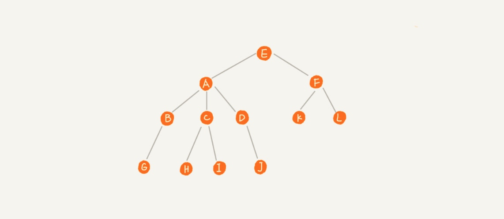
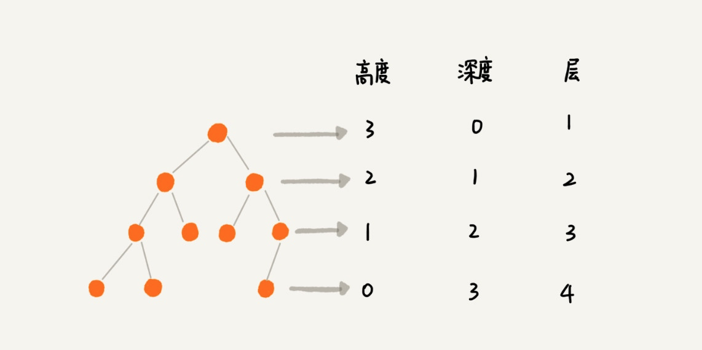
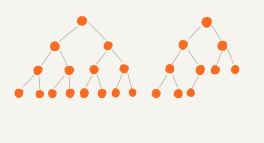
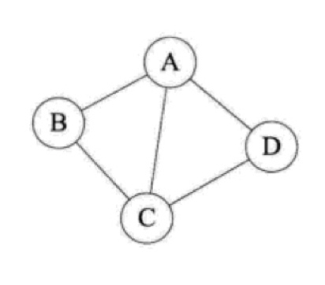
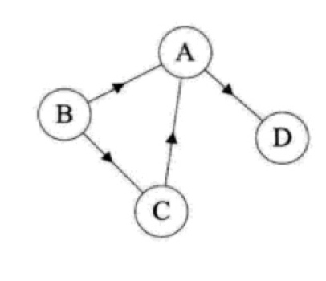

### 数据结构
数据结构，其实就是一个个解决问题的“模型”。有了这些模型，就能把一个个具体的问题抽象化，然后再来解决。  
不同的数据结构，都是在编程中运用数学思维的产物。每种数据结构都有自身的特点，有利于我们更方便地实现某种特定的数学模型。  

### 数据结构 —— 线性表结构
**数组**  
数组（Array）是一种线性表数据结构，它用一组连续的内存空间，来存储一组具有相同类型的数据。
> 在 PHP 中，因为数组底层是通过散列表实现的，所以功能异常强大，这段常规的数组定义在 PHP 中并不成立。  
> PHP 的数组可以存储任何类型数据，如果与 Java 对比的话，PHP 数组集成了 Java 的数组、List、Set、Map 于一身。  

对于传统的数组，比如 C 语言和 Java 中的数组，在使用之前都需要声明数组存储数据的类型和数组的大小，数组的优点是可以通过下标值随机访问数组内的任何元素，算法复杂度是 O (1)，非常高效，但是缺点是删除 / 插入元素比较费劲，以删除为例，需要在删除某个元素后，将后续元素都往前移一位，如果是插入，则需要将插入位置之后的元素都往后移，所以对数组的插入 / 删除而言，算法复杂度是 O (n)。  
```java
int[] arrayA = new int[5];//定义一个长度为5的整型数组
//数组赋值
for(int i=0;i<5;i++) {
    arrayA[i] = i+1;
}
//获取第三个元素的值
int a = arrayA[2];
//获取最后一个元素的值
int b = arrayA[4];
```

**链表**  
和数组不同，链表并不需要一块连续的内存空间，它通过“指针”将一组零散的内存块串联起来使用。  
链表有多种类型，最简单的是单链表，单链表是最原生的链表。  
单链表中有两个节点比较特殊，分别是第一个结点和最后一个结点。我们通常把第一个结点叫作头结点，把最后一个结点叫作尾结点。其中，头结点用来记录链表的基地址，有了它，我们就可以遍历得到整条链表。而尾结点特殊的地方在于：指针不是指向下一个结点，而是指向一个空地址 NULL，表示这是链表上最后一个结点。对单链表而言，理论上来说，插入（头插入、未插入、指定位置插入）和删除（指定值删除）节点的时间复杂度是 O (1)，查询节点的时间复杂度是 O (n)。  
> 插入：只需要改变插入元素之前的节点的指针域指向新的节点，再把新的节点的指针域指向后面一个节点就可以了，其他节点不受影响，无需额外操作。  
> 删除：改变要删除的节点的前一个节点的指针指向就可以了，其他节点不受影响，无需额外操作。

  

```c
typedef struct Node {
    ElemType data;//数据域
    struct Node* next;//指针域
} Node;
typedef struct Node* LinkList; //单向链表
```

在单链表的基础上扩展还有循环链表，循环链表和单链表的区别是尾节点指向了头结点，从而首尾相连，有点像贪吃蛇，可用于解决「约瑟夫环」问题。
  

此外，还有比较常见的双向链表，顾名思义，与单链表的区别是双向链表除了有一个指向下一个节点的指针外，还有一个用于指向上一个节点的指针，从而实现通过 O (1) 复杂度找到上一个节点。正是因为这个节点，使得双向链表在插入、删除节点时比单链表更高效，虽然我们前面已经提到单链表插入、删除时间复杂度已经是 O (1) 了，但是这没有考虑还只是针对插入、删除操作本身而言，以删除为例，删除某个节点后，需要将其前驱节点的指针指向被删除节点的下一个节点，这样，我们还需要获取其前驱节点，在单链表中获取前驱节点的时间复杂度是 O (n)，所以综合来看单链表的删除、插入操作时间复杂度也是 O (n)，而双向链表则不然，它有一个指针指向上一个节点，所以其插入和删除时间复杂度才是真正的 O (1)。而且，对于有序链表而言，双向链表的查询效率显然也要高于单链表，不过更优的时间复杂度是靠更差的空间复杂度换取的，双向链表始终需要单链表的两倍空间，但是在 Web 应用中，时间效率优先级更高，所以我们通常都是空间换时间来提高性能，Java 的 LinkedHashMap 底层就用到了双向链表。  
  

结合循环链表和双向链表为一体的双向循环链表，其实就是将双向链表的首尾通过指针连接起来。
  

**栈**  
栈又叫堆栈，是限定只能在一端进行插入和删除操作的线性表，并且满足后进先出（LIFO）的特点。栈是限定仅在表尾进行插入和删除操作的线性表。我们把允许插入和删除的一端叫做栈顶，另一个端叫做栈底，不含任何数据的栈叫做空栈。  
栈支持通过数组 / 链表实现，通过数组实现的通常叫做顺序栈，通过链表实现的叫做链栈。  
```c
//使用数组来实现的栈
typedef struct Stack {
    int top;//代表栈顶指针
    ElementType data[MAX_SIZE];
} Stack;
// 入栈
void push(Stack* s,ElementType elem) {
   if(s->top > MAX_SIZE)
      return;
    s->data[s->top] = elem;
    s->top++;
}
//出栈
ElementType pop(Stack* s) {
   if(s->top <= 0) {
        return NULL;
   }
   ElementType em = s->data[s->top-1];
   s->top--;
   return em; 
}
```
  

堆栈在日常开发和软件使用中，应用非常广泛，比如我们的浏览器前进、倒退功能，编辑器 / IDE 中的撤销、取消撤销功能，程序代码中的函数调用、递归、四则运算等等，都是基于堆栈这种数据结构来实现的，就连著名的 stackoverflow 网站也是取「栈溢出」，需要求教之意。  

**队列**  
队列就是按排队的方式来组织数据，强调的是先进先出，也是一种受限制的线性表。队列的特性是先入先出（FIFO），允许插入的一端叫队尾，允许删除的一端叫队头。  
```c
// 数据结构表示，链表结构实现
struct Node //队列的节点
{
        int data;
        struct Node* next;
}Node;

struct Queue  //队列
{
        struct Node* front;//队头
        struct Node* tail;//队尾
        int size;//队列大小
};
//入队列操作
void Push(Queue* queue,Element data) {
    Node* node = new Node();
    node->data = data;
    node->next = NULL;
    //空队列
    if (queue -> size == 0) {
         queue ->front = node;
         queue->tail = node;
    }
    else {
        queue->tail->next = node;
        queue->tail = node;
    }
}
//出队列操作
Elem Pop(Queue* queue) {
     if (queue->size == 0) {
        return;
     } 
     Elem em = queue->front->data;
     queue->front = queue->front->next;
     return em;
}
```
  

队列也可以通过数组和链表实现，通过数组实现的叫顺序队列，通过链表实现的叫做链式队列，栈只需要一个栈顶指针就可以了，因为只允许在栈顶插入删除，但是队列需要两个指针，一个指向队头，一个指向队尾。  
通过数组实现的顺序队列有一个问题，就是随着队列元素的插入和删除，队尾指针和队头指针不断后移，而导致队尾指针指向末尾无法插入数据，这时候有可能队列头部还是有剩余空间的。当然，可以通过数据搬移的方式把所有队列数据往前移，但这会增加额外的时间复杂度，如果频繁操作数据量很大的队列，显然对性能有严重损耗，对此问题的解决方案是循环队列，即把队列头尾连起来。此时判断队列是否为空的条件还是 tail==head，但是判断队列是否满的条件就变成了 (tail+1) % maxsize == head，maxsize 是数组的长度，浪费一个空间是为了避免混淆判断空队列的条件。当然如果通过链表来实现队列的话，显然没有这类问题，因为链表没有空间限制。  

新增加的元素只能从队尾添加，称入队列；删除元素只能从队头删除，称出队列；不允许中间操作。  
队列的应用也非常广泛，比如我们常见的消息队列就是队列的典型应用场景。

### 数据结构 —— 散列表结构
散列表（HashTable，也叫哈希表），是根据键（Key）直接访问在内存存储位置的数据结构。  
散列表的实现原理：通过散列函数（也叫哈希函数）将元素的键映射为数组下标（转化后的值叫做散列值或哈希值），然后在对应下标位置存储记录值。当我们按照键值查询元素时，就是用同样的散列函数，将键值转化数组下标，从对应的数组下标的位置取数据。  
散列表用的是数组支持按照下标随机访问数据的特性，所以散列表其实就是数组的一种扩展，由数组演化而来。可以说，如果没有数组，就没有散列表。  
  

散列技术既是一种存储方法，也是一种查找方法。与之前的查找方法不同的是散列技术的记录之间不存在逻辑关系，因此主要是面向查找的数据结构。  
最适合求解的问题是查找给定值相等的记录。  

散列表中有两个关键的概念，一个是散列函数（或者哈希函数），一个是散列冲突（或者哈希冲突）。  
散列函数用于将键值经过处理后转化为散列值，具有以下特性：  
> 1、散列函数计算得到的散列值是非负整数  
> 2、如果 key1 == key2，则 hash (key1) == hash (key2)  
> 3、如果 key1 != key2，则 hash (key1) != hash (key2)  

所谓散列冲突，指的是 key1 != key2 的情况下，通过散列函数处理，hash (key1) == hash (key2)，这个时候就发生了散列冲突。设计再好的散列函数也无法避免散列冲突，原因是散列值是非负整数，总量是有限的，但是现实世界中要处理的键值是无限的，将无限的数据映射到有限的集合，肯定避免不了冲突。  
如果不考虑散列冲突，散列表的查找效率是非常高的，时间复杂度是 O (1)，比二分查找效率还要高，但是因为无法避免散列冲突，所以散列表查找的时间复杂度取决于散列冲突，最坏的情况可能是 O (n)，退化为顺序查找，这种情况在散列函数设计不合理的情况下更糟。  

要减少哈希冲突，提高散列表操作效率，设计一个优秀的散列函数至关重要。  
我们平时经常使用的 md5 函数就是一个散列函数，但是还有其他很多自定义的设计实现，要根据不同场景，设计不同的散列函数来减少散列冲突，而且散列函数本身也要很简单，否则执行散列函数本身会成为散列表的瓶颈。  
通常有以下几种散列函数构造方法：  
> 1、直接定址法：即 f (key) = a\*key + b，f 表示散列函数，a、b 是常量，key 是键值  
> 2、数字分析法：即对数字做左移、右移、反转等操作获取散列值  
> 3、除数留余法：即 f (key) = key % p，p 表示容器数量，这种方式通常用在将数据存放到指定容器中，决定哪个数据放到哪个容器。比如分表后插入数据如何处理（此时 p 表示拆分后数据表的数量）  
> 4、随机数法：即 f (key) = random (key)，比如负载均衡的 random 机制

出现散列冲突，处理思路如下：  
> 1、开放寻址法：该方法又可以细分为三种 —— 线性寻址、二次探测、随机探测。  
> 线性寻址表示出现散列冲突之后，就去寻找下一个空的散列地址；线性寻址步长是 1，二次探测步长是线性寻址步长的 2 次方，其它逻辑一样；同理，随机探测每次步长随机。不管哪种探测方法，散列表中空闲位置不多的时候，散列冲突的概率就会提高，为了保证操作效率，我们会尽可能保证散列表中有一定比例的空闲槽位，我们用装载因子来表示空位的多少，装载因子 = 填入元素 / 散列表长度，装载因子越大，表明空闲位置越少，冲突越多，散列表性能降低。  
> 2、再散列函数法：发生散列冲突后，换一个散列函数计算散列值  
> 3、链地址法：发生散列冲突后，将对应数据链接到该散列值映射的上一个值之后，即将散列值相同的元素放到相同槽位对应的链表中。链地址法即使在散列冲突很多的情况下，也可以保证将所有数据存储到散列表中，但是也引入了遍历单链表带来性能损耗。  

   

哈希算法的应用场景：安全加密（不可逆）、唯一标识、数据校验（下载文件数据的完整性）、散列函数、负载均衡、分布式缓存等。  

### 数据结构 —— 树结构
树这种数据结构模拟了自然界中树的概念，自然界中的树有根、叶子、枝干，数据结构中的树也是如此，只不过是倒过来的：  
   

其中，每个元素叫做节点；树的顶点（没有父元素的节点）叫根节点，如 E；每个分支的末端节点（没有子元素的节点）叫叶子节点，如 G、H、I、J、K、L；用来连接相邻节点之间的关系叫父子关系，比如 E 是 A、F 的父节点，A、F 是 E 的子节点；具有同一个父节点的多个子节点叫做兄弟节点，比如 A、F 是兄弟节点。  

节点拥有的子节点数目叫做节点的度。叶子节点的度为 0，树的度是树内各节点度的最大值。  
除此之外，树还有高度、深度和层的概念：  
> 节点的高度=节点到叶子节点的最长路径（边数）  
> 节点的深度=根节点到这个节点所经历的边个数  
> 节点的层数=节点的深度+1  
> 树的高度=根节点的高度

   

`注意：其实，线性表也可以看作一种特殊的树，只不过所有节点都在一个分支上，第一个元素是根节点，最后一个元素是子节点，没有兄弟节点。层数就是线性表的长度。`  

**二叉树**  
二叉树是我们平时遇到的最常见的树结构，它是一种特殊的树。  
二叉树，就是每个节点最多有两个「分叉」，即两个子节点，分别是左子节点和右子节点。不过，二叉树并不要求每个节点都有两个子节点，有的节点只有左子结点，有的节点只有右子节点。  
根据左右子节点的饱和度，我们又从二叉树中提取出两种特殊的二叉树 —— 满二叉树和完全二叉树。满二叉树即所有分支节点都有左右子节点，并且所有叶子节点都在同一层上；完全二叉树要复杂一些，深度为 k 有 n 个节点的二叉树，当且仅当其中的每一节点，都可以和同样深度 k 的满二叉树，序号为 1 到 n 的节点一对一对应时，称为完全二叉树。下图分别是满二叉树和完全二叉树：  
   

二叉树的一些特性：  
1、在第 i 层最多有 2i-1 个节点  
2、深度为 k 的二叉树最多有 2k-1 个节点  
3、对于任何一个二叉树，叶子节点数为 n0，度为 2 的节点数为 n2，则 n0 = n2+1  
4、具有 n 个结点的完全二又树的深度为 (log2 n)+1  
5、如果对一棵有 n 个结点的完全二叉树（其深度为 (log2 n)+1）的结点按层序编号（从第1层到第 (log2 n)+1 层，每层从左到右），对任一结点i（1<=i<=n）有：  
> 如果 i=1，则结点 i 是二叉树的根，无双亲；如果 i>1，则其双亲是结点 i/2  
> 如果 2i>n，则结点 i 无左孩子（结点i为叶子结点）；否则其左孩子是结点 2i  
> 如果 2i+1>n，则结点 i 无右孩子；否则其右孩子是结点 2i+1  

数组适合满二叉树、完全二叉树这些特殊二叉树的存储，甚至一些比较稠密的二叉树也可以用数组；但是，如果二叉树比较稀疏就不适合用数组了（造成空间浪费，因为不存在的节点用 null 表示，造成“空洞”），可以通过链表来存储它们（理论上来说，链表适用于所有的二叉树存储，而且用链表来存储不会存在空间的浪费）。  
```php
class Node
{
    public $data;
    public $left = null;
    public $right = null;

    public function __construct($data)
    {
        $this->data = $data;
    }
}
```
数组查找性能高，但是插入、删除性能差；链表插入、删除性能高，但查找性能差；在不考虑散列冲突的话，散列表的插入、删除、查找性能都很高，但是前提是没有散列冲突，此外，散列表存储的数据是无序的，散列表的扩容非常麻烦，涉及到散列冲突时，性能不稳定，另外，散列表用起来爽，构造起来可不简单，要考虑散列函数的设计、哈希冲突的解决、扩容缩容等一系列问题。于是，插入、删除、查找性能都不错，构建起来也不是很复杂，性能还很稳定的数据结构 —— 高性能的二叉排序树诞生了。  
二叉排序树也叫做二叉查找树，二叉搜索树。  
二叉排序树是一种特殊的二叉树。二叉排序树是天然有序的，它要求在树中的任意一个节点，其左子树中的每个节点的值，都要小于这个节点的值，而右子树节点的值都大于这个节点的值。  
```php
class BinarySortedTree
{
    /**
     * @var Node
     */
    private $tree;

    public function getTree()
    {
        return $this->tree;
    }

    // 插入节点数据
    public function insert(int $data)
    {
        // 如果是空树，则将数据插入到根节点
        if (!$this->tree) {
            $this->tree = new Node($data);
            return;
        }
        $p = $this->tree;
        while ($p) {
            if ($data < $p->data) {
                if (!$p->left) {
                    $p->left = new Node($data);
                    return;
                }
                $p = $p->left;
            } elseif ($data > $p->data) {
                if (!$p->right) {
                    $p->right = new Node($data);
                    return;
                }
                $p = $p->right;
            }
        }
    }

    // 查找节点
    public function find(int $data)
    {
        $p = $this->tree;
        while ($p) {
            if ($data < $p->data) {
                $p = $p->left;
            } elseif ($data > $p->data) {
                $p = $p->right;
            } else {
                return $p;
            }
        }
        return null;
    }

    // 删除
    public function delete(int $data)
    {
        if (!$this->tree) {
            return;
        }

        $p = $this->tree;
        $pp = null;  // p 的父节点
        // 查找待删除节点
        while ($p && $p->data != $data) {
            $pp = $p;
            if ($p->data < $data) {
                $p = $p->right;
            } else {
                $p = $p->left;
            }
        }
        // 指定删除数据在二叉树中不存在
        if ($p == null) {
            return;
        }

        // 待删除节点有两个子节点
        if ($p->left && $p->right) {
            $minP = $p->right;  // 右子树中的最小节点
            $minPP = $p;  // $minP 的父节点
            // 查找右子树中的最小节点
            while ($minP->left) {
                $minPP = $minP;
                $minP = $minP->left;
            }
            $p->data = $minP->data;  // 将 $minP 的数据设置到 $p 中
            $p = $minP;  // 下面就变成删除 $minP 了
            $pp = $minPP;
        }

        $child = null;
        if ($p->left) {
            $child = $p->left;
        } elseif ($p->right) {
            $child = $p->right;
        } else {
            $child = null;
        }

        if (!$pp) {
            $this->tree = $child;   // 删除的是根节点
        } elseif ($pp->left == $p) {
            $pp->left = $child;
        } else {
            $pp->right = $child;
        }
    }
}
```
不论是插入、删除、还是查找，二叉排序树的时间复杂度都等于二叉树的高度，最好的情况当然是满二叉树或完全二叉树，此时根据完全二叉树的特性，时间复杂度是 O (logn)，性能相当好，最差的情况是二叉排序树退化为线性表（斜树），此时的时间复杂度是 O (n)，所以二叉排序树的形状也很重要，不同的形状会影响最终的操作性能。  

### 数据结构 —— 图结构
图（Graph）由顶点（Vertex）和边（Edge）组成。  
图中的元素叫顶点，图不能为空。在线性表中，相邻元素有前后关系；在树中，相邻元素有层次关系；在图中，任意两个元素之间都可能有关系，顶点之间的关系通过边来表示。  
图可以表示为 G (V,E)，其中 G 表示图，V 表示顶点的集合，E 表示边的集合。  
没有方向的边叫无向边，任意两个顶点之间都是无向边的图叫无向图。在无向图中，任意两个顶点之间都有边的图叫无向完全图。  
   

与之相对的，有方向的边叫有向边（也叫弧），任意两个顶点之间都是有向边的图叫有向图。在有向图中，任意两个顶点之间都有方向相反的两条有向边的图叫有向完全图。
   

按照边的数目，我们将边数很少的图叫稀疏图，边数很多的图叫稠密图。有些图的边还拥有与其相关的数字，我们把这个数字叫做权，这种带权的图通常称作网。  

图的应用场景很多，比如社交网络中用户之间的关系，网络设备之间的拓扑结构，以及现实生活中形形色色的网：公路网、铁路网、地铁网等，都可以通过图来表示。

**顶点与边的关系**  
顶点的度指的是与顶点相连接的边数，整个图的度数是所有顶点度数之和。  

在无向图中，边不分方向，边数是图的度数 / 2。  
在有向图中，边有方向，按照方向将有向图顶点的度分为出度和入度，出度表示有多少条边是以这个顶点为起点指向其他顶点；入度表示有多少条边指向这个顶点。  
在树中，顶点到任意节点的路径是唯一的，而在图中，顶点到任意顶点的路径却不是唯一的。比如上述示例有向图中，从 B 到 A 就有 B->A、B->C->A 两条路径，示例无向图中还有 B->C->D->A 这条路径。    

**连通图**  
在无向图 G 中，如果顶点 v 到顶点 v' 有路径，则称 v 和 v' 是连通的，如果任意两个顶点都是连通的，则称 G 是连通图。在有向图 G 中，对于每一对顶点，如果相互之间都存在路径，则 G 是强连通图。

**图的存储 —— 邻接矩阵**  
通过一维数组是无法存储图的，因为图包含顶点和边，而且每个顶点都可能与其他顶点有关联。  
所以，我们通过两个数组来存储图：一个一维数组用于存储所有顶点，一个二维数组来存储连接顶点的边 / 弧，边或弧连接的是两个顶点，所以需要二维数组来存储。我们把这种存储图的方式叫做邻接矩阵，对于无向图而言，由于边没有方向，所以存储无向图边的二维数组是一个对称矩阵。  
`注意：矩阵是一个数学概念，一个  m x n 的矩阵是一个由 m 行 n 列元素排列成的矩形阵列`  

对于邻接矩阵而言，初始化的时间复杂度等于边数组构建的复杂度，对于有 n 个顶点的图而言，时间复杂度是 O (n^2)，空间复杂度也是如此。  
如果图比较稀疏的话（稀疏图），边数组会存在巨大的空间浪费。但是，优点是实现起来非常简单，对于稠密图或者非常简单的图来说，用邻接矩阵是比较方便的。  

**图的存储 —— 邻接表**  
基于链表替代边数组来存储边，这样就可以避免稀疏图对空间的浪费了。这种存储方式还是通过一个一维数组来存储顶点，只是将边 / 弧通过链表来表示，我们把这种存储方式叫做邻接表。  

邻接表的构建时间复杂度要比邻接矩阵好，对于一个有 n 个顶点和 e 条边的图而言，时间复杂度是 O (n+e)，而且不存在任何空间的浪费，比较高效，可用于存储任何图。  
邻接表也不是十全十美，对于有向图来说，如果要计算某个顶点的入度，需要遍历整个图才能实现，要解决这个问题，我们可以通过逆邻接表来实现。  
所谓逆邻接表，就是和邻接表相反，指针指向基于入度，这样我们就可以很轻松计算某个顶点的入度了。  

**图的遍历**  
图的遍历主要有两种方式，一种是深度优先搜索，一种是广度优先搜索。  
