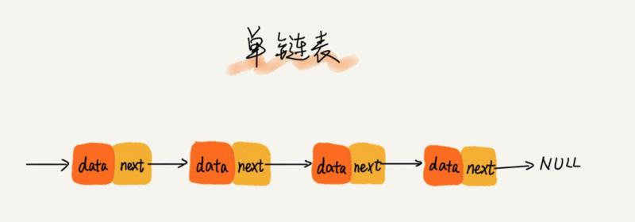
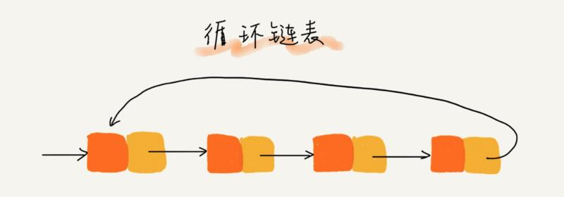
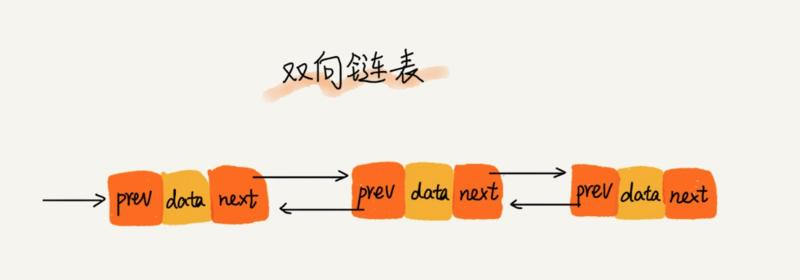
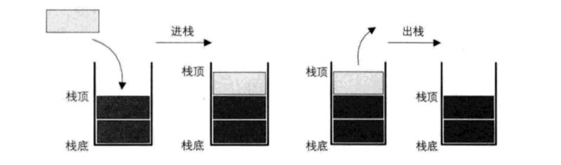
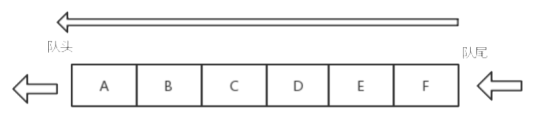
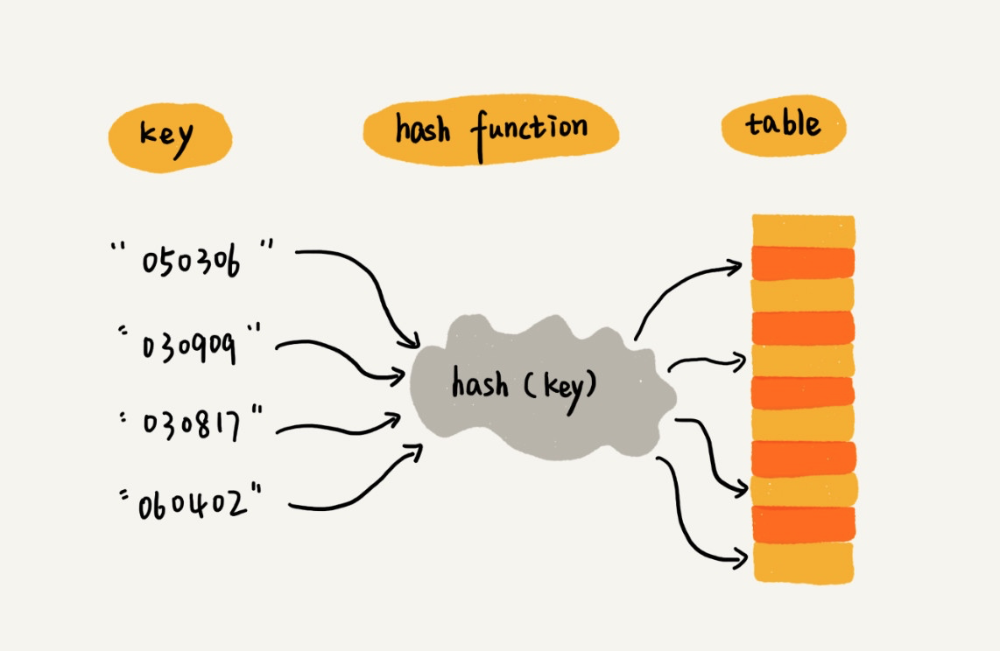
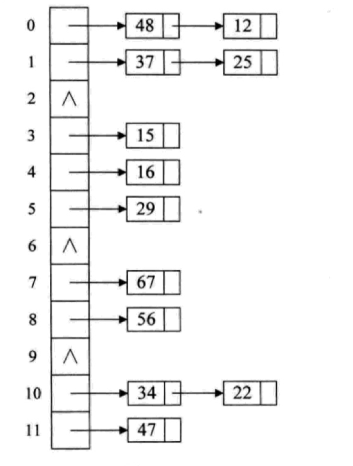

### 数据结构
数据结构，其实就是一个个解决问题的“模型”。有了这些模型，就能把一个个具体的问题抽象化，然后再来解决。  
不同的数据结构，都是在编程中运用数学思维的产物。每种数据结构都有自身的特点，有利于我们更方便地实现某种特定的数学模型。  

### 数据结构 —— 线性表结构
**数组**  
数组（Array）是一种线性表数据结构，它用一组连续的内存空间，来存储一组具有相同类型的数据。
> 在 PHP 中，因为数组底层是通过散列表实现的，所以功能异常强大，这段常规的数组定义在 PHP 中并不成立。  
> PHP 的数组可以存储任何类型数据，如果与 Java 对比的话，PHP 数组集成了 Java 的数组、List、Set、Map 于一身。  

对于传统的数组，比如 C 语言和 Java 中的数组，在使用之前都需要声明数组存储数据的类型和数组的大小，数组的优点是可以通过下标值随机访问数组内的任何元素，算法复杂度是 O (1)，非常高效，但是缺点是删除 / 插入元素比较费劲，以删除为例，需要在删除某个元素后，将后续元素都往前移一位，如果是插入，则需要将插入位置之后的元素都往后移，所以对数组的插入 / 删除而言，算法复杂度是 O (n)。  
```java
int[] arrayA = new int[5];//定义一个长度为5的整型数组
//数组赋值
for(int i=0;i<5;i++) {
    arrayA[i] = i+1;
}
//获取第三个元素的值
int a = arrayA[2];
//获取最后一个元素的值
int b = arrayA[4];
```

**链表**  
和数组不同，链表并不需要一块连续的内存空间，它通过“指针”将一组零散的内存块串联起来使用。  
链表有多种类型，最简单的是单链表，单链表是最原生的链表。  
单链表中有两个节点比较特殊，分别是第一个结点和最后一个结点。我们通常把第一个结点叫作头结点，把最后一个结点叫作尾结点。其中，头结点用来记录链表的基地址，有了它，我们就可以遍历得到整条链表。而尾结点特殊的地方在于：指针不是指向下一个结点，而是指向一个空地址 NULL，表示这是链表上最后一个结点。对单链表而言，理论上来说，插入（头插入、未插入、指定位置插入）和删除（指定值删除）节点的时间复杂度是 O (1)，查询节点的时间复杂度是 O (n)。  
> 插入：只需要改变插入元素之前的节点的指针域指向新的节点，再把新的节点的指针域指向后面一个节点就可以了，其他节点不受影响，无需额外操作。  
> 删除：改变要删除的节点的前一个节点的指针指向就可以了，其他节点不受影响，无需额外操作。

  

```c
typedef struct Node {
    ElemType data;//数据域
    struct Node* next;//指针域
} Node;
typedef struct Node* LinkList; //单向链表
```

在单链表的基础上扩展还有循环链表，循环链表和单链表的区别是尾节点指向了头结点，从而首尾相连，有点像贪吃蛇，可用于解决「约瑟夫环」问题。
  

此外，还有比较常见的双向链表，顾名思义，与单链表的区别是双向链表除了有一个指向下一个节点的指针外，还有一个用于指向上一个节点的指针，从而实现通过 O (1) 复杂度找到上一个节点。正是因为这个节点，使得双向链表在插入、删除节点时比单链表更高效，虽然我们前面已经提到单链表插入、删除时间复杂度已经是 O (1) 了，但是这没有考虑还只是针对插入、删除操作本身而言，以删除为例，删除某个节点后，需要将其前驱节点的指针指向被删除节点的下一个节点，这样，我们还需要获取其前驱节点，在单链表中获取前驱节点的时间复杂度是 O (n)，所以综合来看单链表的删除、插入操作时间复杂度也是 O (n)，而双向链表则不然，它有一个指针指向上一个节点，所以其插入和删除时间复杂度才是真正的 O (1)。而且，对于有序链表而言，双向链表的查询效率显然也要高于单链表，不过更优的时间复杂度是靠更差的空间复杂度换取的，双向链表始终需要单链表的两倍空间，但是在 Web 应用中，时间效率优先级更高，所以我们通常都是空间换时间来提高性能，Java 的 LinkedHashMap 底层就用到了双向链表。  
  

结合循环链表和双向链表为一体的双向循环链表，其实就是将双向链表的首尾通过指针连接起来。
  

**栈**  
栈又叫堆栈，是限定只能在一端进行插入和删除操作的线性表，并且满足后进先出（LIFO）的特点。栈是限定仅在表尾进行插入和删除操作的线性表。我们把允许插入和删除的一端叫做栈顶，另一个端叫做栈底，不含任何数据的栈叫做空栈。  
栈支持通过数组 / 链表实现，通过数组实现的通常叫做顺序栈，通过链表实现的叫做链栈。  
```c
//使用数组来实现的栈
typedef struct Stack {
    int top;//代表栈顶指针
    ElementType data[MAX_SIZE];
} Stack;
// 入栈
void push(Stack* s,ElementType elem) {
   if(s->top > MAX_SIZE)
      return;
    s->data[s->top] = elem;
    s->top++;
}
//出栈
ElementType pop(Stack* s) {
   if(s->top <= 0) {
        return NULL;
   }
   ElementType em = s->data[s->top-1];
   s->top--;
   return em; 
}
```
  

堆栈在日常开发和软件使用中，应用非常广泛，比如我们的浏览器前进、倒退功能，编辑器 / IDE 中的撤销、取消撤销功能，程序代码中的函数调用、递归、四则运算等等，都是基于堆栈这种数据结构来实现的，就连著名的 stackoverflow 网站也是取「栈溢出」，需要求教之意。  

**队列**  
队列就是按排队的方式来组织数据，强调的是先进先出，也是一种受限制的线性表。队列的特性是先入先出（FIFO），允许插入的一端叫队尾，允许删除的一端叫队头。  
```c
// 数据结构表示，链表结构实现
struct Node //队列的节点
{
        int data;
        struct Node* next;
}Node;

struct Queue  //队列
{
        struct Node* front;//队头
        struct Node* tail;//队尾
        int size;//队列大小
};
//入队列操作
void Push(Queue* queue,Element data) {
    Node* node = new Node();
    node->data = data;
    node->next = NULL;
    //空队列
    if (queue -> size == 0) {
         queue -> front = node;
         queue-> tail = node;
    }
    else {
        queue->tail->next = node;
        queue->tail = node;
    }
}
//出队列操作
Elem Pop(Queue* queue) {
     if (queue->size == 0) {
        return;
     } 
     Elem em = queue -> front -> data;
     queue->front = queue->front->next;
     return em;
}
```
  

队列也可以通过数组和链表实现，通过数组实现的叫顺序队列，通过链表实现的叫做链式队列，栈只需要一个栈顶指针就可以了，因为只允许在栈顶插入删除，但是队列需要两个指针，一个指向队头，一个指向队尾。  
过数组实现的顺序队列有一个问题，就是随着队列元素的插入和删除，队尾指针和队头指针不断后移，而导致队尾指针指向末尾无法插入数据，这时候有可能队列头部还是有剩余空间的。当然，可以通过数据搬移的方式把所有队列数据往前移，但这会增加额外的时间复杂度，如果频繁操作数据量很大的队列，显然对性能有严重损耗，对此问题的解决方案是循环队列，即把队列头尾连起来。此时判断队列是否为空的条件还是 tail==head，但是判断队列是否满的条件就变成了 (tail+1) % maxsize == head，maxsize 是数组的长度，浪费一个空间是为了避免混淆判断空队列的条件。当然如果通过链表来实现队列的话，显然没有这类问题，因为链表没有空间限制。  

新增加的元素只能从队尾添加，称入队列；删除元素只能从队头删除，称出队列；不允许中间操作。  
队列的应用也非常广泛，比如我们常见的消息队列就是队列的典型应用场景。

### 数据结构 —— 散列表结构
散列表（HashTable，也叫哈希表），是根据键（Key）直接访问在内存存储位置的数据结构。  
散列表的实现原理：通过散列函数（也叫哈希函数）将元素的键映射为数组下标（转化后的值叫做散列值或哈希值），然后在对应下标位置存储记录值。当我们按照键值查询元素时，就是用同样的散列函数，将键值转化数组下标，从对应的数组下标的位置取数据。  
散列表用的是数组支持按照下标随机访问数据的特性，所以散列表其实就是数组的一种扩展，由数组演化而来。可以说，如果没有数组，就没有散列表。  
  

散列技术既是一种存储方法，也是一种查找方法。与之前的查找方法不同的是散列技术的记录之间不存在逻辑关系，因此主要是面向查找的数据结构。  
最适合求解的问题是查找给定值相等的记录。  

散列表中有两个关键的概念，一个是散列函数（或者哈希函数），一个是散列冲突（或者哈希冲突）。  
散列函数用于将键值经过处理后转化为散列值，具有以下特性：  
> 1、散列函数计算得到的散列值是非负整数  
> 2、如果 key1 == key2，则 hash (key1) == hash (key2)  
> 3、如果 key1 != key2，则 hash (key1) != hash (key2)  

所谓散列冲突，指的是 key1 != key2 的情况下，通过散列函数处理，hash (key1) == hash (key2)，这个时候就发生了散列冲突。设计再好的散列函数也无法避免散列冲突，原因是散列值是非负整数，总量是有限的，但是现实世界中要处理的键值是无限的，将无限的数据映射到有限的集合，肯定避免不了冲突。  
如果不考虑散列冲突，散列表的查找效率是非常高的，时间复杂度是 O (1)，比二分查找效率还要高，但是因为无法避免散列冲突，所以散列表查找的时间复杂度取决于散列冲突，最坏的情况可能是 O (n)，退化为顺序查找，这种情况在散列函数设计不合理的情况下更糟。  

要减少哈希冲突，提高散列表操作效率，设计一个优秀的散列函数至关重要。  
我们平时经常使用的 md5 函数就是一个散列函数，但是还有其他很多自定义的设计实现，要根据不同场景，设计不同的散列函数来减少散列冲突，而且散列函数本身也要很简单，否则执行散列函数本身会成为散列表的瓶颈。  
通常有以下几种散列函数构造方法：  
> 1、直接定址法：即 f (key) = a\*key + b，f 表示散列函数，a、b 是常量，key 是键值  
> 2、数字分析法：即对数字做左移、右移、反转等操作获取散列值  
> 3、除数留余法：即 f (key) = key % p，p 表示容器数量，这种方式通常用在将数据存放到指定容器中，决定哪个数据放到哪个容器。比如分表后插入数据如何处理（此时 p 表示拆分后数据表的数量）  
> 4、随机数法：即 f (key) = random (key)，比如负载均衡的 random 机制

出现散列冲突，处理思路如下：  
> 1、开放寻址法：该方法又可以细分为三种 —— 线性寻址、二次探测、随机探测。  
> 线性寻址表示出现散列冲突之后，就去寻找下一个空的散列地址；线性寻址步长是 1，二次探测步长是线性寻址步长的 2 次方，其它逻辑一样；同理，随机探测每次步长随机。不管哪种探测方法，散列表中空闲位置不多的时候，散列冲突的概率就会提高，为了保证操作效率，我们会尽可能保证散列表中有一定比例的空闲槽位，我们用装载因子来表示空位的多少，装载因子 = 填入元素 / 散列表长度，装载因子越大，表明空闲位置越少，冲突越多，散列表性能降低。  
> 2、再散列函数法：发生散列冲突后，换一个散列函数计算散列值  
> 3、链地址法：发生散列冲突后，将对应数据链接到该散列值映射的上一个值之后，即将散列值相同的元素放到相同槽位对应的链表中。链地址法即使在散列冲突很多的情况下，也可以保证将所有数据存储到散列表中，但是也引入了遍历单链表带来性能损耗。  

   

哈希算法的应用场景：安全加密（不可逆）、唯一标识、数据校验（下载文件数据的完整性）、散列函数、负载均衡、分布式缓存等。  

### 数据结构 —— 二叉树结构

