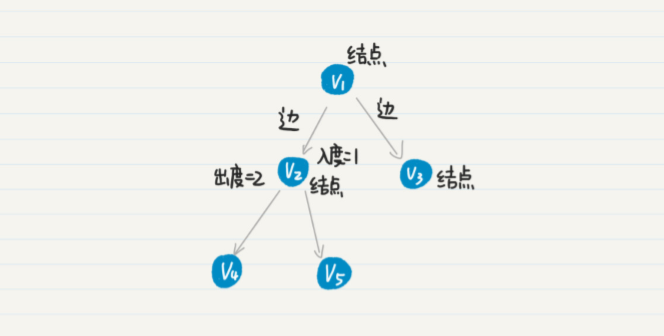
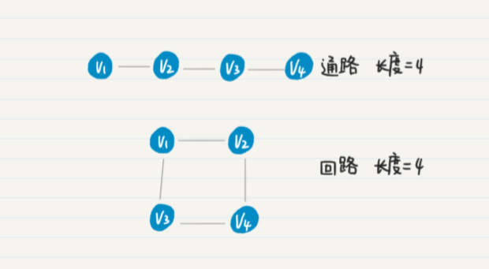
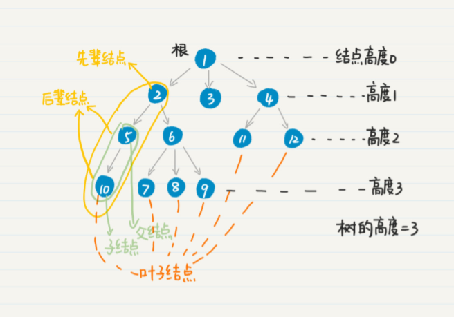

### 迭代法  
迭代法，就是不断地用旧的变量值，递推计算新的变量值。  
人类并不擅长重复性的劳动，而计算机却很适合做这种事。很多问题的现象，思考其本质，看看不断更新变量值或者缩小搜索的区间范围，是否可以获得最终的解（或近似解、局部最优解），如果是就可以尝试迭代法。

```java
/**
 * 求和
 * 
 * @param  number 统计最终数值
 * @return
 */
public static long sum(int number) 
{
    long result = 0;
    for (int i = 0; i <= number; ++i){
        result += i;
    }

    return result;
}
```

一般的，迭代法可以运用在以下几个方面：  
> 1、求数值的精确或者近似解，比如二分法。  
> 2、在一定范围内查找目标值，比如二分查找。  
> 3、机器学习算法中的迭代，很多时候机器学习的过程，就是根据已知的数据和一定的假设，求一个局部最优解。  

### 数学归纳法
“归纳”，是一种从经验事实中找出普遍特征的认知方法。  
数学归纳法，就是指直接从理论上证明某个结论，节约大量的计算资源和时间（形成公式）。  

数学归纳法的一般步骤是这样的：
> 1、证明基本情况是否成立；  
> 2、假设基本条件成立，再证明其他共性条件也是成立的。  

和使用迭代法的计算相比，数学归纳法最大的特点就在于“归纳”二字。它已经总结出了规律，只要我们能够证明这个规律是正确的（从第一步正确，第二步正 确，第三步正确，一直推导到最后一步是正确的），就没有必要进行逐步的推算，可以节省很多时间和资源。

递归调用的代码和数学归纳法的逻辑是一致的。递归把计算交给计算机，归纳把计算交给人，前者是拿计算机的计算成本换人的时间，后者是拿人的时间换计算机的计算成本。  

### 递归
递归就是将复杂的问题，每次都解决一点点，并将剩下的任务转化成为更简单的问题等待下次求解，如此反复，直到最简单的形式。  

递归和循环其实都是迭代法的实现，而且在某些场合下，它们的实现是可以相互转化的。但是，对于某些应用场景，递归确很难被循环取代。  
> 1、递归的核心思想和数学归纳法类似，并更具有广泛性：将当前的问题化解为两部分：一个当前所采取的步骤（可能是进行一次运算、做一个选择等）和另一个更简单的问题（运算的结果离目标值更近）。  
> 2、递归会使用计算机的函数嵌套调用。而函数的调用本身，就可以保存很多中间状态和变量值，因此极大的方便了编程的处理。

```java
/**
 * 阶乘
 * 
 * @param  number 阶乘的最终值
 * @return
 */
public static long factorial(int number) 
{
    if (number <= 1) {
        return 1;
    }

    return number * factorial(number - 1);
}
```

**归并排序中的分治思想**  
对一堆杂乱无序的数字，按照从小到大或者从大到小的规则进行排序，这是计算机领域非常经典的问题。归并排序算法的核心就是“归并”，也就是把两个有序的数列合并起来，形成一个更大的有序数列。  

分而治之（Divide and Conquer），我们通常简称为分治。它的思想就是，将一个复杂的问题，分解成两个甚至多个规模 相同或类似的子问题，然后对这些子问题再进一步细分，直到最后的子问题变得很简单， 很容易就能被求解出来，这样这个复杂的问题就求解出来了。  

归并排序通过分治的思想，把长度为 n 的数列，每次简化为两个长度为 n/2 的数列，这更 有利于计算机的并行处理，只需要 log n 次归并。  
归并排序使用了分治的思想，而这个过程需要使用递归来实现。  
```java
/**
 * 归并排序
 * 
 * @param arr 待排序数组
 */
public static int[] mergingSort(int[] arr) {
    if (arr.length <= 1) {
        return arr;
    }

    int num = arr.length >> 1;
    int[] leftArr = Arrays.copyOfRange(arr, 0, num);
    int[] rightArr = Arrays.copyOfRange(arr, num, arr.length);

    return mergeTwoArray(mergingSort(leftArr), mergingSort(rightArr));
}

private static int[] mergeTwoArray(int[] arr1, int[] arr2) {
    int i = 0, j = 0, k = 0;
    int[] result = new int[arr1.length + arr2.length];
    while(i < arr1.length && j < arr2.length){
        if (arr1[i] <= arr2[j]) {
            result[k++] = arr1[i++];
        } else {
            result[k++] = arr2[j++];
        }
    }

    // 序列 1 中多余的元素移入新数组
    while(i < arr1.length){
        result[k++] = arr1[i++];
    }
    // 序列 2 中多余的元素移入新数组
    while(j < arr2.length){
        result[k++] = arr2[j++];
    }

    return result;
}
```

当需要排序的数组很大（比如达到 1024GB 的时候），我们没法把这些数据都塞入一台普通机器的内存里。这时候，我们可以把这个超级大的数据集，分解为多个更小的数据集（比如 16GB 或者更小），然后分配到多台机器，让它们并行地处理。等所有机器处理完后，中央服务器再进行结果的合并。由于多个小任务间不会相互干扰，可以同时处理，这样会大大增加处理的速度，减少等待时间。  
在单台机器上实现归并排序的时候，我们只需要在递归函数内，实现数据分组以及合并就行了。而在多个机器之间分配数据的时候，递归函数内除了分组及合并，还要负责把数据分发到某台机器上。  

分布式架构中 MapReduce 的主要步骤：  
> 1、数据分割和映射  
> 分割是指将数据源进行切分，并将分片发送到 Mapper 上。映射是指 Mapper 根据应用的需求，将内容按照键 - 值的匹配，存储到哈希结构中。  
> 2、规约  
> 归约是指接受到的一组键值配对，如果是键内容相同的配对，就将它们的值归并。由于哈希映射的关系，MapReduce 还需要 洗牌的步骤，也就是将键 - 值的配对不断地发给对应的 Reducer 进行归约。普通的分治或递归不一定需要洗牌的步骤。  
> 3、合并  
> 为了提升洗牌阶段的效率，可以选择减少发送到归约阶段的键 - 值配对。具体做法是在数 据映射和洗牌之间，加入合并的过程，在每个 Mapper 节点上先进行一次本地的归约。然后只将合并的结果发送到洗牌和归约阶段。

### 排列   
从 n 个不同的元素中取出 m（1<=m<=n）个不同的元素，按照一定的顺序排成一列，这个过程就叫排列。当 m = n 的时候，这就是全排列。  

排列的公式 n(n-1)(n-2)...(n-m+1) = n!/(n-m)!  
```java
import java.util.Arrays;

public class Range
{
    public static void main(String[] args)
    {
        arrangementSelect(new String[]{"1","2","3"}, 3);
    }

    /**
     * 排列选择（从列表中选择 n 个排列）
     *
     * @param dataList 待选列表
     * @param n 选择个数
     */
    public static void arrangementSelect(String[] dataList, int n)
    {
        System.out.println(String.format("A(%d, %d) = %d", dataList.length, n, arrangement(dataList.length, n)));

        arrangementSelect(dataList, new String[n], 0);
    }

    /**
     * 排列选择
     *
     * @param dataList 待选列表
     * @param resultList 前面（resultIndex-1）个的排列结果
     * @param resultIndex 选择索引，从 0 开始
     */
    private static void arrangementSelect(String[] dataList, String[] resultList, int resultIndex)
    {
        int resultLen = resultList.length;

        // 全部选择完时，输出排列结果
        if (resultIndex >= resultLen) {
            System.out.println(Arrays.asList(resultList));
            return ;
        }

        // 递归选择下一个
        for (int i = 0; i < dataList.length; i++) {
            // 判断待选项是否存在于排列结果中
            boolean isExists = false;
            for (int j = 0; j < resultIndex; j++) {
                if (dataList[i].equals(resultList[j])) {
                    isExists = true;
                    break;
                }
            }

            // 排列结果不存在该项，才可选择
            if (!isExists) {
                resultList[resultIndex] = dataList[i];
                arrangementSelect(dataList, resultList, resultIndex + 1);
            }
        }
    }

    /**
     * 计算阶乘数，即 n! = n * (n-1) * ... * 2 * 1
     *
     * @param n
     * @return
     */
    public static long factorial(int n)
    {
        return (n > 1) ? n * factorial(n - 1) : 1;
    }

    /**
     * 计算排列数，即 A(n, m) = n! / (n-m)!
     *
     * @param n 所有排列数
     * @param m 抽取排列数
     * @return
     */
    public static long arrangement(int n, int m)
    {
        return (n >= m) ? factorial(n) / factorial(n - m) : 0;
    }
}
```

排列可以帮助我们生成很多可能性，鉴于此，排列最多的用途就是穷举法，也就是，列出所有可能的情况，一个一个验证，然后看每种情况是否符合条件的解。  
比如田忌赛马所使用的出战顺序，黑客们的暴力破解密码（鉴于存在暴力破解，通常程序也会加上每天尝试密码的次数限制，所以足够长度的多类型字符密码相对安全）。

### 组合
组合是指，从 n 个不同元素中取出 m（1≤m≤n）个不同的元素。对于所有 m 取值的组合之全集合，我们可以叫作全组合（All Combination）。例如对于集合 {1, 2, 3} 而言，全组合就是 {空集, {1}, {2}, {3}, {1, 2}, {1,3} {2, 3}, {1, 2, 3}}。  

组合的公式 总排列/m! = n!/(m! * (n-m)!)  
```java
import java.util.Arrays;

public class Combination
{
    public static void main(String[] args)
    {
        combinationSelect(new String[]{"1","2","3"}, 2);
    }

    /**
     * 组合选择（从列表中选择 n 个组合）
     *
     * @param dataList 待选列表
     * @param n 选择个数
     */
    public static void combinationSelect(String[] dataList, int n)
    {
        System.out.println(String.format("C(%d, %d) = %d", dataList.length, n, combination(dataList.length, n)));

        combinationSelect(dataList, 0, new String[n], 0);
    }

    /**
     * 组合选择
     *
     * @param dataList 待选列表
     * @param dataIndex 待选开始索引
     * @param resultList 前面（resultIndex-1）个的组合结果
     * @param resultIndex 选择索引，从 0 开始
     */
    private static void combinationSelect(String[] dataList, int dataIndex, String[] resultList, int resultIndex)
    {
        int resultLen = resultList.length;
        int resultCount = resultIndex + 1;
        // 全部选择完时，输出组合结果
        if (resultCount > resultLen) {
            System.out.println(Arrays.asList(resultList));
            return ;
        }

        // 递归选择下一个
        for (int i = dataIndex; i < dataList.length + resultCount - resultLen; i++) {
            resultList[resultIndex] = dataList[i];
            combinationSelect(dataList, i + 1, resultList, resultIndex + 1);
        }
    }

    /**
     * 计算阶乘数，即 n! = n * (n-1) * ... * 2 * 1
     *
     * @param n
     * @return
     */
    public static long factorial(int n)
    {
        return (n > 1) ? n * factorial(n - 1) : 1;
    }

    /**
     * 计算组合数，即 C (n, m) = n!/((n-m)! * m!)
     *
     * @param n
     * @param m
     * @return
     */
    public static long combination(int n, int m) {
        return (n >= m) ? factorial(n) / factorial(n - m) / factorial(m) : 0;
    }
}
```

组合可以说是排列的兄弟，两者类似但又有所不同，这两者的区别：排列考虑了取出的元 素它们之间的顺序，而组合无需考虑这种顺序（在递归的时候，传入下一个嵌套调用函数的剩余元素，只需 要包含当前被选元素之后的那些，以避免重复的组合）。  

在自然语言处理中，我们需要用多元文法把临近的几个单词合并起来，组合成一个新的词组。  
普通的多元文法定死了每个元组内单词出现的顺序，但是事实上，多个单词出现时，我们可以不用关心它们的顺序，而只关心它们的组合。这样，我们就可以对多元组内的单词进行某种形式的标准化，即使原来的单词出现顺序有所不同，经过这个标准化过程之后，都会变成唯一的顺序。

### 动态规划
有时候，我们并不用处理所有可能的情况，只要找到满足条件的优解就行了。在这种情况下，我 们需要在各种可能的局部解中，找出那些可能达到优的局部解，而放弃其他的局部解。这个寻找优解的过程其实就是动态规划。  
动态规划需要通过子问题的优解，推导出终问题的优解，因此这种方法特别注重子问题之间的转移关系。我们通常把这些子问题之间的转移称为状态转移，并把用于刻画这些状态转移的表达式称为状态转移方程。显然，找到合适的状态转移方程，是动态规划的关键。  

**编辑距离**  
当你在搜索引擎的搜索框中输入单词的时候，有没有发现，搜索引擎会返回一系列相关的 关键词，方便你直接点击。甚至，当你某个单词输入有误的时候，搜索引擎依旧会返回正 确的搜索结果。  
搜索下拉提示和关键词纠错，这两个功能其实就是查询推荐。  
查询推荐的核心思想其实就是对于用户的输入，查找相似的关键词并进行返回。而测量拉丁文的文本相似度，常用的指标是编辑距离（Edit Distance）。  
将错误的字符串转成正确的，以此来返回查询结果的过程中，由一个字符串转成另一个字符串所需的少编辑操作次数，我们就叫作编辑距离。  
编辑操作有这三种（增删改）：把一个字符替换成另一个字符；插入一个字符；删除一个字符。比如，我们想把 mouuse 转换成 mouse，有很多方法可以实现，但是很显然，直接删除 一个“u”是简单的，所以这两者的编辑距离就是 1。  
  

**状态转移**  
假设使用排列组合操作，首先是计算量非常大（假设字符串 A 的长度是 n，而 B 字符串中不同的字符数量是 m，那么 A 所有可能的排列大致在 m^n 这个数量级，这会导致非常久的处理时间），其次是增删字符的可能性太多。实际上，编辑距离只需要求小的操作次数，并不要求列出所有的可能，而且排列过程非常容易出错，还会浪费大量计算资源，显然排列组合不符合要求。  
我们可以把求编辑距离这个复杂的问题，划分为更多更小的子问题（简单的情况莫过于字符串为空或一个字符）。而且，我们在每一个子问题中，都只需要保留一个优解，之后的问题求解，只依赖这个优值，这种求编辑距离的方法就是动态规划，而这些子问题在动态规划中被称为不同的状态。不同状态之间的转移，就是状态转移。  
编辑距离是具有对称性的，也就是说从字符串 A 到 B 的编辑距离，和从字符串 B 到 A 的 编辑距离，两者一定是相等的。  

用迭代来推导过程，从而得出表达式；这个表达式表示的是动态规划中从上一个状态到下一个状态之间可能存在的一些变化，以及基于这些变化的终决策结果，我们把这样的表达式称为状态转移方程。
```java
public class Recommend
{
    public static void main(String[] args)
    {
        System.out.println(getStrDistance("mouse", "mouuse"));
    }


    public static int getStrDistance(String a, String b)
    {
        if (a == null || b == null) {
            return -1;
        }

        // 初始用于记录化状态转移的二维表
        int[][] d = new int[a.length() + 1][b.length() + 1];
        // 如果 i 为 0，且 j 大于等于 0，那么 d[i, j] 为 j
        for (int j = 0; j <= b.length(); j++) {
            d[0][j] = j;
        }
        // 如果 i 大于等于 0，且 j 为 0，那么 d[i, j] 为 i
        for (int i = 0; i <= a.length(); i++) {
            d[i][0] = i;
        }
        // 实现状态转移方程
        // 代码里的状态转移是从 d[i, j] 到 d[i+1]
        for (int i = 0; i < a.length(); i++) {
            for (int j = 0; j < b.length(); j++) {
                int r = 0;
                if (a.charAt(i) != b.charAt(j)) {
                    r = 1;
                }
                int first_append = d[i][j + 1] + 1;
                int second_append = d[i + 1][j] + 1;
                int replace = d[i][j] + r;
                int min = Math.min(first_append, second_append);
                min = Math.min(min, replace);
                d[i + 1][j + 1] = min;
            }
        }

        return d[a.length()][b.length()];
    }
}
```
相互比较长度为 m 和 n 的两个字符串，一共需要求 m*n 个子问题，因此计算量是 m*n 这个数量级。和排列法的 m^n 相比，这已经降低太多太多了。

动态规划的基于编辑距离算法的局限性在于只适用于拉丁语系的相似度衡量。  
如果一个问题有很多种可能，看上去需要使用排列或组合的思想，但是终求的只是某种优解（例如小值、大值、短子串、长子串等等），那么可以考虑使用动态规划。  
状态转移方程是个关键。用状态转移表来帮助自己理解整个过程，如果能找到准确的转移方程，那么离终的代码实现就不远了。  

### 树的深度优先搜索
如果一个图里所有的边都是有向边，那么这个图就是有向图。如果一个图里所有的边都是无向边，那么这个图就是无向图。既含有向边，又含无向边的图，称为混合图。  
  

在有向图中，以结点 v 为出发点的边的数量，我们叫作 v 的出度。而以 v 终点的边之数量，称为 v 的入度。在上图中，结点 V2 的入度是 1，出度是 2。  

结点和边的交替序列组成的就是通路，即通路上的任意两个结点其实就是互为连通的。从起始点到终止点所经过的边之数量，就是通路的长度。  
如果一条通路的起始点 V1 和终止点 Vn 相同，这种特殊的通路我们就叫作回路。  
  

树是一种特殊的图，它是没有简单回路（除了第一个结点和后一个结点相同外，其余结点不重复出现的回路）的连通无向图。
从树顶层的根结点一直遍历到最下层的叶子结点，最终逐步构成单词前缀的过程。这个过程对应的数据结构就是前缀树，或者字典树。  
有向树就是一种树，特殊的是它的边是有方向的，而树是没有简单回路的连通图。有向树有且仅有一个结点的入度为 0，这个结点被称为根；除根以外的所有结点，入度都为 1，从树根到任一结点有且仅有一条有向通路。  
前缀树是一种有向树。  
  

有向树可以用来实现前缀树，其实现过程包括构建前缀树和查询前缀树。  
> 构建树的过程：  
> 首先，我们把空字符串作为树的根。  
> 对于每个单词，其中每一个字符都代表了有向树的一个结点。而前一个字符就是后一个字符的父结点，后一个字符是前一个字符的子结点。这也意味着，每增加一个字符，其实就是在当前字符结点下面增加一个子结点，相应地，树的高度也增加了 1。  

前缀树的构建和查询在本质上其实是一致的。构建的时候，我们需要根据当前的前缀进行查询，然后才能找到合适的位置插入新的结点。而且，这两者都存在一个不断重复送代的查找过程，我们把这种方式称为深度优先搜索。  
所谓树的深度优先搜索，其实就是从树中的某个结点出发，沿着和这个结点相连的边向前走，找到下一个结点，然后以这种方式不断地发现新的结点和边，一直搜索下去，直到访问了所有和出发点连通的点、或者满足某个条件后停止。  
如果到了某个点，发现和这个点直接相连的所有点都已经被访问过，那么就回退到在这个点的父结点，继续查看是否有新的点可以访问；如果没有就继续回退，一直到出发点。由于单棵树中所有的结点都是连通的，所以通过深度优先的策略可以遍历树中所有的结点， 因此也被称为深度优先遍历。  
把深度优先搜索，和在前缀树中查询单词的过程对比，就会发现两者的逻辑是一致的。不过，使用前缀树匹配某个单词的时候，只需要沿着一条可能的通路搜索下去，而无需遍历树中所有的结点。  

深度优先搜索的过程和递归调用在逻辑上是一致的。把函数的嵌套调用，看作访问下一个连通的结点；把函数的返回，看作没有更多新的结点需要访问，回溯到上一个结点。  
在查询的过程中，至少有三种情况是无法在字典里找到被查的单词的：  
1、被查单词所有字母都被处理完毕，但是我们仍然无法在字典里找到相应的词条；  
2、搜索到前缀树的叶子结点，但是被查单词仍有未处理的字母，就返回查找失败；  
3、搜索到中途，还没到达叶子结点，被查单词也有尚未处理的字母，但是当前被处理的字母已经无法和结点上的 label 匹配，返回查找失败。是不是叶子仍然通过结点对象的 sons 变量来判断。  
```java
import java.util.Iterator;
import java.util.Map;
import java.util.HashMap;
import java.util.Stack;

/**
 * 前缀树的结点
 */
public class TreeNode 
{
    // 结点的名称，在前缀树里是单个字母
    public char label;
    // 使用哈希映射存放子结点
    public HashMap<Character, TreeNode> sons = null;
    // 从树的根到当前结点这条通路上，全部字母所组成的前缀。
    public String prefix = null;
    // 词条的解释
    public String explanation = null;

    // 初始化结点
    public TreeNode(char l, String pre, String exp) 
    {
        label = l;
        prefix = pre;
        explanation = exp;
        sons = new HashMap<>();
    }
}


public class Dfs 
{
    /**
     * 使用栈来实现深度优先搜索
     * 
     * @param root
     */
    public void dfsByStack(TreeNode root) 
    {
        // 创建堆栈对象，其中每个元素都是 TreeNode 类型
        Stack<TreeNode> stack = new Stack<TreeNode>();
        // 初始化的时候，压入根结点
        stack.push(root);

        // 只要栈里还有结点，就继续下去
        while (!stack.isEmpty()) {
            // 弹出栈顶的结点
            TreeNode node = stack.pop();
            if (node.sons.size() == 0) {
                // 已经到达叶子结点
                System.out.println(node.prefix + node.label);
            } else {
                // 非叶子结点，遍历它的每个子结点
                Iterator<Map.Entry<Character, TreeNode>> iter = node.sons.entrySet().iterator();
                // 注意，这里使用了一个临时的栈 stackTemp
                // 这样做是为了保持遍历的顺序，和递归遍历的顺序是一致的
                // 如果不要求一致，可以直接压入 stack
                Stack<TreeNode> stackTemp = new Stack<TreeNode>();
                while (iter.hasNext()) {
                    stackTemp.push(iter.next().getValue());
                }

                while (!stackTemp.isEmpty()) {
                    stack.push(stackTemp.pop());
                }
            }
        }
    }
}
```

### 树的广度优先搜索
树是二维的，朝着纵向进行的是深度优先搜索，朝着横向进行的就是广度优先搜索。  

广度优先搜索（Breadth First Search），也叫宽度优先搜索，是指从图中的某个结点出发，沿着和这个点相连的边向前走，去寻找和这个点距离为 1 的所有其他点。只有当和起 始点距离为 1 的所有点都被搜索完毕，才开始搜索和起始点距离为 2 的点。当所有和起始 点距离为 2 的点都被搜索完了，才开始搜索和起始点距离为 3 的点，如此类推。  
广度优先搜索，相对于深度优先搜索，没有函数的嵌套调用和回溯操作，所以运行速度比 较快。但是，随着搜索过程的进行，广度优先需要在队列中存放新遇到的所有结点，因此 占用的存储空间通常比深度优先搜索多。

寻找两个人之间的最短通路，或者说找出两人是几度好友，在社交中有不少应用。例如，向你推荐新的好友、找出两人之间的关系的紧密程度、职场背景调查等等。  
基于树的广度优先搜索，社交关系的六度理论说明地球上任何两个人之间的社交关系不会超过六度，因为社会关系会随着关系的度数增加，而呈指数级的膨胀。所以，如果我们可以控制这种指数级别的增长，就可以控制潜在好友的数量，达到提升效率的目的。双向广度优先搜索巧妙的运用了两个方向的广度优先搜索，大幅降低搜索的度数。  

利用双向队列的数据结构进行广度优先的搜索。  
```java
public void Bfs() 
{
    Deque<Map<String, Object>> nodeDeque = new ArrayDeque<Map<String, Object>>();
    Map<String, Object> node = new HashMap<String, Object>();
    nodeDeque.add(node);
    while (!nodeDeque.isEmpty()) {
        node = nodeDeque.peekFirst();
        System.out.println(node);
        // 获得节点的子节点，对于二叉树就是获得节点的左子结点和右子节点
        List<Map<String, Object>> children = getChildren(node);
        if (children != null && !children.isEmpty()) {
            for (Map child : children) {
                nodeDeque.add(child);
            }
        }
    }
}
```


