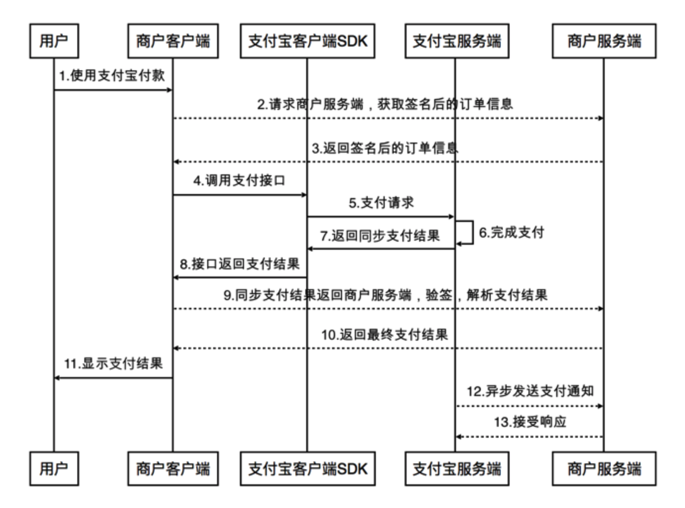

### 支付
一个完整的支付清算系统结构内，各种特定业务所涵盖的支付服务、清算服务是相互独立的。

### 支付体系及基本概念
退款，一般分成用户发起的退款以及差错退款，前者是支付成功后，用户主动退款，而后者是支付成功后，发现重复支付或者有差错，系统发起的退款。退款是在支付成功的前提下发起。  
关闭，订单超过了有效期自动关闭，不再接受支付成功的回调消息；或者订单未到有效期，商户端主动发起关闭，关闭的订单还没有支付成功。订单关闭是在订单一定没有支付成功前提下发起的。  
撤销，无论支付是否成功，都可以发起撤销，发起撤销后，支付成功的交易要退款，支付未成功的交易，则保证不会再次成功。撤销是不知道支付是否成功的前提下发起。  

现金贷，是小额现金贷款业务的简称，是针对申请人发放的消费类贷款业务，具有方便灵活的借款与还款方式，以及实时审批、快速到账的特性。 从 2015 年开始，现金贷作为消费金融一个重要的分支在中国开始强势崛起。以一二线城市以线上为主，三四线城市以线下为主。 截至 2018 年 1 月，现金贷平台融资渠道遭全面封堵，除了银行和 ABS 产品融资渠道遭封堵，资本市场融资渠道也在收紧。

贷超即贷款超市，贷款平台，贷款系统，各种贷款平台的集合体。  
贷超的盈利系统包括三个方面：甲方渠道、贷超平台、流量客户，这三部分的有机结合，才能保证盈利。

P2P，是个人对个人，将小额资金聚集起来，借贷给有资金需求的人，而 P2P 平台作为网络借贷的信息中介机构，为借款人和出借人实现直接借贷提供信息搜集、信息发布、资信评估、信息交互、借贷撮合等服务。

### 支付流程
**微信支付流程**  

  

在步骤 3 中，统一下单接口返回正常的 prepay_id，再按签名规范重新生成签名后，将数据传输给 APP。参与签名的字段名为 appId，partnerId，prepayId，nonceStr，timeStamp，package（package 的值格式为 Sign=WXPay）。   

`注意：统一下单 API、支付结果通知 API 和查询订单 API 等都涉及签名过程，调用都必须在商户服务器端完成。`

**支付宝支付流程**  
  

图中虚线标识商户链路，实线标识支付宝链路。

在步骤 4 中，此消息就是接口所描述的支付宝客户端 SDK 提供的支付对象 PayTask，将商户签名后的订单信息传进 payv2 方法唤起支付宝收银台  
在步骤 5 中，支付宝客户端 SDK 将会按照商户客户端提供的请求参数发送支付请求。  
在步骤 8 中，商户客户端在第 4 步中调用的支付接口，会返回最终的支付结果（即同步通知）。  
在步骤 13 中，用户在支付宝 APP 或 H5 收银台完成支付后，会根据商户在手机网站支付 API 中传入的前台回跳地址 return_url 自动跳转回商户页面，同时在 URL 请求中附带上支付结果参数。同时，支付宝还会根据原始支付 API 中传入的异步通知地址 notify_url，通过 POST 请求的形式将支付结果作为参数通知到商户系统。  
除了正向支付流程外，支付宝也提供交易查询、关闭、退款、退款查询以及对账等配套 API。

特别注意：
> 构造交易数据并签名必须在商户服务端完成，商户的应用私钥绝对不能保存在商户 APP 客户端中，也不能从服务端下发。
> 同步返回的数据，只是一个简单的结果通知，商户确定该笔交易付款是否成功需要依赖服务端收到支付宝异步通知的结果进行判断。  
> 商户系统接收到通知以后，必须通过验签（验证通知中的 sign 参数）来确保支付通知是由支付宝发送的（建议使用支付宝提供的 SDK 来完成）。 

