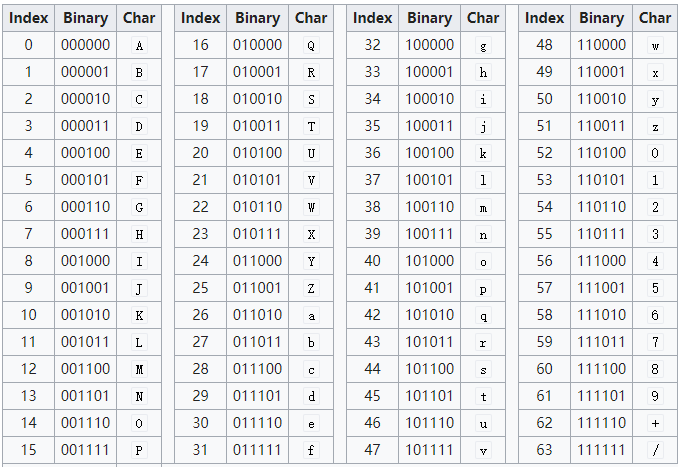

### Base64 
base64 的作用是把任意的字符序列转换为只包含特殊字符集（A-Z、a-z、0-9、+、/ 共 64 个字符，每个字符使用 6 位表示）的序列。  
  

### Base64 加密
Base64 加密的过程就是把字符的 ascii 码转为二进制，进而换成相应的字符。  
比如字符串"123"，1 的 ASCII 为 49，那么转换为二进制就是 00110001，2 的 ASCII 为 50，那么转换为二进制就是 00110010，3 的 ASCII 为 51，那么转换为二进制就是 00110011，这三个二进制组合在一起就是 001100010011001000110011。这个二进制位总共 24 位，从左到右依次取 6 位，对应关系是：  

- 第一个 6 位，001100，查阅上面的图标，对应 M  
- 第二个 6 位，010011，同样的操作，对应 T
- 第三个 6 位，001000，对应 I
- 第四个 6 位，110011，对应 z
即 123 转换为 Base64 之后，就是 MTIz。  

但是，并不是所有字符的 ascii 码二进制都刚好是 6 的倍数，这里涉及到补齐的说法（不足位数补 0）。  
以字符串 "12" 为例，1 的 ASCII 转换为二进制是 00110001，2 的 ASCII 转换为二进制是 00110010，我们将它组合在一起然后补齐之后（加上 2 个 0），就是 001100010011001000，按照 6 位一组进行分割，然后查表求得，结果是 MTI，但是为了后面的解码，我们需要在加密后的字符串末尾加上 1 个 "="，就是 "MTI="。  

### Base64 解密
Base64 解密的时候，需要查上面的表，进行反向操作，举个例子，对于 Base64 字符 M，查表得到它对应的 6 位二进制位为 001100。  
以加密结果 "MTIzNA==" 为例： 

- 我们首先判断字符串末尾是否有 "="，如果没有的话，那么也就是说，原始字符串没有补位操作，按照 4 个 Base64 字符转换为 3 个 8 位的字节算法就可以了，4 个字符组合起来就是 24 位，按照 8 位一个字节，就是三个字节。
- 如果末尾有 2 个等于号 "=="，也就是说之前进行了补位操作，通过上面加密的流程可以知道，原始字节流中，剩余 1 个字节，补了 4 个 0，得到了 2 个 Base64 字符，所以加密字符串中，除了最后 2 个字符，其余按照没有补位的转换操作就可以了，对于最后的 2 个 Base64 字符，我们把他们对应的二进制位组合起来，然后再进行 右移 4 位，就得到了一个 8 位的字节。
- 如果末尾有一个等于号 "="，也就是说未加密之前，剩余 2 个字节，所以按照上面所说的，加密的时候，需要补齐 2 个 0，这样就形成了三个 Base64 字符，那么除了最后的三个字符，其余的按照正常的转换就可以了，对于最后的三个 Base64 字符，我们把他们的二进制位组合起来总共 18 位，然后右移 2 位，就得到了 16 位的 2 个字节。

### Base64 加解密实现
```php
class  Base64
{
	private static function normalToBase64Char($num)
	{
	    if ($num >= 0 && $num <= 25) {
	        return chr(ord('A') + $num);
	    } else if ($num >= 26 && $num <= 51) {
	        return chr(ord('a') + ($num - 26));
	    } else if ($num >= 52 && $num <= 61) {
	        return chr(ord('0') + ($num - 52));
	    } else if ($num == 62) {
	        return '+';
	    } else {
	        return '/';
	    }
	}

	private static function base64CharToInt($num)
	{
	    if ($num >= 65 && $num <= 90) {
	        return ($num - 65);
	    } else if ($num >= 97 && $num <= 122) {
	        return ($num - 97) + 26;
	    } else if ($num >= 48 && $num <= 57) {
	        return ($num - 48) + 52;
	    } else if ($num == 43) {
	        return 62;
	    } else {
	        return 63;
	    }
	}

	public static function encode($content){
	    $len = strlen($content);
	    // 完整组合
	    $loop = intval($len / 3);
	    // 剩余字节数，需要补齐
	    $rest = $len % 3;
	    $ret = "";
	    // 首先计算完整组合
	    for ($i = 0; $i < $loop; $i++) {
	        $base_offset = 3 * $i;
	        // 每 3 个字节组合成一个无符号的 24 位的整数
	        $int_24 = (ord($content[$base_offset]) << 16)
	            | (ord($content[$base_offset + 1]) << 8)
	            | (ord($content[$base_offset + 2]) << 0);
	        // 6 位一组，每一组都进行 Base64 字符串转换
	        $ret .= self::normalToBase64Char($int_24 >> 18);
	        $ret .= self::normalToBase64Char(($int_24 >> 12) & 0x3f);
	        $ret .= self::normalToBase64Char(($int_24 >> 6) & 0x3f);
	        $ret .= self::normalToBase64Char($int_24 & 0x3f);
	    }
	    // 需要补齐的情况
	    if ($rest == 0) {
	        return $ret;
	    } else if ($rest == 1) {
	        // 剩余 1 个字节，此时需要补齐 4 位
	        $int_12 = ord($content[$loop * 3]) << 4;
	        $ret .= self::normalToBase64Char($int_12 >> 6);
	        $ret .= self::normalToBase64Char($int_12 & 0x3f);
	        $ret .= "==";
	        return $ret;
	    } else {
	        // 剩余 2 个字节，需要补齐 2 位
	        $int_18 = ((ord($content[$loop * 3]) << 8) | ord($content[$loop * 3 + 1])) << 2;
	        $ret .= self::normalToBase64Char($int_18 >> 12);
	        $ret .= self::normalToBase64Char(($int_18 >> 6) & 0x3f);
	        $ret .= self::normalToBase64Char($int_18 & 0x3f);
	        $ret .= "=";
	        return $ret;
	    }
	}

	public static function decode($content){
	    $len = strlen($content);
	    if ($content[$len - 1] == '=' && $content[$len - 2] == '=') {
	        // 说明加密的时候，剩余 1 个字节，补齐了 4 位，也就是左移了 4 位，所以除了最后包含的 2 个字符，前面的所有字符可以 4 个字符一组
	        $last_chars = substr($content, -4);
	        $full_chars = substr($content, 0, $len - 4);
	        $type = 1;
	    } else if ($content[$len - 1] == '=') {
	        // 说明加密的时候，剩余 2 个字节，补齐了 2 位，也就是左移了 2 位，所以除了最后包含的 3 个字符，前面的所有字符可以 4 个字符一组
	        $last_chars = substr($content, -4);
	        $full_chars = substr($content, 0, $len - 4);
	        $type = 2;
	    } else {
	        $type = 3;
	        $full_chars = $content;
	    }

	    // 首先处理完整的部分
	    $loop = strlen($full_chars) / 4;
	    $ret = "";
	    for ($i = 0; $i < $loop; $i++) {
	        $base_offset = 4 * $i;
	        $int_24 = (self::base64CharToInt(ord($full_chars[$base_offset])) << 18)
	            | (self::base64CharToInt(ord($full_chars[$base_offset + 1])) << 12)
	            | (self::base64CharToInt(ord($full_chars[$base_offset + 2])) << 6)
	            | (self::base64CharToInt(ord($full_chars[$base_offset + 3])) << 0);
	        $ret .= chr($int_24 >> 16);
	        $ret .= chr(($int_24 >> 8) & 0xff);
	        $ret .= chr($int_24 & 0xff);
	    }
	    // 紧接着处理补齐的部分
	    if ($type == 1) {
	        $l_char = chr(((self::base64CharToInt(ord($last_chars[0])) << 6)
	                | (self::base64CharToInt(ord($last_chars[1])))) >> 4);
	        $ret .= $l_char;
	    } else if ($type == 2) {
	        $l_two_chars = ((self::base64CharToInt(ord($last_chars[0])) << 12)
	                | (self::base64CharToInt(ord($last_chars[1])) << 6)
	                | (self::base64CharToInt(ord($last_chars[2])) << 0)) >> 2;
	        $ret .= chr($l_two_chars >> 8);
	        $ret .= chr($l_two_chars & 0xff);
	    }
	    return $ret;
	}
}
```

