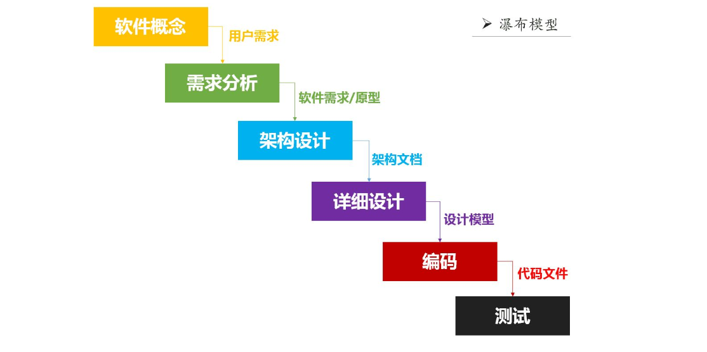
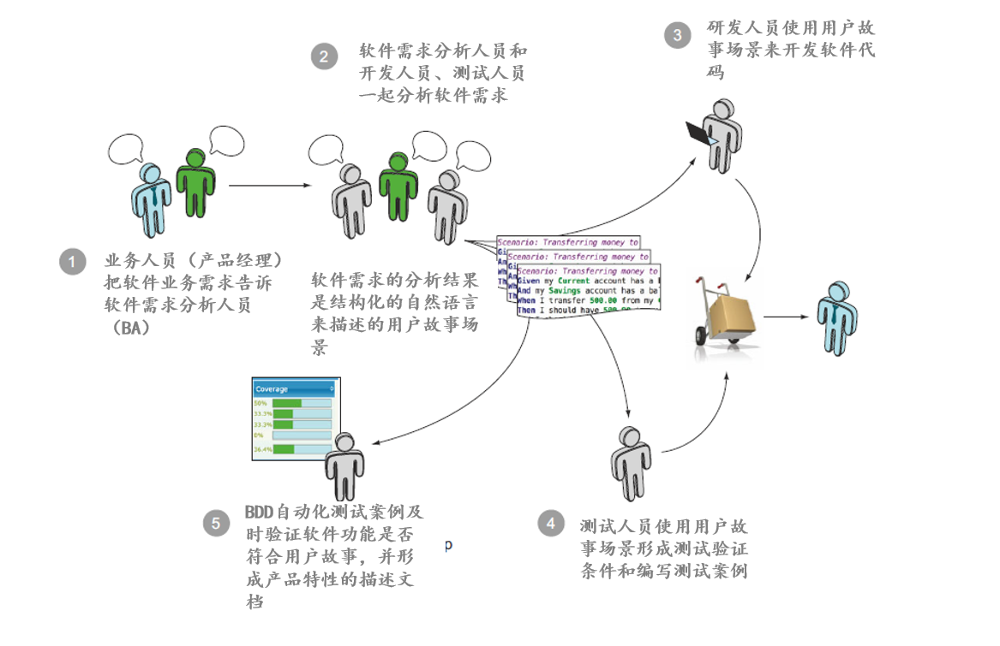

### 什么是 BDD?
BDD（Behavior Driven Development）即行为驱动开发。BDD 本质上是一种敏捷软件开发实践，它鼓励软件项目中的开发者、测试，用户，业务分析人员等之间相互协作。  
BDD 的目的是解决沟通理解、做正确且被期望的事情的问题。  

BDD 借鉴了敏捷和精益实践，让敏捷研发团队尽可能理解产品经理或业务人员的产品需求，并在软件研发过程中及时反馈和演示软件产品的研发状态，让产品经理或业务人员根据获得的产品研发信息及时对软件产品特性进行调整。BDD 帮助敏捷研发团队把精力集中在识别、理解和构建跟业务目标有关的产品特性上面，并让敏捷研发团队能够确保识别出的产品特性能够被正确设计和实现出来。  
BDD 提供了一种通用的，简单的，结构化的描述语言，这种语言既可以是英语也可以是其他本地的语言，通过他能够很方便让项目成员和业务干系人非常顺畅的沟通需求，及时这些干系人不懂的任何编程语言。  

有两种不同的行为驱动开发 (BDD): SpecBDD 和 StoryBDD。 SpecBDD 专注于代码的技术行为，而 StoryBDD 专注于业务逻辑或功能的行为和互动。  

采用 StoryBDD 时, 你编写可读的故事来描述应用程序的行为。接着这些故事可以作为应用程序的实际测试案例执行。Behat 是使用在 PHP 应用程序中的 StoryBDD框架，它受到 Ruby 的 Cucumber 项目的启发并且实现了 Gherkin DSL 來描述功能的行为。  

采用 SpecBDD 时, 你编写规格来描述实际的代码应该有什么行为。你应该描述函数或者方法应该有什么行为，而不是测试函数或者方法。PHP 提供了 PHPSpec 框架来达到这个目的，这个框架受到了 Ruby 的 RSpec project 项目的启发。  

### 为什么 BDD
传统软件研发过程是这样的：  
1、业务人员把想要的软件产品需求讲述给软件需求分析人员。  
2、软件需求分析人员把从业务人员那里获得的软件需求记录下来，并根据业务需求编写软件产品需求说明书。  
3、软件开发人员根据软件产品需求说明书编写软件代码和单元测试代码。  
4、软件测试人员根据软件产品需求说明书进行测试需求分析，编写测试案例（用例），并使用测试案例对软件产品进行测试。  
5、最后软件开发团队根据稳定的软件版本编写软件产品的功能说明和技术说明文档。  

传统软件研发模式的问题在于，在业务人员把业务需求描述给软件需求分析人员之后，软件需求分析人员按照自己的理解编写软件需求规格说明书，然后由研发人员根据软件需求规格说明进行软件架构设计和编写软件代码，最后由测试人员根据软件需求规格说明书编写测试案例进行测试。由业务需求到软件编码，再到软件测试的过程中，有不同角色和不同人员在不同时段对软件开发所需的信息进行处理，这中间有太多机会可能会导致丢失、弄错、甚至直接忽视业务人员的原始需求。软件研发的众多环节中，只要一个环节出错，软件研发团队就很难按时交付出符合业务人员要求的软件产品。   
  

BDD 的软件研发过程是这样的：  
1、产品经理（业务人员）通过具体的用户故事使用场景来告诉软件需求分析人员他（她）想要什么样的软件产品。使用软件产品的使用场景来描述软件需求可以尽可能的避免相关人员错误理解软件需求或增加自己的主观想象的需求。  
2、软件需求分析人员（BA）和研发团队（研发人员、测试人员）一起对产品经理（业务人员）的用户故事进行分析，并梳理出具体的软件产品使用场景举例，这些场景举例使用结构化的关键字自然语言进行描述，例如中文、英文等。  
3、研发团队使用 BDD 工具把用户故事场景文件转化为可执行的自动化测试代码，研发人员运行自动化测试用例来验证开发出来的软件产品是否符合用户故事场景的验收要求。  
4、测试人员可以根据自动化测试结果开展手工测试和探索性测试。  
5、产品经理（业务人员）可以实时查看软件研发团队的自动化测试结果和 BDD 工具生成的测试报告，确保软件实现符合产品经理（业务人员）的软件期望。  

行为驱动开发是一种敏捷软件开发的技术，它鼓励软件项目中的开发者、QA 和非技术人员或商业参与者之间的协作。行为驱动开发特别适用于敏捷项目。行为驱动开发由一系列软件工程实践组成，这些软件工程实践可以用来帮组研发团队提高交付效率、交付质量和交付价值。  BDD 引入了敏捷管理、精益研发等思想，尤其包括测试驱动开发（TDD）和领域驱动设计（DDD）等软件研发方法。行为驱动开发（BDD）利用简单的格式化自然语言（包括英语、中文等语言）来提升敏捷研发团队和产品经理或业务人员之间的沟通水平，使得敏捷研发团队能够更好的理解业务目标，从而更好的满足产品经理或业务人员的产品需求。  
  

BDD 的好处：  
1、减少浪费  
2、节省成本  
3、容易并且安全的适应变化  
4、因为少了中间的转达环节，从而能够快速交付产品  

### 如何 BDD
当一个需求过来的时候，先通过项目干系人都能理解的 Feature 文件，描述项目的 User Story，有的里面还有详细生动的数据范例（examples），从而能够让所有的人更加容易理解其需求。  
通过数据范例（examples）的表格更加容易的理解当前 case 的意图，而当 Feature 和 Example 文件都完成后，借助于第三方的开源框架实现，比如 Cucumber，jBehave，SpecFlow 等把 Feature 和 Example 转换成代码，然后通过低层次的单元测试框架，比如 JUnit，NUnit，Spock，RSpec，结合测试驱动开发（TDD），从而把业务代码的逻辑实现。  
> Cucumer 是一个实现了 BDD 的一个框架，其支持下面的语言和框架集成， Cucumer 基本上所有的主流语言都支持，而且还能和市面上一些流行框架相结合，比如自动化测试框架，Selenium； Ruby 的超级牛逼的 Web 开发框架 Ruby On Rails 等等。   

下面以 Cucumber 和 JUnit 为例，介绍 BDD 的实际开发过程  
1、建立一个 Maven 项目并添加 Cucumber 依赖库  
2、安装 Cucumber Eclipse 插件  
3、新建一个 Feature 文件，编一个需求  
4、运行 Feature 文件，生成 Cucumber 的步骤（Steps）代码  
5、在步骤代码里面加上 JUnit 的断言并根据断言驱动业务实现  
> 根据 BDD 的开发的原则，先写 BDD 的步骤代码（Steps）和单元测试代码，然后再写实现代码。  
> 因为实现代码还没有写，所以先写的步骤代码（Steps）和单元测试代码肯定运行失败，但是没有关系，这个时候我们就可以写业务实现代码了，然后让单元测试通过，一旦单元测试通过，我们就可以对代码进行重构，上面的步骤简称 RGB（红绿蓝）。  
> 1、修改步骤代码（Steps）并编写单元测试  
> 2、编写业务实现  
> 3、重新运行测试  
> 4、运行测试类：RunBDDTest 并输出结果  
> 5、重构代码  

### BDD 在 PHP 的世界
[Behat](http://behat.org/), PHP 的 StoryBDD 框架， 受到了 Ruby’s Cucumber 项目的启发。  
[PHPSpec](http://www.phpspec.net/), PHP 的 SpecBDD 框架， 受到了 Ruby’s RSpec 项目的启发。  
[Codeception](http://codeception.com/) 是一个使用 BDD 准则的全栈测试框架。  

### BDD 常见疑问
**复杂遗留系统适合使用 BDD 吗**  
如果要把一个大型的，维护了 10 几年的遗留项目，彻底推翻，使用 BDD 和 TDD 进行重写是不现实的，而且随着复杂性的提高，其成本也是很高的。除非有特别的理由，否则很难得到领导的同意。  
因为复杂的遗留系统，很多代码很难测试，而且还有很多私有方法，静态方法，有 final 修饰的，很难写单元测试的。这个时候，其实瓶颈就在如何 Mock 这些复杂的上下文场景。  

